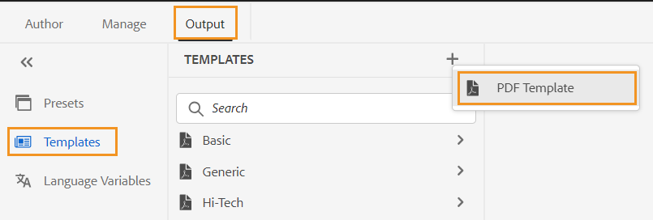
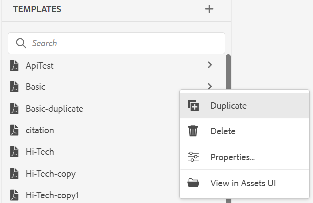

# Modèle PDF {#PDF-template}

L’utilisation d’un modèle garantit la cohérence de la disposition et de la structure du contenu. Comme les modèles sont prédéfinis, vous pouvez éviter de retravailler les problèmes de mise en forme qui surviennent pour chaque nouveau projet ou mise à jour. Les modèles vous permettent de concevoir des mises en page, de mettre en forme le contenu et d’appliquer divers paramètres pour personnaliser votre PDF.

## Modèles PDF d’usine et personnalisés

Il existe des exemples de modèles d’usine prêts à l’emploi que les développeurs peuvent utiliser comme modèles de base pour créer des modèles personnalisés en fonction des besoins de leur entreprise.

## Création d’un modèle PDF {#create-pdf-template}

Vous pouvez créer des modèles PDF personnalisés avec des mises en page spécifiques et définir la mise en forme des composants de mise en page (comme la table des matières, l&#39;index, le glossaire) ou des composants DITA (comme l&#39;en-tête, le paragraphe, la liste) à l&#39;aide de feuilles de style.

Pour créer un modèle PDF, procédez comme suit :

1. Dans l’éditeur web, accédez à l’onglet **Output**.
1. Sélectionnez **Modèles**  dans le panneau de gauche.

   

1. Dans la fenêtre **Modèles**, sélectionnez l’icône **+** en regard de **Modèles** et choisissez **Modèle PDF**.
1. Dans la boîte de dialogue **Nouveau modèle PDF**, sélectionnez un modèle d’usine à utiliser comme base pour créer le modèle personnalisé. Vous pouvez également utiliser la zone de recherche pour rechercher un modèle.
1. Indiquez un titre pour le modèle.

   >[!NOTE]
   >
   >  Vous pouvez également prévisualiser une miniature du modèle lors de la création et de la duplication d’un modèle. Modifiez ou supprimez la miniature à l’aide de [**Propriétés**](#properties-option) dans le menu **Options** après avoir créé le modèle.

1. Cliquez sur **Créer**.

   Le nouveau modèle est créé et ajouté dans le panneau **Modèles**.

## Duplication d’un modèle PDF {#duplicate-pdf-template}

Si vous souhaitez créer un nouveau modèle avec les mêmes mises en page et mise en forme que celles d’un modèle existant, vous pouvez créer une copie. Une fois qu’un modèle a été dupliqué, vous pouvez personnaliser davantage ses composants selon vos besoins.

Pour dupliquer un modèle PDF existant, procédez comme suit :

1. Dans l’éditeur web, accédez à l’onglet **Output**.
1. Sélectionnez **Modèles**  dans le panneau de gauche. La fenêtre **Modèles** s’ouvre.
1. Pointez sur le modèle à dupliquer et sélectionnez l’icône **...** *Options*, puis choisissez **Dupliquer** dans le menu contextuel.

   La boîte de dialogue **Dupliquer le modèle PDF** s’ouvre.

   

   *Sélectionnez un modèle à dupliquer, prévisualisez la miniature et mettez à jour le titre dans la boîte de dialogue **Dupliquer le modèle PDF**.*

1. Indiquez un titre pour le modèle.

   Le champ **Titre** est prérenseigné sous la forme d’une copie du même titre que le modèle source. Un message d’erreur s’affiche si le modèle portant le même titre existe déjà.

1. Pour spécifier un titre préféré, supprimez le titre prérempli et spécifiez un titre.
1. Cliquez sur **Dupliquer**.

   Un modèle en double est créé et ajouté sous le **Modèles**.

## Autres opérations sur les modèles

Vous pouvez également effectuer les opérations suivantes sur les modèles à partir du menu **Options** :

### Supprimer

Sélectionnez l’option Supprimer pour supprimer le modèle sélectionné. Sélectionnez ensuite Oui à l’invite de confirmation.
Le paramètre prédéfini est supprimé du **Modèles**.

### Propriétés{#properties-option}

Sélectionnez cette option pour afficher et modifier les propriétés du modèle. Vous pouvez prévisualiser la miniature existante pour le modèle. Vous pouvez également modifier ou supprimer la miniature. Vous pouvez également modifier le titre et la description du modèle.

### Afficher dans l’interface utilisateur d’Assets

Sélectionnez cette option pour afficher le modèle dans l’interface utilisateur d’Assets. Lorsqu’il ouvre l’emplacement racine du modèle, vous pouvez afficher toutes les ressources du modèle.

Une fois le modèle personnalisé créé, vous pouvez le choisir parmi les Mises en page du paramètre prédéfini de sortie PDF.

Découvrez comment [ publier une sortie PDF ](https://experienceleague.adobe.com/docs/experience-manager-guides-learn/tutorials/user-guide/output-gen/web-editor/native-pdf-web-editor.html?lang=en).

>[!NOTE]
>
>Si un profil de dossier est configuré sur votre dossier, vous n’afficherez que les modèles PDF configurés sur le profil de dossier.

En fonction de votre configuration, votre administrateur peut configurer les modèles :

+++ Services cloud

Pour plus d’informations sur la configuration des profils globaux et au niveau du dossier, consultez la section [Configurer des modèles](../cs-install-guide/conf-folder-level.md#id1889D0IL0Y4) du guide d’installation et de configuration des services cloud.

+++

+++ Logiciel On-Premise

Pour plus d’informations sur la configuration des profils globaux et au niveau des dossiers, consultez la section [Configurer des modèles de création](../install-guide/conf-folder-level.md#create-custom-authoring-template-id1917d0eg0hj) dans le guide de configuration et d’installation On-premise.

+++

## Personnalisation d’un modèle PDF {#customize-pdf-template}

Vous pouvez personnaliser les modèles en modifiant les composants du modèle et en appliquant des formats de style à l’aide de feuilles de style.

Pour personnaliser un modèle PDF, procédez comme suit :

1. Dans l’éditeur web, accédez à l’onglet **Output**.
1. Développez la barre latérale gauche et sélectionnez **Modèles**.

   Le panneau **Modèles** s’ouvre alors.

1. Pour afficher les composants d’un modèle, effectuez l’une des opérations suivantes :

   * Sélectionnez l’icône > en regard d’un modèle ou double-cliquez sur le nom du modèle.
   * Pointez sur n’importe quel modèle et sélectionnez ... (icône **Options**), puis choisissez **Modifier** dans le menu contextuel.

   Par défaut, le panneau **Paramètres** s’ouvre dans l’éditeur de modèles.

   

   >[!NOTE]
   >
   >  Votre administrateur peut télécharger les derniers modèles à partir du chemin suivant et remplacer les modèles existants :
   >
   > `/libs/fmdita/pdf`

   Les différents composants de modèle que vous pouvez personnaliser sont classés dans les sections suivantes :

   * Mises en page : un PDF type contient différentes pages, telles qu’une couverture ou une page de titre, une table des matières, un chapitre, un index, des citations, etc. La section Mises en page vous permet de concevoir l’aspect des différentes pages qui constituent votre PDF. Pour plus d’informations, voir [Mises en page](../native-pdf/components-pdf-template.md#page-layouts).

     Outre l’aspect, vous pouvez également définir la disposition des éléments de la page, tels que l’en-tête, le pied de page et les zones de contenu d’une page. Pour plus d’informations sur la personnalisation de la disposition d’une page, voir [Création et personnalisation de mises en page](components-pdf-template.md#create-customize-page-layout).

   * Feuilles de style : les paramètres de la section Feuilles de style vous permettent de personnaliser l’aspect des composants de mise en page, tels que la table des matières, l’index, le glossaire, les citations, etc. En outre, vous pouvez également personnaliser les styles du contenu DITA tels que les en-têtes, les paragraphes, les listes, etc. Pour plus d’informations sur l’utilisation des feuilles de style, voir [Utilisation des feuilles de style pour personnaliser PDF](components-pdf-template.md#stylesheet-customization).
   * Ressources : stockez les fichiers de ressources que vous devez personnaliser ou concevoir des modèles PDF. Assets (logos, polices personnalisées, images d’arrière-plan, etc.) est stocké dans les ressources .
Vous pouvez également utiliser les ressources présentes à tout autre emplacement du référentiel. Vous n’avez pas besoin de créer des ressources en double pour chaque modèle. Vous pouvez également les conserver dans un dossier partagé et les utiliser dans tous les modèles PDF natifs.

     Pour en savoir plus sur l’utilisation des ressources, voir [Utilisation des ressources](components-pdf-template.md#work-with-resources).

   * Paramètres : configurez les paramètres de sortie pour générer un PDF à l’aide du modèle. Cette section vous permet de définir le mappage de modèles pour diverses pages d’un PDF, une page de départ de chapitre, des marqueurs d’impression, des citations, etc.

   Vous pouvez également organiser l’ordre dans lequel ils doivent apparaître dans votre sortie PDF finale.
Pour plus d’informations sur l’application des paramètres, voir [ Paramètres PDF avancés ](components-pdf-template.md#advanced-pdf-settings).

1. Pour personnaliser un composant de modèle, double-cliquez sur un composant de modèle ou sélectionnez l’icône > juste avant.

   Par exemple, double-cliquez sur *Mises en page* ou sélectionnez l’icône *>* avant *Mises en page* pour afficher les mises en page disponibles.

   >[!NOTE]
   >
   >Vous pouvez également mettre à jour une miniature et la description du modèle à l’aide de l’option [**Propriétés**](#properties-option) du menu **Options**.

1. Une fois les modifications effectuées, sélectionnez *Enregistrer tout* (ou `Ctrl+S`).
