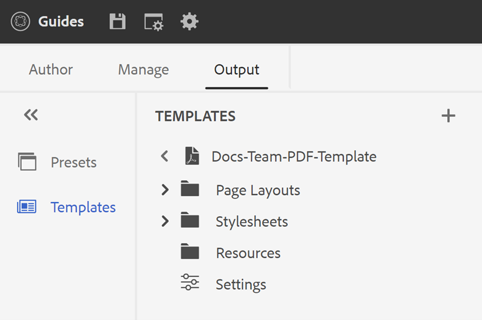

# Modèle de PDF {#PDF-template}

L’utilisation d’un modèle garantit la cohérence de la disposition et de la structure du contenu. Lorsque les modèles sont prédéfinis, vous pouvez éviter de retravailler les problèmes de mise en forme qui se produisent pour chaque nouveau projet ou mise à jour. Les modèles vous permettent de concevoir des mises en page de page, de mettre en forme le contenu et d’appliquer divers paramètres pour personnaliser votre PDF.

## Modèles de PDF personnalisés et d’usine

Il existe des exemples de modèles d’usine prêts à l’emploi que les développeurs peuvent utiliser comme modèles de base pour créer des modèles personnalisés en fonction de leurs besoins organisationnels.

## Créer un modèle de PDF {#create-pdf-template}

Vous pouvez créer des modèles de PDF personnalisés avec des mises en page spécifiques et définir la mise en forme des composants de mise en page (comme la table des matières, l’index, le glossaire) ou des composants DITA (comme l’en-tête, le paragraphe, la liste) à l’aide de feuilles de style.

Pour créer un modèle de PDF, procédez comme suit :
1. Dans l’éditeur Web, accédez à la **Sortie** .
1. Sélectionner **Modèles**  dans le panneau de gauche.

1. Dans la fenêtre **Modèles**, sélectionnez l’icône **+** en regard de **Modèles** et choisissez **Modèle PDF**.
1. Dans la boîte de dialogue **Nouveau modèle de PDF**, sélectionnez un modèle de fabrique que vous souhaitez utiliser comme base pour créer le modèle personnalisé. Vous pouvez également utiliser la zone de recherche pour rechercher un modèle.
1. Indiquez un titre pour le modèle.

>[!NOTE]
>
>  Vous pouvez également prévisualiser une miniature du modèle lors de la création et de la duplication d’un modèle. Modifiez ou supprimez la miniature à l’aide de [**Propriétés**](#properties-option) dans le **Options** après la création du modèle.

1. Cliquez sur **Créer**.

   Le nouveau modèle est créé et ajouté dans la variable **Modèles** du panneau.

## Dupliquer un modèle de PDF {#duplicate-pdf-template}

Si vous souhaitez créer un modèle avec les mêmes mises en page et mises en forme que le modèle existant, vous pouvez en créer une copie. Une fois qu’un modèle a été dupliqué, vous pouvez personnaliser davantage ses composants, si nécessaire.

Pour dupliquer un modèle de PDF existant, procédez comme suit :
1. Dans l’éditeur Web, accédez à la **Sortie** .
1. Sélectionner **Modèles**  dans le panneau de gauche. Cela ouvre la fenêtre **Modèles** fenêtre.
1. Pointez sur le modèle à dupliquer, puis sélectionnez **..** *Options* et choisissez **Dupliquer** dans le menu contextuel.

   Cela ouvre la fenêtre **Dupliquer le modèle de PDF** boîte de dialogue.

   

   *Sélectionnez un modèle à dupliquer, prévisualisez la miniature et mettez à jour le titre dans le **Dupliquer le modèle de PDF**boîte de dialogue.*

1. Indiquez un titre pour le modèle.

   La variable **Titre** est prérenseigné en tant que copie du même titre que le modèle source. Un message d’erreur s’affiche si le modèle portant le même titre existe.

1. Pour spécifier une préférence de titre, supprimez le titre prérenseigné et spécifiez un titre.
1. Cliquez sur **Dupliquer**.

   Un modèle dupliqué est créé et ajouté sous le **Modèles**.

## Autres opérations sur les modèles

Vous pouvez également effectuer les opérations suivantes sur les modèles à partir du **Options** menu :

### Supprimer

Sélectionnez l&#39;option Supprimer pour supprimer le modèle sélectionné. Sélectionnez ensuite Oui à l’invite de confirmation.
Le paramètre prédéfini est supprimé de la variable **Modèles**.

### Propriétés{#properties-option}

Sélectionnez cette option pour afficher et modifier les propriétés du modèle. Vous pouvez prévisualiser la miniature existante pour le modèle. Vous pouvez également modifier ou supprimer la miniature. Vous pouvez également modifier le titre et la description du modèle.

### Affichage dans l’interface utilisateur d’Assets

Sélectionnez cette option pour afficher le modèle dans l’interface utilisateur d’Assets. Comme il ouvre l’emplacement racine du modèle, vous pouvez afficher toutes les ressources du modèle.

Une fois que vous avez créé le modèle personnalisé, vous pouvez le choisir parmi les dispositions de page dans le paramètre prédéfini de sortie du PDF.
Découvrez comment [publication d’une sortie PDF](https://experienceleague.adobe.com/docs/experience-manager-guides-learn/tutorials/user-guide/output-gen/web-editor/native-pdf-web-editor.html?lang=en).

>[!NOTE]
>
>Si un profil de dossier est configuré sur votre dossier, vous n’afficherez que les modèles de PDF configurés sur le profil de dossier.

Selon votre configuration, votre administrateur peut configurer les modèles :

 Services cloud 

Pour plus d’informations sur la configuration des profils globaux et au niveau du dossier, voir [Configurer des modèles](../cs-install-guide/conf-folder-level.md#id1889D0IL0Y4) dans le guide d&#39;installation et de configuration pour les Cloud Service.

    

  Logiciel On-Premise 

Pour plus d’informations sur la configuration des profils globaux et au niveau du dossier, voir [Configuration de modèles de création](../install-guide/conf-folder-level.md#create-custom-authoring-template-id1917d0eg0hj) dans le guide Installation et configuration On-premise .

## Personnalisation d’un modèle de PDF {#customize-pdf-template}

Vous pouvez personnaliser des modèles en ajustant les composants de modèle et en appliquant des formats de style à l’aide de feuilles de style.

Pour personnaliser un modèle de PDF, procédez comme suit :
1. Dans l’éditeur Web, accédez à la **Sortie** .
1. Développez la barre latérale gauche et sélectionnez **Modèles**.

   Cela ouvre la fenêtre **Modèles** du panneau.
1. Pour afficher les composants d’un modèle, effectuez l’une des opérations suivantes :

   * Sélectionnez l’icône > en regard d’un modèle ou double-cliquez sur le nom du modèle.
   * Passez la souris sur un modèle et sélectionnez le... (**Options** et choisissez **Modifier** dans le menu contextuel.

     Par défaut, la fonction **Paramètres** dans l’éditeur de modèles.
   

   >[!NOTE]
   >
   >  Votre administrateur peut télécharger les derniers modèles à partir du chemin suivant et remplacer les modèles existants :
   >
   > `/libs/fmdita/pdf`

   Les différents composants de modèle que vous pouvez personnaliser sont classés dans les sections suivantes :
   * Mise en page : un PDF type contient différentes pages, telles qu’une page de couverture ou de titre, la table des matières, le chapitre, l’index, les citations, etc. La section Mise en page vous permet de concevoir l’aspect des différentes pages qui constitueraient votre PDF. Pour plus d’informations, voir [Disposition de page](../native-pdf/components-pdf-template.md#page-layouts).

     En plus de l’aspect, vous pouvez définir la disposition des éléments de page, tels que l’en-tête, le pied de page et les zones de contenu d’une page. Pour en savoir plus sur la personnalisation de la mise en page d’une page, voir [Création et personnalisation de mises en page](components-pdf-template.md#create-customize-page-layout).

   * Feuilles de style : les paramètres de la section Feuilles de style vous permettent de personnaliser l’aspect des composants de mise en page tels que la table des matières, l’index, le glossaire, les citations, etc. En outre, vous pouvez également personnaliser les styles du contenu DITA comme les en-têtes, les paragraphes, les listes, etc. Pour plus d’informations sur l’utilisation des feuilles de style, voir [Utiliser des feuilles de style pour personnaliser PDF](components-pdf-template.md#stylesheet-customization).
   * Ressources : stockez les fichiers de ressources que vous devez personnaliser ou concevoir des modèles de PDF. Les ressources telles que les logos, les polices personnalisées, les images d’arrière-plan, etc., sont stockées dans les ressources.
Vous pouvez également utiliser les ressources présentes à n’importe quel autre emplacement du référentiel. Vous n’avez pas besoin de créer des ressources en double pour chaque modèle. Vous pouvez les conserver dans un dossier partagé et les utiliser dans tous les modèles de PDF natif.

     Pour en savoir plus sur l’utilisation des ressources, voir [Utilisation des ressources](components-pdf-template.md#work-with-resources).
   * Paramètres : configurez les paramètres de sortie pour générer un PDF à l’aide du modèle. Cette section vous permet de définir le mappage des modèles pour différentes pages d’un PDF, d’une page de début de chapitre, de marqueurs d’impression, de citations, etc.
Vous pouvez également organiser l’ordre dans lequel ils doivent apparaître dans la sortie finale du PDF.
Pour plus d’informations sur l’application des paramètres, voir [Paramètres du PDF avancé](components-pdf-template.md#advanced-pdf-settings).

1. Pour personnaliser un composant de modèle, double-cliquez sur un composant de modèle ou sélectionnez l’icône > devant celui-ci.

   Par exemple, double-cliquez sur *Disposition de page* ou sélectionnez l’option *>* avant *Disposition de page* pour afficher les mises en page disponibles.

   >[!NOTE]
   >
   >Vous pouvez également mettre à jour une miniature et la description du modèle à l’aide de la variable [**Propriétés**](#properties-option) dans le **Options** .

1. Une fois les modifications souhaitées effectuées, sélectionnez *Enregistrer tout* (ou `Ctrl+S`).
