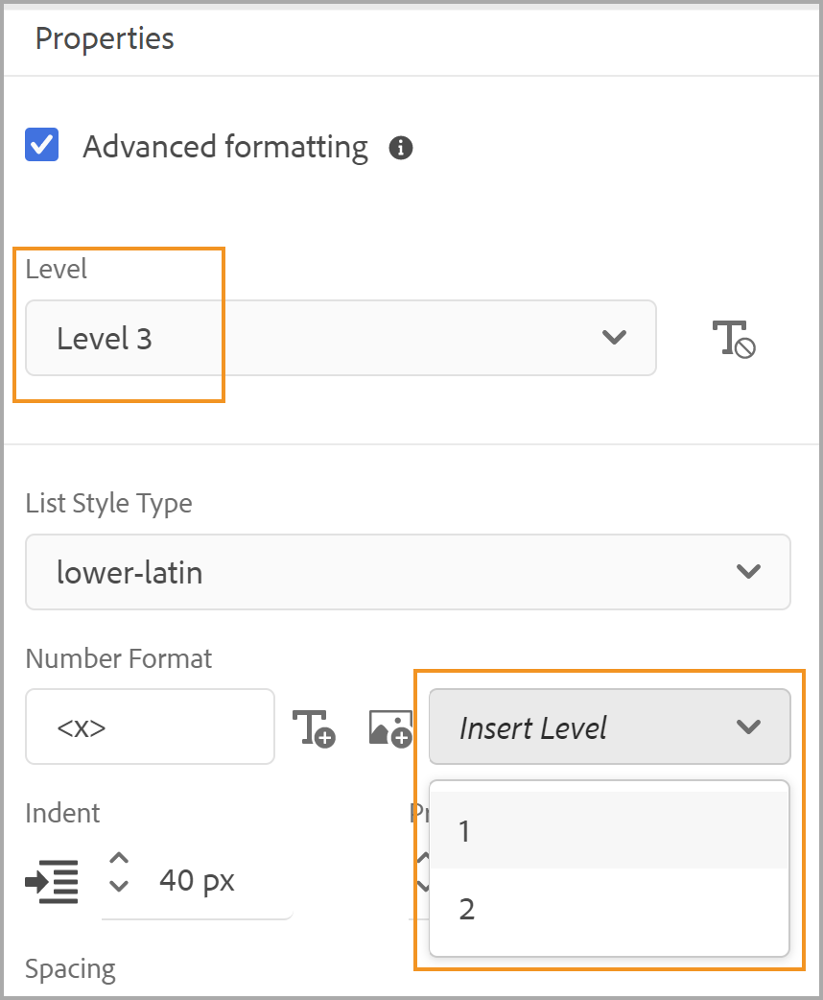
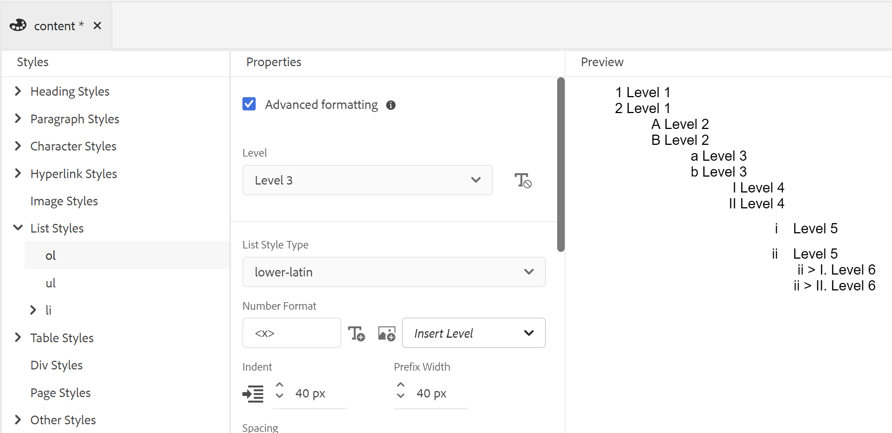

# Utilisation des styles de contenu communs {#work-with-common-styles}

Une feuille de style contient les définitions des styles pour les éléments utilisés dans la sortie de votre PDF. Vous pouvez choisir de travailler avec les exemples de feuilles de style ou en créer de nouvelles. Dans la plupart des cas, la création d&#39;une copie de la feuille de style d&#39;exemple prête à l&#39;emploi vous aidera à démarrer rapidement.

L’éditeur de styles est un éditeur WYSIWYG qui masque toutes les complexités d’un code CSS derrière l’interface utilisateur. L’éditeur de style vous permet de personnaliser facilement et très rapidement les styles pour les éléments de votre choix. Les styles sont classés sous les en-têtes suivants :

* Styles de titre
* Styles de paragraphe
* Styles de caractère
* Styles d’hyperlien
* Styles d’image
* Styles de liste
* Styles de tableau
* Styles Div
* Styles de page
* Autres styles

Lorsque vous utilisez du contenu DITA structuré, le mappage de style pour la plupart des éléments DITA est en place dans la feuille de style par défaut. Si vous travaillez avec des éléments DITA standard, vous pouvez modifier leur apparence en apportant directement des modifications à la définition de style. Ces définitions de style sont disponibles dans la catégorie Autre style . Pour plus d’informations, voir [Utilisation d’autres styles](#other-styles) plus loin dans cette rubrique.

Les sections suivantes présentent les paramètres de style les plus couramment utilisés sous la forme d’exemples.

>[!NOTE]
>
>Dans les exemples suivants, nous partons du principe que vous utilisez la feuille de style d’exemple fournie avec le produit.

## Utilisation des styles d’en-tête {#heading-styles}

Les styles d’en-tête contiennent tous les styles de base pour les en-têtes utilisés dans votre contenu. Vous obtiendrez 6 styles d’en-tête de base et un style d’en-tête pour l’en-tête de rubrique/chapitre et de titre de l’annexe. Dans un document structuré, H1 représente le titre de la rubrique ou du chapitre et H2 à H6 sont utilisés pour les sous-rubriques ou les sections d’une rubrique/d’un chapitre. Cette hiérarchie d’en-têtes est automatiquement appliquée au contenu chaque fois que l’en-tête correspondant est trouvé.

>[!NOTE]
>
>Vous pouvez créer vos propres styles d’en-tête personnalisés qui peuvent être utilisés dans votre contenu à l’aide de la classe outputclass. Pour plus d’informations, voir l’étape 4 de la section [Utilisation de l’orientation de page et de la rotation des vues](design-page-layout.md#page-orientation-rotation) par exemple.

### Création d’en-têtes personnalisés au niveau du chapitre {#create-chapter-level-heading}

Dans un livre (ou une carte-livre), vous travaillez avec Chapitres. Les styles d’en-tête de base sont conçus de telle sorte qu’ils soient appliqués à vos en-têtes au niveau du chapitre sans aucune personnalisation. Cependant, si vous souhaitez créer des en-têtes spécialisés pour votre contenu, vous devrez créer ces en-têtes. Par exemple, la valeur par défaut `h1.chapter` est appliqué au titre de votre chapitre. Si vous souhaitez que le titre du chapitre s’affiche dans un style différent, vous devez personnaliser la variable `h1.chapter` style. De même, vous pouvez créer des styles personnalisés pour les sous-titres de votre chapitre. Par exemple, si vous souhaitez créer un style personnalisé pour les 2nd et 3rd En-têtes de niveau dans votre chapitre, vous devez créer un style en tant que `h2.chatper` et `h3.chatper`.

Comme la fonction Publication avec PDF natif contient les définitions de style de base pour les styles les plus courants, même si vous supprimez accidentellement un style, le style par défaut est appliqué au contenu. Par exemple, s’il n’existe aucune définition de style pour le style h2 dans votre feuille de style, la fonction Publication de PDF natif applique un style de base au contenu h2.

Dans cet exemple, nous allons créer un style d’en-tête de chapitre de deuxième niveau :

1. Ouvrez la feuille de style requise pour la modifier.
   >[!NOTE]
   >
   >Voir [Personnalisation d’un style prédéfini ou nouveau](components-pdf-template.md#customize-style) pour ouvrir une feuille de style à des fins de personnalisation ou de modification.

1. Dans le **Styles** , développez la liste **Styles de titre**.
1. Clic droit sur **Styles de titre** style et choisissez **Nouveau style**.
1. Dans le *Ajouter un style* , conservez la **Balise** name as `h2` et saisissez `chapter` dans le **Classe** champ du nom.
1. Cliquez sur **Terminé**.

Un nouveau style d’en-tête nommé `h2.chapter` est créé et ajouté sous la liste Styles d’en-tête .

Une fois que vous avez créé un style, vous pouvez personnaliser les propriétés requises du style à l’aide de l’éditeur de style.

### Création d’en-têtes de numéro automatique {#auto-number-heading}

L’un des styles de sortie les plus couramment utilisés est les en-têtes numérotés automatiquement. Ces en-têtes représentent les numéros de chapitre, de rubrique et de sous-rubrique. Les en-têtes de numéro automatique diffèrent des styles de liste où des numéros automatiques sont attribués à une liste d’éléments dans une rubrique.

Dans cet exemple, nous allons personnaliser les en-têtes du niveau 1 au niveau 3 afin d’utiliser des numéros automatiques dans différents formats.

1. Ouvrez la feuille de style requise pour la modifier.

   >[!NOTE]
   >
   >Voir [Personnalisation d’un style prédéfini ou nouveau](components-pdf-template.md#customize-style) pour ouvrir une feuille de style à des fins de personnalisation ou de modification.

1. Dans le **Styles** , développez la liste **Styles de titre**.

1. Sélectionnez la variable **h1** style de la liste.
Les propriétés du style h1 sont affichées dans le panneau Propriétés avec son aperçu.

   >[!NOTE]
   >
   >Le panneau Aperçu vous donne une vue en temps réel des mises à jour de style que vous appliquez à n’importe quel élément.

1. Sélectionnez la variable **Autonnumber** .

   Les styles que vous pouvez appliquer sur la liste de numéros automatiques sont affichés sous la propriété Autonumber .

1. Définissez les propriétés suivantes :
   * **Style**: effectuez une sélection parmi un large éventail de styles de numérotation spécifiques à un paramètre régional ou générique. Vous pouvez choisir des styles tels que Arabo-Indic, Devanagari, Géorgien, Décimal, Alpha inférieur, etc. Pour l’exemple actuel, sélectionnez `upper-alpha`.

   * **Format**: le format par défaut est défini sur `<x>`, dans laquelle la variable `x` est remplacée par le style de numérotation que vous avez sélectionné dans la propriété Style . Par exemple, si vous avez sélectionné `decimal` (1) style, puis la valeur de `x` s’incrémente automatiquement pour chaque instance du `h1` style et est égal à 2, 3, etc. Vous pouvez également ajouter du texte personnalisé dans le champ pour mettre en forme le style de titre. Par exemple, si vous souhaitez que tous les en-têtes h1 aient un préfixe `Chapter`, vous devez définir ce champ sur `Chapter <x>`.

   * **Insérer un caractère**: si vous souhaitez ajouter un caractère spécial au format , cliquez sur Insérer un caractère (). Sélectionnez le caractère que vous souhaitez ajouter au format de style, puis cliquez sur Insérer. Vous pouvez choisir différents types de caractères spéciaux dans la liste déroulante Sélectionner une catégorie . Pour notre exemple, sélectionnez le guillemet Guillemet double angle à droite dans la catégorie Ponctuation .

     

   * **Commencer la numérotation à partir de**: si vous souhaitez que la numérotation commence à partir d’un nombre spécifique, indiquez cette valeur. Dans notre exemple, conservez la valeur par défaut 1.

   * **Retrait**: si vous souhaitez mettre l’en-tête en retrait, vous devez définir la valeur Retrait . Dans notre exemple, définissez-le sur 0 px.

     >[!NOTE]
     >
     >Vous pouvez saisir la valeur en px (pixels), pt (points), rem, em, % (pourcentage) ou en unités (pouces).

   * **Largeur du préfixe**: il s’agit de la zone occupée par le format de numéro automatique. Elle est automatiquement définie sur une taille pouvant facilement s’adapter au format de style sélectionné. Si vous souhaitez augmenter la taille, vous pouvez remplacer la valeur par défaut.

     Lorsque vous définissez cette valeur manuellement, essayez de modifier les autres propriétés qui auront un impact sur la largeur. Par exemple, modifiez la taille de la police, le format avec préfixe (Chapitre) ou un suffixe (:), définissez la valeur maximale dans la variable *Commencer la numérotation à partir de* , ainsi que les différentes propriétés de police à afficher avec une taille optimale.

     Dans notre exemple, conservez la valeur par défaut.

   * **Espacement**: spécifiez l’espacement horizontal et vertical. Dans notre exemple, conservez les valeurs par défaut.

     Avec les personnalisations ci-dessus, le style est personnalisé comme illustré ci-dessous :

     

   * **Appliquer la mise en forme à**: les propriétés de la catégorie Numéro automatique vous aideront à définir le style de numérotation. Pour appliquer d’autres personnalisations au style de numérotation ou au contenu de votre format d’en-tête, vous pouvez choisir Numérotation ou Paragraphe dans ce champ. Si vous choisissez Numérotation, toutes les modifications apportées aux catégories Police, Bordure, Disposition et autres s’appliqueront uniquement au style de numérotation du titre. Toutefois, si vous choisissez Paragraphe, les modifications seront appliquées au contenu de l’en-tête et non au style de numérotation.

   Utilisez les paramètres suivants pour générer une sortie affichée dans la capture d’écran suivante :

   | **Style de titre** | **Propriété** | **Valeur**. | **Commentaires supplémentaires** |
   | :- | :- | :- | :- |
   | h1 | Style | Décimale | Ces propriétés se trouvent dans la catégorie Numéro automatique . |
   |  | Format | `Capter <x>:` |  |
   |  | Largeur du préfixe | 160 px |  |
   |  | Police > Alignement du texte | Gauche | Assurez-vous que l’option Appliquer la mise en forme à est définie sur Numérotation. |
   | h2 | Style | Décimale | Ces propriétés se trouvent dans la catégorie Numéro automatique . |
   |  | Format | `Section <x>:` |  |
   |  | Largeur du préfixe | 125 px |  |
   |  | Police > Alignement du texte | Gauche | Assurez-vous que l’option Appliquer la mise en forme à est définie sur Numérotation. |
   | h3 | Style | Décimale | Ces propriétés se trouvent dans la catégorie Numéro automatique . |
   |  | Niveau d’insertion | 2 |  |
   |  | Format | `Section <2>.<x>:` |  |
   |  | Largeur du préfixe | 125 px |  |
   |  | Police > Alignement du texte | Gauche | Assurez-vous que l’option Appliquer la mise en forme à est définie sur Numérotation. |
   |  |

   

## Utilisation des styles de paragraphe {#paragraph-style}

Un style de paragraphe peut être créé pour appliquer une mise en forme spéciale à un paragraphe entier. Cependant, en utilisant la pseudo-classe, vous pouvez appliquer un style à une partie spécifique du texte. Dans l’exemple suivant, nous allons créer un style de paragraphe pour utiliser le style de casquette déroulante.

### Création du style de la casquette de dépôt {#drop-cap-style}

Un style de casquette (ou de majuscule perdue) est utilisé dans les magazines et les documents littéraires dans lesquels le premier caractère d’un paragraphe ou d’une section reçoit un style spécial. Vous pouvez obtenir le même effet à l’aide de la fonction Publication de PDF natif .

Dans l’exemple suivant, nous allons créer un style de casquette de dépôt :

1. Ouvrez la feuille de style requise pour la modifier.

   >[!NOTE]
   >
   Voir [Personnalisation d’un style prédéfini ou nouveau](components-pdf-template.md#customize-style) pour ouvrir une feuille de style à des fins de personnalisation ou de modification.

1. Dans le **Styles** , développez la liste **Styles de paragraphe**.

1. Cliquez avec le bouton droit de la souris sur le **Style de paragraphe** et choisissez **Nouveau style**.

1. Dans le *Ajouter un style* , conservez la **Balise** nom sous la forme p et dans la fonction **Pseudo** **Classe** champ, sélectionnez `::first-letter`.

1. Cliquez sur **Terminé**.

   Un nouveau style de paragraphe nommé `::first-letter`  est créé et ajouté sous le **Styles de paragraphe** liste.

1. Sélectionner `::first-letter` sous le style p, puis définissez les propriétés suivantes :

   * **Police**: définissez la police souhaitée pour la première lettre de votre paragraphe. Dans notre exemple, définissez la famille de polices sur cursive, le poids de la police sur 500, la taille de la police sur 30 pt et choisissez une couleur de police.

   * **Disposition**: définissez l’alignement vertical du texte autour de la casquette de dépôt. Dans notre exemple, nous allons définir l’alignement vertical sur le bas.

Comme la variable `p` est mappée avec la balise `
` dans DITA, vous n’avez pas besoin d’ajouter explicitement ce style à l’aide de l’attribut outputclass . Où que vous soyez dans votre contenu a `
` est utilisé, le style de la casquette de dépôt est automatiquement appliqué. Dans la capture d’écran suivante, le titre du chapitre, la brève description et les éléments de liste de définitions n’ont pas été formatés avec le style de casquette déroulante. Seul le style de paragraphe est formaté avec le style de la casquette déroulante :

## Utilisation des styles de caractères {#char-style}

Les styles de caractères vous permettent de créer des styles pour mettre en forme les caractères ou les mots de votre contenu. Vous pouvez, par exemple, créer un style de caractère pour le code en ligne ou le nom de fichier, ou créer un style qui utilise plusieurs formats de style sur le contenu sélectionné.

### Création d’un style de caractère intégré {#inline-char-style}

La mise en forme de caractères ou de mots insérés dans un paragraphe est un style très courant. Le processus de création d’un style intégré implique deux tâches : d’abord, créer un style dans la feuille de style, puis appliquer le style dans votre contenu à l’aide de la fonction `outputclass` attribut.

Dans l’exemple suivant, nous allons créer un style de caractères intégré :

1. Ouvrez la feuille de style requise pour la modifier.

   >[!NOTE]
   >
   Voir [Personnalisation d’un style prédéfini ou nouveau](components-pdf-template.md#customize-style) pour ouvrir une feuille de style à des fins de personnalisation ou de modification.

1. Dans le **Styles** , développez la liste **Styles de caractère**.

1. Cliquez avec le bouton droit de la souris sur le **Style de caractère** et choisissez **Nouveau style**.

1. Dans la boîte de dialogue Ajouter un style, conservez la variable **Balise** name as span and enter `BoldItalic` dans le **Classe** champ du nom.

   

1. Cliquez sur **Terminé**.

   Un nouveau style de caractère nommé code est créé et ajouté sous la liste Styles de caractère .

1. Sélectionner `span.BoldItalic` de la **Style de caractère** et définissez les propriétés suivantes :

   * **Police**: toutes les propriétés relatives aux polices peuvent être personnalisées à partir de cette section. Par défaut, certaines polices sont regroupées avec le produit. Vous pouvez choisir la police de votre choix pour le style de caractère. Dans notre exemple, définissez la famille de polices sur *Serif,* et sélectionnez *Gras* et *Italique* dans la propriété Font Style. Vous pouvez également personnaliser d’autres propriétés de police, telles que le poids de la police (comme le gras ou le briquet), la décoration du texte (comme le soulignement ou le surlignage), la taille de la police, la couleur de la police, l’alignement du texte, etc.

     >[!NOTE]
     >
     Vous pouvez également ajouter des polices à votre modèle, qui sont stockées dans la section Ressources de votre modèle. Pour plus d’informations sur l’ajout de polices et l’utilisation des ressources, voir [Utilisation des ressources](components-pdf-template.md#work-with-resources).

   * **Disposition**: vous pouvez définir les propriétés liées à la mise en page, telles que Hauteur et Largeur, Marge, Marge intérieure, Alignement, etc.

   * **Contexte**: les propriétés Background permettent de formater la couleur d’arrière-plan d’un style particulier. Vous pouvez définir la couleur ou l’image d’arrière-plan de n’importe quel style.

Une fois que vous avez créé le style de caractère intégré, vous devez l’appliquer dans votre contenu. Pour appliquer le style de code intégré, accédez à la vue source et ajoutez le `outputclass` dans le contenu souhaité :

`outputclass="BoldItalic"`

L’exemple suivant illustre le format Gras italique appliqué à différents emplacements du texte en cours d’exécution :

## Personnalisation du style de liste {#custom-list-style}

Les styles de liste contiennent les paramètres de style par défaut pour les listes triées et non triées. Vous pouvez facilement personnaliser ces styles de liste pour répondre aux exigences de votre documentation.

Dans l’exemple suivant, nous allons personnaliser le style de liste numérotée ou classée :

1. Ouvrez la feuille de style requise pour la modifier.

   >[!NOTE]
   >
   Voir [Personnalisation d’un style prédéfini ou nouveau](components-pdf-template.md#customize-style) pour ouvrir une feuille de style à des fins de personnalisation ou de modification.

1. Dans le **Styles** , développez la liste **Styles de liste**.

1. Sélectionnez la variable **ol** style de la liste.

   Les propriétés du style ol sont affichées dans le panneau Propriétés avec son aperçu.

   

1. Sélectionnez la variable **Formatage avancé** .

   Un message de confirmation s’affiche.

1. Cliquez sur **Oui** sur le *Confirmation* pour ouvrir le message **Formatage avancé** propriétés.

   Les propriétés suivantes sont disponibles par défaut :

   * **Niveau**: par défaut, il existe 6 niveaux de listes numérotées. Le niveau que vous sélectionnez dans cette liste déroulante contrôle les changements de style au niveau sélectionné et à tous les niveaux suivants. Par exemple, si vous sélectionnez le niveau 4, toutes les modifications de style que vous appliquez sont définies sur les niveaux 4, 5 et 6.

   * **Type de style de liste**: vous pouvez choisir un certain nombre de styles de numérotation de listes. La liste contient des styles de numérotation spécifiques aux paramètres régionaux et génériques utilisés pour créer une liste numérotée. Certains types de listes sont arabe, cambodgien, Devanagari, éthiopien, hangul, hébreu, japonais, coréen, chinois simple, ourdou, et plus encore.

   Vous pouvez également utiliser les propriétés de formatage avancé suivantes :

   * **Format du nombre**: le format par défaut est défini sur `<x>`, dans laquelle la variable `x` est remplacée par le style de numérotation que vous avez sélectionné dans la propriété Type de style de liste. Par exemple, si vous avez sélectionné `decimal` (1) style, puis la valeur de `x` s’incrémente automatiquement pour chaque instance de l’élément de liste et prend la forme 2, 3, etc. Vous pouvez également ajouter du texte personnalisé dans le champ pour mettre en forme le style de la liste. Par exemple, si vous souhaitez que tous les styles de liste de premier niveau aient un suffixe &quot;`)`&quot;, vous devez définir ce champ pour le style de liste de premier niveau sur &quot;`<x>)`&quot;.

   * **Insérer un caractère**: si vous souhaitez ajouter un caractère spécial au format numérique, cliquez sur Insérer un caractère (). Sélectionnez le caractère que vous souhaitez ajouter au format de style, puis cliquez sur Insérer. Vous pouvez choisir différents types de caractères spéciaux dans la liste déroulante Sélectionner une catégorie .

   * **Niveau d’insertion**: vous pouvez inclure le nombre de n’importe quel niveau précédent au format de votre nombre. Par exemple, si vous souhaitez inclure le format de numéro du 5e niveau dans votre format de numéro du 6e niveau, choisissez 5 dans la liste déroulante Insérer un niveau . Notez que la liste déroulante Insérer un niveau affiche uniquement le nombre de niveaux précédents et non le niveau suivant. Par exemple, lorsque vous êtes au niveau 3, la liste Insérer un niveau n’affiche que les niveaux 1 et 2.

     

     Vous pouvez également modifier le format numérique pour présenter les valeurs de liste selon vos besoins. Par exemple, lorsque vous utilisez un style de numérotation imbriqué pour le niveau 3, vous pouvez le formater en &quot;`<2>.<x>))`&quot;. Elle affiche la liste numéro 2, suivie d’un point, puis la liste numéro 3, et enfin deux crochets, tels que `2.3))`.

   * **Retrait**: si vous souhaitez mettre la liste en retrait, vous devez définir la valeur Retrait . Toutes les modifications apportées au retrait peuvent être examinées dans le panneau Aperçu et ajustées.

     >[!NOTE]
     >
     Vous pouvez saisir la valeur en px (pixels), pt (points), rem, em, % (pourcentage) ou en unités (pouces).

   * **Largeur du préfixe**: il s’agit de la zone occupée par le format numérique. Il est automatiquement défini sur une taille pouvant facilement s’adapter au format sélectionné. Si vous souhaitez augmenter la taille, vous pouvez remplacer la valeur par défaut.

     Lorsque vous définissez cette valeur manuellement, essayez de modifier les autres propriétés qui auront un impact sur la largeur. Par exemple, modifiez la taille de la police, le format avec un préfixe ou un suffixe et les différentes propriétés de la police pour obtenir une taille optimale.

   * **Espacement**: spécifiez l’espacement horizontal entre le format du numéro de liste et le contenu. L’espacement vertical contrôle l’écart entre les deux éléments de la liste.

     La capture d’écran suivante montre la liste classée personnalisée pour chaque niveau :

     

## Utilisation du style de tableau {#table-styles}

A l’aide des feuilles de style, vous pouvez concevoir des *n* Nombre de styles de tableau. Les styles du tableau vous permettent de concevoir la manière dont le tableau entier, une ligne ou une colonne particulière. Le contrôle au niveau des cellules permet de créer des styles de tableau très présentables.

Dans l’exemple suivant, nous voyons comment créer un style de tableau et les différentes options de style de tableau que vous pouvez personnaliser :

1. Ouvrez la feuille de style requise pour la modifier.

   >[!NOTE]
   >
   Voir [Personnalisation d’un style prédéfini ou nouveau](components-pdf-template.md#customize-style) pour ouvrir une feuille de style à des fins de personnalisation ou de modification.

1. Dans le **Styles** , cliquez avec le bouton droit sur la liste **Style de tableau** et choisissez **Nouveau style**.

1. Dans le *Ajouter un style* , conservez la **Balise** name as `table` et saisissez `double-border` dans le **Classe** champ du nom.

1. Cliquez sur **Terminé**.

   Un nouveau style de tableau nommé `table.double-border` est créé et ajouté sous la liste Styles de tableau .

1. Sélectionner `table.double-border` de la **Styles de tableau** et définissez les propriétés suivantes :

   * **Appliquer la mise en forme à**: vous pouvez choisir d’appliquer la mise en forme du style à l’ensemble du tableau, aux lignes ou colonnes impaires/paires, ou à la première/dernière ligne ou colonne.

     >[!NOTE]
     >
     Les paramètres suivants sont disponibles sous la variable **Général** lors de **Appliquer la mise en forme à** est défini sur **Tableau entier**.

   * **Habillage de texte**: choisissez comment placer du texte autour du tableau. Cela s’avère utile lorsque le tableau se trouve dans un autre élément de niveau bloc et qu’il doit être rendu avec d’autres contenus dans l’élément de bloc. Les options d’encapsulage sont les suivantes : *left* ou *right* aligné ou *none*.

   * **Effondrement de la bordure**: sélectionnez l’aspect de la bordure du tableau. Si vous sélectionnez Réduire, une seule ligne de bordure est tracée entre les cellules du tableau. Toutefois, pour un style distinct, la bordure est visible autour de chaque cellule avec une marge intérieure supplémentaire.

     

   * **Interlettrage**: ce paramètre est disponible uniquement lorsque l’option Effacement de la bordure est définie sur Séparer. Ce paramètre permet d’indiquer l’espacement vertical et horizontal entre les bordures des cellules.

     

     >[!NOTE]
     >
     Les paramètres suivants sont disponibles sous la variable **Cellule** lors de **Appliquer la mise en forme à** est défini sur **Tableau entier**.

   * **Marge intérieure**: spécifiez la marge intérieure entre les cellules du tableau. Vous pouvez spécifier différentes valeurs de remplissage pour les côtés supérieur, inférieur, gauche et droit.

   * **Alignement vertical**: spécifiez l’alignement vertical du contenu des cellules. Les options disponibles sont les suivantes : Haut, Milieu et Bas.

   * **Bordure, style, couleur, largeur, rayon :** Spécifiez les propriétés liées aux bordures. Vous pouvez choisir de n’avoir des bordures que sur des côtés spécifiques, comme Gauche ou Droite. Le style de bordure répertorie les styles de bordure disponibles, tels que Plein, Barré, Double ligne, etc. Définissez la couleur de la bordure à l’aide de la palette de couleurs. Vous pouvez spécifier la largeur de la bordure en px, pt, rem, em, % et en unités. Le rayon définit la courbe pour faire des coins circulaires.

   Les autres propriétés sous Police, Bordure, Disposition, Pagination et Arrière-plan sont expliquées sous d’autres exemples dans cette rubrique. Selon votre sélection dans la variable **Appliquer la mise en forme à** , vous pouvez appliquer ces valeurs à l’ensemble du tableau ou aux lignes ou colonnes sélectionnées.

   Vous trouverez ci-dessous un aperçu d’un exemple de tableau avec différentes lignes formatées différemment :

   

## Utilisation d’autres styles {#other-styles}

Si vous travaillez avec du contenu structuré (DITA), vous remarquerez que presque tous les éléments DITA ont un mappage de style dans la feuille de style par défaut. Par exemple, un `<shortdesc>` Le style de l’élément est défini sous **Autre style** > **.shortdesc** définition de style. Vous pouvez facilement personnaliser l’un de ces styles et ils sont automatiquement appliqués dans la sortie du PDF générée à partir de votre contenu structuré. Cela signifie que, contrairement à d’autres styles personnalisés, vous n’avez pas besoin d’ajouter une `outputclass` sur le contenu pour ces styles.

Si vous souhaitez créer une définition de style pour tout élément qui n’est pas disponible par défaut ou si vous disposez d’un élément personnalisé, vous pouvez facilement le créer dans la feuille de style. Le seul point à prendre en compte est de créer le style avec le même nom que le nom de l’élément structuré.

Dans l’exemple suivant, nous allons créer un titre de fenêtre (`wintitle`) style :

1. Ouvrez la feuille de style requise pour la modifier.

   >[!NOTE]
   >
   Voir [Personnalisation d’un style prédéfini ou nouveau](components-pdf-template.md#customize-style) pour ouvrir une feuille de style à des fins de personnalisation ou de modification.

1. Dans le **Styles** list, expand **Autres styles**.

1. Cliquez avec le bouton droit de la souris sur le **Autre style** et choisissez **Nouveau style**.

1. Dans le *Ajouter un style* , conservez la **Balise** name as *blank* et saisissez `wintitle` dans le **Classe** champ du nom.

   As `wintitle` est un nom d’élément DITA reconnu, sa définition de style est automatiquement mappée à la variable `<wintitle>` dans votre source.

1. Cliquez sur **Terminé**.

   Un nouveau style nommé `.wintitle` est créé et ajouté sous le **Autres styles** liste.

1. Sélectionnez .wintitle dans le **Autres styles** et définissez les propriétés selon les besoins.

La capture d’écran suivante affiche le style de titre de la fenêtre appliquée au texte &quot;Contrôle de Principal&quot;.

