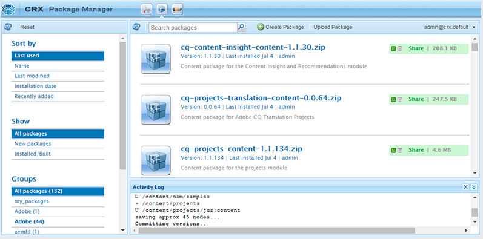
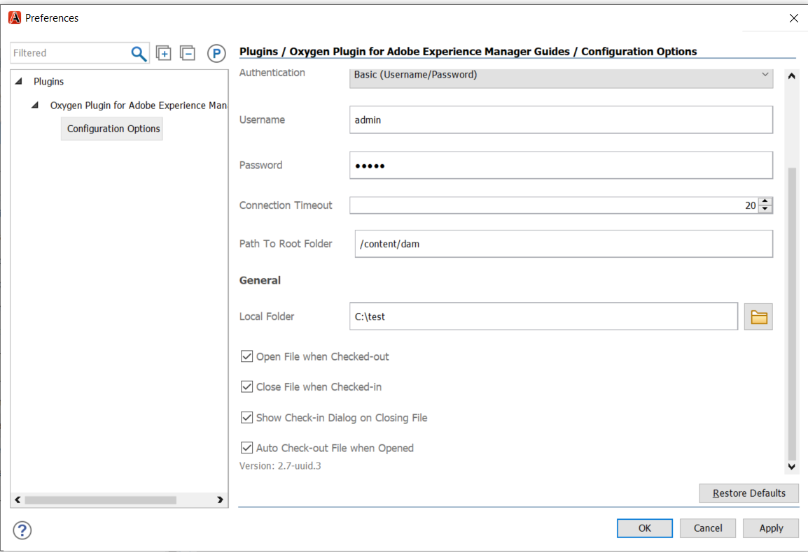
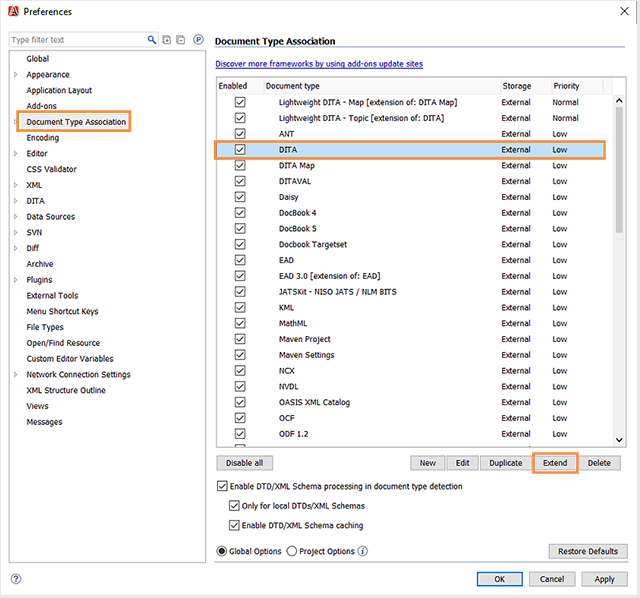
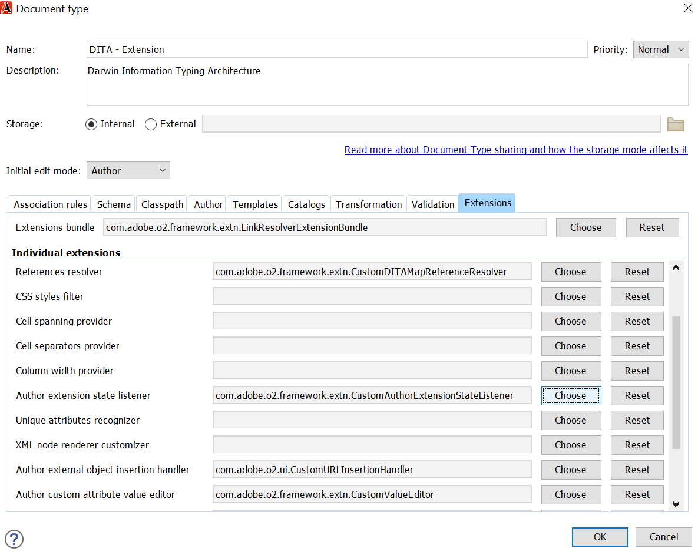
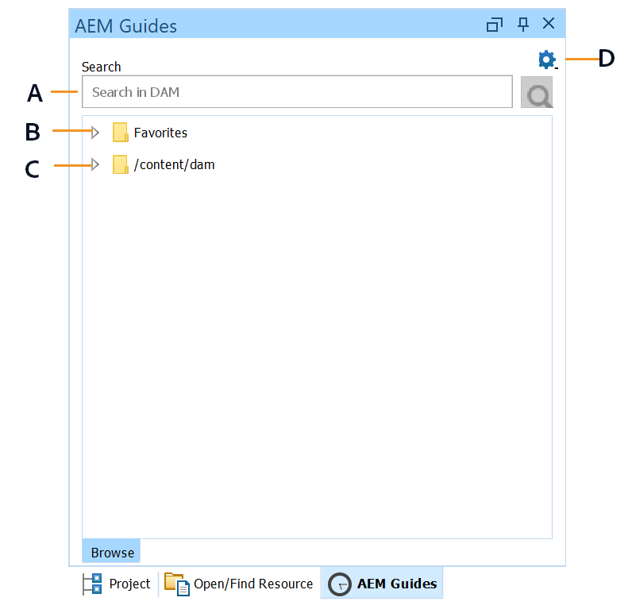
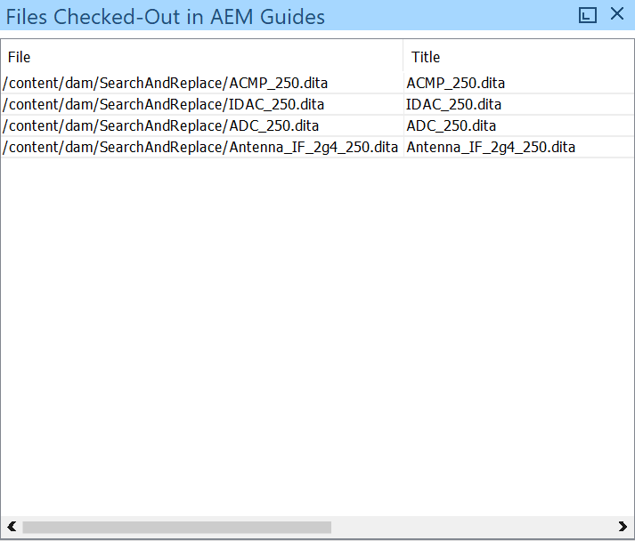
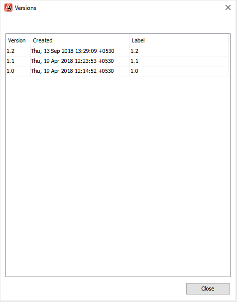
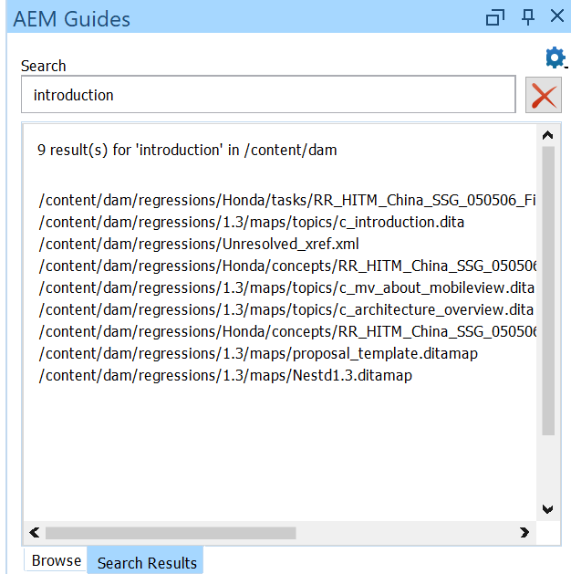

# Plug-in Oxygen pour Adobe Experience Manager Guides {#id1645H6010Q5}

Le plug-in Oxygen pour Adobe Experience Manager Guides \(plus tard appelé plug-in Oxygen pour AEM Guides dans le guide\) vous permet de connecter l’auteur XML Oxygen au référentiel Adobe Experience Manager \(AEM\) pour la création et la gestion de contenu. Vous pouvez utiliser le plug-in pour parcourir, rechercher et ouvrir des fichiers, extraire et archiver des fichiers, charger des dossiers et des fichiers sur le référentiel AEM. Le panneau AEM Guides de l’application de bureau vous permet de marquer les dossiers souhaités \(du référentiel AEM\) vers la liste des dossiers favoris pour un accès rapide. De plus, vous pouvez installer un package dans l’interface web d’AEM et ouvrir vos fichiers DITA dans Oxygen XML Author directement depuis l’interface web d’AEM.

## Télécharger et installer {#id1826M0L0PUI}

Le module externe Oxygen pour AEM Guides est disponible via votre portail de distribution logicielle Adobe. Recherchez « oxygène » dans l’onglet Experience Manager, puis téléchargez le programme d’installation du plug-in depuis votre [portail de distribution de logiciels Adobe](https://experience.adobe.com/#/downloads/content/software-distribution/en/general.html).

>[!NOTE]
>
>Vérifiez la compatibilité de la version du connecteur Oxygen dans les notes de mise à jour pour l’Adobe Experience Manager Guides spécifique.

Une fois que vous disposez du programme d’installation, installez-le sur votre ordinateur local où est installé Oxygen XML Author. Avant de commencer le processus d’installation, vous devez vous assurer que votre système répond aux exigences techniques d’installation du plug-in Oxygen pour AEM Guides.

### Exigences techniques

- Oxygen XML Author version 26.1

- Adobe Experience Manager Guides version 4.6 ou ultérieure

- Adobe Experience Manager version 6.5 avec pack de services 21, 20 et 19

- Système d&#39;exploitation pris en charge par Oxygen XML Author version 26.1

- Java Development Kit
   - Oracle SE 8 JRE 1.8

### Installation du plug-in sous Windows

>[!IMPORTANT]
>
>Si une ancienne version du plug-in est installée sur votre système, veillez à le désinstaller avant de lancer le processus d’installation. Pour obtenir des instructions de désinstallation **reportez-vous à la section** Désinstallation des packages de l’article [Comment utiliser les packages](https://helpx.adobe.com/fr/experience-manager/6-4/sites/administering/using/package-manager.html).

Effectuez les étapes suivantes sur le système sur lequel Oxygen XML Author est installé :

1. Lancez le fichier `.exe` du programme d’installation.

   L’écran de bienvenue de l’assistant d’installation s’affiche.

1. Cliquez sur **Suivant** et accédez à l’emplacement où se trouve le fichier .exe Oxygen XML Author.

1. Sélectionnez le fichier, puis cliquez sur **Ouvrir**.

   L&#39;emplacement du fichier sélectionné est ajouté dans l&#39;assistant d&#39;installation.

1. Cliquez sur **Suivant**.

1. Cliquez sur **Installer**.

1. Cliquez sur **Terminer** pour fermer l’assistant d’installation.
1. Lancez Oxygen XML Author.

   Le panneau AEM Guides s’affiche dans l’instance de création XML Oxygen.

   {width="800" align="left"}

   >[!NOTE]
   >
   >Si le panneau AEM Guides n’est pas visible, consultez les solutions de contournement disponibles dans la section de dépannage —[panneau AEM Guides manquant](#id192BH200ZAX).


### Installation du plug-in sur Mac

>[!IMPORTANT]
>
>Si une ancienne version du plug-in est installée sur votre système, veillez à le désinstaller avant de lancer le processus d’installation. Voir la section **Désinstallation des packages** dans l’article [Comment utiliser les packages](https://helpx.adobe.com/fr/experience-manager/6-4/sites/administering/using/package-manager.html) pour obtenir des instructions de désinstallation.

Effectuez les étapes suivantes sur le système sur lequel Oxygen XML Author est installé :

1. Recherchez le fichier .dmg du plug-in sur votre système.

1. Double-cliquez sur le fichier .dmg pour ouvrir le contenu du fichier.

   Le fichier .dmg contient un dossier aem-connector-x.x et un fichier aem-connector-x.x-setup .

   >[!NOTE]
   >
   >x.x dans les noms de fichier est le numéro de version du plug-in.

1. Copiez le dossier aem-connector-x.x dans le dossier plugins de l’auteur XML Oxygen.
1. Double-cliquez sur le fichier aem-connector-x.x-setup pour lancer le programme d’installation.

1. Lancez Oxygen XML Author.

   Le panneau AEM Guides s’affiche dans l’instance de création XML Oxygen.

    {width="800" align="left"}

   >[!NOTE]
   >
   >Si le panneau AEM Guides n’est pas visible, consultez les solutions de contournement disponibles dans la section de dépannage —[panneau AEM Guides manquant](#id192BH200ZAX).


### Installez le package pour activer la fonctionnalité d’édition de documents depuis l’interface web d’AEM {#id182CE0Q0TY4}

En tant qu&#39;auteur, vous pouvez ouvrir et modifier vos plans ou rubriques DITA dans Oxygen XML Author directement à partir de l&#39;interface web d&#39;AEM. Pour activer cette fonctionnalité dans l’interface web d’AEM, votre administrateur AEM doit installer un package dans votre instance de création AEM.

En tant qu’administrateur AEM, procédez comme suit pour installer le package :

1. Récupérez le fichier .zip du package auprès de votre équipe informatique.
1. Connectez-vous à votre instance AEM *\(en tant qu’administrateur\)* puis accédez au gestionnaire de packages CRX. L’URL par défaut pour accéder au gestionnaire de packages est .

   `http://<server name>:<port>/crx/packmgr/index.jsp`

   Le gestionnaire de packages gère les packages sur votre installation AEM locale. Pour plus d’informations sur l’utilisation du gestionnaire de packages, consultez [&#x200B; Utilisation des packages &#x200B;](https://experienceleague.adobe.com/docs/experience-manager-cloud-service/content/implementing/developer-tools/package-manager.html?lang=fr) dans la documentation d’AEM.

    {width="650" align="left"}

1. Pour télécharger le package Oxygen, cliquez sur **Télécharger le package**.
1. Dans la boîte de dialogue Charger le package, accédez au fichier du package Oxygène que vous avez téléchargé à l’étape 1 et cliquez sur OK.

   Le package est chargé sur votre instance AEM.

1. Pour lancer le processus d’installation, cliquez sur **Installer**.

   {width="650" align="left"}

1. Dans la boîte de dialogue Installer le package , cliquez sur **Installer**.
1. Une fois l’installation terminée, cliquez sur le bouton Accueil dans le coin supérieur gauche du gestionnaire de packages CRX.
1. Sélectionnez un fichier DITA dans votre dossier de ressources.

   L’option **Modifier dans Oxygène** est disponible dans la barre d’outils. Pour plus d&#39;informations sur l&#39;utilisation de cette option, voir [Ouvrir la rubrique DITA dans Oxygen XML Author depuis l&#39;interface web d&#39;AEM](#id182CE0I905Z).

   >[!NOTE]
   >
   >L&#39;option **Modifier dans l&#39;oxygène** est visible lorsque vous sélectionnez une rubrique DITA. Si vous sélectionnez plusieurs rubriques, l’option n’est pas visible.


## Configuration du plug-in Oxygen pour AEM Guides {#id1826KF00AHS}

Après avoir téléchargé et installé le plug-in, vous devez configurer les éléments suivants pour qu’il fonctionne :

- **Paramètres d’authentification web** : paramètres d’authentification SSO dans le plug-in d’AEM Guides.
- **Paramètres généraux** : paramètres de connexion du plug-in, tels que l’URL du serveur AEM, les informations de connexion, etc.
- **Préférence pour la personnalisation des attributs de profilage et des noms de fichier dans les références croisées** : cette configuration est requise pour les schémas d’attributs de profilage des jeux de documentation.

### Paramètres d’authentification web

JxBrowser est utilisé pour l’authentification SSO par le plug-in du connecteur Oxygen. Il s’agit d’un navigateur au chrome. Pour Java 9+, l’accès aux API non publiques est requis et vous devez explicitement accorder cet accès à JxBrowser. Pour plus d’informations, voir [Dépannage de JxBrowser](https://jxbrowser-support.teamdev.com/docs/guides/troubleshooting/issues.html).

Mettez à jour les fichiers donnés pour configurer les paramètres d’authentification web dans le plug-in Oxygen pour AEM Guides :

>[!NOTE]
>
>Effectuez une sauvegarde du fichier avant de le mettre à jour.

**Pour Mac et Oxygène 26.1**

Ajoutez les lignes suivantes dans env.sh

```java
--illegal-access=permit\
--add-opens=java.desktop/javax.swing.plaf.basic=ALL-UNNAMED\
--add-exports=javafx.controls/com.sun.javafx.scene.control=ALL-UNNAMED\
--add-exports=javafx.graphics/com.sun.javafx.stage=ALL-UNNAMED\
--add-exports=javafx.graphics/com.sun.javafx.scene=ALL-UNNAMED\
--add-exports=javafx.graphics/com.sun.javafx.scene.traversal=ALL-UNNAMED\
--add-exports=javafx.graphics/com.sun.javafx.tk=ALL-UNNAMED\
--add-exports=javafx.graphics/com.sun.glass.ui=ALL-UNNAMED\
--add-opens=javafx.graphics/com.sun.glass.ui=ALL-UNNAMED\
--add-opens=javafx.graphics/javafx.stage=ALL-UNNAMED\
--add-opens=javafx.graphics/com.sun.javafx.tk.quantum=ALL-UNNAMED\
--add-exports=java.desktop/sun.awt=ALL-UNNAMED\
--add-opens javafx.swing/javafx.embed.swing=ALL-UNNAMED
```

Ajoutez les lignes suivantes dans le fichier oxygenAuthor.sh

```java
-Djdk.module.illegalAccess=permit\-Djava.ipc.external=true\
```

**Pour Windows et Oxygen 26.1**

Ajoutez les lignes suivantes dans env.bat :

```java
--illegal-access=permit --add-opens=java.desktop/javax.swing.plaf.basic=ALL-UNNAMED --add-exports=javafx.controls/com.sun.javafx.scene.control=ALL-UNNAMED --add-exports=javafx.graphics/com.sun.javafx.stage=ALL-UNNAMED --add-exports=javafx.graphics/com.sun.javafx.scene=ALL-UNNAMED --add-exports=javafx.graphics/com.sun.javafx.scene.traversal=ALL-UNNAMED --add-exports=javafx.graphics/com.sun.javafx.tk=ALL-UNNAMED --add-exports=javafx.graphics/com.sun.glass.ui=ALL-UNNAMED --add-opens=javafx.graphics/com.sun.glass.ui=ALL-UNNAMED --add-opens=javafx.graphics/javafx.stage=ALL-UNNAMED --add-opens=javafx.graphics/com.sun.javafx.tk.quantum=ALL-UNNAMED --add-exports=java.desktop/sun.awt=ALL-UNNAMED --add-opens javafx.swing/javafx.embed.swing=ALL-UNNAMED
```

Ajoutez les lignes suivantes dans le fichier oxygor.bat :

```java
-Djdk.module.illegalAccess=permit -Djava.ipc.external=true
```

>[!NOTE]
>
>Vous devez exécuter oxygène à partir de oxygenAuthor.sh pour Mac et oxygenAuthor.bat pour Windows en tant qu’administrateur.

### Paramètres généraux

Pour configurer les paramètres de connexion dans le plug-in Oxygen pour Adobe Experience Manager Guides, procédez comme suit :

1. Dans le panneau AEM Guides, cliquez sur l’icône des paramètres, puis sélectionnez **Paramètres**.

   {width="800" align="left"}

1. Spécifiez les détails suivants :
   - **URL du serveur** : URL du serveur AEM, par exemple :

     ```http
     http[s]://<host>:<port>
     ```

     Dans l’URL ci-dessus, spécifiez le nom d’hôte et le port du serveur sur lequel le serveur AEM est déployé.

     >[!IMPORTANT]
     >
     >Si votre serveur AEM est déployé sur le port 80 ou 443, il n’est pas nécessaire de le spécifier dans l’URL.

   - **Authentification :** choisissez entre **Nom d’utilisateur/mot de passe de base\)** ou **Authentification web**. In case you select **Basic** authentication you need to enter the **Username** and **Password** in the Preferences dialog.

     If you select Web Authentication, then you are shown the AEM Login screen. Enter your login credentials and click the **Sign In** button. On successful login, the AEM Login screen closes and the AEM Guides panel displays the files list from the AEM server.

   - **Connection Timeout**: Specify time in seconds that the client will wait for a response from the AEM server. In case no response from the server is received within the specified time, the request is terminated. La valeur par défaut est de 20 secondes.

   - **Local Folder**: Location on your local machine where the files from AEM repository are stored after checkout. If you specify a location that does not exist on the drive, then the plugin creates that location.
   - **Open File when Checked out**: If selected, opens the files on checkout.
   - **Close File when Checked in**: If selected, closes the files on check-in. Before closing the file, you are shown a pop-up wherein you can specify the version comments.
   - **Show Checkin Dialog on Closing File**: If selected, you are shown a pop-up on closing a file. From the pop-up, you can choose to check in the file or close the file without checking in.
   - **Auto-Checkout File when Opened**: If selected, double-clicking on a file automatically checks it out and opens it for editing. In case the file is already checked-out, then it is simply opened up for editing. If this option is not selected, then opening a file on which you don&#39;t have a lock opens it up in read-only mode.
1. Cliquez sur **OK**.

### Preference for profiling attribute customization and filenames in cross references {#id1827K0D0OHT}

You need to configure the preferences in Oxygen XML Author to use the profiling attribute associated with the DITA topics in the AEM repository. You also need to configure the preference to display filenames in place of GUIDs in the cross references.

Perform the following steps to configure profiling attributes and cross references:

1. In Oxygen XML Author, click **Options** \> **Preferences**.
1. In the **Document Type Association** tab, select **DITA**, and then click **Extend**.

   {width="650" align="left"}

1. In the **Classpath** tab, select `com.adobe.o2.connector` in the **Use Parent Class Loader From Plugin with ID** drop-down.

   {width="650" align="left"}

1. Dans l’onglet **Extensions**, effectuez les modifications suivantes :

   - Cliquez sur **Choisir** en regard du lot **Extensions** et sélectionnez   `LinkResolverExtensionBundle - com.adobe.o2.framework.extn` dans la liste **Class**. Cliquez sur **OK**.
      {width="650" align="left"}
   - Cliquez sur **Choisir** en regard de l’**Listener d’état de l’extension de création** sous **Extensions individuelles** et sélectionnez `CustomAuthorExtensionStateListener - com.adobe.o2.framework.extn` dans la liste **Classe**. Cliquez sur **OK**.
   - Cliquez sur **Choisir** en regard de l’**Éditeur de valeur d’attribut personnalisé de création** sous **Extensions individuelles** et sélectionnez `CustomValueEditor - com.adobe.o2.framework.extn` dans la liste **Classe**. Cliquez sur **OK**.
   - Cliquez sur **Choisir** en regard du **Gestionnaire d’insertion d’objet externe de création** sous **Extensions individuelles** et sélectionnez `CustomURLInsertionHandler - com.adobe.o2.ui ` dans la liste **Classe**. Cliquez sur **OK**.


   La capture d&#39;écran suivante montre l&#39;onglet **Extension** configuré pour les rubriques DITA :
   
1. Cliquez sur **OK** dans toutes les boîtes de dialogue pour enregistrer vos modifications.

### Configurer l&#39;extension DITA map

La configuration de l&#39;extension DITA map est requise pour permettre l&#39;ouverture des fichiers map dans Oxygen XML Author directement à partir de l&#39;interface web d&#39;AEM. Ces configurations sont similaires à celles des attributs de profilage effectuées dans la procédure précédente.

Effectuez les étapes suivantes pour configurer l&#39;extension de plan DITA :

1. Dans Oxygen XML Author, cliquez sur **Options** \> **Préférences**.
1. Dans l&#39;onglet **Association de type de document**, sélectionnez **DITA Map**, puis cliquez sur **Étendre**.
1. Dans l’onglet **Classpath**, sélectionnez com.adobe.o2.connector dans le menu déroulant **Utiliser le chargeur de classe parent à partir du plug-in avec ID**.
1. Dans l’onglet **Extensions**, effectuez les modifications suivantes :
   - Cliquez sur **Choisir** en regard du lot **Extensions** et sélectionnez   `com.adobe.o2.framework.extn.LinkResolverDITAMapExtensionBundle` dans la liste **Class**. Cliquez sur **OK**.

   - Cliquez sur **Choisir** en regard de l’**Listener d’état de l’extension de création** sous **Extensions individuelles** et sélectionnez `CustomDITAMapAuthorExtensionStateListener - com.adobe.o2.framework.extn` dans la liste **Classe**. Cliquez sur **OK**.

   - Cliquez sur **Choisir** en regard du **Gestionnaire d’insertion d’objet externe de création** sous **Extensions individuelles** et sélectionnez `CustomURLInsertionHandler - com.adobe.o2.ui ` dans la liste **Classe**. Cliquez sur **OK**.

   - Cliquez sur **Choisir** en regard de l’**Éditeur de valeur d’attribut personnalisé de création** sous **Extensions individuelles** et sélectionnez `CustomValueEditor - com.adobe.o2.framework.extn` dans la liste **Classe**. Cliquez sur **OK**.

   - Cliquez sur **Choisir** en regard du **Résolveur de références** sous **Extensions individuelles** et sélectionnez `CustomDITAMapReferenceResolver - com.adobe.o2` dans la liste **Classe**. Cliquez sur **OK**.
   - *\(Facultatif\)* Si vous ne souhaitez pas résoudre les références lors de l’ouverture d’un fichier de mappage, vous devez effectuer la configuration supplémentaire suivante :

   La capture d’écran suivante présente l’onglet **Extension** configuré :
   

1. Cliquez sur **OK** dans toutes les boîtes de dialogue pour enregistrer vos modifications.

## Utilisation du plug-in Oxygen pour AEM Guides {#id1826JG00WY4}

### Panneau AEM Guides

L’écran suivant présente le panneau AEM Guides.

{width="550" align="left"}

**A**\) Affiche la barre de recherche.

**B**\) Affiche le dossier Favoris. Par défaut, il est vide. Vous pouvez ajouter des dossiers du référentiel AEM en tant que favoris. Les dossiers favoris sont ensuite affichés ici.

**C**\) Le dossier DAM affiche le référentiel AEM. Vous pouvez développer et réduire la vue du dossier.

**D**\) Icône Paramètres \(engrenage\) avec les options suivantes :

- **Connexion** : sélectionnez cette option pour vous connecter au serveur AEM. Cette option est désactivée lorsque l’auteur XML Oxygen est connecté au serveur AEM.
- **Actualiser** : sélectionnez cette option pour obtenir le dernier statut des fichiers et du dossier à partir du référentiel AEM.

  >[!NOTE]
  >
  >Veillez à enregistrer vos fichiers avant de les actualiser. Lorsque vous sélectionnez l’option **Actualiser**, un avertissement s’affiche pour vous permettre d’enregistrer vos fichiers avant de les actualiser. Si vous n’avez pas enregistré vos fichiers, vous pouvez cliquer sur **Annuler** et les enregistrer.

- **Paramètres** : vous pouvez utiliser cette option pour ouvrir la boîte de dialogue Préférences générales du module externe.
- **Déconnexion** : sélectionnez cette option pour fermer la connexion au serveur AEM. Cette option est disponible uniquement si vous utilisez le mode d’authentification Web.

### Fonctions du menu contextuel

Les fonctions du module externe Oxygen pour AEM Guides sont disponibles en cliquant avec le bouton droit sur un dossier ou un fichier dans le référentiel AEM. Les fonctions disponibles pour les dossiers sont différentes des fichiers. Voici la liste complète des fonctions du menu contextuel Plug-in Oxygen pour AEM Guides :

- **Open**: Opens the selected file or expands the selected folder.
- **Open In**: You can choose to open the selected file in AEM Guides&#39; Web Editor or Map Dashboard, or Map Editor. For more information about these options, see [Open file in AEM Guides&#39; editor](#id195GH0V30KX).
- **Check-out**: Checks out a file from AEM repository. For more details, see [Check-out files](#id195HC020TS4).
- **Check-out with dependents**: Checks out a file with its direct references. For more details, see [Check-out files](#id195HC020TS4).
- **Check-out with read-only dependents**: Checks out the selected file along with its dependents. You cannot make any changes in the dependent files. For more details, see [Check-out files](#id195HC020TS4).
- **Cancel check-out**: Cancels the checked-out file, closes the file from the editor, and reverts the changes to the last version of the file saved on the server.
- **Refresh**: In case of a file, fetches the latest copy of the file from the AEM repository. For a folder, it fetches the folder structure and file&#39;s status. This means that is a file is added, then it will be shown in the AEM Guides View. Also, if a file is checked out on AEM server, doing a Refresh in Oxygen Author will show the file as checked out. However, this does not update the files list in the *Files Checked-Out in AEM Guides* View.
- **Refresh Checked-out Files**: Refreshes the list of checked out files in the *Files Checked-Out in AEM Guides* View. If a file is checked out on AEM server, then doing a Refresh will update the list of checked out files in the *Files Checked-Out in AEM Guides* View. However, if a new file has been added or the status of a file has changed, then it does not update it in the AEM Guides tree view. To update the status of files on AEM, you must do a Refresh.
- **Check-in**: Checks in a files that you have checked out. For more details, see [Check in a file](#id182CF0J0FHS).
- **Check-in with dependents**: If you have checked out files with dependents, then this option checks in the main file along with its dependents. For more details, see [Check in a file](#id182CF0J0FHS).
- **Create Folder**: Creates a folder in the AEM repository. Cette option est disponible uniquement au niveau du dossier.
- **Charger le(s) fichier(s)\)** : charge un ou plusieurs fichiers. Pour plus d’informations, voir [Charger des fichiers et des dossiers](#id195HC03F03J).
- **Charger avec personnes à charge** : charge les fichiers DITA \(XML, DITA, Book Map ou DITA map\) avec ses personnes à charge. Pour plus d’informations, voir [Charger des fichiers et des dossiers](#id195HC03F03J).
- **Charger le dossier** : charge un dossier sur le référentiel AEM. Pour plus d’informations, voir [Charger des fichiers et des dossiers](#id195HC03F03J).
- **Ajouter aux favoris** : ajoute un dossier au dossier *Favoris* dans le panneau AEM Guides. Il est recommandé d’ajouter votre dossier de travail ici, ce qui facilite la synchronisation des fichiers et du statut du fichier à partir d’AEM.
- **Supprimer des favoris** : supprime un dossier des *favoris*. Pour plus d’informations, voir [&#x200B; Ajouter ou supprimer des favoris &#x200B;](#id195HC04405P).
- **Afficher les métadonnées** : affiche les métadonnées telles que la classe DITA, le titre du document, le type, l&#39;UUID et d&#39;autres informations associées à un fichier. Pour plus d’informations, voir [Affichage des métadonnées d’un fichier](#id195GHN0H05C).
- **Afficher les versions** : affiche l’historique des versions d’un fichier. Pour plus d’informations, voir [Afficher l’historique des versions d’un fichier](#id195GI000D5Q).

### Ouvrez un fichier dans Oxygen XML Author {#id195GHJ0A0UB}

Une fois que vous êtes connecté au référentiel AEM, vous pouvez ouvrir des fichiers à modifier dans l’instance de création XML d’Oxygen. Effectuez les étapes suivantes pour ouvrir un fichier pour le modifier dans l’auteur XML Oxygen :

1. Dans le panneau AEM Guides, cliquez avec le bouton droit de la souris sur un fichier que vous souhaitez ouvrir pour le modifier.

1. Sélectionnez **Ouvrir** dans le menu contextuel. Vous pouvez également double-cliquer sur le fichier pour l’ouvrir.

   Le fichier est ouvert dans l’éditeur de l’auteur Oxygen XML.

    {width="800" align="left"}

   Lorsque vous placez le pointeur de la souris sur l’onglet d’un fichier, le chemin d’accès au serveur et son UUID s’affichent. Dans la capture d’écran ci-dessus, l’UUID du document est mis en surbrillance.

>[!NOTE]
>
>Pointez sur les images ou les vidéos d’une rubrique dans l’éditeur de création XML d’oxygène pour afficher uniquement l’UUID de l’élément sélectionné. Pour le localiser dans le référentiel, cliquez avec le bouton droit de la souris sur l’image affichée ou sur la balise de l’objet (uniquement dans le cas de fichiers vidéo, audio et autres fichiers multimédias), puis sélectionnez **Afficher dans le référentiel**.


Si vous avez sélectionné l’option **Extraction automatique du fichier à l’ouverture** \(dans la boîte de dialogue Préférences\), lors de l’ouverture d’un fichier, ce dernier est automatiquement extrait et peut être modifié. Pour ouvrir un fichier, vous pouvez double-cliquer sur un nom de fichier ou cliquer avec le bouton droit de la souris sur le nom de fichier et choisir **Ouvrir** dans le menu contextuel. Si cette option n’est pas sélectionnée, le fichier est ouvert en mode lecture seule.


### Ouvrir le fichier dans l’éditeur d’AEM Guides {#id195GH0V30KX}

Si vous souhaitez utiliser les éditeurs disponibles dans AEM Guides, vous pouvez le faire en sélectionnant l&#39;option souhaitée dans le menu contextuel. Effectuez les étapes suivantes pour utiliser l’éditeur d’AEM Guides à la place de l’éditeur de création XML Oxygen :

1. Dans le panneau AEM Guides, cliquez avec le bouton droit de la souris sur un fichier que vous souhaitez ouvrir pour le modifier.

1. Sélectionnez **Ouvrir dans** dans le menu contextuel, puis choisissez l’une des options suivantes :

   - **Éditeur de rubriques web** : si le fichier que vous ouvrez est un fichier .xml ou .dita, vous pouvez l’ouvrir pour le modifier dans l’éditeur web. Choisissez l’option **Éditeur de rubriques web** pour ouvrir le fichier sélectionné afin de le modifier dans l’éditeur web.

   - **Map Dashboard** : vous pouvez choisir de modifier un fichier .ditamap dans le tableau de bord de mappage, où vous pouvez effectuer diverses opérations sur le fichier de mappage. Ces opérations dépendent du rôle/groupe auquel vous appartenez.

   - **Web DITA Map Editor** : si vous souhaitez ouvrir le fichier .ditamap pour le modifier dans l&#39;éditeur de carte, choisissez cette option. L&#39;option Éditeur de mappage DITA vous permet d&#39;ajouter ou de supprimer des rubriques, d&#39;ajouter des tables de relation et d&#39;effectuer d&#39;autres opérations sur votre mappage.


### Extraction de fichiers {#id195HC020TS4}

Lorsque vous extrayez un fichier, il est stocké localement sur votre système et verrouillé pour modification dans le référentiel AEM. Procédez comme suit pour extraire un fichier :

1. Vous pouvez extraire vos fichiers de l’une des manières suivantes :
   - Cliquez avec le bouton droit sur un fichier dans le panneau AEM Guides.
   - Cliquez avec le bouton droit de la souris sur l&#39;onglet Map dans le panneau DITA Maps Manager.
   - Cliquez avec le bouton droit de la souris sur un fichier dans le panneau DITA Maps Manager.
   - Cliquez avec le bouton droit sur l’onglet Fichier lorsque vous ouvrez une carte ou une rubrique dans l’éditeur.

1. Sélectionnez l’une des options suivantes :
   - **Extraire :** extrait un fichier du référentiel AEM et le rend disponible pour modification.
   - **Check-out with dependents**: Checks out a file with its direct references. You can make changes in parent and child pages using this option. Oxygen Plugin for AEM Guides supports checking out one level of dependents. For example, Map A references Topic A and Topic A references Topic B. Checking out Map A will checkout Topic A regardless of its level in the TOC hierarchy. However, it will not check out Topic B because it is not directly linked from Map A.
   - **Check-out with read-only dependents**: Checks out a file and downloads its dependents to your local machine as read-only copies. You cannot make any changes in the dependent files.

If you have selected the **Open Files on Checkout** option \(in the Preferences dialog\), then on checking out a file, the file is automatically opened for editing.

If you have selected the **Auto-Checkout File when Opened** option \(in the Preferences dialog\), then on opening the file, the file is automatically checked out and is made available for editing. Pour ouvrir un fichier, vous pouvez double-cliquer sur un nom de fichier ou cliquer avec le bouton droit de la souris sur le nom de fichier et choisir **Ouvrir** dans le menu contextuel.

When a file is checked-out, the icon of the file changes to show its locked status.

{width="650" align="left"}

In the above screenshot, a file checked out by other user is shown with a black colored lock icon \(A\). File checked out by the current user is shown with a green colored lock \(B\).

>[!NOTE]
>
>If the checked-out file is deleted or moved to any other folder in AEM, you get an error message when you check-in the file. Make sure that the checked-out file is not moved or deleted using the AEM web interface.

### Check in a file {#id182CF0J0FHS}

When you check in a file, the local copy from your system is stored in the AEM repository, and the lock on the file is removed. Perform the following steps to check in a file:

1. Save your file by clicking **File** \> **Save**.

1. Right-click on a checked-out file or map in one of the following locations:
   - Panneau AEM Guides
   - DITA Maps Manager panel
   - The file tab when you open a map or topic in the Editor.
   - The map tab in the DITA Maps Manager panel.

1. Choose from the following two options:

   - **Check-In**: Checks-in the selected file from your local system into AEM repository.
   - **Check-In with Dependents:** If you have checked-out a file along with its dependents, then use this option to check in all dependent files in one single operation. On selecting this option, you are shown the Check-In dialog with all dependent files. Click OK to check-in all files at once.

   If you have not checked out dependent files and then you choose this option, then only those dependent files that you have \(separately\) checked out will be checked in. You will be shown a list of files that could not be checked in:

   {width="800" align="left"}

   It is strongly recommended not to move a file that is checked out. However, if a checked out file is moved to a different location, then you must cancel the checkout on that file. If you want to make updates on that file, then check out the file again, make changes, and then check it back in. If you try to check in a file that has been moved from its original location, then you will get an error.

   If a dependent file is checked out in AEM, then Check-In with Dependents will not show the dependent file in the Check-In dialog. To get a list of dependent files that are checked out in AEM, you must do a folder Refresh.

   Similarly, if you have checked-in a dependent file through AEM, the file list is not refreshed in Oxygen Author until you do a folder Refresh and Refresh Checked-Out Files. If you do a Check-in with Dependents with some files checked in through AEM, then you will get an error listing the files that could not be checked in.

1. \(Optional\) In the **Check-In** or the **Check-in with Dependents** dialog, add a comment in **Version Comments** text box.

   >[!NOTE]
   >
   >This comment is displayed in the AEM version history of the file.

1. Add label(s) in the **Label** text box in the **Check-In** or the **Check-in with Dependents** dialog . Enter a label and press Enter. For example, *2307 Release*.

   If your administrator has predefined a list of labels and uploaded them in the `label.json` file, then those labels are displayed as a dropdown. You can choose one or more labels from the dropdown.

   {width="550" align="left"}

   You can add multiple labels (separated by commas) to the same version of a topic.  Par exemple, *Adobe*, *AEM*, *Guides*.
Cependant, vous ne pouvez pas ajouter le même libellé aux différentes versions d’une rubrique. Si vous ajoutez une étiquette que vous avez déjà ajoutée à une version antérieure, elle est ajoutée à la dernière version et supprimée de la version antérieure.

   >[!NOTE]
   > 
   > Ces libellés s’affichent dans l’historique des versions AEM du fichier.


1. Cliquez sur **OK**.

>[!NOTE]
>
>Si le fichier extrait est supprimé ou déplacé vers un autre dossier d’AEM, un message d’erreur s’affiche lorsque vous archivez le fichier. Assurez-vous que le fichier extrait n’est pas déplacé ou supprimé à l’aide de l’interface web d’AEM.

### Fichiers extraits dans la vue AEM Guides

Lorsque vous avez dans plusieurs dossiers, il n’est pas facile de déterminer le nombre de fichiers à extraire dans une seule vue. AEM Guides fournit des fichiers extraits dans la vue AEM Guides qui donnent un instantané complet des fichiers actuellement extraits. Cette vue vous permet de déterminer facilement les fichiers que vous avez vérifiés dans le référentiel AEM à l’aide d’AEM Guides. Effectuez les étapes suivantes pour accéder à cette vue et l’utiliser :

1. Cliquez sur **Fenêtre** \> **Afficher** \> **Fichiers extraits dans AEM Guides**.

   Les fichiers extraits dans la vue AEM Guides s’affichent.

   {width="550" align="left"}

1. Cliquez avec le bouton droit de la souris sur un fichier dans cette vue pour obtenir les options suivantes :

   - [Ouvrir](#id195GH0V30KX)
   - [Ouvrir dans](#id195GH0V30KX)
   - Annuler l’extraction
   - [Archiver](#id182CF0J0FHS)
   - [Archivage avec des personnes à charge](#id182CF0J0FHS)
   - [Afficher les métadonnées](#id195GHN0H05C)
   - [Afficher les versions](#id195GI000D5Q)

**Notes sur les fichiers extraits dans la vue AEM Guides :**

- La vue *Fichiers extraits dans AEM Guides* conserve les sessions des utilisateurs. Cela signifie que les fichiers extraits par l’utilisateur actuel sont stockés et conservés dans la vue sur toutes les sessions du même utilisateur \(ou cache\).

- Si l’utilisateur modifie les informations d’identification de connexion du serveur AEM, les données du fichier extrait \(ou du cache\) dans la vue sont réinitialisées. The user must manually run a *Refresh Checked-Out Files* command on each folder from where the files were earlier checked out. To simplify this, it is recommended to add your working folders to *Favorites* from where you can quickly do a folder refresh.

- You can sort the files list on the basis of their File names, Title, or Path. If a new file is checked out, the file appears in sorted order in the view.


### Upload files and folders {#id195HC03F03J}

Perform the following steps to upload files or folders:

1. Right-click a folder in the AEM Guides panel.
1. Sélectionnez l’une des options suivantes :
   - **Upload File\(s\)**: Select this option to upload single or multiple files to the selected folder in the AEM repository. In the Select files \(s\) to upload dialog, select the files and click **Open**.
   - **Upload with dependents**: Select this option to upload a DITA file with its dependents. In the Select file to upload dialog, select the files and click **Open**.
   - **Upload Folder**: Select this option to upload a folder in the AEM repository. In the Choose dialog, select the folder and click **Choose**.

**Additional notes on working with UUID-based files**:

The following points must be considered while moving or copying content from your local system to AEM repository:

- When uploading one or more files, a new UUID is generated for files not having any UUID. This UUID is added in the `topic id` of a DITA file.

- When copying a folder, the references to the files \(within the folder\) are automatically updated in all DITA maps referencing files in that folder.

- When copying a DITA map file, the UUID references within the map file are not changed.

- If a file or a folder has a conflict or has a duplicate, then a unique filename is generated for the new file being copied or moved.

- No two files can have the same UUID. A unique UUID is assigned to all new files.

- If in case a file is being uploaded by two different users at the same time, then the file that is processed later overwrites the earlier file. However, such a practice should be avoided.

- When you checkout content from AEM repository and make changes on your local system, ensure that file name is not changed at the time of uploading the file.

- Lorsque vous insérez une référence dans le gestionnaire de plans DITA ou l&#39;éditeur, il affiche le titre du fichier et non l&#39;UUID. Si le titre n’est pas présent, il affiche le nom du fichier.

### Ajouter ou supprimer des favoris {#id195HC04405P}

Pour ajouter ou supprimer un dossier dans le dossier Favoris du panneau AEM Guides, procédez comme suit :

- Cliquez avec le bouton droit sur un dossier et sélectionnez **Ajouter aux favoris**. Vous pouvez ajouter un dossier aux favoris s’il ne figure pas dans les favoris.
- Vous pouvez supprimer un dossier des favoris des manières suivantes :
   - Cliquez avec le bouton droit sur un dossier dans le dossier **Favoris** et sélectionnez **Supprimer des favoris**.
   - Cliquez avec le bouton droit sur un dossier déjà ajouté en tant que favori dans le référentiel AEM sous **DAM** et sélectionnez **Supprimer des favoris**.

### Affichage de l’historique des versions d’un fichier {#id195GI000D5Q}

Pour afficher l’historique des versions d’un fichier, procédez comme suit :

1. Cliquez avec le bouton droit de la souris sur un fichier dans le panneau AEM Guides.

1. Sélectionnez **Afficher les versions** dans le menu contextuel.

   L’historique des versions du fichier s’affiche dans la boîte de dialogue Versions .

   {width="550" align="left"}


### Affichage des métadonnées d’un fichier {#id195GHN0H05C}

Pour afficher les métadonnées d’un fichier, procédez comme suit :

1. Cliquez avec le bouton droit de la souris sur un fichier dans le panneau AEM Guides.

1. Sélectionnez **Afficher les métadonnées** dans le menu contextuel.

   Les métadonnées du fichier telles que la classe DITA, l&#39;état du document, la date de modification, la taille, le titre et l&#39;UUID s&#39;affichent dans la boîte de dialogue Métadonnées.

   {width="550" align="left"}


## Recherche d’une rubrique dans le référentiel AEM {#id1826J20405Z}

Vous pouvez rechercher des rubriques dans le référentiel AEM à l’aide de la barre de recherche du panneau AEM Guides. Vous pouvez effectuer une recherche dans l’ensemble du dossier DAM ou sélectionner un dossier, puis rechercher une rubrique dans ce dossier. Le résultat de la recherche affiche les rubriques dont le texte correspond à votre requête.

Pour rechercher des rubriques, procédez comme suit :

1. Dans le référentiel AEM, sélectionnez le dossier dans lequel vous souhaitez rechercher une rubrique.
1. Saisissez la requête de recherche \(par exemple, `introduction`\) dans la barre de recherche du plug-in Oxygen pour AEM Guides.
1. Cliquez sur le bouton de recherche ou appuyez sur Entrée.

   Le résultat s’affiche dans l’onglet Résultats de la recherche sous la forme d’une liste avec le chemin d’accès au fichier. S’il n’existe aucun résultat correspondant à votre requête, Aucun résultat trouvé dans le message &lt;chemin du dossier sélectionné\> ne s’affiche.

   {width="550" align="left"}

1. \(Facultatif\) Double-cliquez sur un fichier dans les résultats de recherche pour l’ouvrir dans Oxygen XML Author.
1. Pour revenir à la vue Référentiel AEM, effectuez l’une des opérations suivantes :
   - Pour afficher la vue du référentiel AEM sans effacer les résultats de la recherche, cliquez sur l’onglet **Parcourir**.
   - Pour effacer les résultats de la recherche et afficher le référentiel AEM, cliquez sur l’icône Supprimer la recherche .

## Ouvrez la rubrique DITA dans Oxygen XML Author à partir de l’interface web d’AEM. {#id182CE0I905Z}

Vous pouvez ouvrir et modifier votre rubrique DITA dans Oxygen XML Author à partir de l&#39;interface web d&#39;AEM. Vous devez installer un package dans AEM pour activer cette option. Pour plus d’informations sur l’installation du package, voir [Installer le package pour activer la fonctionnalité d’édition de documents à partir de l’interface web d’AEM](#id182CE0Q0TY4).

>[!NOTE]
>
>L&#39;option **Modifier dans l&#39;oxygène** est accessible à partir de différents emplacements dans AEM : lorsqu&#39;une rubrique est sélectionnée, lorsqu&#39;une rubrique est prévisualisée ou depuis l&#39;onglet Rubriques et rapports de la console Plan DITA. Si vous sélectionnez plusieurs rubriques, l’option n’est pas visible dans la barre d’outils.

**Ouvrir une rubrique DITA**

Effectuez les étapes suivantes pour ouvrir une rubrique DITA dans Oxygen XML Author :

1. Sélectionnez une rubrique dans vos ressources et cliquez sur l’option **Modifier dans Oxygène** dans la barre d’outils.

   >[!NOTE]
   >
   >Si la rubrique n&#39;est pas extraite, elle est d&#39;abord extraite, puis ouverte dans Oxygen en mode édition.

1. Sélectionnez Oxygen XML Author *&lt;version\>* dans la zone de message **Lancer l’application**. Vous pouvez sélectionner l’option **Mémoriser mon choix pour les liens AEM** pour enregistrer vos préférences.

**Modifier une rubrique DITA**

Pour modifier une rubrique DITA dans Oxygen XML Author, procédez comme suit :

1. Sélectionnez et extrayez une rubrique dans vos ressources.
1. Cliquez sur l’option **Modifier dans Oxygène** dans la barre d’outils.

   >[!NOTE]
   >
   >Si la rubrique n&#39;est pas extraite, elle est d&#39;abord extraite, puis ouverte dans Oxygen en mode édition.

1. Sélectionnez Oxygen XML Author *&lt;version\>* dans la zone de message **Lancer l’application**. Vous pouvez sélectionner l’option **Mémoriser mon choix pour les liens AEM** pour enregistrer vos préférences.
1. Modifiez la rubrique dans Oxygen XML Author.
1. Consultez la rubrique à partir du plug-in Oxygen pour AEM Guides.

   Pour plus d’informations sur l’archivage d’une rubrique à l’aide du plug-in Oxygen pour AEM Guides, voir [Archiver un fichier](#id182CF0J0FHS).

   >[!NOTE]
   >
   >Veillez à archiver la rubrique à l’aide du module externe Oxygen pour AEM Guides. Si vous archivez à partir de l’interface web d’AEM, les modifications que vous apportez dans l’auteur XML Oxygen ne sont pas enregistrées dans la version archivée de la rubrique.

**Insérer une référence à une rubrique à partir du référentiel Experience Manager Guides**

Vous pouvez également faire glisser et déposer une rubrique pour insérer la référence dans une rubrique ou un plan DITA.
>[!NOTE]
>
> Vous devez extraire un fichier avant d&#39;y ajouter toute référence.

Les éléments suivants sont ajoutés en fonction du type de références :

Si vous faites glisser vers l’éditeur une rubrique ouverte :
- Une référence est ajoutée avec `<image>` élément pour les images.
- Un élément d’objet est ajouté pour une vidéo ou un fichier audio.
- L’élément `<xref>` est ajouté pour toutes les autres références telles que topic, map, DITAVAL, PDF, ZIP et XML.

Si vous accédez à l&#39;éditeur ou au gestionnaire de plans DITA avec un plan ouvert :
- L&#39;élément `<mapref>` est ajouté pour les références de mappage, qui incluent un mappage DITA, un bookmap ou un schéma d&#39;objet.
- L’élément `<topicref>` est ajouté pour toutes les autres références telles que topic, map, DITAVAL, PDF, ZIP et XML.


## Utilisation de profils d’attributs {#id1827JA002YK}

AEM Guides vous permet de créer et d&#39;associer facilement des attributs conditionnels à l&#39;aide des attributs DITA appropriés. Vous pouvez définir des attributs conditionnels au niveau global ou au niveau du dossier. Les conditions définies globalement sont visibles dans tous les projets et les conditions au niveau du dossier ne sont visibles que dans les projets créés dans le dossier spécifié. Les auteurs de contenu peuvent utiliser ces attributs conditionnels pour conditionner le contenu de leurs rubriques ou mappages DITA qu&#39;ils créent ou utilisent. Pour en savoir plus sur la création d’attributs conditionnels dans AEM à l’aide d’AEM Guides, consultez la section *Configurer des attributs conditionnels pour les profils globaux ou au niveau du dossier* dans Installation et configuration d’Adobe Experience Manager Guides.

>[!NOTE]
>
>Assurez-vous d’avoir ajouté les attributs conditionnels dans AEM et défini [Préférence pour la personnalisation des attributs de profil](#id1827K0D0OHT) avant d’ajouter des attributs conditionnels à votre contenu.

Effectuez les étapes suivantes pour ajouter des attributs conditionnels à votre contenu dans l’instance de création XML Oxygen :

1. Consultez et ouvrez une rubrique à partir du *module externe Oxygen pour AEM Guides*.
1. Sélectionnez la partie du contenu à laquelle vous souhaitez appliquer les attributs conditionnels.
1. Double-cliquez sur l’attribut conditionnel dans le panneau Attributs de l’auteur XML Oxygen.

   {width="300" align="left"}

1. Dans la colonne **Disponible** de la boîte de dialogue Modifier l’attribut , sélectionnez le ou les attributs\(s\), puis cliquez sur **Ajouter**.

   L’écran suivant affiche les attributs `audience`.

   {width="550" align="left"}

1. Cliquez sur **OK**.

   Les attributs sont ajoutés au contenu.


## Résolution des problèmes courants {#id188ABC00RY4}

Cette rubrique couvre certains des problèmes les plus courants auxquels vous pouvez être confronté lorsque vous utilisez le plug-in, ainsi que leurs solutions.

### Panneau AEM Guides manquant {#id192BH200ZAX}

**Problème** - Si le panneau AEM Guides n’est pas visible dans l’instance de création XML d’oxygène, essayez les solutions suivantes :

Solution 1 :

1. Dans Oxygen XML Author, activez le plug-in .

   Cliquez sur **Options** \> **Préférences** \> **Modules externes** et sélectionnez **Module externe Oxygen pour Adobe Experience Manager Guides.**

1. Relancez Oxygen XML Author.


Solution 2 :

1. Si le panneau AEM Guides n’apparaît toujours pas, activez la fenêtre AEM Guides .

   Dans l’auteur XML Oxygen, cliquez sur **Fenêtre** \> **Afficher la vue** \> **AEM Guides**.

Solution 3 :

1. Désinstallez et réinstallez le plug-in Oxygen pour Adobe Experience Manager Guides.

   - Sous Windows, désinstallez le plug-in de la liste **Ajouter ou supprimer des programmes**. Réinstallez ensuite le plug-in .

   - Sur Mac, accédez au dossier aem-connector-x.x dans le dossier plugins de l’auteur XML Oxygen et déplacez-le vers **Corbeille**. Ensuite, videz le dossier **Trash**.


### Configurer le port pour la transformation DITA-OT

**Problème** - Lorsque vous exécutez une transformation DITA-OT sur des fichiers traités par le module externe, la transformation échoue avec l’erreur suivante :

{width="800" align="left"}

**Solution** - Ce problème a été corrigé en ajoutant un serveur proxy entre DITA-OT et le plug-in. Ce serveur proxy traite et partage tous les fichiers demandés par DITA-OT pour les transformations. Le port par défaut sur lequel ce serveur a été configuré est : `5972`. Si vous utilisez ce port pour un autre serveur, vous pouvez spécifier un autre port pour le serveur proxy.

Effectuez les étapes suivantes pour modifier le port par défaut du serveur proxy :

1. Accédez au répertoire racine \(user&#39;s\).
1. Créez un fichier nommé aem\_connector\_proxy.
1. Ouvrez le fichier dans n’importe quel éditeur de texte et ajoutez un numéro de port disponible dans la première ligne du fichier.
1. Enregistrez et fermez le fichier.
1. Redémarrez Oxygen XML Author et exécutez la transformation DITA-OT.


### Le panneau AEM Guides ne recherche pas l’emplacement du fichier ouvert

Problème : lorsque vous choisissez d’ouvrir un fichier en vue de le modifier dans Oxygen XML Author à partir du serveur AEM, le fichier est ouvert en vue de le modifier dans Oxygen XML Author. Toutefois, le panneau AEM Guides n’affiche pas l’emplacement du fichier dans l’arborescence de navigation.

Solution : ce problème a été observé dans des scénarios où le chemin d’accès au fichier contient /content/dam deux fois. Par défaut, toutes les ressources d’AEM sont stockées dans le dossier /content/dam . Si vous téléchargez ou créez une structure de dossiers contenant également /content/dam, ce problème est observé. Vous pouvez effectuer toutes les opérations normales sur ces fichiers, mais leur emplacement dans l’arborescence de navigation n’est pas affiché par défaut. Pour accéder à ce fichier dans l’arborescence de navigation, vous devez accéder manuellement à l’emplacement du fichier. Notez que dans l’arborescence de navigation, le chemin d’accès /content/dam en double est remplacé par /content/assets.

### Configuration de la journalisation

Problème : par défaut, le plug-in Oxygen pour AEM Guides ne génère aucun journal, ce qui rend difficile le débogage des scénarios d’erreur.

Solution : Effectuez les étapes suivantes pour configurer les enregistreurs pour Oxygen et JxBrowser :

1. Fermer Oxygen XML Author

1. Créez un fichier nommé `logback.xml` avec le contenu suivant :

   ```xml
   <configuration>
       <appender name="R2" class="ch.qos.logback.core.rolling.RollingFileAppender">
           <file>${user.home}/Desktop/oxygenLog/oxygen.log</file>
           <rollingPolicy class="ch.qos.logback.core.rolling.FixedWindowRollingPolicy">
               <fileNamePattern>${user.home}/Desktop/oxygenLog/oxygen%i.log.gz</fileNamePattern>
               <minIndex>1</minIndex>
               <maxIndex>20</maxIndex>
           </rollingPolicy>
           <triggeringPolicy class="ch.qos.logback.core.rolling.SizeBasedTriggeringPolicy">
               <maxFileSize>100MB</maxFileSize>
           </triggeringPolicy>
           <encoder>
               <pattern>%r %marker %p [ %t ] %c - %m%n</pattern>
           </encoder>
       </appender> 
   
       <root level="debug">
           <appender-ref ref="R2" />
       </root>
   </configuration>   
   ```

1. Enregistrez le fichier dans le répertoire `Oxygen Author 26`. (Par exemple, le chemin serait : `C:\Program Files\Oxygen XML Author 26\logback.xml`)

1. Fermez le fichier . Cela activera les journaux oXygen, qui seront disponibles au chemin : `${user.home}/Desktop/oxygenLog/oxygen.log`
1. Ouvrez le fichier `oxygenAuthor.bat` dans un éditeur de texte.
1. Configurez les journaux liés à JxBrowser en ajoutant le paramètre .
   `-Denable.aem.jx.log=true`. This enables JxBrowser-related logs, which you can view at path: `${user.home}\AppData\Local\Temp\Oxygen_Plugin_Javax_Log.log`:


   ```java
   SET OXYGEN_JAVA=java.exe
   if exist "%JAVA_HOME%\bin\java.exe" set OXYGEN_JAVA="%JAVA_HOME%\bin\java.exe"
   if exist "%~dp0\jre\bin\java.exe" SET OXYGEN_JAVA="%~dp0\jre\bin\java.exe"
   rem Set environment variables
   call "%~dp0\env.bat"
   %OXYGEN_JAVA% -XX:-OmitStackTraceInFastThrow -XX:SoftRefLRUPolicyMSPerMB=10 -Djdk.module.illegalAccess=permit -Djava.ipc.external=true 
   -Denable.aem.jx.log=true -Dsun.java2d.noddraw=true -Dsun.awt.nopixfmt=true -Dsun.java2d.dpiaware=true -Dsun.io.useCanonCaches=true -Dsun.io.useCanonPrefixCache=true 
   -Dsun.awt.keepWorkingSetOnMinimize=true -Dcom.oxygenxml.app.descriptor=ro.sync.exml.AuthorFrameDescriptor
    -Dcom.oxygenxml.ApplicationDataFolder="%APPDATA%" -cp %CP% ro.sync.exml.Oxygen %*
   ```


Avec les étapes précédentes, les journaux seront activés et vous pourrez les utiliser pour déboguer les problèmes.
