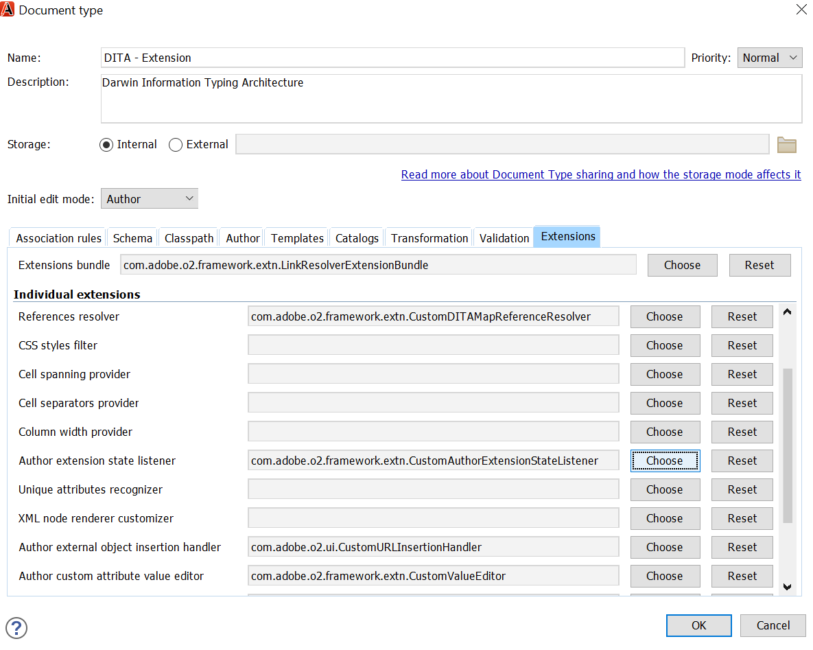
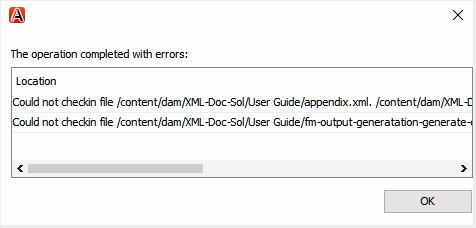

# Module externe Oxygen pour les guides Adobe Experience Manager {#id1645H6010Q5}

Le module externe Oxygen pour les guides Adobe Experience Manager \(appelé ultérieurement module externe Oxygen pour les guides d’AEM dans le guide\) vous permet de connecter l’auteur XML Oxygen au référentiel Adobe Experience Manager \(AEM\) pour la création et la gestion de contenu. Vous pouvez utiliser le module externe pour parcourir, rechercher et ouvrir des fichiers ; extraire et archiver des fichiers ; charger des dossiers et des fichiers sur le référentiel AEM. Le panneau AEM Guides de l’application de bureau vous permet de marquer les dossiers de votre choix \(du référentiel AEM\) vers la liste des dossiers favoris pour un accès rapide. De plus, vous pouvez installer un package dans AEM interface web et ouvrir vos fichiers DITA dans Auteur XML Oxygen directement à partir de l’interface web AEM.

## Télécharger et installer {#id1826M0L0PUI}

Le module externe Oxygen pour AEM Guides est disponible via votre portail de distribution de logiciels Adobe. Recherchez &quot;oxygène&quot; dans l’onglet du Experience Manager, puis téléchargez le programme d’installation du module externe depuis votre [Portail de distribution de logiciels Adobe](https://experience.adobe.com/#/downloads/content/software-distribution/en/general.html).

>[!NOTE]
>
>Vérifiez la compatibilité de la version du connecteur Oxygen dans les notes de mise à jour des Guides Adobe Experience Manager spécifiques.

Une fois que vous avez installé le programme d’installation, installez-le sur votre ordinateur local sur lequel Oxygen XML Author est installé. Avant de commencer le processus d’installation, vous devez vous assurer que votre système répond aux exigences techniques d’installation du module externe Oxygen pour les AEM Guides.

### Exigences techniques

- Oxygen XML Author version 25.1

- Guides Adobe Experience Manager version 4.3 ou ultérieure

- Adobe Experience Manager version 6.5 avec Service Pack 14, 15, 16 et 17

- Système d’exploitation pris en charge par Oxygen XML Author version 25.1

- Java Development Kit
   - Oracle SE 8 JRE 1.8

### Installation du module externe sous Windows

>[!IMPORTANT]
>
>Si une ancienne version du module externe est installée sur votre système, assurez-vous de la désinstaller avant de lancer le processus d’installation. Voir **Désinstallation des modules** dans la section [Utilisation de modules](https://helpx.adobe.com/experience-manager/6-4/sites/administering/using/package-manager.html) article pour les instructions de désinstallation.

Effectuez les étapes suivantes sur le système où Oxygen XML Author est installé :

1. Lancez le programme d’installation `.exe` fichier .

   L’écran de bienvenue de l’assistant d’installation s’affiche.

1. Cliquez sur **Suivant** et accédez à l’emplacement où le fichier .exe de l’auteur XML Oxygen est disponible.

1. Sélectionnez le fichier, puis cliquez sur **Ouvrir**.

   L’emplacement du fichier sélectionné est ajouté dans l’assistant d’installation.

1. Cliquez sur **Suivant**.

1. Cliquez sur **Installer**.

1. Cliquez sur **Terminer** pour fermer l&#39;assistant d&#39;installation.
1. Lancez Auteur XML Oxygen.

   Le panneau Guides d’AEM s’affiche dans l’auteur XML Oxygen.

   {width="800" align="left"}

   >[!NOTE]
   >
   >Si vous ne voyez pas le panneau AEM Guides, reportez-vous aux solutions de contournement dans la section de dépannage—[Panneau Guides AEM manquants](#id192BH200ZAX).


### Installation du module externe sur Mac

>[!IMPORTANT]
>
>Si une ancienne version du module externe est installée sur votre système, assurez-vous de la désinstaller avant de lancer le processus d’installation. Voir **Désinstallation des modules** dans la section [Utilisation de modules](https://helpx.adobe.com/experience-manager/6-4/sites/administering/using/package-manager.html) instructions de désinstallation de l’article.

Effectuez les étapes suivantes sur le système où Oxygen XML Author est installé :

1. Recherchez le fichier .dmg du module externe sur votre système.

1. Double-cliquez sur le fichier .dmg pour ouvrir le contenu du fichier.

   Le fichier .dmg contient un dossier aem-connector-x.x et un fichier aem-connector-x.x-setup .

   >[!NOTE]
   >
   >x.x dans les noms de fichier est le numéro de version du module externe.

1. Copiez le dossier aem-connector-x.x dans le dossier plugins de Oxygen XML Author.
1. Double-cliquez sur le fichier aem-connector-x.x-setup pour lancer le programme d’installation.

1. Lancez Auteur XML Oxygen.

   Le panneau Guides d’AEM s’affiche dans l’auteur XML Oxygen.

    {width="800" align="left"}

   >[!NOTE]
   >
   >Si vous ne voyez pas le panneau AEM Guides, reportez-vous aux solutions de contournement dans la section de dépannage—[Panneau Guides AEM manquants](#id192BH200ZAX).


### Installez le package pour activer la fonction d’édition de documents à partir de l’interface web d’AEM {#id182CE0Q0TY4}

En tant qu’auteur, vous pouvez ouvrir et modifier vos mappages ou rubriques DITA dans Auteur XML Oxygen directement à partir de l’interface web AEM. Pour activer cette fonctionnalité dans AEM interface web, votre administrateur AEM doit installer un package dans votre instance de création d’AEM.

En tant qu’administrateur AEM, procédez comme suit pour installer le package :

1. Récupérez le fichier .zip du module auprès de votre équipe informatique.
1. Connectez-vous à votre instance AEM *\(en tant qu’administrateur\)* et accédez au gestionnaire de modules CRX. L’URL par défaut pour accéder au gestionnaire de modules est :

   `http://<server name>:<port>/crx/packmgr/index.jsp`

   Le gestionnaire de modules gère les modules de votre installation AEM locale. Pour plus d’informations sur l’utilisation du gestionnaire de modules, voir [Utilisation de modules](https://experienceleague.adobe.com/docs/experience-manager-cloud-service/content/implementing/developer-tools/package-manager.html?lang=en) dans la documentation AEM.

    {width="650" align="left"}

1. Pour charger le package Oxygen, cliquez sur **Télécharger le module**.
1. Dans la boîte de dialogue Télécharger le package , accédez au fichier de package Oxygen que vous avez téléchargé à l’étape 1, puis cliquez sur OK.

   Le package est téléchargé sur votre instance AEM.

1. Pour lancer le processus d’installation, cliquez sur **Installer**.

   {width="650" align="left"}

1. Dans la boîte de dialogue Installer le package, cliquez sur **Installer**.
1. Une fois l’installation terminée, cliquez sur le bouton Accueil dans le coin supérieur gauche de CRX Package Manager.
1. Sélectionnez un fichier DITA dans votre dossier de ressources.

   **Modifier dans Oxygen** est disponible dans la barre d’outils. Pour plus d’informations sur l’utilisation de cette option, voir [Ouvrir la rubrique DITA dans l’auteur XML Oxygen à partir de l’interface web AEM](#id182CE0I905Z).

   >[!NOTE]
   >
   >La variable **Modifier dans Oxygen** est visible lorsque vous sélectionnez une rubrique DITA. Si vous sélectionnez plusieurs rubriques, l’option ne sera pas visible.


## Configuration du module externe Oxygen pour AEM Guides {#id1826KF00AHS}

Après avoir téléchargé et installé le module externe, vous devez configurer les éléments suivants pour qu’ils fonctionnent avec le module externe :

- **Paramètres d&#39;authentification web**: paramètres pour l’authentification SSO dans le module externe pour les Guides d’AEM.
- **Paramètres généraux**: paramètres de connexion du module externe, tels que l’URL du serveur d’AEM, les détails de connexion, etc.
- **Préférences pour la personnalisation des attributs de profilage et les noms de fichier dans les références croisées**: cette configuration est requise pour les schémas d’attributs de profilage pour les jeux de documentation.

### Paramètres d&#39;authentification web

JxBrowser est utilisé pour l’authentification SSO par le module externe du connecteur Oxygen. C&#39;est un navigateur basé sur le chrome. Pour java 9+, l’accès aux API non publiques est requis et vous devez accorder explicitement cet accès à JxBrowser. Pour plus d’informations, voir [Dépannage de JxBrowser](https://jxbrowser-support.teamdev.com/docs/guides/troubleshooting/issues.html).

Mettez à jour les fichiers donnés pour configurer les paramètres d’authentification web dans le module externe Oxygen pour AEM Guides :

>[!NOTE]
>
>Effectuez une sauvegarde du fichier avant de le mettre à jour.

**Pour Mac et Oxygen 25.1**

Ajoutez les lignes suivantes dans env.sh.

```java
--illegal-access=permit\
--add-opens=java.desktop/javax.swing.plaf.basic=ALL-UNNAMED\
--add-exports=javafx.controls/com.sun.javafx.scene.control=ALL-UNNAMED\
--add-exports=javafx.graphics/com.sun.javafx.stage=ALL-UNNAMED\
--add-exports=javafx.graphics/com.sun.javafx.scene=ALL-UNNAMED\
--add-exports=javafx.graphics/com.sun.javafx.scene.traversal=ALL-UNNAMED\
--add-exports=javafx.graphics/com.sun.javafx.tk=ALL-UNNAMED\
--add-exports=javafx.graphics/com.sun.glass.ui=ALL-UNNAMED\
--add-opens=javafx.graphics/com.sun.glass.ui=ALL-UNNAMED\
--add-opens=javafx.graphics/javafx.stage=ALL-UNNAMED\
--add-opens=javafx.graphics/com.sun.javafx.tk.quantum=ALL-UNNAMED\
--add-exports=java.desktop/sun.awt=ALL-UNNAMED\
--add-opens javafx.swing/javafx.embed.swing=ALL-UNNAMED
```

Ajoutez les lignes suivantes dans le fichier oxygèneAuthor.sh :

```java
-Djdk.module.illegalAccess=permit\-Djava.ipc.external=true\
```

**Pour Windows et Oxygen 25.1**

Ajoutez les lignes suivantes dans env.bat.

```java
--illegal-access=permit --add-opens=java.desktop/javax.swing.plaf.basic=ALL-UNNAMED --add-exports=javafx.controls/com.sun.javafx.scene.control=ALL-UNNAMED --add-exports=javafx.graphics/com.sun.javafx.stage=ALL-UNNAMED --add-exports=javafx.graphics/com.sun.javafx.scene=ALL-UNNAMED --add-exports=javafx.graphics/com.sun.javafx.scene.traversal=ALL-UNNAMED --add-exports=javafx.graphics/com.sun.javafx.tk=ALL-UNNAMED --add-exports=javafx.graphics/com.sun.glass.ui=ALL-UNNAMED --add-opens=javafx.graphics/com.sun.glass.ui=ALL-UNNAMED --add-opens=javafx.graphics/javafx.stage=ALL-UNNAMED --add-opens=javafx.graphics/com.sun.javafx.tk.quantum=ALL-UNNAMED --add-exports=java.desktop/sun.awt=ALL-UNNAMED --add-opens javafx.swing/javafx.embed.swing=ALL-UNNAMED
```

Ajoutez les lignes suivantes dans le fichier oxygèneAuthor.bat.

```java
-Djdk.module.illegalAccess=permit -Djava.ipc.external=true
```

>[!NOTE]
>
>Vous devez exécuter de l’oxygène à partir d’oxygèneAuthor.sh pour Mac et d’oxygèneAuthor.bat pour Windows en tant qu’administrateur.

### Paramètres généraux

Effectuez les étapes suivantes pour configurer les paramètres de connexion dans les guides du module externe Oxygen pour Adobe Experience Manager :

1. Dans le panneau Guides d’AEM, cliquez sur l’icône de paramètres, puis sélectionnez **Paramètres**.

   {width="800" align="left"}

1. Indiquez les informations suivantes :
   - **URL du serveur**: URL du serveur AEM, par exemple :

     ```http
     http[s]://<host>:<port>
     ```

     Dans l’URL ci-dessus, spécifiez le nom d’hôte et le port du serveur sur lequel AEM serveur est déployé.

     >[!IMPORTANT]
     >
     >Si votre serveur AEM est déployé sur le port 80 ou 443, vous n’avez pas besoin de le spécifier dans l’URL.

   - **Authentification :** Choisir parmi **De base \(Nom d’utilisateur/Mot de passe\)** ou **Authentification web**. Si vous sélectionnez **De base** l’authentification que vous devez renseigner dans la variable **Nom d’utilisateur** et **Password** dans la boîte de dialogue Préférences.

     Si vous sélectionnez Authentification Web, l’écran AEM connexion s’affiche. Saisissez vos informations de connexion et cliquez sur le bouton **Se connecter** bouton . Une fois la connexion établie, l’écran AEM connexion se ferme et le panneau AEM Guides affiche la liste des fichiers du serveur AEM.

   - **Délai de connexion**: spécifiez le temps d’attente, en secondes, d’une réponse du client par rapport au serveur AEM. Si aucune réponse du serveur n’est reçue dans le délai spécifié, la requête est arrêtée. La valeur par défaut est de 20 secondes.

   - **Dossier local**: emplacement sur votre ordinateur local où les fichiers du référentiel AEM sont stockés après extraction. Si vous spécifiez un emplacement qui n’existe pas sur le lecteur, le module externe crée cet emplacement.
   - **Ouvrir le fichier lors de l’extraction**: s’il est sélectionné, ouvre les fichiers lors de l’extraction.
   - **Fermer le fichier lors de l’archivage**: si cette option est sélectionnée, les fichiers sont fermés lors de l’archivage. Avant de fermer le fichier, une fenêtre contextuelle s’affiche, dans laquelle vous pouvez spécifier les commentaires de version.
   - **Afficher la boîte de dialogue d’archivage lors de la fermeture du fichier**: s’il est sélectionné, une fenêtre contextuelle s’affiche lors de la fermeture d’un fichier. Dans la fenêtre contextuelle, vous pouvez choisir d’archiver le fichier ou de le fermer sans archiver.
   - **Extraction automatique du fichier lorsqu’il est ouvert**: si cette option est sélectionnée, un double-clic sur un fichier l’extrait automatiquement et l’ouvre pour modification. Si le fichier est déjà extrait, il est simplement ouvert pour modification. Si cette option n’est pas sélectionnée, l’ouverture d’un fichier sur lequel vous n’avez pas de verrouillage l’ouvre en mode lecture seule.
1. Cliquez sur **OK**.

### Préférences pour la personnalisation des attributs de profilage et les noms de fichier dans les références croisées {#id1827K0D0OHT}

Vous devez configurer les préférences dans Oxygen XML Author pour utiliser l’attribut de profilage associé aux rubriques DITA dans le référentiel AEM. Vous devez également configurer la préférence pour afficher les noms de fichier à la place des GUID dans les références croisées.

Effectuez les étapes suivantes pour configurer les attributs de profilage et les références croisées :

1. Dans Auteur XML Oxygen, cliquez sur **Options** \> **Préférences**.
1. Dans le **Association du type de document** onglet, sélectionnez **DITA**, puis cliquez sur **Étendre**.

   {width="650" align="left"}

1. Dans le **Classpath** sélectionnez com.adobe.o2.connector dans l’onglet **Utilisation du module externe de chargement de classe parent avec identifiant** menu déroulant.

   {width="650" align="left"}

1. Dans le **Extensions** effectuez les modifications suivantes :
   - Cliquez sur **Choisir** en regard de **Écouteur d’état de l’extension de création** under **Extensions individuelles** et sélectionnez CustomAuthorExtensionStateListener - com.adobe.o2.framework.extn dans **Classe** liste. Cliquez sur **OK**.
   - Cliquez sur **Choisir** en regard de **Éditeur de valeur d’attribut personnalisé de création** under **Extensions individuelles** et sélectionnez CustomValueEditor - com.adobe.o2.framework.extn dans la **Classe** liste. Cliquez sur **OK**.
La capture d’écran suivante montre le **Extension** pour les rubriques DITA :

     {width="650" align="left"}

   - Cliquez sur **Choisir** en regard de **Groupe d’extensions** et sélectionnez LinkResolverExtensionBundle - com.adobe.o2.framework.extn dans **Classe** liste. Cliquez sur **OK**.

      {width="650" align="left"}


1. Cliquez sur **OK** dans toutes les boîtes de dialogue pour enregistrer vos modifications.

### Configuration de l’extension de carte DITA

La configuration de l’extension de mappage DITA est requise pour permettre l’ouverture des fichiers de mappage dans l’auteur XML Oxygen directement à partir de l’interface web d’AEM. Ces configurations sont similaires aux configurations des attributs de profilage effectuées lors de la procédure précédente.

Effectuez les étapes suivantes pour configurer l’extension de mappage DITA :

1. Dans Auteur XML Oxygen, cliquez sur **Options** \> **Préférences**.
1. Dans le **Association du type de document** onglet, sélectionnez **Carte DITA**, puis cliquez sur **Étendre**.
1. Dans le **Classpath** sélectionnez com.adobe.o2.connector dans l’onglet **Utilisation du module externe de chargement de classe parent avec identifiant** menu déroulant.
1. Dans le **Extensions** effectuez les modifications suivantes :
1. 
   - Cliquez sur **Choisir** en regard de **Écouteur d’état de l’extension de création** under **Extensions individuelles** et sélectionnez CustomDITAMapAuthorExtensionStateListener - com.adobe.o2.framework.extn dans **Classe** liste. Cliquez sur **OK**.
- Cliquez sur **Choisir** en regard de **Éditeur de valeur d’attribut personnalisé de création** under **Extensions individuelles** et sélectionnez CustomValueEditor - com.adobe.o2.framework.extn dans la **Classe** liste. Cliquez sur **OK**.
- *\(Facultatif\)* Si vous ne souhaitez pas résoudre les références lors de l’ouverture d’un fichier map, vous devez effectuer la configuration supplémentaire suivante :

  Cliquez sur **Choisir** en regard de **Références Resolver** under **Extensions individuelles** et sélectionnez CustomDITAMapReferenceResolver - com.adobe.o2.framework.extn dans la **Classe** liste. Cliquez sur **OK**.

  La capture d’écran suivante montre le **Extension** tab :

  {width="650" align="left"}

1. Cliquez sur **OK** dans toutes les boîtes de dialogue pour enregistrer vos modifications.

## Utilisation du module externe Oxygen pour AEM Guides {#id1826JG00WY4}

### Panneau Guides d’AEM

L’écran suivant affiche le panneau Guides d’AEM.

{width="550" align="left"}

**A**\) Affiche la barre de recherche.

**B**\) Affiche le dossier Favoris. Par défaut, il est vide. Vous pouvez ajouter des dossiers du référentiel AEM comme favoris, les dossiers favoris sont ensuite affichés ici.

**C**\) Le dossier DAM affiche le référentiel AEM. Vous pouvez développer et réduire l’affichage du dossier.

**D**\) L’icône Paramètres \(engrenage\) avec les options suivantes :

- **Connexion**: sélectionnez cette option pour vous connecter au serveur AEM. L’option est désactivée lorsque l’auteur XML Oxygen est connecté au serveur AEM.
- **Actualiser**: sélectionnez cette option pour obtenir le dernier état des fichiers et du dossier à partir du référentiel AEM.

  >[!NOTE]
  >
  >Assurez-vous d’enregistrer vos fichiers avant de les actualiser. Lorsque vous sélectionnez **Actualiser** , vous recevez un avertissement pour enregistrer vos fichiers avant de les actualiser. Si vous n’avez pas enregistré vos fichiers, vous pouvez cliquer sur **Annuler** et les sauver.

- **Paramètres**: vous pouvez utiliser cette option pour ouvrir la boîte de dialogue de préférences générales du module externe.
- **Déconnexion**: sélectionnez cette option pour fermer la connexion AEM serveur. Cette option est disponible uniquement si vous utilisez le mode Authentification Web .

### Fonctions de menu contextuel

Les fonctions du module externe Oxygen pour AEM Guides sont disponibles lorsque vous cliquez avec le bouton droit de la souris sur un dossier ou un fichier dans le référentiel AEM. Les fonctions disponibles pour les dossiers sont différentes des fichiers. Voici une liste complète des fonctions du module externe Oxygen pour le menu contextuel AEM Guides :

- **Ouvrir**: ouvre le fichier sélectionné ou développe le dossier sélectionné.
- **Ouvrir dans**: vous pouvez choisir d’ouvrir le fichier sélectionné dans l’éditeur web ou le tableau de bord des cartes d’AEM Guides ou dans l’éditeur de cartes. Pour plus d’informations sur ces options, voir [Ouvrir le fichier dans l’éditeur AEM Guides](#id195GH0V30KX).
- **Extraction**: extrait un fichier du référentiel AEM. Pour plus d’informations, voir [Extraction de fichiers](#id195HC020TS4).
- **Extraction avec dépendances**: extrait un fichier avec ses références directes. Pour plus d’informations, voir [Extraction de fichiers](#id195HC020TS4).
- **Extraction avec dépendances en lecture seule**: extrait le fichier sélectionné avec ses fichiers dépendants. Vous ne pouvez pas apporter de modifications aux fichiers dépendants. Pour plus d’informations, voir [Extraction de fichiers](#id195HC020TS4).
- **Annuler l’extraction**: annule le fichier extrait, ferme le fichier à partir de l’éditeur et rétablit les modifications sur la dernière version du fichier enregistré sur le serveur.
- **Actualiser**: dans le cas d’un fichier, récupère la dernière copie du fichier du référentiel AEM. Pour un dossier, il récupère la structure de dossiers et l’état du fichier. Cela signifie qu’un fichier est ajouté, puis qu’il s’affiche dans la vue AEM Guides. En outre, si un fichier est extrait sur AEM serveur, l’opération Actualiser dans l’auteur Oxygen affiche le fichier comme extrait. Toutefois, cela ne met pas à jour la liste des fichiers dans la variable *Fichiers extraits dans AEM Guides* Afficher.
- **Actualisation des fichiers extraits**: actualise la liste des fichiers extraits dans le *Fichiers extraits dans AEM Guides* Afficher. Si un fichier est extrait sur AEM serveur, l’opération d’actualisation met à jour la liste des fichiers extraits dans la variable *Fichiers extraits dans AEM Guides* Afficher. Cependant, si un nouveau fichier a été ajouté ou que l’état d’un fichier a changé, il ne le met pas à jour dans l’arborescence des Guides d’AEM. Pour mettre à jour l’état des fichiers sur AEM, vous devez effectuer une opération d’actualisation.
- **Archivage**: extrait les fichiers que vous avez extraits. Pour plus d’informations, voir [Archivage d’un fichier](#id182CF0J0FHS).
- **Archivage avec les dépendances**: si vous avez extrait des fichiers avec des dépendances, cette option archive le fichier principal avec ses dépendances. Pour plus d’informations, voir [Archivage d’un fichier](#id182CF0J0FHS).
- **Créer un dossier**: crée un dossier dans le référentiel AEM. Cette option est disponible uniquement au niveau du dossier.
- **Télécharger le fichier\(s\)**: télécharge un ou plusieurs fichiers. Pour plus d’informations, voir [Chargement de fichiers et de dossiers](#id195HC03F03J).
- **Chargement avec des dépendances**: charge les fichiers DITA \(XML, DITA, Cartographie du livre ou Carte DITA\) avec ses fichiers dépendants. Pour plus d’informations, voir [Chargement de fichiers et de dossiers](#id195HC03F03J).
- **Dossier de chargement**: télécharge un dossier sur le référentiel AEM. Pour plus d’informations, voir [Chargement de fichiers et de dossiers](#id195HC03F03J).
- **Ajouter aux Favoris**: ajoute un dossier au dossier *Favoris* dans le panneau Guides d’AEM. Il est recommandé d’ajouter ici votre dossier de travail, ce qui facilite la synchronisation des fichiers et de l’état du fichier à partir d’AEM.
- **Supprimer des favoris**: supprime un dossier de *Favoris*. Pour plus d’informations, voir [Ajouter ou supprimer des Favoris](#id195HC04405P).
- **Afficher les métadonnées**: affiche les métadonnées telles que la classe DITA, le titre, le type, l’UUID du document et d’autres informations associées à un fichier. Pour plus d’informations, voir [Affichage des métadonnées d’un fichier](#id195GHN0H05C).
- **Affichage des versions**: affiche l’historique des versions d’un fichier. Pour plus d’informations, voir [Affichage de l’historique des versions d’un fichier](#id195GI000D5Q).

### Ouvrir un fichier dans l’auteur XML Oxygen {#id195GHJ0A0UB}

Une fois que vous êtes connecté au référentiel AEM, vous pouvez ouvrir des fichiers pour les modifier dans l’auteur XML Oxygen. Effectuez les étapes suivantes pour ouvrir un fichier en vue de le modifier dans l’auteur XML Oxygen :

1. Cliquez avec le bouton droit de la souris sur un fichier du panneau Guides d’AEM que vous souhaitez ouvrir pour le modifier.

1. Sélectionner **Ouvrir** dans le menu contextuel.

   Le fichier est ouvert dans l’éditeur de l’auteur XML Oxygen.

    {width="800" align="left"}

   Lorsque vous placez le pointeur de la souris sur l’onglet d’un fichier, le chemin du serveur s’affiche avec son UUID. Dans la capture d’écran ci-dessus, l’UUID du document est mis en surbrillance.


Si vous avez sélectionné la variable **Extraction automatique du fichier lorsqu’il est ouvert** Option \(dans la boîte de dialogue Préférences\), puis à l’ouverture d’un fichier, le fichier est automatiquement extrait et peut être modifié. Pour ouvrir un fichier, vous pouvez cliquer deux fois sur le nom d’un fichier ou cliquer avec le bouton droit sur celui-ci et choisir **Ouvrir** dans le menu contextuel. Si cette option n’est pas sélectionnée, le fichier est ouvert en mode lecture seule.

>[!NOTE]
>
>Vous pouvez également double-cliquer sur un fichier pour l’ouvrir.

### Ouvrir le fichier dans l’éditeur AEM Guides {#id195GH0V30KX}

Si vous souhaitez utiliser les éditeurs disponibles dans AEM Guides, vous pouvez le faire en sélectionnant l’option requise dans le menu contextuel. Effectuez les étapes suivantes pour utiliser l’éditeur AEM Guides à la place de l’éditeur Oxygen XML Author :

1. Cliquez avec le bouton droit de la souris sur un fichier du panneau Guides d’AEM que vous souhaitez ouvrir pour le modifier.

1. Sélectionner **Ouvrir dans** dans le menu contextuel, sélectionnez l’une des options suivantes :

   - **Éditeur de rubrique web**: si le fichier que vous ouvrez est un fichier .xml ou .dita, vous pouvez l’ouvrir pour le modifier dans l’éditeur web. Choisissez la **Éditeur de rubrique web** pour ouvrir le fichier sélectionné à modifier dans l’éditeur Web.

   - **Tableau de bord des cartes**: vous pouvez choisir de modifier un fichier .ditamap dans le tableau de bord de mappage, dans lequel vous pouvez effectuer diverses opérations sur le fichier de mappage. Ces opérations dépendent du rôle/groupe auquel vous appartenez.

   - **Éditeur de mappage Web DITA**: si vous souhaitez ouvrir le fichier .ditamap en vue de le modifier dans l’éditeur de cartes, sélectionnez cette option. À l’aide de l’option Éditeur de mappage DITA, vous pouvez ajouter ou supprimer des rubriques, ajouter des tableaux de relation et effectuer d’autres opérations sur votre carte.


### Extraction de fichiers {#id195HC020TS4}

Lorsque vous extrayez un fichier, il est stocké localement sur votre système et verrouillé pour modification dans le référentiel AEM. Effectuez les étapes suivantes pour extraire un fichier :

1. Vous pouvez extraire vos fichiers de l’une des manières suivantes :
   - Cliquez avec le bouton droit de la souris sur un fichier dans le panneau AEM Guides.
   - Cliquez avec le bouton droit sur l’onglet de mappage dans le panneau Gestionnaire de mappages DITA .
   - Cliquez avec le bouton droit de la souris sur un fichier dans le panneau Gestionnaire de cartes DITA .
   - Cliquez avec le bouton droit sur l’onglet Fichier lorsque vous ouvrez une carte ou une rubrique dans l’éditeur.

1. Sélectionnez l’une des options suivantes :
   - **Extraction :** Extrait un fichier du référentiel AEM et le rend disponible pour modification.
   - **Extraction avec dépendances**: extrait un fichier avec ses références directes. Vous pouvez apporter des modifications aux pages parents et enfants à l’aide de cette option. Le module externe Oxygen pour AEM Guides prend en charge l’extraction d’un niveau de dépendances. Par exemple, la carte A fait référence à la rubrique A et la rubrique A à la rubrique B. L’extraction de la carte A entraîne l’extraction de la rubrique A, quel que soit son niveau dans la hiérarchie de la table des matières. Cependant, il n’extrait pas la rubrique B, car elle n’est pas directement liée à partir de la carte A.
   - **Extraction avec dépendances en lecture seule**: extrait un fichier et télécharge ses dépendances sur votre ordinateur local en tant que copies en lecture seule. Vous ne pouvez pas apporter de modifications aux fichiers dépendants.

Si vous avez sélectionné la variable **Ouvrir les fichiers lors de l’extraction** Option \(dans la boîte de dialogue Préférences\), puis lors de l’extraction d’un fichier, le fichier est automatiquement ouvert pour modification.

Si vous avez sélectionné la variable **Extraction automatique du fichier lorsqu’il est ouvert** Option \(dans la boîte de dialogue Préférences\), puis à l’ouverture du fichier, le fichier est automatiquement extrait et mis à disposition pour modification. Pour ouvrir un fichier, vous pouvez cliquer deux fois sur le nom d’un fichier ou cliquer avec le bouton droit sur celui-ci et choisir **Ouvrir** dans le menu contextuel.

Lorsqu’un fichier est extrait, l’icône du fichier change pour afficher son état verrouillé.

{width="650" align="left"}

Dans la capture d’écran ci-dessus, un fichier extrait par un autre utilisateur s’affiche avec une icône de verrouillage de couleur noire \(A\). Le fichier extrait par l’utilisateur actuel s’affiche avec un verrou de couleur verte \(B\).

>[!NOTE]
>
>Si le fichier extrait est supprimé ou déplacé dans un autre dossier d’AEM, un message d’erreur s’affiche lorsque vous archivez le fichier. Assurez-vous que le fichier extrait n’est pas déplacé ni supprimé à l’aide de l’interface web d’AEM.

### Archivage d’un fichier {#id182CF0J0FHS}

Lorsque vous archivez un fichier, la copie locale du système est stockée dans le référentiel AEM et le verrouillage du fichier est supprimé. Effectuez les étapes suivantes pour archiver un fichier :

1. Enregistrez votre fichier en cliquant sur **Fichier** \> **Enregistrer**.

1. Cliquez avec le bouton droit sur un fichier extrait ou mappez-le dans l’un des emplacements suivants :
   - Panneau Guides d’AEM
   - Panneau Gestionnaire des mappages DITA
   - Onglet Fichier lorsque vous ouvrez une carte ou une rubrique dans l’éditeur.
   - Onglet de mappage dans le panneau Gestionnaire de mappages DITA .

1. Choisissez l’une des deux options suivantes :

   - **Archivage**: archive le fichier sélectionné de votre système local dans AEM référentiel.
   - **Archivage avec les personnes à charge :** Si vous avez extrait un fichier avec ses fichiers dépendants, utilisez cette option pour archiver tous les fichiers dépendants en une seule opération. Lorsque vous sélectionnez cette option, la boîte de dialogue d’archivage s’affiche avec tous les fichiers dépendants. Cliquez sur OK pour archiver tous les fichiers en même temps.

   Si vous n’avez pas extrait les fichiers dépendants, puis que vous sélectionnez cette option, seuls les fichiers dépendants que vous avez \(séparément\) extraits seront archivés. La liste des fichiers n’ayant pas pu être archivés s’affiche :

   {width="800" align="left"}

   Il est vivement recommandé de ne pas déplacer un fichier extrait. Cependant, si un fichier extrait est déplacé vers un autre emplacement, vous devez annuler l’extraction sur ce fichier. Si vous souhaitez apporter des mises à jour à ce fichier, extrayez-le à nouveau, apportez des modifications, puis réarchivez-le. Si vous essayez d’archiver un fichier qui a été déplacé à partir de son emplacement d’origine, une erreur s’affiche.

   Si un fichier dépendant est extrait dans AEM, l’option Archiver avec les personnes à charge n’affiche pas le fichier dépendant dans la boîte de dialogue Archiver. Pour obtenir la liste des fichiers dépendants extraits dans AEM, vous devez effectuer une opération d’actualisation du dossier.

   De même, si vous avez archivé un fichier dépendant via AEM, la liste de fichiers n’est pas actualisée dans l’auteur Oxygen tant que vous n’avez pas effectué l’opération Actualiser et actualiser les fichiers extraits. Si vous effectuez une Archivage avec des personnes à charge avec certains fichiers archivés par le biais d’AEM, une erreur répertoriant les fichiers qui n’ont pas pu être archivés s’affiche.

1. \(Facultatif\) Dans la variable **Archivage** ou le **Archivage avec des personnes à charge** boîte de dialogue, ajouter un commentaire dans **Commentaires sur la version** zone de texte.

   >[!NOTE]
   >
   >Ce commentaire s’affiche dans l’historique AEM version du fichier.

1. Ajoutez un ou plusieurs libellés dans le **Libellé** de la zone de texte **Archivage** ou le **Archivage avec des personnes à charge** dialog . Saisissez un libellé et appuyez sur Entrée. Par exemple : *Version 2307*.

   Si votre administrateur a prédéfini une liste d’étiquettes et les a chargées dans la variable `label.json` puis ces libellés s’affichent sous la forme d’une liste déroulante. Vous pouvez choisir une ou plusieurs étiquettes dans la liste déroulante.

   {width="550" align="left"}

   Vous pouvez ajouter plusieurs libellés (séparés par des virgules) à la même version d’une rubrique.  Par exemple : *Adobe*, *AEM*,*Guides*
Cependant, vous ne pouvez pas ajouter le même libellé aux différentes versions d’une rubrique. Si vous ajoutez un libellé que vous avez déjà ajouté à une version antérieure, il est ajouté à la dernière version et supprimé de la version précédente.

   >[!NOTE]
   > 
   > Ces libellés s’affichent dans l’historique AEM version du fichier.


1. Cliquez sur **OK**.

>[!NOTE]
>
>Si le fichier extrait est supprimé ou déplacé dans un autre dossier d’AEM, un message d’erreur s’affiche lorsque vous archivez le fichier. Assurez-vous que le fichier extrait n’est pas déplacé ni supprimé à l’aide de l’interface web d’AEM.

### Fichiers extraits en mode AEM Guides

Lorsque vous disposez de plusieurs dossiers, il n’est pas facile de déterminer le nombre de fichiers extraits dans une vue. AEM Guides fournit des fichiers extraits dans la vue AEM Guides qui fournit un instantané complet des fichiers extraits actuellement. Grâce à cette vue, vous pouvez facilement identifier les fichiers qui ont été vérifiés par vous dans AEM référentiel à l’aide d’AEM Guides. Effectuez les étapes suivantes pour accéder à cette vue et l’utiliser :

1. Cliquez sur **Fenêtre** \> **Afficher la vue** \> **Fichiers extraits dans AEM Guides**.

   La vue Fichiers extraits dans AEM Guides s’affiche.

   {width="550" align="left"}

1. Cliquez avec le bouton droit sur un fichier dans cette vue pour obtenir les options suivantes :

   - [Ouvrir](#id195GH0V30KX)
   - [Ouvrir dans](#id195GH0V30KX)
   - Annuler l’extraction
   - [Archivage](#id182CF0J0FHS)
   - [Archivage avec des personnes à charge](#id182CF0J0FHS)
   - [Afficher les métadonnées](#id195GHN0H05C)
   - [Affichage des versions](#id195GI000D5Q)

**Remarques sur les fichiers extraits dans la vue AEM Guides :**

- La variable *Fichiers extraits dans AEM Guides* La vue conserve les sessions de l’utilisateur. Cela signifie que les fichiers extraits par l’utilisateur actuel sont stockés et conservés dans l’affichage au cours des sessions \(ou cache\) du même utilisateur.

- Si l’utilisateur modifie les informations de connexion du serveur AEM, les données du fichier extrait \(ou cache\) dans la vue sont réinitialisées. L’utilisateur doit exécuter manuellement une *Actualisation des fichiers extraits* sur chaque dossier à partir duquel les fichiers ont été extraits précédemment. Pour simplifier, il est recommandé d’ajouter vos dossiers de travail à la section *Favoris* à partir de laquelle vous pouvez rapidement actualiser un dossier.

- Vous pouvez trier la liste des fichiers en fonction de leur nom de fichier, de leur titre ou de leur chemin d’accès. Si un nouveau fichier est extrait, le fichier s’affiche dans l’ordre de tri dans la vue.


### Chargement de fichiers et de dossiers {#id195HC03F03J}

Effectuez les étapes suivantes pour charger des fichiers ou des dossiers :

1. Cliquez avec le bouton droit de la souris sur un dossier dans le panneau AEM Guides.
1. Sélectionnez l’une des options suivantes :
   - **Télécharger le fichier\(s\)**: sélectionnez cette option pour charger un ou plusieurs fichiers dans le dossier sélectionné du référentiel AEM. Dans la boîte de dialogue Sélectionner les fichiers à charger, sélectionnez les fichiers et cliquez sur **Ouvrir**.
   - **Chargement avec des dépendances**: sélectionnez cette option pour charger un fichier DITA avec ses dépendances. Dans la boîte de dialogue Select file to upload, sélectionnez les fichiers, puis cliquez sur **Ouvrir**.
   - **Dossier de chargement**: sélectionnez cette option pour charger un dossier dans le référentiel AEM. Dans la boîte de dialogue Choisir, sélectionnez le dossier et cliquez sur **Choisir**.

**Remarques supplémentaires sur l’utilisation de fichiers UUID**:

Les points suivants doivent être pris en compte lors du déplacement ou de la copie de contenu de votre système local vers le référentiel AEM :

- Lors du téléchargement d’un ou de plusieurs fichiers, un nouvel UUID est généré pour les fichiers ne disposant d’aucun UID. Cet UUID est ajouté dans la variable `topic id` d’un fichier DITA.

- Lors de la copie d’un dossier, les références aux fichiers \(dans le dossier\) sont automatiquement mises à jour dans toutes les cartes DITA référençant les fichiers de ce dossier.

- Lors de la copie d’un fichier de mappage DITA, les références UUID dans le fichier de mappage ne sont pas modifiées.

- Si un fichier ou un dossier est en conflit ou a un doublon, un nom de fichier unique est généré pour le nouveau fichier copié ou déplacé.

- Aucun fichier ne peut avoir le même UUID. Un UUID unique est affecté à tous les nouveaux fichiers.

- Si, en cas de chargement simultané d’un fichier par deux utilisateurs différents, le fichier traité ultérieurement remplace le fichier précédent. Une telle pratique doit toutefois être évitée.

- Lorsque vous extrayez du contenu du référentiel AEM et apportez des modifications sur votre système local, assurez-vous que le nom de fichier n’est pas modifié au moment du téléchargement du fichier.

- Lorsque vous insérez une référence dans le Gestionnaire de mappages DITA, elle affiche le titre du fichier et non l’UUID. Si le titre n’est pas présent, il affiche le nom du fichier.

### Ajouter ou supprimer des Favoris {#id195HC04405P}

Effectuez les étapes suivantes pour ajouter ou supprimer un dossier dans le dossier Favoris du panneau Guides d’AEM :

- Cliquez avec le bouton droit de la souris sur un dossier et sélectionnez **Ajouter aux Favoris**. Vous pouvez ajouter un dossier aux favoris s’il ne figure pas dans Favoris.
- Vous pouvez supprimer un dossier des favoris comme suit :
   - Cliquez avec le bouton droit de la souris sur un dossier de la **Favoris** et sélectionnez **Supprimer des favoris**.
   - Cliquez avec le bouton droit sur un dossier dans le référentiel AEM sous **DAM** dossier déjà ajouté en tant que favori et sélectionné **Supprimer des favoris**.

### Affichage de l’historique des versions d’un fichier {#id195GI000D5Q}

Pour afficher l’historique des versions d’un fichier, procédez comme suit :

1. Cliquez avec le bouton droit de la souris sur un fichier dans le panneau AEM Guides.

1. Sélectionner **Affichage des versions** dans le menu contextuel.

   L’historique des versions du fichier s’affiche dans la boîte de dialogue Versions.

   {width="550" align="left"}


### Affichage des métadonnées d’un fichier {#id195GHN0H05C}

Pour afficher les métadonnées d’un fichier, procédez comme suit :

1. Cliquez avec le bouton droit de la souris sur un fichier dans le panneau AEM Guides.

1. Sélectionner **Afficher les métadonnées** dans le menu contextuel.

   Les métadonnées du fichier, telles que la classe DITA, l’état du document, la date de modification, la taille, le titre et l’UUID, s’affichent dans la boîte de dialogue Métadonnées.

   {width="550" align="left"}


## Recherche d’une rubrique dans le référentiel AEM {#id1826J20405Z}

Vous pouvez rechercher des rubriques dans le référentiel AEM à l’aide de la barre de recherche du panneau AEM Guides. Vous pouvez effectuer des recherches dans l’ensemble du dossier DAM ou sélectionner un dossier, puis rechercher une rubrique dans ce dossier. Le résultat de la recherche affiche les rubriques dont le texte correspond à votre requête.

Effectuez les étapes suivantes pour rechercher des rubriques :

1. Sélectionnez un dossier dans le référentiel AEM où vous souhaitez rechercher une rubrique.
1. Saisissez la requête de recherche \(par exemple, `introduction`\) dans la barre de recherche du module externe Oxygen pour AEM Guides.
1. Cliquez sur le bouton de recherche ou appuyez sur Entrée.

   Le résultat s’affiche dans l’onglet Résultats de la recherche sous la forme d’une liste avec le chemin d’accès au fichier. Si aucun résultat correspondant n’est trouvé pour votre requête, aucun résultat n’est trouvé dans &lt;path of=&quot;&quot; the=&quot;&quot; selected=&quot;&quot; folder=&quot;&quot;> s’affiche.

   {width="550" align="left"}

1. \(Facultatif\) Double-cliquez sur un fichier dans le résultat de recherche pour l’ouvrir dans l’auteur XML Oxygen.
1. Pour revenir à la vue Repository d’AEM, effectuez l’une des opérations suivantes :
   - Pour afficher la vue Référentiel AEM sans effacer les résultats de la recherche, cliquez sur **Parcourir** .
   - Pour effacer les résultats de la recherche et afficher le référentiel d’AEM, cliquez sur l’icône Supprimer la recherche .

## Ouvrir la rubrique DITA dans l’auteur XML Oxygen à partir de l’interface web AEM {#id182CE0I905Z}

Vous pouvez ouvrir et modifier votre rubrique DITA dans Auteur XML Oxygen à partir de l’interface web d’AEM. Vous devez installer un package dans AEM pour activer cette option. Pour plus d’informations sur l’installation des packages, voir [Installez le package pour activer la fonction d’édition de documents à partir de l’interface web d’AEM](#id182CE0Q0TY4).

>[!NOTE]
>
>La variable **Modifier dans Oxygen** est accessible à partir de différents emplacements dans AEM : lorsqu’une rubrique est sélectionnée, lorsqu’une rubrique est prévisualisée ou à partir de l’onglet Sujets et rapports de la console de mappage DITA. Si vous sélectionnez plusieurs rubriques, l’option n’est pas visible dans la barre d’outils.

**Ouvrir une rubrique DITA**

Effectuez les étapes suivantes pour ouvrir une rubrique DITA dans l’auteur XML Oxygen :

1. Sélectionnez une rubrique dans vos ressources, puis cliquez sur **Modifier dans Oxygen** dans la barre d’outils.

   >[!NOTE]
   >
   >Si la rubrique n’est pas extraite, elle est d’abord extraite, puis ouverte dans Oxygen en mode d’édition.

1. Sélectionnez Auteur XML Oxygen . *&lt;version>* dans le **Lancer l’application** message. Vous pouvez sélectionner **Mémoriser mon choix pour les liens AEM** pour enregistrer vos préférences.

**Modification d’une rubrique DITA**

Effectuez les étapes suivantes pour modifier une rubrique DITA dans Oxygen XML Author :

1. Sélectionnez et extrayez une rubrique dans vos ressources.
1. Cliquez sur **Modifier dans Oxygen** dans la barre d’outils.

   >[!NOTE]
   >
   >Si la rubrique n’est pas extraite, elle est d’abord extraite, puis ouverte dans Oxygen en mode d’édition.

1. Sélectionnez Auteur XML Oxygen . *&lt;version>* dans le **Lancer l’application** message. Vous pouvez sélectionner **Mémoriser mon choix pour les liens AEM** pour enregistrer vos préférences.
1. Modifiez la rubrique dans l’auteur XML Oxygen.
1. Archivez la rubrique à partir du module externe Oxygen pour AEM Guides.

   Pour plus d’informations sur l’archivage d’une rubrique à l’aide du module externe Oxygen pour AEM Guides, voir [Archivage d’un fichier](#id182CF0J0FHS).

   >[!NOTE]
   >
   >Assurez-vous d’archiver la rubrique à l’aide du module externe Oxygen pour AEM Guides. Si vous archivez à partir de l’interface web d’AEM, les modifications que vous apportez dans l’auteur XML Oxygen ne sont pas enregistrées dans la version archivée de la rubrique.


## Utilisation des profils d’attribut {#id1827JA002YK}

AEM Guides vous permet de créer et d’associer facilement des attributs conditionnels à l’aide des attributs DITA appropriés. Vous pouvez définir des attributs conditionnels au niveau global ou au niveau du dossier. Les conditions définies globalement sont visibles pour tous les projets et les conditions au niveau du dossier ne sont visibles que dans les projets créés dans le dossier spécifié. Les auteurs de contenu peuvent utiliser ces attributs conditionnels pour conditionner le contenu de leurs rubriques ou mappages DITA qu’ils créent ou utilisent. Pour en savoir plus sur la création d’attributs conditionnels dans AEM à l’aide des AEM Guides, voir *Configuration d’attributs conditionnels pour les profils globaux ou au niveau du dossier* dans les guides d’installation et de configuration de Adobe Experience Manager.

>[!NOTE]
>
>Assurez-vous que vous avez ajouté les attributs conditionnels dans AEM et que vous avez défini [Préférences pour la personnalisation des attributs de profilage](#id1827K0D0OHT) avant d’ajouter des attributs conditionnels à votre contenu.

Effectuez les étapes suivantes pour ajouter des attributs conditionnels à votre contenu dans l’auteur XML Oxygen :

1. Extraction et ouverture d’une rubrique à partir du *Module externe Oxygen pour AEM Guides*.
1. Sélectionnez la partie du contenu dans laquelle vous souhaitez appliquer les attributs conditionnels.
1. Double-cliquez sur l’attribut conditionnel dans le panneau Attributs de l’auteur XML Oxygen.

   {width="300" align="left"}

1. Dans le **Disponible** dans la boîte de dialogue Modifier l’attribut, sélectionnez l’attribut\(s\), puis cliquez sur **Ajouter**.

   L’écran suivant affiche `audience` attributs.

   {width="550" align="left"}

1. Cliquez sur **OK**.

   Les attributs sont ajoutés au contenu.


## Résolution des problèmes courants {#id188ABC00RY4}

Cette rubrique aborde certains des problèmes les plus courants auxquels vous pourriez être confronté lorsque vous utilisez le module externe, ainsi que leurs solutions.

### Panneau Guides AEM manquants {#id192BH200ZAX}

**Problème** - Si vous ne voyez pas le panneau Guides d’AEM dans l’auteur XML Oxygen, essayez les solutions suivantes :

Solution 1 :

1. Dans Oxygen XML Author, activez le module externe.

   Cliquez sur **Options** \> **Préférences** \> **Modules externes** et sélectionnez **Module externe Oxygen pour les guides Adobe Experience Manager.**

1. Relancez Oxygen XML Author.


Solution 2 :

1. Si vous ne voyez toujours pas le panneau Guides AEM, activez AEM fenêtre Guides .

   Dans Oxygen XML Author, cliquez sur **Fenêtre** \> **Afficher la vue** \> **Guides d’AEM**.

Solution 3 :

1. Désinstallez et réinstallez le module externe Oxygen pour les guides Adobe Experience Manager.

   - Sous Windows, désinstallez le module externe de **Ajout ou suppression de programmes** liste. Ensuite, réinstallez le module externe.

   - Sur Mac, accédez au dossier aem-connector-x.x dans le dossier plugins de l’auteur XML Oxygen, puis déplacez-le vers **Corbeille**. Ensuite, videz la variable **Corbeille** dossier.


### Configuration du port pour la transformation DITA-OT

**Problème** - Lorsque vous exécutez une transformation DITA-OT sur des fichiers qui sont traités par le module externe, la transformation échoue avec l’erreur suivante :

{width="800" align="left"}

**Solution** - Ce problème a été corrigé en ajoutant un serveur proxy entre DITA-OT et le module externe. Ce serveur proxy traite et partage tous les fichiers demandés par DITA-OT pour les transformations. Le port par défaut sur lequel ce serveur a été configuré est : `5972`. Si vous utilisez ce port pour un autre serveur, vous pouvez spécifier un autre port pour le serveur proxy.

Effectuez les étapes suivantes pour modifier le port par défaut du serveur proxy :

1. Accédez à votre répertoire racine \(utilisateur\).
1. Créez un fichier nommé aem\_connector\_proxy.
1. Ouvrez le fichier dans n’importe quel éditeur de texte et ajoutez un numéro de port disponible dans la première ligne du fichier.
1. Enregistrez et fermez le fichier.
1. Redémarrez l’auteur XML Oxygen et exécutez la transformation DITA-OT.


### AEM panneau Guides ne navigue pas vers l’emplacement du fichier ouvert

Problème : lorsque vous choisissez d’ouvrir un fichier en vue de le modifier dans Oxygen XML Author à partir du serveur AEM, le fichier est ouvert pour modification dans Oxygen XML Author. Toutefois, le panneau Guides d’AEM n’affiche pas l’emplacement du fichier dans l’arborescence de navigation.

Solution : ce problème a été observé dans les scénarios où le chemin d’accès au fichier contient deux fois /content/dam. Par défaut, toutes les ressources d’AEM sont stockées sous le dossier /content/dam . Si vous chargez ou créez une structure de dossiers qui contient également /content/dam, ce problème est observé. Vous pouvez effectuer toutes les opérations normales sur ces fichiers, mais leur emplacement dans l’arborescence de navigation n’est pas affiché par défaut. Pour accéder à ce fichier dans l’arborescence de navigation, vous devez parcourir manuellement l’emplacement du fichier. Notez que dans l’arborescence de navigation, le chemin /content/dam dupliqué est remplacé par /content/assets.

### Configuration de la journalisation

Problème : par défaut, le module externe Oxygen pour AEM Guides ne génère aucun journal, ce qui rend difficile le débogage d’un scénario d’erreur.

Solution : procédez comme suit pour configurer les enregistreurs pour oXygen et JxBrowser :

1. Fermer l’auteur XML Oxygen

1. Créez un fichier nommé `logback.xml` avec le contenu suivant :

   ```xml
   <configuration>
       <appender name="R2" class="ch.qos.logback.core.rolling.RollingFileAppender">
           <file>${user.home}/Desktop/oxygenLog/oxygen.log</file>
           <rollingPolicy class="ch.qos.logback.core.rolling.FixedWindowRollingPolicy">
               <fileNamePattern>${user.home}/Desktop/oxygenLog/oxygen%i.log.gz</fileNamePattern>
               <minIndex>1</minIndex>
               <maxIndex>20</maxIndex>
           </rollingPolicy>
           <triggeringPolicy class="ch.qos.logback.core.rolling.SizeBasedTriggeringPolicy">
               <maxFileSize>100MB</maxFileSize>
           </triggeringPolicy>
           <encoder>
               <pattern>%r %marker %p [ %t ] %c - %m%n</pattern>
           </encoder>
       </appender> 
   
       <root level="debug">
           <appender-ref ref="R2" />
       </root>
   </configuration>   
   ```

1. Enregistrez le fichier dans le `Oxygen Author 25` répertoire . (Par exemple, le chemin serait : `C:\Program Files\Oxygen XML Author 25\logback.xml`)

1. Fermez le fichier. Cela permet d’activer les journaux Xygen, qui seront disponibles à l’emplacement suivant : `${user.home}/Desktop/oxygenLog/oxygen.log`
1. Ouvrez le `oxygenAuthor.bat` dans un éditeur de texte.
1. Configuration des journaux liés au navigateur JxBrowser en ajoutant le paramètre
   `-Denable.aem.jx.log=true`. Cela active les journaux liés à JxBrowser, que vous pouvez afficher à l’emplacement suivant : `${user.home}\AppData\Local\Temp\Oxygen_Plugin_Javax_Log.log`:


   ```java
   SET OXYGEN_JAVA=java.exe
   if exist "%JAVA_HOME%\bin\java.exe" set OXYGEN_JAVA="%JAVA_HOME%\bin\java.exe"
   if exist "%~dp0\jre\bin\java.exe" SET OXYGEN_JAVA="%~dp0\jre\bin\java.exe"
   rem Set environment variables
   call "%~dp0\env.bat"
   %OXYGEN_JAVA% -XX:-OmitStackTraceInFastThrow -XX:SoftRefLRUPolicyMSPerMB=10 -Djdk.module.illegalAccess=permit -Djava.ipc.external=true 
   -Denable.aem.jx.log=true -Dsun.java2d.noddraw=true -Dsun.awt.nopixfmt=true -Dsun.java2d.dpiaware=true -Dsun.io.useCanonCaches=true -Dsun.io.useCanonPrefixCache=true 
   -Dsun.awt.keepWorkingSetOnMinimize=true -Dcom.oxygenxml.app.descriptor=ro.sync.exml.AuthorFrameDescriptor
    -Dcom.oxygenxml.ApplicationDataFolder="%APPDATA%" -cp %CP% ro.sync.exml.Oxygen %*
   ```


Avec les étapes précédentes, les journaux seront activés et vous pouvez les utiliser pour déboguer les problèmes.
