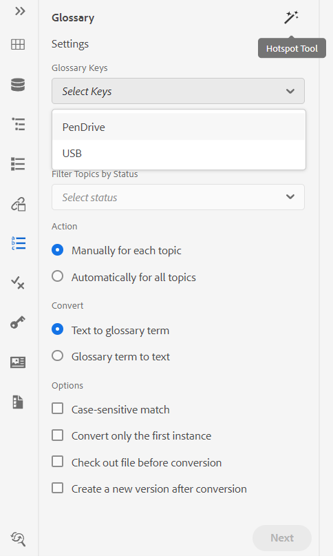
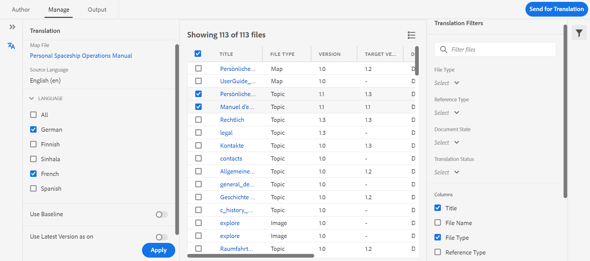

# Version de janvier d’[!DNL Adobe Experience Manager Guides] as a Cloud Service

## Mise à niveau vers la version de janvier

Mettez à niveau votre configuration actuelle d’[!DNL Adobe Experience Manager Guides] as a Cloud Service (plus tard appelée as a Cloud Service) [!DNL AEM Guides] procédant comme suit :
1. Consultez le code Git des services cloud et passez à la branche configurée dans le pipeline des services cloud correspondant à l’environnement à mettre à niveau.
1. Mettez à jour `<dox.version>` propriété dans `/dox/dox.installer/pom.xml` fichier de votre code Git Cloud Services vers la version 2022.1.78.
1. Validez les modifications et exécutez le pipeline Cloud Services pour effectuer la mise à niveau vers la version de janvier d’[!DNL AEM Guides] as a Cloud Service.

## Matrice de compatibilité

Cette section répertorie la matrice de compatibilité pour les applications logicielles prises en charge par [!DNL AEM Guides] version de janvier 2022 d’as a Cloud Service.

### FrameMaker et FrameMaker Publishing Server

| FMPS | FrameMaker |
| --- | --- |
| Non compatible | Mise à jour 2020 4 et versions ultérieures |
| | |

### Connecteur D&#39;Oxygène

| Version d’[!DNL AEM Guides] Cloud | Fenêtres du connecteur d&#39;oxygène | Mac du connecteur d&#39;oxygène | Modifier dans Oxygen Windows | Modifier dans Oxygen Mac |
| --- | --- | --- | --- | --- |
| 2022.1.0 | 2.4.0 | 2.4.0 | 2,2 | 2,2 |
|  |  |  |  |  |  |

## Nouvelles fonctionnalités et améliorations

### Publication basée sur des articles

Avec la version de janvier, nous avons introduit une fonctionnalité de publication d’articles intégrée à l’éditeur web. Vous pouvez utiliser la fonction de publication d’articles pour générer de manière incrémentielle la sortie d’une ou de plusieurs rubriques ou publier votre contenu sur une plateforme de base de connaissances.

Cette fonctionnalité permet aux utilisateurs de créer le plan DITA de manière additive et de publier des rubriques au fur et à mesure qu&#39;elles sont prêtes. Une fois que vous avez publié votre carte, utilisez la fonction de publication d’article pour effectuer une publication incrémentielle pour les articles mis à jour uniquement.

Outre AEM, vous pouvez utiliser cette fonctionnalité unique pour publier vos articles sur n’importe quel portail de base de connaissances, tel que Salesforce. Cette fonctionnalité est également fournie avec un modèle de contenu prêt à l’emploi, reposant sur les composants principaux d’AEM, qui vous permet de créer un référentiel de contenu technique basé sur les connaissances. Ce qui est formidable avec ce modèle, c’est qu’il est entièrement personnalisable pour répondre aux besoins de votre organisation et peut également prendre en charge des cas d’utilisation tels que les portails intranet d’entreprise.
Vous pouvez également filtrer les articles en fonction de leur état de document et de l’heure de modification.

Cette publication d’articles en continu, basée sur les besoins, vous permet non seulement de contrôler entièrement la publication de votre contenu, mais également de réduire le temps global de publication de votre contenu mis à jour.
Lorsque vous publiez vos articles à l’aide de ce modèle, il peut également transmettre les métadonnées aux pages publiées.
Pour plus d’informations, consultez la section *Publication basée sur des articles à partir de l’éditeur web* dans le guide d’utilisation.

### Éditeur Web Amélioré

De nombreuses améliorations et nouvelles fonctionnalités ont été introduites dans l’éditeur web :

* La prise en charge du schéma d&#39;objet a également été ajoutée dans l&#39;éditeur web. Vous pouvez maintenant créer et utiliser le schéma d&#39;objet à l&#39;aide du panneau Schéma d&#39;objet. Avec l’ajout du schéma d’objet, vous pouvez désormais utiliser les métadonnées et la taxonomie de votre entreprise.

* Un nouvel outil de zone réactive de glossaire a été introduit dans cette version pour gérer les glossaires en bloc. Grâce à cet outil, vous pouvez rapidement convertir du texte en glossaire et le glossaire en termes en masse pour une carte sélectionnée ou des rubriques ouvertes.

* Ajout d’une fonctionnalité d’actualisation dans le panneau Contenu réutilisable qui vous permet d’actualiser rapidement le contenu réutilisable dans les fichiers de référence.
* Le nouvel indicateur de copie de travail vous indique si votre copie de travail actuelle du fichier est synchronisée avec la version enregistrée ou non.

* Le filtre de recherche dans le panneau Référentiel et la boîte de dialogue de navigation des fichiers a été amélioré pour offrir davantage d’options de filtrage, qui peuvent être davantage personnalisées.

* Vous pouvez désormais charger des fichiers .docx à partir de l’éditeur web.

### Créer avec FrameMaker

Vous pouvez maintenant créer et publier vos documents dans FrameMaker. FrameMaker est fourni avec un connecteur prêt à l’emploi à Adobe Experience Manager. Dans FrameMaker, vous bénéficiez d’une interface conviviale qui vous permet de gérer des versions de vos documents dans un environnement distribué et collaboratif.

Une fois le contenu créé, FrameMaker vous permet de publier vos documents dans différents formats : PDF, HTML5, EPUB et DITA. Vous pouvez également effectuer les différentes opérations de gestion des fichiers, telles que l’extraction, l’extraction avec des personnes à charge, l’archivage, l’actualisation, etc.
Pour créer avec FrameMaker dans [!DNL AEM Guides] as a Cloud Service, utilisez FrameMaker version 2020.4 et ultérieure.

### Nouveau tableau de bord de traduction

Un nouveau tableau de bord de traduction a été introduit dans l’éditeur web avec les fonctionnalités suivantes :

* Tri, recherche et filtrage de la liste des rubriques.
* Filtrer le contenu par type de référence : références directes ou indirectes.
* Navigation facile pour trouver un projet existant lors du lancement d’une demande de traduction.
* Ajout d’un mécanisme de traduction multilingue pour éviter de créer plusieurs projets pour chaque langue lorsque la demande de traduction est lancée pour plusieurs langues.
* Ajout d’une configuration pour masquer l’onglet Traduction dans le tableau de bord de mappage. Par défaut, il est visible. Vous pouvez choisir de traduire le contenu à l’aide du tableau de bord des cartes ou de l’éditeur web.

### Publication améliorée

* Les auteurs peuvent désormais transmettre des métadonnées au niveau du mappage et du topic à la publication DITA-OT. Cela s’avère utile lorsque les modèles PDF personnalisés sont conçus pour utiliser des propriétés de métadonnées de fichier telles que les balises, l’auteur, l’état du document, etc.

* Une nouvelle configuration a été ajoutée pour permettre aux utilisateurs et utilisatrices de conserver ou de supprimer les versions des rubriques supprimées lorsque l’option **Supprimer et créer** est utilisée dans la génération de sortie du site AEM.

### Amélioration de la gestion des fichiers

Les améliorations suivantes sont désormais visibles lors de l’utilisation de fichiers dans AEM Assets :
* Une nouvelle expérience de chargement de fichiers et une nouvelle boîte de dialogue pour choisir une stratégie de résolution de conflit ont été introduites.

* Possibilité de créer une nouvelle version du fichier chargé avec la possibilité d&#39;empêcher le remplacement d&#39;un fichier extrait.
* Vous pouvez désormais afficher un aperçu des images directement à partir de la vue Historique des versions . En outre, pour les fichiers DITA et non DITA, l&#39;historique des versions affiche séparément les informations de version actuelle.

* Chaque fois que l’utilisateur crée un fichier DITA, le nom de fichier par défaut apparaît en minuscules pour être aligné sur le scénario de création de dossier Native AEM.

### Nouvelle fonctionnalité d’exportation de rapports

Les rapports sont très utiles pour identifier l’intégrité de votre contenu. [!DNL AEM Guides] as a Cloud Service fournit divers rapports pour prendre le contrôle de votre contenu. Désormais, vous pouvez non seulement afficher les rapports, mais également exporter les données du rapport dans un fichier CSV pour les afficher et les partager avec l’ensemble de votre équipe. Les données des rapports peuvent vous donner un aperçu rapide de tous les liens rompus ou des images manquantes.

### Amélioration de l’expérience d’actualisation de la gestion des ressources numériques (DAM) avec oxygène

Lorsque vous actualisez des fichiers à partir du serveur AEM dans Oxygen, un message d’avertissement s’affiche si vous n’avez pas enregistré de fichiers dans votre session Oxygen actuelle. Vous pouvez choisir d’annuler l’opération d’actualisation pour enregistrer les fichiers non enregistrés. Sans cette fonctionnalité, les utilisateurs perdaient toutes les informations non enregistrées dans leurs documents.

### Autres améliorations apportées aux fonctionnalités

* Vous pouvez maintenant créer un modèle **Projet Dita** sous le chemin d’accès **/apps/projects/templates**.
* Téléchargez maintenant le fichier **ui_config.json** par défaut à partir de vos profils de dossier. Vous pouvez l’utiliser pour fusionner des modifications personnalisées du fichier **ui_config.json** existant lors de la mise à niveau.
* Vous n’avez pas besoin d’effacer la mémoire cache du navigateur même lorsque de nouvelles versions de fichiers JS sont présentes.

## Problèmes résolus

Les bogues corrigés dans différentes zones sont répertoriés ci-dessous :

### Éditeur web

* Les convergents apparaissent en rouge même lorsqu’ils ne sont pas rompus. (8239)
* La valeur de l’attribut conditionnel n’est pas automatiquement renseignée lorsque l’option Ajouter toutes les propriétés est sélectionnée dans l’éditeur DITAVAL. (8234)
* Les auteurs ne peuvent pas insérer d’image dans une rubrique à l’aide d’un chemin relatif. (8112)
* Page de tâche de révision n&#39;affichant pas les fichiers multimédias si le nom du fichier contient des espaces. (8111)
* Les conréfs de Ph ajoutés dans la cellule du tableau s’affichent en rouge. (8083)
* Les liens dans la tâche de révision ne seront pas mis à jour lorsque les fichiers en révision seront déplacés. (8080)
* L’éditeur web n’effectue pas correctement le rendu des images dont la propriété de mise à l’échelle est définie sur 75 % ou plus. (8073)
* Les images GIF sont rendues en tant qu’images statiques dans l’éditeur web. (8024)
* Une conkeyref dans un élément de note ne s’affiche pas dans l’aperçu de l’éditeur web ni dans la sortie. (8006)
* la xréf à un élément qui est lui-même une conref n’est pas résolue dans l’éditeur. (7933)
* Le titre avec la clé n’est pas rendu correctement dans l’aperçu de l’éditeur et dans le panneau Référentiel. (7909)
* Les fragments de code avec des caractères spéciaux ne sont pas stockés correctement. (7908)
* L’enregistrement d’une rubrique après le formatage des équations de MathML génère une erreur. (7954)
* keydef having (tm) ne s’affichent pas correctement dans l’éditeur et la sortie du site AEM contenait des symboles de gestion des balises en double. (7859)
* Faire glisser et déposer un fragment de code ne fonctionne pas selon les DTD. (7758)
* HTML ignore les dimensions définies personnalisées pour les graphiques. (7718)
* l’attribut conrefend n’est pas mis à jour lorsque le fichier source est déplacé. (7698)
* L’utilisation de documents de type Rubrique de référence entraîne plusieurs problèmes d’interface utilisateur. (7656)
* Les fichiers DITAVAL ne s’affichent pas lorsque l’auteur ajoute ditavalref dans une carte. (7594)
* Un espace inattendu est trouvé dans chaque élément de `<entry>` vide lorsque l’attribut outputclass est ajouté à `<tgroup>` élément. (7532)
* Le bouton Source ne fonctionne pas pour les rubriques ouvertes via le tableau de bord de carte. (7465)
* L&#39;impression insère des lignes vides et des espaces visibles lorsque le fichier est ouvert dans FrameMaker ou Oxygen. (7408)
* Les mappages avec href=« / » dans l’une des rubriques ne sont pas publiés sur les sites AEM. (7405)
* Problèmes de performances détectés dans l’éditeur lorsque la carte racine comporte un grand nombre de jeux de clés. (7400)
* L’état du document pour un mappage avec un modèle personnalisé n’est pas hérité de son profil d’états correspondant. (7359)
* L’élément `<tm>` est incorrectement rendu en tant qu’élément de bloc. (7286)
* Les modèles en double s’affichent dans le panneau des modèles de l’éditeur lorsqu’un nouveau modèle est créé. (5814)
* Les modèles définis dans ui_config pour les images afin de définir des attributs supplémentaires ne s’appliquent pas aux cas de glisser-déposer. (5713)
* Apparence par défaut incorrecte de uicontrol dans menucascade. (5483)
* Les modèles personnalisés pour Rubrique/Carte n’affichent pas le nouveau nom dans l’interface utilisateur. Il affiche le nom sous la forme « Topic »/« Map » au lieu du nom configuré. (4958)
* Possibilité d’effacer la feuille de route des paramètres des préférences utilisateur. (8534)
* Une nouvelle collection de mappages n’est pas répertoriée, même après actualisation de la page.(8603)
* Impossible de fermer la rubrique déverrouillée. (8545)
* Le passage entre les modes source et auteur marque la rubrique comme sale et nécessite que le contenu soit à nouveau enregistré.(8524)
* Le panneau Réutiliser le contenu se bloque lors de la recherche de caractères spéciaux `[` ou `*` .(8279)
* Le curseur ne s’affiche pas dans la barre de recherche lorsque la boîte de dialogue Insérer un élément est ouverte à l’aide du raccourci clavier Alt + Entrée.(7912)
* L’option de recherche effectue uniquement une recherche dans les noms de fichier et non dans le contenu. (7784)

### Connecteur D&#39;Oxygène

* Les fichiers dont le dossier parent contient des caractères spéciaux génèrent une erreur lors du chargement dans Oxygen. (8054)
* Lorsqu’un nouveau document est ouvert dans Oxygen, il renvoie une erreur « Impossible de trouver le GUID ». (7856)
* L’option d’archivage est désactivée une fois le fichier extrait d’AEM à l’aide de l’option Modifier dans Oxygen. (7471)

### Révision

* La synchronisation en temps réel ne fonctionne pas pour les commentaires. (7661)

### Mapper le tableau de bord

* Impossible d’afficher le contenu de la conférence dans le titre d’une rubrique dans l’onglet Rubriques ou rapports du tableau de bord de mappage. (8263)
* Sortie AEM Sites | jcr:title de la page de site générée n&#39;est pas mis à jour lorsque le titre de rubrique DITA est mis à jour. (8131)
* Télécharger MAP ne télécharge pas les fichiers vidéo utilisés dans les rubriques. (8070)
* Les fichiers multimédias ne sont pas téléchargés lorsque la balise d’objet est utilisée par le biais de l’API de carte des signets de téléchargement. (8057)
* Un rapport incorrect s’affiche dans l’onglet Rapports si un sujet contient une conref dans un fichier dont le titre commence par conref. (4698)
* La boîte de dialogue Appliquer les libellés de l’onglet Ligne de base n’affiche pas les libellés dans la liste déroulante. (8455)

### Publication

* La création du PDF échoue pour la première fois lorsque l’option Activer le contrôle de version est sélectionnée. (8053, 8294)
* Un espace est ajouté automatiquement après une balise « tm ; » dans la sortie du site AEM. (7964)
* Impossible d’afficher les vidéos YouTube dans la sortie du site AEM. (7401)
* Échec du filtrage par libellé pour le contenu référencé une fois que l’utilisateur a cliqué sur Parcourir toutes les rubriques dans l’onglet de ligne de base du tableau de bord de mappage. (7388)
* La rubrique de publication avec l’élément `<tm>` ayant la valeur de propriété SM ou reg s’affiche incorrectement dans la sortie générée. (7239)
* La publication de base avec une image ne sélectionne pas la dernière version de l’image dans la sortie publiée. (7231)
* Les rubriques référencées associées sont affichées dans l&#39;onglet Ligne de base. (5424)
* La publication incrémentielle pour une rubrique dont le titre contient conkeyref ne fonctionne pas comme prévu. (4474)
* Le titre de la page n’est pas utilisé pour la génération de l’URL de sortie même si ce paramètre est coché. (8257)
* Publication de base : sélection de la version actuelle des images au lieu du nœud figé. Cela s’affiche également si le nom d’une image contient un espace ou des caractères spéciaux. (8274, 8322)
* La publication incrémentielle échoue pour un plan DITA avec un schéma d&#39;objet de type mappé. (8218)
* La valeur null est ajoutée chaque fois qu’un mappage est ajouté au tableau de bord de publication en bloc. (8695)
* Lors de l’utilisation de la publication de ligne de base avec une image comme conref dans la rubrique, l’image n’est pas publiée dans la sortie. (8564)
* La publication échoue avec une exception si la ligne de base utilisée dans la publication de site AEM est supprimée. (8572)
* La régénération de rubrique ne fonctionne pas. (8091)
* Il existe des problèmes de publication de notes de bas de page dans des tableaux. (4709)

### AEM Assets

* Problèmes de performances détectés lors de la sélection/suppression de jeux de contenu volumineux dans l’interface utilisateur d’Assets. (8238)
* La fonctionnalité de recherche enregistrée (collection dynamique) s’interrompt si le prédicat DITA est ajouté aux filtres de recherche. (8048)
* Le rétablissement de l’image dans une ancienne version ne fonctionne pas. (DXML-7903)
* L’option de suppression est également visible pour les auteurs qui ne disposent pas des autorisations de suppression. (7322)
* La superposition CCMS pour l’éditeur Assets interrompt le rendu de l’option Supprimer . (8093)
* Le profil de document n’est pas supprimé. (8604)
* Les références s’interrompent lors de l’exécution de « Tout sélectionner » et du déplacement du fichier multimédia/Dita_Content vers un autre dossier. (8621)
* Des références incorrectes se produisent dans la source lors du déplacement des ressources. (8627)
* La vue Liste fixe n’est pas chargée. (8542)

### Import de contenu

* Conversion d’HTML en DITA | La table avec &#39;tr&#39; ayant des entrées &#39;td&#39; vides provoque des lignes supplémentaires dans la sortie. (8132)
* Conversion d’HTML en DITA | HTML ayant une table avec plusieurs tbody échoue avec une exception . (7940)
* Conversion d’HTML en DITA | erreurs générées si la source HTML contient des commentaires. (7937)
* L&#39;importation de fichiers DITA 1.3 entraîne la transformation de certains href en liens incorrects. (8019)

## Problèmes connus

Adobe a identifié les problèmes connus suivants pour [!DNL AEM Guides] version de janvier 2022 d’as a Cloud Service.

### Problèmes connus liés à la solution de contournement

Utilisez la solution donnée pour les problèmes connus suivants :

* L’authentification web ne fonctionne pas pour le connecteur Oxygen sur Mac.
  **Solution** : Utilisez le connecteur Oxygen sous Windows pour l’instant.

* Dans le navigateur Firefox, les commentaires de révision ne peuvent pas être importés sans ouvrir la vue côte à côte.
  **Solution** : utilisez le navigateur Chrome pour l’instant.

* Les références s’interrompent lors du déplacement des images ou des fichiers multimédias dont les noms de fichier contiennent un ou plusieurs espaces.
  **Solution** : renommez le fichier et supprimez les espaces de son nom avant de le déplacer.

* Le tableau de bord des cartes ne se charge pas par intermittence dans la dernière version du navigateur Chrome.
  **Solution** : actualisez la page du tableau de bord de carte.

### Autres problèmes connus

* Si Oxygen est connecté à [!DNL AEM Guides] solution à l’aide de l’authentification web, la déconnexion échoue.
* Les tâches de révision ne peuvent pas être réaffectées aux utilisateurs.
* Des problèmes surviennent dans l’interface utilisateur de la collecte de cartes, tels qu’une distorsion du texte et un dysfonctionnement de la fonctionnalité **Tout sélectionner**.
