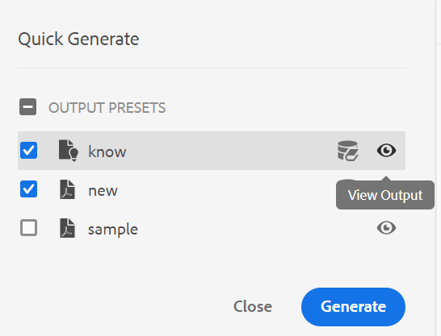

# Version d’octobre d’Adobe Experience Manager Guides as a Cloud Service

## Mise à niveau vers la version d’octobre

Mettez à niveau votre configuration Adobe Experience Manager Guides as a Cloud Service actuelle (ultérieurement appelée *AEM Guides as a Cloud Service*) en procédant comme suit :
1. Consultez le code Git des services cloud et passez à la branche configurée dans le pipeline des services cloud correspondant à l’environnement à mettre à niveau.
1. Mettez à jour `<dox.version>` propriété dans `/dox/dox.installer/pom.xml` fichier de votre code Git Cloud Services vers la version 2022.10.183.
1. Validez les modifications et exécutez le pipeline Cloud Services pour effectuer la mise à niveau vers la version d’octobre d’AEM Guides as a Cloud Service.

## Matrice de compatibilité

Cette section répertorie la matrice de compatibilité pour les applications logicielles prises en charge par la version d’octobre 2022 d’AEM Guides as a Cloud Service.

### FrameMaker et FrameMaker Publishing Server

| FMPS | FrameMaker |
| --- | --- |
| Non compatible | Mise à jour 2020 4 et versions ultérieures |
| | |

*La ligne de base et les conditions créées dans AEM sont prises en charge dans les versions FMPS à compter de 2020.2.

### Connecteur D&#39;Oxygène

| Version d’AEM Guides as a Cloud | Fenêtres du connecteur d&#39;oxygène | Mac du connecteur d&#39;oxygène | Modifier dans Oxygen Windows | Modifier dans Oxygen Mac |
| --- | --- | --- | --- | --- |
| 2022.10.0 | 2.7.13 | 2.7.13 | 2,3 | 2,3 |
|  |  |  |  |  |

## Nouvelles fonctionnalités et améliorations

AEM Guides as a Cloud Service offre des améliorations et de nouvelles fonctionnalités dans la version d’octobre :

### Panneau Génération rapide

AEM Guides propose désormais le panneau **Génération rapide** qui vous permet de générer et d&#39;afficher rapidement la sortie des paramètres prédéfinis créés pour votre plan DITA.

Dans le panneau **Génération rapide**, vous pouvez voir la liste de tous les paramètres prédéfinis de sortie créés pour votre plan DITA.

Sélectionnez un ou plusieurs paramètres prédéfinis et générez rapidement la sortie. Vous pouvez également afficher rapidement la sortie générée pour les paramètres prédéfinis. Un message de réussite s’affiche lors de la génération de la sortie. Un message d’erreur s’affiche si la génération de sortie échoue. Vous pouvez également consulter le journal des erreurs pour afficher les détails de l’erreur qui s’est produite dans le processus de génération.

## Problèmes résolus

Les bogues corrigés dans différentes zones sont répertoriés ci-dessous :

* Native PDF | Erreur lors de la suppression de rubriques réservées aux ressources de la sortie PDF. (10554)
* PDF natif | Les clés vides apparaissent dans la sortie PDF. (10553)
* Native PDF | `navtitle` pour `topichead` n’est pas honoré. (10509)
* PDF natif | Prise en charge nécessaire pour les versions du JDK amd64. (10465)
* Native PDF | Impossible de masquer les rubriques de front-office de la table des matières. (10355)
* PDF natif | Le redémarrage du numéro de page dans la mise en page du chapitre lance la numérotation de manière aléatoire à partir de la fin du chapitre précédent. (10154)
* Navigateur Chrome | L’écran devient vide lorsque vous faites glisser un élément de l’interface utilisateur. Par exemple, lorsque vous faites glisser une condition depuis le panneau Conditions. (10524)
* Les propriétés de nœud sont supprimées après l’opération de copier-coller d’une ressource. (10053)
* En cliquant sur **Fermer** les utilisateurs étaient redirigés vers les ressources , l’expérience a été corrigée pour rediriger les utilisateurs vers la page d’accueil d’AEM. (9654)
