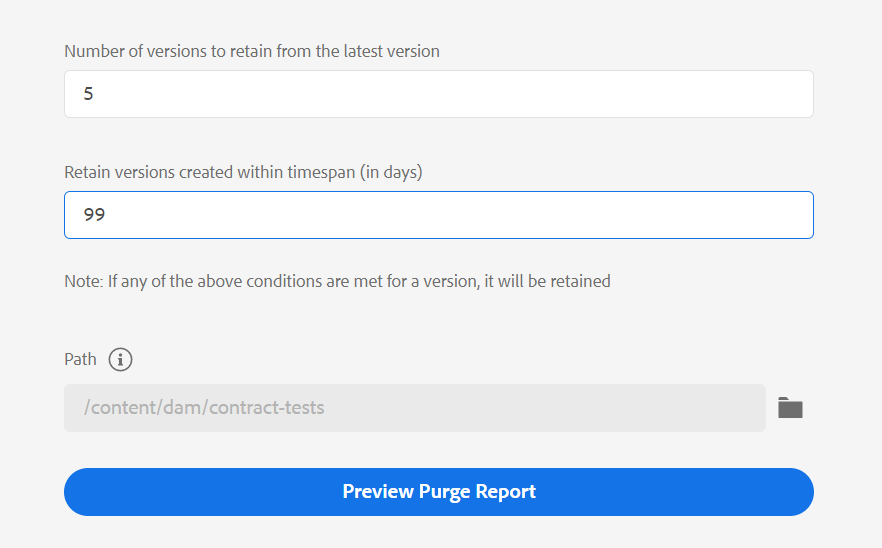

# Version de novembre des guides Adobe Experience Manager as a Cloud Service

## Mise à niveau vers la version de novembre

Mettez à niveau vos guides Adobe Experience Manager actuels as a Cloud Service (plus tard appelés *AEM Guides as a Cloud Service*) en procédant comme suit :
1. Extrayez le code Git des Cloud Service et passez à la branche configurée dans le pipeline Cloud Service correspondant à l’environnement que vous souhaitez mettre à niveau.
1. Mettre à jour `<dox.version>` dans `/dox/dox.installer/pom.xml` du code Git Cloud Service vers la version 2022.11.198.
1. Validez les modifications et exécutez le pipeline Cloud Service pour effectuer la mise à niveau vers la version de novembre d’AEM Guides as a Cloud Service.

## Étapes d’indexation du contenu existant (uniquement si vous utilisez une version antérieure à la version de septembre des AEM Guides as a Cloud Service)

Effectuez les étapes suivantes pour indexer le contenu existant et utilisez le nouveau texte de recherche et de remplacement au niveau de la carte :

* Exécutez une requête de POST sur le serveur (avec l’authentification correcte) - `http://<server:port>/bin/guides/map-find/indexing`.
(Facultatif : vous pouvez transmettre des chemins spécifiques des cartes pour les indexer ; par défaut, toutes les cartes seront indexées. || Exemple : `https://<Server:port>/bin/guides/map-find/indexing?paths=<map_path_in_repository>`)

* L’API renvoie un jobId. Pour vérifier l’état de la tâche, vous pouvez envoyer une demande de GET avec l’ID de la tâche au même point de terminaison : `http://<server:port>/bin/guides/map-find/indexing?jobId={jobId}`
(Par exemple : http://&lt;_localhost:8080_>/bin/guides/map-find/indexing?jobId=2022/9/15/7/27/7dfa1271-981e-4617-b5a4-c18379f11c42_678)

* Une fois la tâche terminée, la requête de GET ci-dessus répond avec succès et indique si une correspondance a échoué. Les mappages indexés avec succès peuvent être confirmés à partir des journaux du serveur.

## Matrice de compatibilité

Cette section répertorie le tableau de compatibilité des applications logicielles prises en charge par AEM Guides as a Cloud Service de novembre 2022.

### FrameMaker et FrameMaker Publishing Server

| FMPS | FrameMaker |
| --- | --- |
| Non compatible | Mise à jour 4 et ultérieure 2020 |
| | |

*Les conditions de base et créées dans AEM sont prises en charge dans les versions FMPS à partir de 2020.2.

### Connecteur Oxygen

| AEM Guides as a Cloud | Fenêtres du connecteur Oxygen | Mac du connecteur Oxygen | Modifier sous Windows Oxygen | Modifier dans Oxygen Mac |
| --- | --- | --- | --- | --- |
| 2022.11.0 | 2,7.13 | 2,7.13 | 2,3 | 2,3 |
|  |  |  |  |

## Nouvelles fonctionnalités et améliorations

AEM Guides as a Cloud Service fournit des améliorations et de nouvelles fonctionnalités dans la version de novembre :

### Suppression de fichiers du panneau du référentiel

Vous pouvez désormais facilement supprimer des fichiers (un seul fichier à la fois) du **Options** du fichier sélectionné dans le panneau du référentiel.

Une invite de confirmation s’affiche avant de supprimer le fichier. Si le fichier n’est référencé dans aucun autre fichier, il est supprimé et un message de réussite s’affiche.

Si le fichier sélectionné est extrait, vous ne pouvez pas le supprimer et un message d’erreur s’affiche. Si le fichier sélectionné est ajouté à une collection de favoris ou est référencé à partir de tout autre fichier, AEM guide la vérification de votre confirmation et vous donne la possibilité de le supprimer de force. Si vous supprimez une rubrique référencée et que vous avez ouvert le fichier contenant des références à modifier, le lien rompu du fichier référencé s’affiche.

**Remarque**: vous pouvez également supprimer le fichier sélectionné à l’aide de la touche Suppr du clavier.

### Purge des versions sélectionnées des fichiers

Lorsque vous créez et conservez votre contenu, de nombreuses versions peuvent être créées pour vos fichiers DITA dans votre référentiel. AEM Guides vous permet de purger les anciennes versions de vos fichiers DITA du référentiel et de libérer de l’espace disque.

AEM Guides ne supprime pas la première version du fichier ou une version incluse dans une ligne de base ou à laquelle un libellé est appliqué. L’opération de purge ne supprime même pas les fichiers inclus dans un processus de traduction ou de révision. Vous pouvez choisir le nombre de versions à conserver et choisir de supprimer les fichiers dont la date est antérieure au nombre de jours défini.

Avant de commencer l’opération de purge, vous pouvez prévisualiser le rapport afin d’afficher les versions qui seront purgées. Vous pouvez ensuite décider de lancer ou d’annuler l’opération de purge.

Une fois l’opération de purge terminée, vous pouvez vérifier le rapport de purge pour afficher les fichiers purgés.

### Gestion des paramètres prédéfinis de sortie de profil global et de dossier

AEM Guides vous fournit la fonction permettant de créer et de gérer des paramètres prédéfinis de sortie pour les profils globaux et de dossiers. Vous pouvez ensuite facilement utiliser ces paramètres prédéfinis de sortie pour générer une sortie pour toutes les cartes liées à ce profil Global ou Dossier.

**Remarque** Seuls les utilisateurs administratifs de niveau dossier peuvent créer des paramètres prédéfinis de profil global et de dossier.

Ces paramètres prédéfinis globaux apparaissent sous **Sortie** de toutes les cartes associées. Vous pouvez les utiliser pour générer la sortie pour toutes les cartes associées. Vous pouvez sélectionner le paramètre prédéfini comme paramètre prédéfini de PDF par défaut pour générer la sortie du PDF. Vous pouvez également **Modifier**, **Renommer**, **Dupliquer**, ou **Supprimer** un paramètre prédéfini de sortie existant à partir du **Options** .

### Colonne Libellé de version ajoutée au tableau de bord de traduction

Dans le tableau de bord de traduction, vous pouvez également voir la colonne Libellé de version . Le Libellé de la version sélectionnée du fichier source s’affiche. Vous pouvez ainsi sélectionner tous les fichiers avec un libellé spécifique et les traduire en une seule fois.

### PDF natif | PDF avec barre de modification affichant la différence entre les versions de document

Vous pouvez maintenant créer un PDF qui affiche les différences de contenu entre deux versions à l’aide de la barre de modification. Vous pouvez choisir de comparer la version actuelle à une ligne de base de la version précédente ou de comparer les deux versions de ligne de base sélectionnées.

Une barre de modification s’affiche dans le PDF pour indiquer le contenu modifié, inséré ou supprimé. Vous avez également la possibilité d’effectuer les opérations suivantes :
* Afficher le contenu inséré en vert et souligné
* Afficher le contenu supprimé en rouge et marqué d’une barre oblique

### PDF natif | Prise en charge des variables pour Output Path et PDF File Name

Vous pouvez désormais également utiliser les variables d’usine suivantes pour définir le Chemin de sortie et le Fichier de PDF. Vous pouvez utiliser une seule ou une combinaison de variables pour définir ces options :
* `${map_filename}`
* `${map_title}`
* `${preset_name}`
* `${language_code}`
* `${map_parentpath}` (Uniquement pour le chemin de sortie)
* `${path_after_langfolder}` (Uniquement pour le chemin de sortie)

### PDF natif | Générer une table des matières pour les mappages DITA et réorganiser les mises en page

Vous pouvez désormais également générer la table des matières dans les mappages DITA à l’aide d’un paramètre de PDF avancé du modèle. Vous pouvez choisir d’activer ou de désactiver l’affichage des différentes mises en page et de réorganiser leur position.

## Problèmes résolus

Les bogues résolus dans différentes zones sont répertoriés ci-dessous :

* PDF natif | `conkeyref` n’est pas résolu dans la sortie de PDF générée. 10564
* PDF natif | Des problèmes se produisent lors de l’accès aux métadonnées d’une carte dans la sortie du PDF. (10556)
* PDF natif | Les styles intégrés sont utilisés pour générer des balises à la place du nom de classe.  (10498)
* L’éditeur web charge une page vierge par intermittence. 10678
* La publication du PDF échoue si nous créons un paramètre prédéfini en dupliquant un paramètre prédéfini existant. 10584
* **Afficher le journal** ne fonctionne pas lorsque la génération du PDF échoue pour un paramètre prédéfini. 10576
* Remarque à l’intérieur d’une balise para , qui est un conref, ne s’affiche pas dans l’aperçu. (10559)
* Lorsque vous appuyez sur Retour arrière à la fin d’un élément de liste, toute la liste est supprimée. (10540)
* Lors de l’utilisation d’un PDF natif pour exporter les données imbriquées `<indexterm>` ne sont pas imbriqués dans l’index. (10521)
* **Retrait automatique** dans la barre d’outils est manquante dans la vue Source. 10448
* Le premier caractère d’un élément de liste est perdu pendant la création de la liste dans l’éditeur. (10447)
* Plusieurs fenêtres contextuelles s’affichent si une version de ressource DITA est modifiée et enregistrée dans la fenêtre d’édition de ligne de base. 10399)
* L’erreur d’application se produit lorsque l’utilisateur clique **Modifier** après avoir sélectionné tous les paramètres prédéfinis de sortie dans le panneau Quick Generate. 10388
* Les métadonnées personnalisées de la rubrique DITA ne sont pas conservées lorsqu’une action de copier-coller est effectuée à partir de l’interface utilisateur d’Assets. (10367)
* Le post-traitement est bloqué pour l’ensemble du dossier linguistique dont les ressources sont présentes dans un projet de traduction actif. (10332)
* L’onglet Modèle de l’éditeur XML n’est pas visible pour les administrateurs de profil de dossier. (10266)
* Les problèmes de navigation se produisent dans l’éditeur web après la mise à niveau vers la version 4.0. 10159
* Les fichiers du SVG ne s’affichent pas en mode Aperçu. (10010)
* Si l’onglet Sortie de l’éditeur contient d’autres paramètres prédéfinis, la section Paramètres prédéfinis ne peut pas être défilée et tous les paramètres prédéfinis ne s’affichent pas. (9787)
* **Modifier** et **Annoter** les options d’une image ne fonctionnent pas correctement en mode Colonnes. (8758)
* Le lien d’homologue n’est pas résolu et apparaît comme un texte normal dans la sortie générée. (7774)
