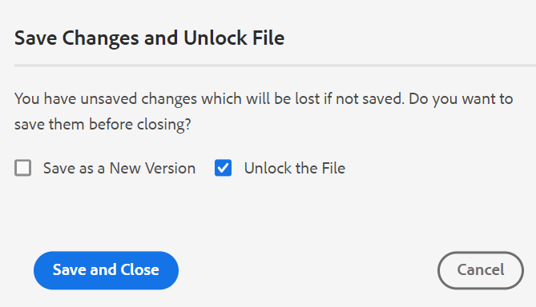

# Version de février [!DNL Adobe Experience Manager Guides] as a Cloud Service

## Mettre à niveau vers la version de février

Mettez à niveau votre configuration actuelle d’[!DNL Adobe Experience Manager Guides] as a Cloud Service (plus tard appelée as a Cloud Service) [!DNL AEM Guides] procédant comme suit :
1. Consultez le code Git des services cloud et passez à la branche configurée dans le pipeline des services cloud correspondant à l’environnement à mettre à niveau.
1. Mettez à jour `<dox.version>` propriété dans `/dox/dox.installer/pom.xml` fichier de votre code Git Cloud Services vers la version 2022.2.114.
1. Validez les modifications et exécutez le pipeline Cloud Services pour effectuer la mise à niveau vers la version de février d’[!DNL AEM Guides] as a Cloud Service.

## Matrice de compatibilité

Cette section répertorie la matrice de compatibilité pour les applications logicielles prises en charge par [!DNL AEM Guides] version de février 2022 d’as a Cloud Service.

### FrameMaker et FrameMaker Publishing Server

| FMPS | FrameMaker |
| --- | --- |
| Non compatible | Mise à jour 2020 4 et versions ultérieures |
| | |

### Connecteur D&#39;Oxygène

| Version d’[!DNL AEM Guides] Cloud | Fenêtres du connecteur d&#39;oxygène | Mac du connecteur d&#39;oxygène |
| --- | --- | --- |
| 2022.2.0 | 2.4.0 | 2.4.0 |
|  |  |  |

## Nouvelles fonctionnalités et améliorations

### Publication native de PDF

La prise en charge de la création d’un PDF natif a également été ajoutée dans la version de février d’[!DNL AEM Guides] as a Cloud Service. Un nouveau moteur de publication a été introduit avec les fonctionnalités suivantes :
* Création d’un modèle CSS
* Créer différents modèles de page
* Conception de modèles PDF comprenant des modèles CSS et de page
* Publier le contenu de carte et de rubrique au format PDF

### Prise en charge du chemin d’accès au site de la base de connaissances dans la publication basée sur des articles

[!DNL AEM Guides] as a Cloud Service fournit la fonction de publication d’article pour générer de manière incrémentielle une sortie d’une ou de plusieurs rubriques ou publier votre contenu sur une plateforme de base de connaissances. Avec la version de février, vous disposez d’une option supplémentaire pour choisir le chemin d’accès au site de la base de connaissances vers lequel la rubrique/carte doit être publiée. Une fois le chemin sélectionné, la sortie est générée à l’emplacement spécifié.

### Améliorations de l’éditeur web

De nombreuses améliorations et nouvelles fonctionnalités ont été ajoutées dans l’éditeur web :

* **Boîte de dialogue améliorée lors de la fermeture du fichier**

[!DNL AEM Guides] as a Cloud Service vous invite à enregistrer vos modifications et à déverrouiller vos fichiers verrouillés lorsque vous tentez de fermer un fichier ouvert dans l’éditeur web. Les invites s&#39;affichent en fonction des paramètres **Demander l&#39;archivage à la fermeture** et **Demander la nouvelle version à la fermeture** configurés par votre administrateur.

Selon la configuration, vous avez la possibilité d’enregistrer les modifications et de créer une nouvelle version de votre document. Vous pouvez également archiver le fichier et enregistrer les modifications apportées à la version actuelle.

Pour plus d’informations, voir *Scénarios de fermeture de fichier et d’enregistrement* dans le guide de l’utilisateur.

* Un espace insécable a été ajouté à la palette de caractères.  Un espace **insécable** empêche un saut de ligne automatique à un point particulier d’un document HTML. L’éditeur web prend en charge un espace insécable pour la sortie AEM Site et HTML5.

* Lorsque vous chargez une image à partir de l’éditeur web, une boîte de dialogue de confirmation s’affiche si une image portant le même nom existe déjà. Vous pouvez conserver les deux fichiers (le fichier existant et le nouveau fichier) ou remplacer le fichier existant et enregistrer uniquement le nouveau fichier.

* Si un utilisateur a verrouillé un fichier pour y apporter des modifications, un administrateur peut le déverrouiller et l’archiver. Cette fonction est utile lorsque certains fichiers doivent être modifiés, mais qu’ils ont été verrouillés par des utilisateurs qui ne sont pas disponibles pour archiver le fichier

### Mapper le tableau de bord

Lorsque vous choisissez de télécharger le plan DITA, la requête est mise en file d&#39;attente et vous recevez une notification une fois que le plan est prêt à être téléchargé. Vous pouvez choisir de télécharger immédiatement le fichier de mappage ou de le télécharger ultérieurement à partir du lien fourni dans la boîte de réception de notifications d’AEM.

### Révision

Vous pouvez mentionner les détails dans le champ de description de la tâche de révision, et ils sont affichés dans l’e-mail envoyé au réviseur ou à la réviseuse.

## Problèmes résolus

Les bogues corrigés dans différentes zones sont répertoriés ci-dessous :

### Publication basée sur des articles

* La publication basée sur les articles ne publie pas les articles en fonction de la ligne de base sélectionnée. (8771)
* Les fichiers DITAVAL ne sont pas honorés dans la publication basée sur des articles. (8770)
* Impossible d’effectuer une publication basée sur un article pour le profil Salesforce lorsque le type d’enregistrement est FAQ et que le contenu du champ d’article est Question. (8448)
* Impossible d’effectuer une publication basée sur des articles pour le profil Salesforce lorsque le type d’enregistrement est Manuel. (8447)

### Éditeur web

* Faire glisser et déposer une condition ne fonctionne pas sur les rubriques DITA. (8761)
* Les attributs sont manquants lors de l’ajout d’un chapitre dans la libellule à l’aide du glisser-déposer à partir de la vue Favoris. (8746)
* La modification des propriétés d’une image (hauteur, largeur) entraîne une erreur d’application. (8722)
* Les liens rompus n’apparaissent pas dans le panneau Plan dans la vue source. (8590)
* L’éditeur XML supprime la balise de nouvelle ligne dans le bloc de code. (8522)
* Glossentry s’affiche sous forme de note lorsqu’une entrée Glossentry est créée. (8384)
* la xréf ne peut pas être insérée même à des emplacements valides. (8354)
* La liste d’éléments (Alt + Entrée) apparaît grisée dans le thème Sombre/Plus sombre. (7913)
* La liste des modèles de mappage dans l’option **Créer** (menu représentant des points de suspension) du panneau Référentiel n’est pas conforme au **Profil de dossier** dans les Préférences utilisateur. (5918)
* Les identifiants d’élément ne sont pas générés automatiquement pour les éléments ajoutés à partir de la fonction Réutiliser le contenu de la barre d’outils principale. (5826)

### Interface utilisateur d’Assets

* La modification des images ne fonctionne pas comme prévu sur le serveur cloud. (8768)
* Dans le panneau Historique des versions, la section Version actuelle affiche un horodatage incorrect et est modifiée par les informations . (8765)
* Le chargement du fichier DITAVAL sur le serveur cloud échoue lorsque l’outil de bureau AEM est utilisé. (8707)
* Le deuxième utilisateur administrateur ne peut pas être ajouté en tant que premier utilisateur administrateur à un dossier. (8430)
* Les propriétés non uniques d’une ressource ne sont pas copiées lorsque la ressource est copiée et collée. (8241)

### Modifications de la convivialité

* Dans le panneau Révision de l’éditeur web, si un nom d’utilisateur est long, les icônes d’acceptation/de rejet ne s’affichent pas clairement. (8793)
* Dans le panneau **Rechercher et remplacer**, une icône indésirable apparaît lorsque l’utilisateur survole la section des résultats avec la souris. (8775)
* L’icône Personnalisé n’est pas sélectionnée dans la propriété , mais l’icône par défaut est affichée pour les rapports générés à l’aide du bouton Générer le rapport . (8573)
