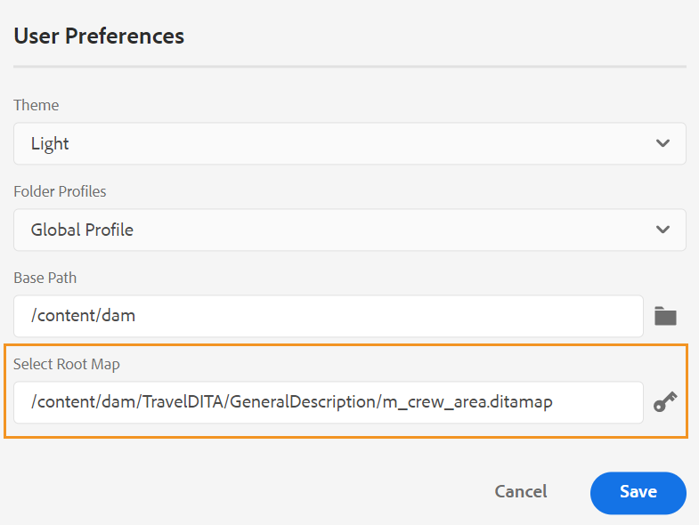
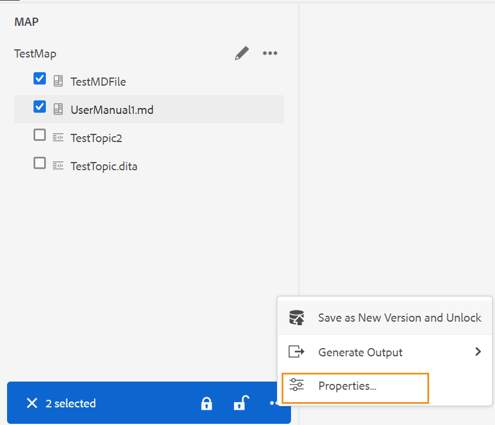
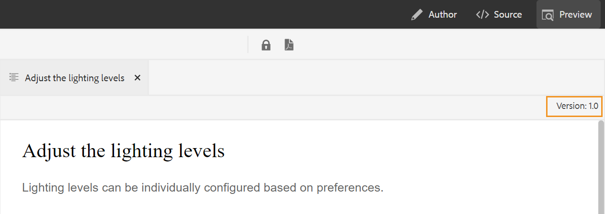

# Version d’avril d’Adobe Experience Manager Guides as a Cloud Service

## Mise à niveau vers la version d’avril

Mettez à niveau votre configuration actuelle d’[!DNL Adobe Experience Manager Guides] as a Cloud Service (plus tard appelée *[!DNL AEM Guides]as a Cloud Service*) en procédant comme suit :
1. Consultez le code Git des services cloud et passez à la branche configurée dans le pipeline des services cloud correspondant à l’environnement à mettre à niveau.
1. Mettez à jour `<dox.version>` propriété dans `/dox/dox.installer/pom.xml` fichier de votre code Git Cloud Services vers la version 2022.4.133.
1. Validez les modifications et exécutez le pipeline Cloud Services pour effectuer la mise à niveau vers la version d’avril d’[!DNL AEM Guides] as a Cloud Service.

## Matrice de compatibilité

Cette section répertorie la matrice de compatibilité pour les applications logicielles prises en charge par [!DNL AEM Guides] version d’avril 2022 d’as a Cloud Service.

### FrameMaker et FrameMaker Publishing Server

| FMPS | FrameMaker |
| --- | --- |
| Non compatible | Mise à jour 2020 4 et versions ultérieures |
| | |

### Connecteur D&#39;Oxygène

| Version d’AEM Guides Cloud | Fenêtres du connecteur d&#39;oxygène | Mac du connecteur d&#39;oxygène |
| --- | --- | --- |
| 2022.4.0 | 2.5.6 | 2.5.6 |
|  |  |  |

*La ligne de base et les conditions créées dans AEM sont prises en charge dans les versions FMPS à compter de 2020.2.

## Nouvelles fonctionnalités et améliorations

De nombreuses améliorations et nouvelles fonctionnalités ont été ajoutées dans l’éditeur web :

### Amélioration de la résolution des clés

Une référence de clé de contenu DITA insère une partie du contenu d&#39;une rubrique dans une autre. Il utilise une clé pour localiser le contenu. Les références clés associées à une rubrique DITA doivent être résolues. La carte racine sélectionnée a la priorité la plus élevée pour résoudre les références clés.

Désormais, les références clés sont résolues sur la base du mappage racine défini dans l’ordre de priorité suivant :

1. Préférences utilisateur
1. Panneau Vue Carte
1. Profil de dossier

Pour plus d’informations, voir la section *Résoudre les références clés* dans le guide de l’utilisateur.

### Ajout d’un panneau personnalisé dans le panneau de gauche

Vous pouvez maintenant ajouter un panneau personnalisé dans le panneau de gauche de l’éditeur web. Vous pouvez utiliser un panneau personnalisé à diverses fins, par exemple pour fournir de l’aide ou effectuer les tests d’un projet. Si un panneau personnalisé a été configuré, il apparaît également dans la liste des panneaux dans l’**Paramètres de l’éditeur**. Vous pouvez activer/désactiver le basculement pour afficher ou masquer le panneau personnalisé.

### Possibilité de modifier l&#39;état du document des rubriques dans un plan DITA

Vous pouvez désormais facilement modifier l&#39;état du document des rubriques sélectionnées dans un plan DITA. Vous pouvez également ouvrir et modifier les propriétés des rubriques sélectionnées dans un plan DITA à partir du menu **Plus d&#39;options** au bas du panneau Vue Carte.

### Informations de version affichées en mode Aperçu

L’éditeur web vous aide à gérer vos versions. Vous pouvez également voir la version de la rubrique active ou du plan DITA dans le coin supérieur droit de l&#39;onglet Fichier de la rubrique dans le mode Aperçu d&#39;une rubrique.

## Problèmes résolus

Les bogues corrigés dans différentes zones sont répertoriés ci-dessous :

* Les nouveaux libellés ne sont pas automatiquement répercutés dans le menu déroulant Ajouter/supprimer un libellé . Une actualisation de la ligne de base est plutôt requise. (9249)
* Impossible de modifier le titre de la ligne de base si une ligne de base est créée par des critères de libellé. (9171)
* La publication de tâche à l’aide d’une ligne de base est bloquée à l’état « en attente » si l’état de la ligne de base devient « échec ». (9194)
* La suppression des libellés des références directes supprime également les libellés des références indirectes. (9257)
* La recherche au fur et à mesure que vous tapez entraîne des requêtes de recherche indésirables dans la vue Référentiel. (9307)
* Des problèmes se produisent lorsqu’un mot-clé est utilisé dans le titre de l’onglet. (9318)
* La ligne de base échoue lors de l’ajout d’un libellé comportant des espaces. (9362)
* La sortie du site AEM n’affiche pas correctement l’élément glossusage. (8936)
* Une erreur de console se produit à l’ouverture de l’onglet **Output** dans l’éditeur web. (8715)
* Le message d’erreur affiché lors de la publication d’un type d’enregistrement manuel via Salesforce n’est pas intuitif. (8952)
* Le paramètre Valider avec des attributs de condition n’est pas ouvert immédiatement, mais l’utilisateur doit rouvrir le fichier pour afficher les validations. (9300)
* Les métadonnées ne peuvent pas être supprimées une fois qu&#39;un plan DITA est publié avec des métadonnées.  (9178)
* Le panneau Traduction est visible même à l&#39;ouverture du plan DITA dans l&#39;éditeur de plans. (9053)
* La DTD personnalisée définie par l&#39;utilisateur n&#39;est pas prioritaire par rapport à la DTD DITA standard incorporée dans DITA-OT. (9104)
* Dans la fonction Native PDF, le chargement dans les modèles échoue pour les fichiers autres que DITA et les fichiers image. (9070)
* Le mécanisme d’autorisation exécute deux requêtes au lieu d’une, dans certains scénarios spécialisés. (9221)
* La publication de la sortie du site AEM échoue lors de l’utilisation de la DTD personnalisée. (9243)
* La note de bas de page Utilisation par référence ne fait pas défiler l’écran jusqu’à la section note de bas de page dans la sortie du site AEM. (9234)

## Problèmes connus

Adobe a identifié le problème connu suivant dans la version [!DNL AEM Guides] d’avril d’as a Cloud Service.

* L’éditeur web ne signale pas d’erreur lorsque plusieurs lignes de base sont créées avec le même nom mais présentent un espace ou des différences de casse. Par exemple, « adobe » et « Adobe » ou « Adobe ».
* Le connecteur Oxygen se bloque par intermittence lors de connexions, de déconnexions ou de basculements fréquents entre différents types d’authentification.
