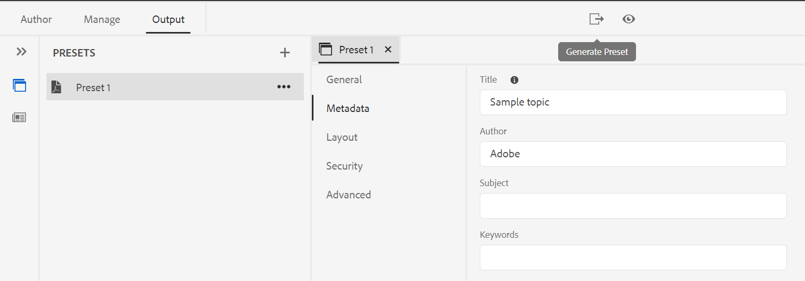

# Version de septembre d’Adobe Experience Manager Guides as a Cloud Service

## Mise à niveau vers la version de septembre

Mettez à niveau votre configuration Adobe Experience Manager Guides as a Cloud Service actuelle (ultérieurement appelée *AEM Guides as a Cloud Service*) en procédant comme suit :
1. Consultez le code Git des services cloud et passez à la branche configurée dans le pipeline des services cloud correspondant à l’environnement à mettre à niveau.
1. Mettez à jour `<dox.version>` propriété dans `/dox/dox.installer/pom.xml` fichier de votre code Git Cloud Services vers la version 2022.9.178.
1. Validez les modifications et exécutez le pipeline Cloud Services pour effectuer la mise à niveau vers la version de septembre d’AEM Guides as a Cloud Service.

## Procédure d’indexation du contenu existant

Effectuez les étapes suivantes pour indexer le contenu existant et utiliser le nouveau texte de recherche et de remplacement au niveau du mappage :
* Exécutez une requête POST au serveur (avec l’authentification correcte) - `http://<server:port>/bin/guides/map-find/indexin`.
(Facultatif) Vous pouvez transmettre des chemins spécifiques des mappages pour les indexer. Par défaut, tous les mappages sont indexés ||  Exemple :   `https://<Server:port>/bin/guides/map-find/indexing?paths=<map_path_in_repository>`)
* L’API renvoie un jobId. Pour vérifier le statut de la tâche, vous pouvez envoyer une requête GET avec l’ID de tâche au même point d’entrée : `http://<server:port>/bin/guides/map-find/indexing?jobId={jobId}`
(Par exemple : `http://<_localhost:8080_>/bin/guides/map-find/indexing?jobId=2022/9/15/7/27/7dfa1271-981e-4617-b5a4-c18379f11c42_678)`
* Une fois la tâche terminée, la requête GET ci-dessus répond avec succès et mentionne si des mappages ont échoué. Les mappages indexés avec succès peuvent être confirmés à partir des journaux du serveur.

## Matrice de compatibilité

Cette section répertorie la matrice de compatibilité pour les applications logicielles prises en charge par la version de septembre 2022 d’AEM Guides as a Cloud Service.

### FrameMaker et FrameMaker Publishing Server

| FMPS | FrameMaker |
| --- | --- |
| Non compatible | Mise à jour 2020 4 et versions ultérieures |
| | |

*La ligne de base et les conditions créées dans AEM sont prises en charge dans les versions FMPS à compter de 2020.2.

### Connecteur D&#39;Oxygène

| Version d’AEM Guides as a Cloud | Fenêtres du connecteur d&#39;oxygène | Mac du connecteur d&#39;oxygène | Modifier dans Oxygen Windows | Modifier dans Oxygen Mac |
| --- | --- | --- | --- | --- |
| 2022.9.0 | 2,7,13 | 2,7,13 | 2,3 | 2,3 |
|  |  |  |  |  |

## Nouvelles fonctionnalités et améliorations

AEM Guides as a Cloud Service offre de nombreuses améliorations et nouvelles fonctionnalités dans la version de septembre :

### Créer une ligne de base dynamique basée sur des libellés

AEM Guides vous offre désormais la possibilité de créer des lignes de base dynamiques basées sur des libellés. Si vous générez une configuration de référence, téléchargez une configuration de référence ou créez un projet de traduction à l’aide d’une configuration de référence, les fichiers sont sélectionnés de manière dynamique en fonction des libellés mis à jour. Cette fonctionnalité est pratique car vous n’avez pas à modifier la ligne de base lors de la mise à jour des libellés.
Vous pouvez également exporter l’instantané de la ligne de base au format CSV.

### Rechercher et remplacer le texte au niveau de la carte

Vous pouvez désormais rechercher des fichiers dans une carte qui contiennent du texte spécifique. Le texte recherché est mis en surbrillance dans les fichiers. Vous pouvez également remplacer le mot ou l’expression recherché par un autre mot ou une autre expression dans les fichiers.
Sélectionnez l’icône **Remplacer** pour remplacer l’occurrence actuelle et l’icône **Tout remplacer dans le fichier** pour remplacer toutes les occurrences dans le fichier sélectionné.

Par défaut, les options **Extraction du fichier avant remplacement** et **Création d’une nouvelle version après remplacement** sont sélectionnées, de sorte qu’un fichier est extrait avant que vous ne remplaciez le texte et qu’une nouvelle version est créée après le remplacement du texte.

### Afficher la différence de version pour les fichiers désynchronisés à partir du tableau de bord de traduction

Vous pouvez désormais choisir de traduire les fichiers **Désynchronisés** en fonction des modifications effectuées entre les deux versions d’une rubrique.\

Dans le tableau de bord de traduction, vous pouvez facilement voir les différences entre la dernière version traduite et la version actuelle du fichier sélectionné.

En fonction des différences, vous pouvez décider de traduire une rubrique ou non.

### Interface utilisateur des métadonnées disponible pour les paramètres prédéfinis de PDF

Vous pouvez définir les métadonnées à partir du paramètre prédéfini de sortie d&#39;un plan DITA. Vous pouvez définir le titre, l’auteur, l’objet et les métadonnées de mots-clés. Ces métadonnées sont mappées aux métadonnées dans les propriétés de fichier de votre PDF de sortie.
Ces métadonnées remplacent les métadonnées définies au niveau du livre. Vous pouvez définir les métadonnées spécifiquement dans chaque paramètre prédéfini de sortie et les transmettre au PDF de sortie.

## Problèmes résolus

Les bogues corrigés dans différentes zones sont répertoriés ci-dessous :

* Éditeur web | Lors du déplacement d’éléments dans une rubrique, les identifiants affectés aux éléments sont remplacés par des identifiants affectés automatiquement. (7895)
* Suivi des modifications | Le contenu est perdu lorsqu’un nouvel élément est saisi à l’aide de la touche Entrée. (10246)
* La sous-carte référencée à la carte principale dans les modèles de données n’est pas créée. (10231)
* Éditeur XML | Le copier-coller ne fonctionne pas en mode création. (10309)
* Plusieurs libellés de version une fois sélectionnés ne sont pas désélectionnés. (9561)
* La navigation automatique vers le chemin d’accès dans la boîte de dialogue de navigation du site ne fonctionne pas comme la navigation dans les fichiers. (9920)
* Le panneau Plan n’affiche pas le contenu lors du passage du mode **Auteur** au mode **Source**. (10319)
* La référence dans une nouvelle rubrique créée à l’aide d’un contenu dans le modèle de rubrique ne fonctionne pas. L’ID de hachage copié n’est pas mis à jour dans la copie de contenu. (9890)
* Web-Editor | Aucun chargeur n’existe lors de la création d’un mappage à partir du modèle de mappage. (9891)
* Nouvel éditeur de carte | Le texte en gras ou en italique ajouté dans le titre du mappage n’est pas conservé si nous passons de la vue **Auteur** à la vue **Mise en page**. (10218)
* Nouvel éditeur de carte | Les conditions appliquées à une référence ne peuvent pas être supprimées du mode Mise en page. (10213)
* Nouvel éditeur de carte | L’application de références de conditions ne fonctionne pas en mode Mise en page comme en mode Création. (10198)
* Nouvel éditeur de carte | Déplacer vers la gauche à partir du menu contextuel supprime la référence si elle ne peut pas être déplacée vers la gauche. (10219)
* Nouvel éditeur de carte |L’icône ne s’affiche pas correctement pour les références dans une carte créée en mode Mise en page. (10197)
* Panneau Référentiel | Un clic droit dans le panneau du référentiel génère une erreur d’application. (10123)
* Rechercher et remplacer | Le mode sombre n’est pas lisible pour les résultats de recherche dans l’éditeur web. (9978)
* Traduction | Les métadonnées et les balises ne sont pas propagées aux copies traduites. (4696)
* La copie de contenu collé (ctrl+c/ctrl+v) renvoie une erreur en mode création. (10304)
* Modèle PDF | L’ajout d’images d’arrière-plan à une disposition de page affiche Chemin d’image absolu et les images ne s’affichent pas dans le PDF de sortie. (10297)
* PDF natif | Le titre et l’en-tête du chapitre ne fonctionnent pas dans la publication PDF. (9947)
* PDF natif | La `xref` d&#39;un concept n&#39;est pas résolue correctement pour une rubrique DITA spécifique. (10229)
* PDF natif | Impossible d’afficher le texte des légendes d’un tableau dans la sortie PDF générée. (9827)
* PDF natif | Les références dans les annexes ne s’affichent pas sous forme d’annexes dans la sortie PDF. (10182)
* PDF natif | L’attribut Frame d’une table n’est pas propagé à l’HTML temporaire (en tant que classe). (10353)
* PDF natif | Les fichiers HTML temporaires ajoutent les classes colsep et rowsep à td et th même si leur valeur est 0 dans la DITA source. (10352)
* PDF natif |  Les métadonnées des critères ajoutés dans la mise en page ne sont pas respectées. (10377)
* PDF natif |  La génération du PDF échoue pour un contenu spécifique. (9927)
* PDF natif | Le contenu via conkeyref ne s’affiche pas dans la sortie PDF. (9836)
* PDF natif | Les références clés des clés avec des images ou des liens externes ne sont pas résolues. (10063)
* La vue Auteur d’un mappage n’affiche pas le texte d’espace réservé pour la liste tabulaire et la liste de figures. (10330)
* Lorsque nous créons une nouvelle ligne de base, le filtre de ligne de base déjà sélectionné n’est pas appliqué. (9954)
* Le fichier vidéo est absent de la ligne de base si le nom du dossier parent comporte un espace. 10031)
* La création de la ligne de base ne sélectionne pas la dernière version lorsque le fuseau horaire de l’utilisateur est différent de celui du serveur. (10190)
* Le raccourci Contrôle + F n’ouvre pas la boîte de dialogue modale de recherche du navigateur dans la console Assets après l’installation d’AEM Guides 4.1 sur AEM 6.5.12. (10189)

## Problèmes connus

Adobe a identifié les problèmes connus suivants pour la version de septembre 2022 d’AEM Guides as a Cloud Service.

* La base dynamique n&#39;est pas intégrée à la publication de la base de connaissances.

* Traduction | L’icône Différence de version s’affiche pour le contenu source en raison d’une modification du contenu cible.
