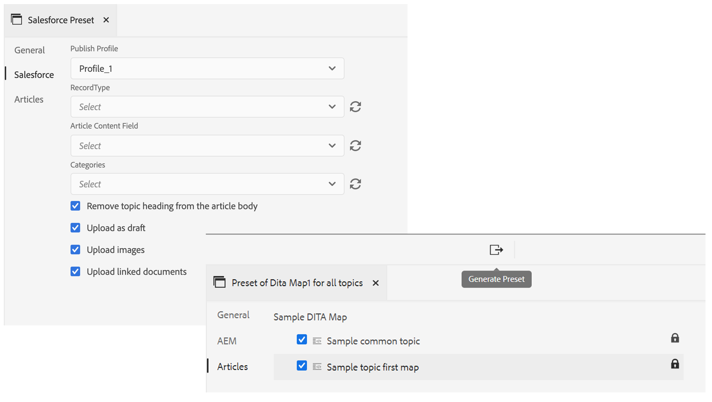
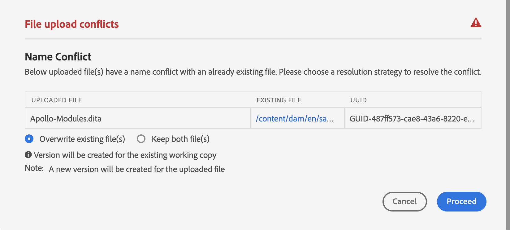

# Version de janvier [!DNL Adobe Experience Manager Guides] as a Cloud Service

## Mise à niveau vers la version de janvier

Mettre à niveau votre [!DNL Adobe Experience Manager Guides] as a Cloud Service (plus tard appelé [!DNL AEM Guides] as a Cloud Service) en procédant comme suit :
1. Extrayez le code Git des Cloud Service et passez à la branche configurée dans le pipeline Cloud Service correspondant à l’environnement que vous souhaitez mettre à niveau.
1. Mettre à jour `<dox.version>` dans `/dox/dox.installer/pom.xml` du code Git Cloud Service vers la version 2022.1.78.
1. Validez les modifications et exécutez le pipeline Cloud Service pour effectuer la mise à niveau vers la version de janvier de [!DNL AEM Guides] as a Cloud Service.

## Matrice de compatibilité

Cette section répertorie la matrice de compatibilité des applications logicielles prises en charge par [!DNL AEM Guides] Version as a Cloud Service de janvier 2022.

### FrameMaker et FrameMaker Publishing Server

| FMPS | FrameMaker |
| --- | --- |
| Non compatible | Mise à jour 4 et ultérieure 2020 |
| | |

### Connecteur Oxygen

| [!DNL AEM Guides] Version cloud | Fenêtres du connecteur Oxygen | Mac du connecteur Oxygen | Modifier sous Windows Oxygen | Modifier dans Oxygen Mac |
| --- | --- | --- | --- | --- |
| 2022.1.0 | 2.4.0 | 2.4.0 | 2,2 | 2,2 |
|  |  |  |  |  |

## Nouvelles fonctionnalités et améliorations

### Publication basée sur des articles

Avec la version de janvier, nous avons introduit une fonctionnalité de publication basée sur les articles intégrée à l’éditeur web. Vous pouvez utiliser la fonction de publication basée sur des articles pour générer de manière incrémentielle la sortie d’une ou de plusieurs rubriques ou publier votre contenu sur une plateforme de la base de connaissances.

Cette fonctionnalité permet aux utilisateurs de créer le mappage DITA de manière additive et de publier les rubriques au fur et à mesure qu’elles sont prêtes. Une fois que vous avez publié votre carte, utilisez la fonction de publication basée sur les articles pour réaliser une publication incrémentielle uniquement pour les articles mis à jour.

Outre AEM, vous pouvez utiliser cette fonction unique pour publier vos articles sur n’importe quel portail de la base de connaissances, tel que Salesforce. Cette fonctionnalité est également fournie avec un modèle de contenu prêt à l’emploi, reposant sur AEM composants principaux, qui vous permet de créer un référentiel basé sur les connaissances du contenu technique. Ce qui est génial avec ce modèle, c’est qu’il est entièrement personnalisable pour répondre aux besoins de votre entreprise et qu’il peut également prendre en charge des cas d’utilisation tels que les portails intranet d’entreprise.
Vous pouvez également filtrer les articles en fonction de leur état de document et de l’heure de modification.

Cette publication continue basée sur les besoins vous permet non seulement de contrôler entièrement votre publication de contenu, mais elle réduit également le temps global de publication de votre contenu mis à jour.
Lorsque vous publiez vos articles à l’aide de ce modèle, il peut également transmettre les métadonnées aux pages que vous avez publiées.
Pour plus d’informations, voir *Publication basée sur des articles à partir de l’éditeur web* dans le Guide de l’utilisateur.

### Amélioration de l’éditeur web

De nombreuses améliorations et nouvelles fonctionnalités sont introduites dans l’éditeur web :

* La prise en charge du schéma d’objet a également été ajoutée dans l’éditeur web. Vous pouvez désormais créer et utiliser un schéma d’objet à l’aide du panneau Schéma d’objet . Avec l’ajout d’un schéma d’objet, vous pouvez désormais utiliser vos propres métadonnées et taxonomie d’entreprise.

* Un nouvel outil de zone réactive de glossaire a été introduit dans cette version pour gérer les glossaires en bloc. Grâce à cet outil, vous pouvez rapidement convertir du texte en glossaire et en termes en bloc pour une carte ou des rubriques ouvertes sélectionnées.

* Ajout d’une fonctionnalité d’actualisation dans le panneau Contenu réutilisable qui vous permet d’actualiser rapidement le contenu réutilisable dans les fichiers de référence.
* Un nouvel indicateur de copie de travail indique si votre version actuelle (copie de travail) du fichier est synchronisée ou non avec la version enregistrée.

* Le filtre de recherche dans le panneau Référentiel et la boîte de dialogue de navigation des fichiers ont été améliorés pour offrir plus d’options de filtrage, qui peuvent être personnalisées plus en détail.

* Vous pouvez désormais charger des fichiers .docx à partir de l’éditeur Web.

### Création avec FrameMaker

Vous pouvez maintenant créer et publier vos documents dans FrameMaker. FrameMaker est livré avec un connecteur d’usine vers Adobe Experience Manager. Dans FrameMaker, vous disposez d’une interface conviviale qui vous permet de gérer des versions de vos documents dans un environnement collaboratif et distribué.

Une fois votre contenu créé, FrameMaker vous permet de publier vos documents dans différents formats (PDF, HTML5, EPUB et DITA). Vous pouvez également effectuer diverses opérations de gestion de fichiers, telles que l’extraction, l’extraction avec dépendances, l’archivage, l’actualisation, etc.
Pour créer avec FrameMaker dans [!DNL AEM Guides] FrameMaker d’utilisation as a Cloud Service version 2020.4 et ultérieure.

### Nouveau tableau de bord de traduction

Un nouveau tableau de bord de traduction a été introduit dans l’éditeur web avec les fonctionnalités suivantes :

* Tri, recherche et filtrage de la liste des rubriques.
* Filtrer le contenu par type de référence : références directes ou indirectes.
* Navigation facile pour trouver un projet existant tout en initiant une demande de traduction.
* Ajout d’un mécanisme de traduction multilingue afin d’éviter de créer plusieurs projets pour chaque langue lorsque la demande de traduction est lancée pour plusieurs langues.
* Introduction d’une configuration pour masquer l’onglet de traduction dans le tableau de bord de carte. Par défaut, il est visible. Vous pouvez choisir de traduire le contenu à l’aide du tableau de bord de mappage ou de l’éditeur web.

### Publication améliorée

* Les auteurs peuvent désormais transmettre des métadonnées au niveau du mappage et du sujet à la publication DITA-OT. Cela s’avère utile lorsque les modèles de PDF personnalisés sont conçus pour utiliser des propriétés de métadonnées de fichier telles que les balises, l’auteur, l’état du document, etc.

* Une nouvelle configuration a été ajoutée pour permettre aux utilisateurs de conserver ou de supprimer les versions des rubriques supprimées lors de la **Suppression et création** est utilisée dans la génération de sortie de site AEM.

### Amélioration de la gestion des fichiers

Les améliorations suivantes sont désormais visibles lors de l’utilisation de fichiers dans AEM Assets :
* Introduction d’une nouvelle expérience de chargement de fichier et d’une nouvelle boîte de dialogue pour le choix d’une stratégie de résolution des conflits.

* Possibilité de créer une version du fichier téléchargé avec la possibilité d’empêcher le remplacement d’un fichier extrait.
* Vous pouvez désormais voir un aperçu des images directement à partir de la vue Historique des versions. En outre, pour les fichiers DITA et non DITA, l’historique de version affiche les informations de version actuelles séparément.

* Chaque fois que l’utilisateur crée un fichier DITA, le nom de fichier par défaut s’affiche en petite casse pour être intégré au scénario de création de dossier d’AEM natif.

### Nouvelle fonctionnalité d’exportation de rapports

Les rapports sont très utiles pour identifier l’intégrité de votre contenu. [!DNL AEM Guides] as a Cloud Service fournit divers rapports pour contrôler votre contenu. Désormais, vous pouvez non seulement afficher les rapports, mais également exporter les données du rapport dans un fichier CSV pour les afficher et les partager avec votre équipe élargie. Les données des rapports peuvent vous donner un aperçu rapide des liens rompus ou des images manquantes.

### Amélioration de l’expérience d’actualisation de la gestion des actifs numériques Oxygen

Lorsque vous actualisez des fichiers du serveur AEM dans Oxygen, un message d’avertissement s’affiche si vous avez des fichiers non enregistrés dans votre session Oxygen actuelle. Vous pouvez choisir d’annuler l’opération d’actualisation pour enregistrer les fichiers non enregistrés. Sans cette fonctionnalité, les utilisateurs perdaient toute information non enregistrée dans leurs documents.

### Autres améliorations des fonctionnalités

* Vous pouvez maintenant créer une **Projet Dita** sous le **/apps/projects/templates** chemin.
* Téléchargez maintenant la valeur par défaut **ui_config.json** à partir de vos profils de dossier. Vous pouvez l’utiliser pour fusionner des modifications personnalisées à partir des **ui_config.json** lors de la mise à niveau.
* Vous n’avez pas besoin d’effacer le cache du navigateur même en présence de nouvelles versions des fichiers JS.

## Problèmes résolus

Les bogues résolus dans différentes zones sont répertoriés ci-dessous :

### Éditeur web

* Les contours apparaissent en rouge, même s’ils ne sont pas rompus. (8239)
* La valeur de l’attribut conditionnel n’est pas renseignée automatiquement lorsque l’option Ajouter toutes les propriétés est sélectionnée dans l’éditeur DITAVAL. (8234)
* Les auteurs ne peuvent pas insérer d’image dans une rubrique à l’aide d’un chemin relatif. (8112)
* Consultez la page de tâche qui n’affiche pas les fichiers multimédias si des espaces sont présents dans le nom du fichier. (8111)
* Les références doctorales ajoutées dans la cellule du tableau sont affichées en rouge. (8083)
* Les liens dans la tâche de révision ne sont pas mis à jour lorsque les fichiers en cours de révision sont déplacés. (8080)
* L’éditeur web n’effectue pas correctement le rendu des images dont la propriété de mise à l’échelle est définie sur 75 % ou plus. (8073)
* Les images de GIF sont rendues sous la forme d’images statiques dans l’éditeur web. (8024)
* Une référence conkeyref dans un élément de note ne s’affiche pas dans l’aperçu de l’éditeur web ni dans la sortie. (8006)
* xref à un élément qui est lui-même un conref n’est pas résolu dans l’éditeur. (7933)
* Le rendu du titre comportant une clé n’est pas correct dans l’aperçu de l’éditeur et dans le panneau Référentiel. (7909)
* Les fragments de code contenant des caractères spéciaux ne sont pas stockés correctement. (7908)
* L’enregistrement d’une rubrique après le formatage des équations MathML entraîne une erreur. (7954)
* keydef avec (tm) n’est pas rendu correctement dans l’éditeur et la sortie du site AEM contenait des symboles de gestion dynamique des balises en double. (7859)
* Le glissement et le dépôt d’un fragment de code ne fonctionnent pas selon les DTD. (7758)
* HTML ignore les dimensions définies personnalisées pour les graphiques. (7718)
* l’attribut conrefend ne se met pas à jour lors du déplacement du fichier source. (7698)
* L’utilisation de documents de type Référence entraîne plusieurs problèmes d’interface utilisateur. (7656)
* Les fichiers DITAVAL ne s’affichent pas lorsque l’auteur ajoute ditavalref dans une carte. (7594)
* Un espace inattendu est présent dans chaque espace vide. `<entry>` élément lorsque l’attribut outputclass est ajouté à `<tgroup>` élément . (7532)
* Le bouton Source ne fonctionne pas pour les rubriques ouvertes via le tableau de bord de carte. (7465)
* Une impression correcte insère des lignes vides et des espaces visibles lorsque le fichier est ouvert dans FrameMaker ou Oxygen. (7408)
* Les mappages avec href=&quot;/&quot; dans l’une des rubriques ne sont pas publiés sur AEM sites. (7405)
* Problèmes de performances détectés dans l’éditeur lorsque la carte racine contient un grand nombre de clés de base. (7400)
* L’état du document pour une carte avec modèle personnalisé n’est pas hérité de son profil d’états correspondant. (7359)
* `<tm>` élément rendu incorrectement en tant qu’élément block . (7286)
* Les modèles en double s’affichent dans le panneau des modèles de l’éditeur lors de la création d’un modèle. (5814)
* Les modèles définis dans ui_config pour les images permettant de définir des attributs supplémentaires ne s’appliquent pas aux cas de glisser-déposer. (5713)
* Aspect par défaut incorrect de l’uicontrol dans le ménucascade. (5483)
* Les modèles personnalisés pour la rubrique/la carte n’affichent pas de nouveau nom dans l’interface utilisateur. Il affiche le nom &quot;Rubrique&quot;/&quot;Carte&quot; plutôt que le nom configuré. (4958)
* Possibilité d’effacer le rootmap des paramètres des préférences utilisateur. (8534)
* Une collection de mappages nouvellement créée n’est pas répertoriée, même après avoir actualisé la page.(8603)
* La rubrique déverrouillée ne peut pas être fermée. (8545)
* Le passage du mode source au mode création marque la rubrique comme sale et nécessite que le contenu soit à nouveau enregistré.(8524)
* La réutilisation du panneau de contenu se bloque lors de la recherche de caractères spéciaux `[` ou `*` .(8279)
* Le curseur ne s’affiche pas dans la barre de recherche lorsque la boîte de dialogue d’insertion d’élément est ouverte à l’aide du raccourci clavier Alt+Entrée.(7912)
* L’option de recherche ne recherche que les noms de fichier et non le contenu. (7784)

### Connecteur Oxygen

* Les fichiers dont le dossier parent contient des caractères spéciaux renvoient une erreur lors du chargement dans Oxygen. (8054)
* Lorsqu’un document nouvellement créé est ouvert dans Oxygen, il renvoie l’erreur &quot;Impossible de trouver le GUID&quot;. (7856)
* L’option d’archivage est désactivée une fois le fichier extrait d’AEM à l’aide de l’option Modifier dans Oxygen. (7471)

### Révision

* La synchronisation en temps réel ne fonctionne pas pour les commentaires. (7661)

### Tableau de bord des cartes

* Impossible d’afficher le contenu de référence dans le titre d’une rubrique dans l’onglet rubriques ou rapports du tableau de bord de mappage. (8263)
* AEM Sites Output | jcr:title de la page de site générée ne se met pas à jour lorsque le titre de la rubrique DITA est mis à jour. (8131)
* Download MAP ne télécharge pas les fichiers vidéo utilisés dans les rubriques. (8070)
* Les fichiers multimédias ne sont pas téléchargés lorsque l’objet Tag est utilisé par le biais de l’API de bookmap de téléchargement. (8057)
* Un rapport incorrect s’affiche dans l’onglet Rapports si une rubrique comporte une référence au fichier dont le titre commence par conref. (4698)
* La boîte de dialogue Appliquer les libellés de l’onglet Ligne de base n’affiche pas les libellés dans la liste déroulante. (8455)

### Publication

* La création du PDF échoue pour la première fois lorsque l’option Activer le contrôle de version est sélectionnée. (8053, 8294)
* Le caractère d’espace blanc est automatiquement ajouté après une balise &quot;tm;&quot; dans la sortie AEM site. (7964)
* Impossible d’afficher les vidéos YouTube dans AEM sortie Site. (7401)
* Le filtrage par libellé échoue pour le contenu référencé une fois que l’utilisateur a cliqué sur parcourir toutes les rubriques dans l’onglet de ligne de base du tableau de bord de carte. (7388)
* Publication d’une rubrique avec élément `<tm>` La valeur de propriété SM ou reg s’affiche incorrectement dans la sortie générée. (7239)
* La publication de ligne de base avec l’image ne sélectionne pas la dernière version de l’image dans la sortie publiée. (7231)
* Les rubriques référencées relatives s’affichent dans l’onglet Ligne de base . (5424)
* La publication incrémentielle pour une rubrique dont le titre contient conkeyref ne fonctionne pas comme prévu. (4474)
* Le titre de la page n’est pas utilisé pour la génération de l’URL de sortie, même si ce paramètre est coché. (8257)
* Publication de ligne de base : sélectionnez la version actuelle des images au lieu du noeud figé. Vous pouvez également vérifier si le nom du fichier contient un espace ou des caractères spéciaux pour une image. (8274, 8322)
* La publication incrémentielle échoue pour le mappage DITA avec le schéma d’objet de type mapref. (8218)
* La valeur null est ajoutée chaque fois qu’une carte est ajoutée au tableau de bord de publication en bloc. (8695)
* Lors de l’utilisation de la publication de ligne de base avec l’image comme référence dans la rubrique, l’image n’est pas publiée dans la sortie. (8564)
* La publication échoue avec une exception si la ligne de base utilisée dans AEM publication de site est supprimée. (8572)
* La régénération de rubrique ne fonctionne pas. (8091)
* Il existe des problèmes lors de la publication des notes de bas de page dans les tableaux. (4709)

### AEM Assets

* Problèmes de performances détectés lors de la sélection/suppression sur un jeu de contenu énorme dans l’interface utilisateur d’Assets. (8238)
* La fonction de recherche enregistrée (collection dynamique) se brise si le prédicat DITA est ajouté aux filtres de recherche. (8048)
* La restauration d’une image vers une ancienne version ne fonctionne pas. (DXML-7903)
* L’option Supprimer est également visible pour les auteurs qui ne disposent pas d’une autorisation de suppression. (7322)
* La superposition CCMS pour l’éditeur de ressources interrompt le rendu de l’option de suppression. (8093)
* Le profil du document n’est pas supprimé. (8604)
* Les références s’interrompent lors de l’exécution de &quot;Select All&quot; et du déplacement du fichier multimédia/Dita_Content vers un autre dossier. (8621)
* Des références incorrectes se produisent dans la source lors du déplacement des ressources. (8627)
* Le mode Liste fixe n’est pas chargé. (8542)

### Importation de contenu

* Conversion HTML vers DITA | La table avec &quot;tr&quot; avec des entrées &quot;td&quot; vides entraîne des lignes supplémentaires en sortie. (8132)
* Conversion HTML vers DITA | Le HTML comportant un tableau avec plusieurs corps échoue avec exception. (7940)
* Conversion HTML vers DITA | erreurs en sortie si le HTML source comporte des commentaires. (7937)
* L’importation de fichiers DITA 1.3 DITA entraîne la transformation de href en liens mal formés. (8019)

## Problèmes connus

Adobe a identifié les problèmes connus suivants pour : [!DNL AEM Guides] Version as a Cloud Service de janvier 2022.

### Problèmes connus liés à la solution

Utilisez la solution donnée pour les problèmes connus suivants :

* L’authentification web ne fonctionne pas pour le connecteur Oxygen sur Mac.
  **Solution**: utilisez le connecteur Oxygen sous Windows pour l’instant.

* Dans le navigateur Firefox, les commentaires de révision ne peuvent pas être importés sans ouvrir la vue côte à côte.
  **Solution**: utilisez le navigateur Chrome pour l’instant.

* Les références s’interrompent lors du déplacement des images ou des fichiers multimédia dont le nom contient un ou plusieurs espaces.
  **Solution**: renommez le fichier et supprimez les espaces du nom de fichier avant de les déplacer.

* Le tableau de bord de la carte ne se charge pas par intermittence dans la dernière version du navigateur Chrome.
  **Solution**: actualisez la page du tableau de bord de la carte.

### Autres problèmes connus

* Si Oxygen est connecté à [!DNL AEM Guides] solution utilisant l’authentification web, puis la déconnexion échoue.
* Les tâches de révision ne peuvent pas être réaffectées aux utilisateurs.
* Des problèmes sont présents dans l’interface utilisateur de la collecte de cartes, comme si le texte était déformé et **Tout sélectionner** ne fonctionne pas correctement.
