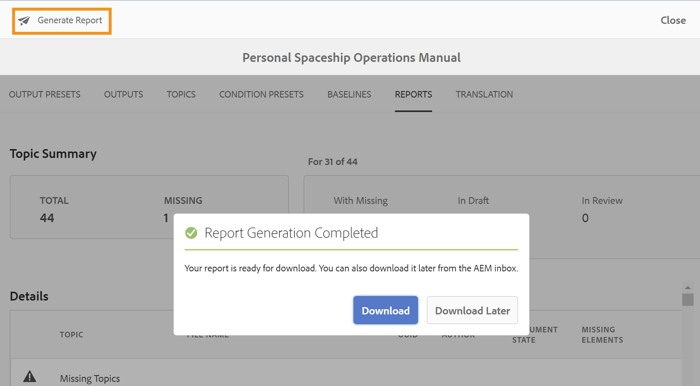

# Notes de mise à jour | Adobe Experience Manager Guides 4.0.x

**Clause de non-responsabilité** :

** était auparavant marqué comme *XML Documentation pour Adobe Experience Manager*. Veuillez noter que certaines références contenues dans la documentation peuvent toujours faire référence à une image de marque antérieure, mais s’appliquent toujours à l’offre actuelle.

Ces notes de mise à jour couvrent les instructions de mise à niveau, les nouvelles fonctionnalités et les améliorations de la version 4.0.x d’Adobe Experience Manager Guides (appelée AEM Guides par la suite).

## 4.0.3 | Notes de mise à jour

### Matrice de compatibilité

Cette section répertorie la matrice de compatibilité pour les applications logicielles prises en charge par AEM Guides version 4.0.3.

#### Adobe Experience Manager

- Version 6.5 Service Pack 12, 10, 11 ou 9

Pour plus d’informations, consultez la section *Exigences techniques* du Guide d’installation et de configuration.

#### FrameMaker et FrameMaker Publishing Server

| Version | FMPS 2020 | FMPS 2019 | Fm 2020 | Fm 2019 |
|---|---|---|---|---|
| Non-UUID | 2020.2 ou version ultérieure* | 2019 | 2020.3 ou version ultérieure | 2019.8 (dernière mise à jour) |
| UUID | 2020.2 ou version ultérieure* | Non compatible | 2020.4 ou version ultérieure | Non compatible |

*La ligne de base et les conditions créées dans la solution XML Documentation sont prises en charge dans FMPS version 2020.2 et ultérieures.*

#### Connecteur D&#39;Oxygène

| Version | Fenêtres du connecteur d&#39;oxygène | Mac du connecteur d&#39;oxygène | Modifier dans Oxygen Windows | Modifier dans Oxygen Mac |
|---|---|---|---|---|
| Non-UUID | 1.6.8 | 1.6.8 | 1.5 | 1.5 |
| UUID | 2.3.8 | 2.3.8 | 2,2 | 2,2 |

### Problèmes résolus

Les bogues corrigés dans différentes zones sont répertoriés ci-dessous :

- Oxygen extrait une version incorrecte d’une rubrique après le rétablissement d’une version de fichier dans AEM. (9661)
- Des différences d’horodatage incorrectes s’affichent dans l’interface utilisateur d’Assets lors du rétablissement d’une version de fichier. (9662)
- Les fichiers sont extraits automatiquement lors du retour à n’importe quelle version. (9663)
- Le contenu traduit est rompu si le code de langue est mentionné en fr ou en-us. (9665)
- Dans la version non-UUID, la traduction approuvée ne s’intègre pas à la langue cible lorsque le code de la langue cible contient cinq caractères comme fr_ca. (9666)
- La version cible de l’image s’affiche en jcr:root, une fois la traduction terminée et que la création de version est activée. (9668)
- Lorsque la traduction est effectuée à l’aide de la ligne de base, une version incorrecte de l’image est envoyée pour traduction. (9669)

## 4.0.2 | Notes de mise à jour

### Matrice de compatibilité

Cette section répertorie la matrice de compatibilité pour les applications logicielles prises en charge par AEM Guides version 4.0.2.

#### Adobe Experience Manager

- Version 6.5 Service Pack 12, 10, 11 ou 9

Pour plus d’informations, consultez la section *Exigences techniques* du Guide d’installation et de configuration.

#### FrameMaker et FrameMaker Publishing Server

| Version | FMPS 2020 | FMPS 2019 | Fm 2020 | Fm 2019 |
|---|---|---|---|---|
| Non-UUID | 2020.2 ou version ultérieure* | 2019 | 2020.3 ou version ultérieure | 2019.8 (dernière mise à jour) |
| UUID | 2020.2 ou version ultérieure* | Non compatible | 2020.4 ou version ultérieure | Non compatible |

*La ligne de base et les conditions créées dans la solution XML Documentation sont prises en charge dans FMPS version 2020.2 et ultérieures.*

#### Connecteur D&#39;Oxygène

| Version | Fenêtres du connecteur d&#39;oxygène | Mac du connecteur d&#39;oxygène | Modifier dans Oxygen Windows | Modifier dans Oxygen Mac |
|---|---|---|---|---|
| Non-UUID | 1.6.8 | 1.6.8 | 1.5 | 1.5 |
| UUID | 2.3.8 | 2.3.8 | 2,2 | 2,2 |

### Problèmes résolus

Les bogues corrigés dans différentes zones sont répertoriés ci-dessous :

- La position du texte inséré ou supprimé n’est pas correcte dans un document de révision nouvellement créé. (9454)
- La version 1.0 n’est pas répertoriée dans certains cas dans le panneau **Historique des versions** après la mise à niveau vers la version 4.0.1. (9441)
- Le libellé et les commentaires ne s’affichent pas pour la version actuelle sous la version 1.0. Dans certains cas, ils ne sont pas répertoriés sous le panneau **Historique des versions**. (9440)
- L’éditeur se fige lorsque certains fichiers de contenu sont ouverts dans l’éditeur. (9433)
- La recherche dans le panneau Référentiel et la boîte de dialogue de navigation *topicref* se figent lors de la recherche de fichiers de contenu volumineux. (9432)
- Deux versions sont créées pour un fichier lors de l’enregistrement d’un fichier à partir de l’éditeur web. (9428)
- Impossible d&#39;insérer des ressources autres que DITA et Daval dans la rubrique. (9363)
- L&#39;éditeur se bloque au chargement de l&#39;aperçu d&#39;une carte avec un grand nombre de clés. (9332)
- Les références interrompent le déplacement des ressources dans les fichiers sources lors de la création à l’aide de la mise à jour FM 4. (9177)

### Problèmes connus

- Si le paramètre **Créer une version pour le fichier téléchargé** est activé, une nouvelle version est créée en sélectionnant **Enregistrer tout** par intermittence dans certains cas.
- La fonctionnalité Supprimer les utilisateurs sous le profil de dossiers ne fonctionne pas par intermittence sur le navigateur Chrome. **Solution** : actualisez le navigateur Chrome.

## 4.0.1 | Notes de mise à jour

### Matrice de compatibilité

Cette section répertorie la matrice de compatibilité pour les applications logicielles prises en charge par la version 4.0.1 de la solution XML Documentation.

#### Adobe Experience Manager

- Version 6.5 Service Pack 12, 11 ou 10
- Java : 11

#### FrameMaker et FrameMaker Publishing Server

| Version | FMPS 2020 | FMPS 2019 | Fm 2020 | Fm 2019 |
|---|---|---|---|---|
| Non-UUID | 2020.2 ou version ultérieure* | 2019 | 2020.3 ou version ultérieure | 2019.8 (dernière mise à jour) |
| UUID | 2020.2 ou version ultérieure* | Non compatible | 2020.4 ou version ultérieure | Non compatible |

*La ligne de base et les conditions créées dans la solution XML Documentation sont prises en charge dans FMPS version 2020.2 et ultérieures.*

#### Connecteur D&#39;Oxygène

| Version | Fenêtres du connecteur d&#39;oxygène | Mac du connecteur d&#39;oxygène | Modifier dans Oxygen Windows | Modifier dans Oxygen Mac |
|---|---|---|---|---|
| Non-UUID | 1.6.8 | 1.6.8 | 1.5 | 1.5 |
| UUID | 2.3.8 | 2.3.8 | 2,2 | 2,2 |

### Problèmes résolus

Les bogues corrigés dans différentes zones sont répertoriés ci-dessous :

- L’arborescence des références est rompue pour un mappage lorsque des références de rubrique en double sont ajoutées ou supprimées. (8922)
- Plusieurs problèmes sont présents dans la section **Versions actuelles** de l’**Historique des versions.** (8909)
- Les références sont interrompues lors de l&#39;utilisation de **Tout sélectionner** et du déplacement des fichiers multimédias ou du contenu DITA vers un autre dossier. (8897)
- Plusieurs problèmes d’interface utilisateur dans la boîte de dialogue **Insérer une référence croisée** > **Référence de fichier** > **Rechercher un fichier** > **Filtres** > **Modifier le chemin de recherche** de l’éditeur web. (8889)
- Problèmes de recherche avec *topicref* et *ditavalref* dans l’éditeur de cartes (8983).
- La recherche au fur et à mesure que vous tapez entraîne des requêtes de recherche indésirables dans la vue Référentiel. (8982)
- Impossible de supprimer les utilisateurs administrateurs dans le profil de dossier. (8926)
- La note de bas de page Utilisation par référence ne fait pas défiler l’écran jusqu’à la section note de bas de page dans la sortie du site AEM. (9061)
- Impossible de publier les articles mis à jour dans Salesforce. (9008)
- La position de mise en surbrillance est incorrecte dans la vue côte à côte. (9009)
- Impossible de glisser-déposer des conditions sur les rubriques DITA. (9031)
- css_layout.css ne peut pas être superposé dans le profil de dossier. (9032)
- Une exception est reçue lors de l’affichage d’une ressource après le chargement. (9068)
- La personnalisation des caractères spéciaux autorisés dans l’éditeur XML ne fonctionne pas correctement. (9075)
- Dans le workflow de traduction, une version supplémentaire est créée pour la ressource traduite. (9107)
- Publication de base avec une rubrique utilisant une image en tant que *conref* à partir d’une autre rubrique, l’image n’apparaît pas dans la sortie. (9172)
- Lors de l’utilisation de l’API de carte de téléchargement, les répertoires temporaires ne sont pas nettoyés en cas d’échec du téléchargement. (9176)
- L’alignement horizontal n’est pas disponible pour un tableau dans la version 4.0. (9207)
- L’attribut Keys n’étant pas affiché pour *glossref*, le formulaire abrégé ne peut pas être inséré via les références d’insertion. (9213)
- La création d’un *keydef* permet uniquement la sélection d’un lien dans la version 4.0. (9214)
- Le comportement de la fonctionnalité Insérer une définition de clé/*keyref* est différent dans 4.0 par rapport à 3.8.10. (9215)
- Correction de problèmes liés à l’éditeur web présent dans les versions 3.8.6 à 3.8.10. (9219)
- Des problèmes se produisent lorsqu’un mot-clé est utilisé dans le titre de l’onglet. (9317)
- La vue Source affiche plusieurs erreurs pour les attributs non conditionnels. (9278)
- Problèmes présents dans la boîte de dialogue de navigation de **Sélectionner le chemin**. (9289)

## 4.0 | Notes de mise à jour

### Matrice de compatibilité

Cette section répertorie la matrice de compatibilité pour les applications logicielles prises en charge par la version 4.0 de la solution XML Documentation.

#### Adobe Experience Manager

- Version 6.5 Service Pack 11, 10 ou 9

#### FrameMaker et FrameMaker Publishing Server

| Version | FMPS 2020 | FMPS 2019 | Fm 2020 | Fm 2019 |
|---|---|---|---|---|
| Non-UUID | 2020.2 ou version ultérieure* | 2019 | 2020.3 ou version ultérieure | 2019.8 (dernière mise à jour) |
| UUID | 2020.2 ou version ultérieure* | Non compatible | 2020.4 ou version ultérieure | Non compatible |

*La ligne de base et les conditions créées dans la solution XML Documentation sont prises en charge dans FMPS version 2020.2 et ultérieures.*

#### Connecteur D&#39;Oxygène

| Version | Fenêtres du connecteur d&#39;oxygène | Mac du connecteur d&#39;oxygène | Modifier dans Oxygen Windows | Modifier dans Oxygen Mac |
|---|---|---|---|---|
| Non-UUID | 1.6.8 | 1.6.8 | 1.5 | 1.5 |
| UUID | 2.3.8 | 2.3.8 | 2,2 | 2,2 |

### Nouvelles fonctionnalités et améliorations

#### Publication basée sur des articles

Avec la version 4.0, nous avons introduit une fonctionnalité de publication d’articles intégrée à l’éditeur web. Vous pouvez utiliser la fonction de publication d’articles pour générer de manière incrémentielle la sortie d’une ou de plusieurs rubriques ou publier votre contenu sur une plateforme de base de connaissances.

Cette fonctionnalité permet aux utilisateurs de créer le plan DITA de manière additive et de publier des rubriques au fur et à mesure qu&#39;elles sont prêtes. Une fois que vous avez publié votre carte, utilisez la fonction de publication d’article pour effectuer une publication incrémentielle pour les articles mis à jour uniquement.

Outre AEM, vous pouvez utiliser cette fonctionnalité unique pour publier vos articles sur n’importe quel portail de base de connaissances, tel que Salesforce. Cette fonctionnalité est également fournie avec un modèle de contenu prêt à l’emploi, reposant sur les composants principaux d’AEM, qui vous permet de créer un référentiel de contenu technique basé sur les connaissances. Ce qui est formidable avec ce modèle, c’est qu’il est entièrement personnalisable pour répondre aux besoins de votre organisation et peut également prendre en charge des cas d’utilisation tels que les portails intranet d’entreprise.

Cette publication d’articles en continu, basée sur les besoins, vous permet non seulement de contrôler entièrement la publication de votre contenu, mais également de réduire le temps global de publication de votre contenu mis à jour.

Pour plus d’informations, consultez la section *Publication basée sur des articles à partir de l’éditeur web* dans le guide d’utilisation.

#### Éditeur Web Amélioré

De nombreuses améliorations et nouvelles fonctionnalités ont été introduites dans l’éditeur web :

- Modification du framework de base de l’IU basée sur Coral en IU basée sur le spectre. Cela donne une interface utilisateur très normalisée et intuitive.
- La nouvelle fonctionnalité Propriétés du fichier a été introduite dans le panneau de droite. Vous pouvez vérifier les propriétés d&#39;un document actif. Les informations sont classées en deux sections :
   - *Général* : contient les détails généraux du fichier, tels que le nom du fichier, l’UUID, les balises de métadonnées, la langue, la date de création, le statut d’extraction et l’état du document.
   - *Référence* : contient des références entrantes et sortantes.

     

- La prise en charge du schéma d&#39;objet a également été ajoutée dans l&#39;éditeur web. Vous pouvez maintenant créer et utiliser le schéma d&#39;objet à l&#39;aide du panneau Schéma d&#39;objet. Avec l’ajout du schéma d’objet, vous pouvez désormais utiliser les métadonnées et la taxonomie de votre entreprise.

  

- Un nouvel outil de zone réactive de glossaire a été introduit dans cette version pour gérer les glossaires en bloc. Grâce à cet outil, vous pouvez rapidement convertir du texte en glossaire et le glossaire en termes en masse pour une carte sélectionnée ou des rubriques ouvertes.

  

- Ajout d’une fonctionnalité d’actualisation dans le panneau Contenu réutilisable qui vous permet d’actualiser rapidement le contenu réutilisable dans les fichiers de référence.
- L’indicateur Nouvelle mise à jour de fichier vous indique si votre copie de travail actuelle du fichier est synchronisée avec la version enregistrée ou non.

  

- Le filtre de recherche dans le panneau Référentiel et la boîte de dialogue de navigation des fichiers a été amélioré pour offrir davantage d’options de filtrage, qui peuvent être davantage personnalisées.

  

- Vous pouvez désormais charger des fichiers .docx à partir de l’éditeur web.
- Les préférences utilisateur sont désormais stockées dans le profil utilisateur et non dans les cookies du navigateur. Cela permet aux utilisateurs et utilisatrices de conserver leurs préférences dans les navigateurs ou les sessions utilisateur.

#### Nouveau tableau de bord de traduction

Un nouveau tableau de bord de traduction a été introduit dans l’éditeur web avec les fonctionnalités suivantes :

- Tri, recherche et filtrage de la liste des rubriques.
- Filtrer le contenu par type de référence : références directes ou indirectes.
- Navigation facile pour trouver un projet existant lors du lancement d’une demande de traduction.
- Ajout d’un mécanisme de traduction multilingue pour éviter de créer plusieurs projets pour chaque langue lorsque la demande de traduction est lancée pour plusieurs langues.
- Ajout d’une configuration pour masquer l’onglet Traduction dans le tableau de bord de mappage. Par défaut, il est visible. Vous pouvez choisir de traduire le contenu à l’aide du tableau de bord des cartes ou de l’éditeur web.

#### Publication améliorée

Les améliorations suivantes sont désormais disponibles dans le processus de publication :

- La génération de PDF via FrameMaker Publishing Server prend désormais en charge les lignes de base et les paramètres prédéfinis de condition.
- Les auteurs peuvent désormais transmettre des métadonnées au niveau du mappage et du topic à la publication DITA-OT. Cela s’avère utile lorsque les modèles PDF personnalisés sont conçus pour utiliser des propriétés de métadonnées de fichier telles que les balises, l’auteur, l’état du document, etc.

  

- Une nouvelle configuration a été ajoutée dans configMgr pour permettre aux utilisateurs de conserver ou de supprimer les versions des rubriques supprimées lorsque l&#39;option **Supprimer et Créer** est utilisée dans la génération de sortie du site AEM.

#### Amélioration de la gestion des fichiers

Les améliorations suivantes sont désormais visibles lors de l’utilisation de fichiers dans AEM Assets :

- Une nouvelle expérience de chargement de fichiers et une nouvelle boîte de dialogue pour choisir une stratégie de résolution de conflit ont été introduites.

  

- Possibilité de créer une nouvelle version du fichier chargé avec la possibilité d&#39;empêcher le remplacement d&#39;un fichier extrait.
- Vous pouvez désormais afficher un aperçu des images directement à partir de la vue Historique des versions . En outre, pour les fichiers DITA et non DITA, l&#39;historique des versions affiche séparément les informations de version actuelle.

  

#### Nouvelle fonctionnalité d’exportation de rapports

Les rapports sont très utiles pour identifier l’intégrité de votre contenu. La solution XML Documentation fournit divers rapports pour prendre le contrôle de votre contenu. Désormais, vous pouvez non seulement afficher les rapports, mais également exporter les données du rapport dans un fichier CSV pour les afficher et les partager avec l’ensemble de votre équipe. Les données des rapports peuvent vous donner un aperçu rapide de tous les liens rompus ou des images manquantes.

#### Amélioration de l’expérience d’actualisation de la gestion des ressources numériques (DAM) avec oxygène

Lorsque vous actualisez des fichiers à partir du serveur AEM dans Oxygen, un message d’avertissement s’affiche si vous n’avez pas enregistré de fichiers dans votre session Oxygen actuelle. Vous pouvez choisir d’annuler l’opération d’actualisation pour enregistrer les fichiers non enregistrés. Sans cette fonctionnalité, les utilisateurs perdaient toutes les informations non enregistrées dans leurs documents.

#### Autres améliorations apportées aux fonctionnalités

- Conformément aux bonnes pratiques d’AEM, les données d’application ont été migrées depuis /content/fmdita, /etc/fmdita/ et /content/dxml/ vers un emplacement plus récent.
- Le workflow Mise à jour des ressources de gestion des ressources numériques a été réintroduit avec une meilleure gestion et des performances optimisées pour s’exécuter avec le workflow de post-traitement XML.
- Le package d’API XML Documentation est désormais disponible dans un référentiel Maven accessible au public.
- Vous pouvez désormais créer un modèle de projet Dita sous le chemin /apps/projects/templates.
- Téléchargez maintenant le fichier ui_config.json par défaut à partir de vos profils de dossier. Vous pouvez l’utiliser pour fusionner des modifications personnalisées du fichier ui_config.json existant lors de la mise à niveau.

### Problèmes résolus

Les bogues corrigés dans différentes zones sont répertoriés ci-dessous :

#### Éditeur web

- les conversions apparaissent en rouge même lorsqu’elles ne sont pas rompues. (8239)
- La valeur de l’attribut conditionnel n’est pas automatiquement renseignée lorsque l’option **Ajouter toutes les propriétés** est sélectionnée dans l’éditeur DITAVAL. (8234)
- Les auteurs ne peuvent pas insérer d’image dans une rubrique à l’aide d’un chemin relatif. (8112)
- Les conréfs de Ph ajoutés dans la cellule du tableau s’affichent en rouge. (8083)
- Dans le cas de systèmes basés sur UUID, les liens d’une tâche de révision ne sont pas mis à jour lorsque les fichiers en cours de révision sont déplacés. (8080)
- L’éditeur web n’effectue pas correctement le rendu des images dont la propriété de mise à l’échelle est définie sur 75 % ou plus. (8073)
- Les images GIF sont rendues en tant qu’images statiques dans l’éditeur web. (8024)
- Une conkeyref dans un élément de note ne s’affiche pas dans l’aperçu de l’éditeur web ni dans la sortie. (8006)
- la xréf à un élément qui est lui-même une conref n’est pas résolue dans l’éditeur. (7933)
- Le titre avec la clé n’est pas rendu correctement dans l’aperçu de l’éditeur et dans le panneau Référentiel. (7909)
- Les fragments de code avec des caractères spéciaux ne sont pas stockés correctement. (7908)
- Même en cas de problème de validation JS, la requête POST est toujours envoyée au serveur. (7989)
- L’enregistrement d’une rubrique après le formatage des équations de MathML génère une erreur. (7954)
- keydef having (tm) ne s’affichent pas correctement dans l’éditeur et la sortie du site AEM contenait des symboles de gestion des balises en double. (7859)
- Faire glisser et déposer un fragment de code ne fonctionne pas selon les DTD. (7758)
- HTML ignore les dimensions définies personnalisées pour les graphiques. (7718)
- l’attribut conrefend n’est pas mis à jour lorsque le fichier source est déplacé. (7698)
- L’utilisation de documents de type Rubrique de référence entraîne plusieurs problèmes d’interface utilisateur. (7656)
- Les fichiers DITAVAL ne s’affichent pas lorsque l’auteur ajoute ditavalref dans une carte. (7594)
- Un espace inattendu est trouvé dans chaque élément de `<entry>` vide lorsque l’attribut outputclass est ajouté à `<tgroup>` élément. (7532)
- Le bouton Source ne fonctionne pas pour les rubriques ouvertes via le tableau de bord de carte. (7465)
- L&#39;impression insère des lignes vides et des espaces visibles lorsque le fichier est ouvert dans FrameMaker ou Oxygen. (7408)
- Les cartes avec href=« / » dans l’une des rubriques ne sont pas publiées sur les sites AEM (7405)
- Problèmes de performances détectés dans l’éditeur lorsque la carte racine comporte un grand nombre de jeux de clés. (7400)
- L’état du document pour un mappage avec un modèle personnalisé n’est pas hérité de son profil d’états correspondant. (7359)
- L’élément `<tm>` est incorrectement rendu en tant qu’élément de bloc. (7286)
- Les modèles en double s’affichent dans le panneau des modèles de l’éditeur lorsqu’un nouveau modèle est créé. (5814)
- Les modèles définis dans ui_config pour les images afin de définir des attributs supplémentaires ne s’appliquent pas aux cas de glisser-déposer. (5713)
- Apparence par défaut incorrecte de uicontrol dans menucascade. (5483)
- Les modèles personnalisés pour Rubrique/Carte n’affichent pas le nouveau nom dans l’interface utilisateur. Il affiche le nom sous la forme « Topic »/« Map » plutôt que sous la forme d’un nom configuré (4958)

#### Connecteur D&#39;Oxygène

- Les fichiers dont le dossier parent contient des caractères spéciaux génèrent une erreur lors du chargement dans Oxygen. (8054)
- Lorsqu’un nouveau document est ouvert dans Oxygen, il renvoie une erreur « Impossible de trouver le GUID ». (7856)
- L’option d’archivage est désactivée une fois le fichier extrait d’AEM à l’aide de l’option Modifier dans Oxygen. (7471)

#### Révision

- Lorsque des tâches de révision sont réaffectées à partir de la boîte de réception AEM, les payloads associées aux tâches ne sont pas visibles par les personnes désignées. (8003)
- Si un nom de fichier comporte de l’espace, la page Tâche de révision n’affiche pas le contenu du fichier (multimédia). (8111)

#### Mapper le tableau de bord

- Impossible d’afficher le contenu de la conférence dans le titre d’une rubrique dans l’onglet Rubriques ou rapports du tableau de bord de mappage. (8263)
- La sortie AEM Sites | jcr:title de la page de site générée n’est pas mise à jour lorsque le titre de la rubrique DITA est mis à jour. (8131)
- Télécharger MAP ne télécharge pas les fichiers vidéo utilisés dans les rubriques. (8070)
- Le téléchargement de la bookmap d’AEM échoue pour la hiérarchie plate si la bookmap comporte 2 rubriques portant le même nom dans différents dossiers. S’il existe des fichiers portant le même nom, mais avec une casse différente, ils sont traités comme des fichiers en double. (8058)
- Les fichiers multimédias ne sont pas téléchargés lorsque la balise d’objet est utilisée par le biais de l’API de carte des signets de téléchargement. (8057)
- Un rapport incorrect s’affiche dans l’onglet Rapports si un sujet contient une conref dans un fichier dont le titre commence par conref. (4698)

#### Publication

- La création du PDF échoue pour la première fois lorsque l’option Activer le contrôle de version est sélectionnée. (8053, 8294)
- Pour le contenu non UUID, les images conref ne s’affichent pas dans la sortie du site AEM. (7907)
- Un espace est ajouté automatiquement après une balise « tm ; » dans la sortie du site AEM. (7964)
- Impossible d’afficher les vidéos YouTube dans la sortie du site AEM. (7401)
- Échec du filtrage par libellé pour le contenu référencé une fois que l’utilisateur a cliqué sur Parcourir toutes les rubriques dans l’onglet de ligne de base du tableau de bord de mappage. (7388)
- La rubrique de publication avec l’élément `<tm>` ayant la valeur de propriété SM ou reg s’affiche incorrectement dans la sortie générée. (7239)
- La publication de base avec une image ne sélectionne pas la dernière version de l’image dans la sortie publiée. (7231)
- Les rubriques référencées associées sont affichées dans l&#39;onglet Ligne de base. (5424)
- La publication incrémentielle pour une rubrique dont le titre contient conkeyref ne fonctionne pas comme prévu. (4474)
- Le titre de la page n’est pas utilisé pour la génération de l’URL de sortie même si ce paramètre est coché. (8257)
- Publication de base : sélection de la version actuelle des images au lieu du nœud figé. Cela s’affiche également si le nom d’une image contient un espace ou des caractères spéciaux. (8274, 8322)
- La publication incrémentielle échoue pour un plan DITA avec un schéma d&#39;objet de type mappé. (8218)

#### AEM Assets

- Problèmes de performances détectés lors de la sélection/suppression de jeux de contenu volumineux dans l’interface utilisateur d’Assets. (8238)
- La fonctionnalité de recherche enregistrée (collection dynamique) s’interrompt si le prédicat DITA est ajouté aux filtres de recherche. (8048)
- Le rétablissement de l’image dans une ancienne version ne fonctionne pas. (DXML-7903)
- L’option de suppression est également visible pour les auteurs qui ne disposent pas des autorisations de suppression. (7322)
- La superposition CCMS pour l’éditeur Assets interrompt le rendu de l’option Supprimer . (8093)

#### Import de contenu

- Conversion HTML vers DITA | Le tableau avec &#39;tr&#39; ayant des entrées &#39;td&#39; vides provoque la création de lignes supplémentaires. (8132)
- Conversion d’HTML en DITA | HTML ayant une table avec plusieurs corps échoue avec une exception. (7940)
- Conversion d’HTML en DITA | Erreurs générées si la source HTML contient des commentaires. (7937)
- L&#39;importation de fichiers DITA 1.3 entraîne la transformation de certains href en liens incorrects. (8019)

#### Autres

- Dans la vue Historique des versions, la miniature des images est manquante ou endommagée. (7948, 8008)
- L’API zipMapWithDependents ne fournit pas d’informations pertinentes en cas de références erronées dans le contenu. (7521)
- Pour les clients UUID, les valeurs de configuration par défaut ont été modifiées pour quelques configurations telles que l’expression régulière pour identifier les fichiers UUID, l’utilisation du titre de la page pour générer la sortie, etc. (8301, 8305)

## Instructions de mise à niveau {#upgrade-instructions}

Vous pouvez facilement mettre à niveau votre version actuelle d’AEM Guides vers la version 4.0.3. Avant de procéder à la mise à niveau vers la version 4.0.3 d’AEM Guides, vous devez tenir compte des points suivants :

- Si vous utilisez la version 4.0.2, vous pouvez directement effectuer la mise à niveau vers la version 4.0.3. Vous devez effectuer la mise à niveau vers la version 4.0.2 avant la mise à niveau vers la version 4.0.3.
- Si vous utilisez la version 4.0, vous pouvez directement effectuer la mise à niveau vers la version 4.0.2.
- Si vous utilisez la version 4.0.1, vous devez la désinstaller.
- Si vous utilisez la version 3.8.5, vous devez effectuer la mise à niveau vers la version 4.0 avant la mise à niveau vers la version 4.0.2.
- Si vous utilisez une version antérieure à la version 3.8.5, reportez-vous à la section mise à niveau du guide d’installation spécifique au produit.

Pour plus d’informations, voir [Instructions de mise à niveau](https://helpx.adobe.com/content/dam/help/en/xml-documentation-solution/4-0-3/Adobe-Experience-Manager-Guides_Upgrade-Instructions_EN.pdf).

