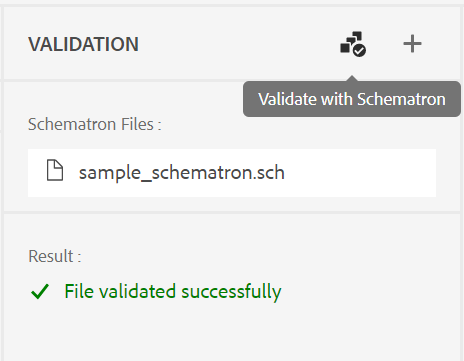

# Version 4.1.x des guides Adobe Experience Manager

Les notes de mise à jour de cette version portent sur les instructions de mise à niveau, les nouvelles fonctionnalités et les améliorations de la version 4.1.x des Guides Adobe Experience Manager (ultérieurement appelés *Guides d’AEM*).

## Mise à niveau vers la dernière version

Vous pouvez facilement mettre à niveau votre version actuelle des AEM Guides vers la version 4.1.3. Avant de procéder à la mise à niveau vers la version 4.1.3 des AEM Guides, vous devez tenir compte des points suivants :
* Si vous utilisez la version 4.1 ou 4.1.x, vous pouvez directement effectuer la mise à niveau vers la version 4.1.3.
* Si vous utilisez la version 4.0.x, vous devez effectuer la mise à niveau vers la version 4.1 ou 4.1.x avant de passer à la version 4.1.3.
* Si vous utilisez la version 3.8.5, vous devez effectuer la mise à niveau vers la version 4.0.x avant de passer à la version 4.1.
* Si vous utilisez une version antérieure à 3.8.5, reportez-vous à la section Mise à niveau du guide d’installation spécifique au produit.

Pour plus d’informations, voir [Instructions de mise à niveau](assets/Adobe-Experience-Manager-Guides-Upgrade-Instructions-EN.pdf).

## 4.1.3 | Notes de mise à jour

## Matrice de compatibilité

Cette section répertorie le tableau de compatibilité des applications logicielles prises en charge par AEM Guides 4.1.3.

### ADOBE EXPERIENCE MANAGER

**Non UUID**
Version 6.5 Service Pack 13, 12, 11 ou 10

**UUID**
Version 6.5 Service Pack 13, 12, 11 ou 10

Pour plus d’informations, voir la section Exigences techniques du guide Installation et configuration de Adobe Experience Manager Guides .

### FrameMaker et FrameMaker Publishing Server

| Version | FMPS 2020 | FMPS 2019 | Fm 2020 | Fm 2019 |
| --- | --- | --- | --- | --- |
| 4.1.3 (non UUID) | 2020.2 ou version ultérieure* | 2019 | 2020.3 ou version ultérieure | 2019.8 (dernière mise à jour) |
| 4.1.3 (UUID) | 2020.2 ou version ultérieure* | Non compatible | 2020.4 ou version ultérieure | Non compatible |
| | | | |

*Les conditions de base et créées dans AEM sont prises en charge dans les versions FMPS à partir de 2020.2.

### Connecteur Oxygen

| Version | Fenêtres du connecteur Oxygen | Mac du connecteur Oxygen | Modifier sous Windows Oxygen | Modifier dans Oxygen Mac |
| --- | --- | --- |--- |--- |
| 4.1.3 (non UUID) | 2.0 | 2.0 | 1,6 | 1,6 |
| 4.1.3 (UUID) | 2,7 | 2,7 | 2,3 | 2,3 |
|  |  |   |

## Problèmes résolus

Le bogue corrigé est répertorié ci-dessous :

* L’éditeur web charge une page vierge par intermittence. 10678

## 4.1.2 | Notes de mise à jour

## Matrice de compatibilité

Cette section répertorie le tableau de compatibilité des applications logicielles prises en charge par AEM Guides 4.1.2.

### ADOBE EXPERIENCE MANAGER

**Non UUID**
Version 6.5 Service Pack 13, 12, 11 ou 10

**UUID**
Version 6.5 Service Pack 13, 12, 11 ou 10

Pour plus d’informations, voir la section Exigences techniques du guide Installation et configuration de Adobe Experience Manager Guides .

### FrameMaker et FrameMaker Publishing Server

| Version | FMPS 2020 | FMPS 2019 | Fm 2020 | Fm 2019 |
| --- | --- | --- | --- | --- |
| 4.1.2 (non UUID) | 2020.2 ou version ultérieure* | 2019 | 2020.3 ou version ultérieure | 2019.8 (dernière mise à jour) |
| 4.1.2 (UUID) | 2020.2 ou version ultérieure* | Non compatible | 2020.4 ou version ultérieure | Non compatible |
| | | | |

*Les conditions de base et créées dans AEM sont prises en charge dans les versions FMPS à partir de 2020.2.

### Connecteur Oxygen

| Version | Fenêtres du connecteur Oxygen | Mac du connecteur Oxygen | Modifier sous Windows Oxygen | Modifier dans Oxygen Mac |
| --- | --- | --- |--- |--- |
| 4.1.2 (non UUID) | 2.0 | 2.0 | 1,6 | 1,6 |
| 4.1.2 (UUID) | 2,7 | 2,7 | 2,3 | 2,3 |
|  |  |   |

## Problèmes résolus

Les bogues résolus dans différentes zones sont répertoriés ci-dessous :

* Lors de la sélection de tous les profils de dossier, un profil de dossier invisible (incorrect) s’affiche. 10393)
* La création de ligne de base ne sélectionne pas la dernière version lorsque le fuseau horaire de l’utilisateur est différent du fuseau horaire du serveur. 10336
* Le raccourci Ctrl+F n’ouvre pas le modal de recherche du navigateur sur la console Ressources après l’installation des AEM Guides 4.1. (10339)
* Une erreur de création de ligne de base se produit pour la rubrique qui contient la référence à un dossier. 10383
* L’onglet Paramètres prédéfinis de sortie affiche par intermittence un écran vide et, dans certains cas, des paramètres prédéfinis non modifiables s’affichent. (10390)
* La gestion de l’espace de clés génère des exceptions et des erreurs. 10449)

### Problèmes connus liés à la solution

* La ligne de base exportée lors de la traduction ne se charge pas dans l’onglet de ligne de base de l’éditeur.

  **Solution**: utilisez l’onglet de ligne de base du tableau de bord de mappage DITA.

## 4.1 | Notes de mise à jour

Les notes de mise à jour de cette version portent sur les instructions de mise à niveau, les nouvelles fonctionnalités et les améliorations de la version 4.1.x des Guides Adobe Experience Manager (ultérieurement appelés *Guides d’AEM*).

## Matrice de compatibilité

Cette section répertorie le tableau de compatibilité des applications logicielles prises en charge par AEM Guides 4.1.

### ADOBE EXPERIENCE MANAGER

**Non UUID**
Version 6.5 Service Pack 13, 12, 10 ou 11

**UUID**
Version 6.5 Service Pack 13, 12, 10 ou 11

Pour plus d’informations, voir la section Exigences techniques du guide Installation et configuration de Adobe Experience Manager Guides .

### FrameMaker et FrameMaker Publishing Server

| Version | FMPS 2020 | FMPS 2019 | Fm 2020 | Fm 2019 |
| --- | --- | --- | --- | --- |
| 4.1 (non UUID) | 2020.2 ou version ultérieure* | 2019 | 2020.3 ou version ultérieure | 2019.8 (dernière mise à jour) |
| 4.1 (UUID) | 2020.2 ou version ultérieure* | Non compatible | 2020.4 ou version ultérieure | Non compatible |
| | | | |

*Les conditions de base et créées dans AEM sont prises en charge dans les versions FMPS à partir de 2020.2.

### Connecteur Oxygen

| Version | Fenêtres du connecteur Oxygen | Mac du connecteur Oxygen | Modifier sous Windows Oxygen | Modifier dans Oxygen Mac |
| --- | --- | --- |--- |--- |
| 4.1 (non UUID) | 2.0 | 2.0 | 1,6 | 1,6 |
| 4.1 (UUID) | 2,7 | 2,7 | 2,3 | 2,3 |
|  |  |  |

## Nouvelles fonctionnalités et améliorations

AEM Guides contient de nombreuses améliorations et nouvelles fonctionnalités de la version 4.1 :

### Publication PDF native

La prise en charge de la création d’un PDF natif a également été ajoutée dans la version 4.1 des AEM Guides. Un nouveau moteur de publication a été introduit avec les fonctionnalités suivantes :
* Création d’un modèle CSS
* Créer différents modèles de page
* Modèles de PDF de conception comprenant des modèles CSS et de page
* Publier le mappage et le contenu de rubrique au format PDF

### Prise en charge du chemin du site de la base de connaissances dans la publication basée sur les articles

AEM Guides fournit la fonction de publication basée sur des articles pour générer de manière incrémentielle une sortie d’une ou de plusieurs rubriques ou publier votre contenu sur une plateforme de la base de connaissances. Avec la version 4.1, vous disposez d’une option supplémentaire pour choisir le chemin du site de la base de connaissances vers lequel la rubrique/le mappage doit être publiée. Une fois le chemin sélectionné, la sortie est générée à l’emplacement spécifié.

### Éditeur web amélioré

* **Amélioration de la résolution des clés**

Une référence de clé de contenu DITA insère une partie du contenu d’une rubrique dans une autre. Elle utilise une clé pour localiser le contenu. Les références clés associées à une rubrique DITA doivent être résolues. La carte racine sélectionnée a la priorité la plus élevée pour résoudre les références clés.

Désormais, les références clés sont résolues sur la base de la carte racine définie dans l’ordre de priorité suivant :

1. Préférences utilisateur
1. Panneau Vue Carte
1. Profil de dossier

Pour plus d’informations, voir *Résoudre les références de clés* dans le guide d’utilisation des guides Adobe Experience Manager.

* **Ajouter un panneau personnalisé dans le panneau de gauche**

Vous pouvez maintenant ajouter un panneau personnalisé dans le panneau de gauche de l’éditeur Web. Vous pouvez utiliser un panneau personnalisé à diverses fins, par exemple pour fournir de l’aide ou effectuer les tests pour un projet. Si un panneau personnalisé a été configuré, il apparaît également dans la liste des panneaux de la variable **Paramètres de l’éditeur**. Vous pouvez activer ou désactiver le commutateur pour afficher ou masquer le panneau personnalisé.

* **Possibilité de modifier l’état du document des rubriques dans un mappage DITA**

Vous pouvez désormais facilement modifier l’état du document des rubriques sélectionnées dans un mappage DITA. Vous pouvez également ouvrir et modifier les propriétés des rubriques sélectionnées dans un mappage DITA à partir du **Plus d’options** au bas du panneau Vue Carte.

* **Informations de version affichées en mode Aperçu**

L’éditeur web vous aide à gérer vos versions. Vous pouvez désormais également voir la version de la rubrique active ou du mappage DITA dans le coin supérieur droit de l’onglet Fichier de la rubrique en mode Aperçu d’une rubrique.

* **Amélioration du comportement d’actualisation de l’éditeur web**

Les améliorations suivantes sont désormais disponibles avec l’opération d’actualisation du navigateur dans l’éditeur web :

* Vous obtenez maintenant la prise en charge de l’actualisation du navigateur lorsque vous modifiez votre contenu dans l’éditeur web. Si vous appuyez sur l’icône d’actualisation du navigateur alors qu’un ou plusieurs fichiers contenant des modifications non enregistrées sont ouverts pour modification, vous êtes invité à enregistrer vos fichiers ou à annuler l’action d’actualisation.

* Même lors de l’actualisation du navigateur, les vues du panneau de gauche et du panneau de droite sont conservées.

* La rubrique active ou le mappage DITA est rouvert dans la zone de modification du contenu.

* **Création de cartes à partir de modèles personnalisés**

Vous disposez désormais de la puissante fonctionnalité permettant de créer des modèles de carte personnalisés. Vous pouvez les utiliser pour créer des mappages DITA avec les modèles de rubrique et de mappage référencés dans le modèle de mappage.

Vous pouvez également vous référer à d’autres modèles de mappage et de rubriques à partir du modèle de mappage personnalisé. Les modèles de mappage référencés peuvent faire référence à divers modèles de mappage, modèles de rubrique, rubriques, cartes, images, vidéos et autres ressources.

Le modèle de carte personnalisé peut vous aider à répliquer très facilement les modèles de carte et la structure de dossiers référencée entière. Ces modèles personnalisés sont particulièrement utiles pour créer et recréer plusieurs cartes qui comportent des structures et des références récursives.

* **Prise en charge des schémas**
&quot;Schéma&quot; fait référence à un langage de validation basé sur des règles utilisé pour définir des tests pour un fichier XML. À l’aide d’un fichier de schéma, vous pouvez définir certaines règles, puis les valider pour une rubrique DITA ou un mappage. L’éditeur web prend en charge les fichiers de schéma. Vous pouvez importer les fichiers de schéma et les modifier dans l’éditeur web. La prise en charge des schémas dans l’éditeur web vous aide à valider les fichiers par rapport à un ensemble de règles et à maintenir la cohérence et l’exactitude dans les rubriques.

* **Amélioration de la boîte de dialogue de fermeture de fichier**

AEM Guides vous invite à enregistrer vos modifications et à déverrouiller vos fichiers verrouillés lorsque vous essayez de fermer un fichier ouvert dans l’éditeur web. Les invites s’affichent en fonction de la variable **Demander l’archivage à la fermeture** et **Demander la nouvelle version à fermeture** paramètres configurés par votre administrateur.

En fonction de la configuration, vous avez la possibilité d’enregistrer les modifications et de créer une nouvelle version de votre document. Vous pouvez également archiver le fichier et enregistrer les modifications apportées à la version actuelle.

Pour plus d’informations, voir *Fermeture du fichier et enregistrement des scénarios* dans le guide d’utilisation des guides Adobe Experience Manager.* Le **Insérer un mot-clé** fonctionnalité a été améliorée. Vous pouvez désormais trouver plus facilement un Mot-clé à insérer lorsque les mots-clés sont répertoriés par ordre alphabétique. Vous pouvez également rechercher des mots-clés en saisissant une chaîne de recherche dans la zone Rechercher.

* **Prise en charge des documents Markdown**
Markdown est un langage de balisage léger qui peut vous aider à ajouter des éléments de formatage aux documents en texte brut. L’éditeur web vous permet d’utiliser des documents Markdown (.md) avec vos documents DITA. Vous pouvez facilement créer et prévisualiser un document Markdown dans l’éditeur web et également l’ajouter à votre fichier de mappage via l’éditeur de mappage DITA.  Pour plus d’informations, voir *Création de documents Markdown à partir de l’éditeur web* dans le guide d’utilisation des guides Adobe Experience Manager.

* **Possibilité de configurer une vue de balises par défaut**
Si un utilisateur active la vue Balises à partir de l’éditeur web, elle reste activée même au cours des sessions.  Cela signifie que vous n’avez pas besoin d’activer à nouveau la vue Balises pour y accéder ultérieurement. Votre administrateur peut configurer l’état par défaut de la vue Balises dans l’éditeur web. La valeur par défaut de la vue Balises pour la session d’un nouvel utilisateur est déterminée par la propriété tagsView dans le fichier ui_config.json.

* Désormais, les fichiers en mode Référentiel sont chargés par lots. Tous les fichiers présents dans la balise principale ou `/content/dam folder` sont répertoriées. Mais à partir du niveau suivant ou du dossier secondaire, 75 fichiers sont chargés à la fois. Ce chargement par lots est efficace et vous pouvez accéder aux fichiers plus rapidement par rapport au chargement de tous les fichiers existants dans un dossier.

### Nouveau tableau de bord de ligne de base

La version 4.1 d’AEM Guides fournit la fonctionnalité de ligne de base intégrée à l’éditeur web. Vous pouvez désormais créer des lignes de base à partir de l’éditeur Web et les utiliser pour publier ou traduire des rubriques de différentes versions.

**Remarque**: pour le système mis à niveau, mettez à jour la dernière version **ui_config.json** pour le profil de dossier.

Utilisez cette fonction pour créer une ligne de base avec une version spécifique des rubriques disponibles à une date et une heure spécifiques. En outre, vous obtenez la prise en charge de l’API pour créer ou mettre à jour une ligne de base avec un libellé défini pour une version de rubriques.

Vous pouvez rechercher les fichiers en fonction de leur nom ou de leur emplacement. Vous pouvez également filtrer les rubriques à afficher dans la fenêtre d&#39;édition de ligne de base et les trier selon des colonnes spécifiques.

Les performances du processus de création de ligne de base ont été améliorées. Le processus de création des lignes de base est asynchrone. Vous pouvez donc continuer à modifier d’autres fichiers dans l’éditeur web pendant la création de la ligne de base. Pour plus d’informations, voir *Création et gestion des lignes de base à partir de l’éditeur web* dans le guide Utilisation des guides Adobe Experience Manager .

Remarque : l’onglet Ligne de base du tableau de bord de carte est masqué par défaut. Votre administrateur peut activer l’onglet Ligne de base dans le tableau de bord de mappage.

* Le paramètre de ligne de base des API à télécharger utilise désormais le titre de la ligne de base pour récupérer le contenu versionné.

### Processus de traduction amélioré

* **Possibilité de créer un projet de traduction de portée**
Si vous devez créer uniquement la portée d’un projet à traduire, vous pouvez sélectionner **Création d’un projet de traduction d’étendue**. Cela n’enverra pas les copies à traduire et l’état de traduction d’origine des fichiers est conservé.

* La variable **Langues** La liste affiche les dossiers de langue ainsi que leurs codes de langue. Par exemple, Français (fr) et Allemand (de).

Pour plus d’informations sur la traduction, voir *Traduire des documents à partir de l’éditeur Web* dans le guide d’utilisation des guides Adobe Experience Manager.

### Publication améliorée

* Vous pouvez également accéder au **Publier le tableau de bord** dans l’onglet Sorties lorsque vous générez une sortie à partir du tableau de bord de mappage. Une liste de toutes les tâches de publication actives est disponible dans le tableau de bord de publication.

* Dans le tableau de bord de mappage, vous pouvez sélectionner plusieurs fichiers DITAVAL pour générer du contenu conditionnel. Vous pouvez conserver l’ordre des fichiers en ajoutant ou en supprimant des fichiers. Vous pouvez également survoler le nom du fichier avec la souris pour voir le chemin d’accès dans le référentiel AEM où le fichier est stocké.

* Les lignes de base ont été respectées pour les métadonnées de la sortie AEM site. Vous pouvez également traiter les propriétés d’une version de ligne de base en tant que métadonnées. Si aucune ligne de base n’est définie, les propriétés de la dernière version sont traitées comme des métadonnées.

* La variable **Nom du fichier** et **Arguments de ligne de commande DITA-OT** Des options ont été ajoutées pour les paramètres prédéfinis de sortie HTML5, EPUB et Personnalisé. Vous pouvez maintenant spécifier le nom de fichier avec lequel vous souhaitez enregistrer la sortie. Vous pouvez également spécifier les arguments supplémentaires que DITA-OT doit traiter lors de la génération de la sortie.

### Tableau de bord des cartes

Lorsque vous choisissez de télécharger le mappage DITA, la demande est mise en file d’attente et vous recevez une notification une fois que le mappage est prêt à être téléchargé. Vous pouvez choisir de télécharger le fichier de carte immédiatement ou plus tard à partir du lien fourni dans la boîte de réception de notifications AEM.

### Autres améliorations de fonctionnalités

* AEM Guides prend désormais en charge Oxygen XML Author version 24.1.
* Le paramètre de ligne de base des API à télécharger utilise désormais le titre de la ligne de base pour récupérer le contenu versionné.

### Fonctionnalité obsolète

AEM Guides ne prend plus en charge la génération du format de sortie DITA pour les documents de FrameMaker. Cette option DITA a également été supprimée des paramètres prédéfinis de sortie du tableau de bord des cartes.

## Problèmes résolus

Les bogues résolus dans différentes zones sont répertoriés ci-dessous :

* La prise en charge de la création n’est pas disponible comme alternative pour le référencement basé sur les chemins de fichier pour la publication. (8076)
* Le module complémentaire DITA empêche la détection des ressources en double de la gestion des actifs numériques. (8417)
* Après l’archivage d’un document d’Oxygen vers AEM, le contenu japonais du document est remplacé par des points d’interrogation (???). (9124)
* L’actualisation des fichiers extraits ne fonctionne pas lors de la journalisation avec l’authentification Web dans Oxygen. (9179)
* Le fichier n’est pas extrait lorsqu’il est ouvert dans Oxygen. (9192)
* Après l’archivage d’un document d’Oxygen vers AEM, le contenu japonais du document est remplacé par des points d’interrogation (???). (9276)
* L&#39;authentification web ne fonctionne pas dans Oxygen. (9296)
* La rechargement échoue dans Oxygen lorsque le ou les fichiers existent déjà dans AEM au même emplacement. (9328)
* Option non disponible pour synchroniser avec force le contenu entre AEM et le système local. (9439)
* L’ID n’est pas généré automatiquement pour l’élément ajouté à l’aide de **Insérer du contenu réutilisable** de la barre d’outils secondaire. (5826)
* Aucune boîte de dialogue de confirmation ne s’affiche lors du téléchargement d’une image portant le même nom qu’un fichier existant, via l’éditeur. (6011)
* Espace insécable non disponible dans la palette des caractères. (7523)
* La liste des éléments (Alt+Entrée) apparaît en grisé dans le thème Sombre/Plus sombre. (7913)
* La version n’est pas mise à jour lors de l’enregistrement de la révision d’une rubrique à partir de la barre d’outils du panneau de mappage. (8228)
* xref ne peut pas être inséré même à des emplacements valides. (8354)
* L’opération &quot;getversionlabel&quot; a des limites et ne donne pas les performances attendues. (8513)
* Les problèmes se produisent avec la boîte de dialogue de confirmation lors de la fermeture d’un fichier verrouillé ou modifié qui n’est actuellement pas ouvert dans l’éditeur. (8692)
* Une erreur se produit lors de l’ajout d’un utilisateur en tant qu’administrateur dans le profil de dossier lorsque l’ID utilisateur est numérique. (8908)
* Le panneau de traduction est visible même lors de l’ouverture du mappage DITA dans l’éditeur de cartes. (9053)
* Le code de langue ne s’affiche pas avec la langue dans le panneau Traduction. (9108)
* Les onglets Traduction et Ligne de base sont visibles pendant un certain temps dans le tableau de bord Carte . (9146)
* Une fois la traduction terminée, une version supplémentaire est créée pour la ressource traduite. (9310)
* La traduction approuvée ne s’intègre pas à la langue cible lorsque le code de langue cible contient cinq caractères tels que `fr_ca`. (9357)
* Le contenu traduit est rompu lorsque le code de langue cible créé est mentionné comme `fr-fr, `, `en-us`. (9527)
* Lors du chargement d’un mappage DITA en dehors du dossier de langue, une exception est consignée au serveur principal.(9543)
* Impossible de créer un fichier DITA à l’aide du modèle DITA personnalisé à partir de l’éditeur. (7262)
* Le mappage DITA est perdu lors de la publication d’un mappage UUID DITA via FMPS. (7278)
* AEM Guides ne copie pas les propriétés non uniques d’une ressource lorsqu’elle est copiée et collée. (8241)
* Le nom du fichier de mappage DITA n’est pas converti en minuscules lors de sa création. (8383)
* La description de la tâche de révision n’apparaît pas dans la notification électronique envoyée lorsqu’une nouvelle tâche de révision est affectée. (8507)
* API de mappage de téléchargement | Les dossiers temporaires ne sont pas nettoyés en cas d’erreur du processus de téléchargement. (8523)
* `columnpreview.jsp` dépend de SP.  (8543)
* Les tâches de sortie avec le statut &quot;En attente&quot; ou &quot;En cours&quot; ne sont pas nettoyées dans le tableau de bord de publication.  (8569)
* Icône par défaut sélectionnée lors de la génération d’un rapport à l’aide du bouton Générer , même lorsque la propriété de l’icône est définie. (8573)
* Des problèmes se produisent lors du processus de révision lors de la mise à niveau de la version 3.8.X vers la version 4.0. (8788)
* Dans le panneau Révision de l’éditeur web, si un nom d’utilisateur est long, les icônes à accepter/rejeter ne s’affichent pas clairement. (8793)
* Arborescence de référence après la suppression d’une rubrique et l’exécution d’une opération de déplacement. (8804)
* La DTD personnalisée définie par l’utilisateur n’a pas la priorité sur la DTD DITA standard incorporée dans DITA-OT. (9104)
* La position de mise en surbrillance est incorrecte dans la vue côte à côte. (9305)
* La note de bas de page de référence utilisée ne fait pas défiler l’écran jusqu’à la section de note de bas de page dans AEM sortie du site. (9061)
* L’ordre des notes de bas de page est incorrect dans la sortie AEM Site. (9327)
* Les ressources DITA nouvellement créées sont toujours extraites par un autre utilisateur. (9387)
* L’erreur est toujours consignée lors de la création d’un nouveau contenu. (9388)
* Le troisième écran du processus de création de la tâche de révision n’affiche pas la liste des glossaires. (4558)
* Références UUID incorrectes attribuées lors du téléchargement de plusieurs fichiers à partir du connecteur FrameMaker/Oxygen. (8269)
* La notification électronique n’est pas envoyée lorsqu’une tâche de révision est réaffectée dans la boîte de réception. (8376)
* Le deuxième utilisateur administrateur ne peut pas être ajouté en tant que premier utilisateur administrateur à un dossier. (8430)
* **Appliquer les étiquettes** dans l’onglet Ligne de base , les libellés ne s’affichent pas dans la liste déroulante. (8455)
* Lors de l’utilisation de la publication de ligne de base avec l’image comme référence dans la rubrique, l’image n’est pas publiée dans la sortie. (8564)
* La fonction de purge de sortie échoue si un grand nombre de noeuds d’historique de sortie restants sont présents. (8568)
* Dans le panneau Historique des versions, la section de version actuelle affiche un horodatage incorrect et modifié par informations. (8765)
* Ligne de base non mise à jour en fonction du libellé défini. (8799)
* Une erreur se produit lorsque des fichiers dont le dossier parent contient des caractères spéciaux dans le nom du fichier sont ouverts dans Oxygen (à l’aide de la fonction **Modifier dans Oxygen** ). (8918)
* Le téléchargement des fichiers d’Oxygen vers AEM échoue. (9157)
* Le mappage de téléchargement avec la ligne de base ne fonctionne pas si le contenu est déplacé vers un autre dossier. (9331)
* Oxygen extrait une version incorrecte d’une rubrique après le rétablissement d’une version dans AEM. (9411)
* La recherche dans le panneau Référentiel et la boîte de dialogue de navigation topicref gèle l’écran lorsque le contenu est volumineux. (9432)
* Si le paramètre **Créer une version pour le fichier téléchargé** est activé, une nouvelle version est créée lors de la restauration et de l’enregistrement sur n’importe quel noeud figé. (9473)
* Des différences d’horodatage incorrectes s’affichent dans l’interface utilisateur d’Assets lors de la restauration d’une version de fichier. (9480)
* Les fichiers sont extraits automatiquement lors du rétablissement d’une version. (9482)
* L’icône représentant un cadenas s’affiche dans la vue du référentiel même lorsque le fichier est archivé à partir de l’éditeur.  (5756)
* Impossible d’ajouter de la matière frontale, des éléments de fond dans un plan de navigation à l’aide de la vue Auteur de l’éditeur web. (7652)
* Le mode Aperçu ne prend pas en charge `deliveryTarget` attribut de traitement conditionnel dans DITA. (7685)
* À l’ouverture d’une rubrique de glossaire dans l’éditeur XML, AEM force l’enregistrer même si elle n’a pas été modifiée. (8105)
* La boîte de dialogue Insérer des références s’ouvre lors de l’ajout d’un objet à un mappage à l’aide de l’interface utilisateur. (8212)
* La réutilisation du panneau de contenu se bloque lors de la recherche de caractères spéciaux `[` ou `*` .(8279)
* Lors de la création de Glossentry, l’éditeur web affiche le contenu sous la forme d’une note. (8384)
* XML Editor supprime la nouvelle ligne dans le bloc de code. (8522)
* Le passage du mode source au mode création marque la rubrique comme sale et nécessite que le contenu soit à nouveau enregistré.(8524)
* Impossible de fermer une rubrique déverrouillée. (8545)
* Il n’existe aucune option pour choisir le chemin de la base de connaissances dans les paramètres prédéfinis de publication basés sur un article. (8636)
* Les attributs sont absents lors de l’ajout d’un chapitre dans un bookmap à l’aide de la fonction Glisser-déposer depuis la vue Favoris. (8746)
* La boîte de dialogue Insérer un mot-clé ne dispose pas de la capacité de recherche et les mots-clés ne sont pas répertoriés dans l’ordre de tri. (9094)
* L’exécution d’une recherche dans XML Editor entraîne le blocage de la page. (9452)
* Sites manquants dans AEM paramètres prédéfinis sous l’onglet Sortie. (9567)
* Images de SVG dont le rendu n’est pas correct dans les modes de création de l’éditeur XML. (9426)
* La ligne de base n’est pas respectée lors de la publication via Salesforce. (8953)
* Il n’est pas possible d’effacer le rootmap des paramètres des préférences de l’utilisateur. (8534)
