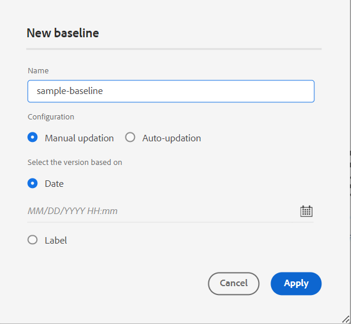

# Nouveautés de la version de décembre 2023 d’Adobe Experience Manager Guides as a Cloud Service

Cet article couvre les nouvelles fonctionnalités améliorées de la version de décembre 2023 d’Adobe Experience Manager Guides (appelée ultérieurement *Experience Manager Guides as a Cloud Service*).

Pour plus d’informations sur les instructions de mise à niveau, la matrice de compatibilité et les problèmes résolus dans cette version, consultez les [Notes de mise à jour](release-notes-2023-12-0.md).

## Utiliser des variables dans la sortie du PDF

Vous pouvez utiliser des variables pour insérer et gérer dynamiquement des informations réutilisables. Experience Manager Guides vous aide à créer, modifier et prévisualiser des variables lorsque vous générez la sortie du PDF. Vous pouvez modifier rapidement les valeurs des variables et rendre vos documents portables et faciles à mettre à jour.

{width="800" align="left"}

*Créez et gérez des variables dans l’éditeur web.*

Vous pouvez également créer des ensembles de variables qui remplacent les valeurs par défaut et affecter d’autres valeurs à vos variables. Insérez ces variables dans la mise en page et utilisez la même mise en page de PDF. Il n’est pas nécessaire de créer des mises en page distinctes pour chaque ensemble de valeurs. Par exemple, vous pouvez créer un jeu de variables pour chaque version de produit. Ce jeu de variables peut être constitué de variables pour différents détails de produit, tels que le nom, le numéro de version et la date de publication du produit. Vous pouvez ensuite ajouter différentes valeurs pour ces variables.

**Jeu de variables 1 : Adobe-set1**

* ProductName : Experience Manager Guides
* VersionNumber : 2311
* Date de publication : 11/02/2023

**Jeu de variables 2 : Adobe-set2**

* ProductName : Experience Manager Guides
* VersionNumber : 2310
* Date de publication : 09/27/2023

*Générez la sortie du PDF à l’aide de variables dans la disposition du PDF.*

Vous pouvez appliquer des styles et utiliser des balises d’HTML pour formater les variables.  Vous pouvez également mettre rapidement à jour les valeurs de toutes les variables, le cas échéant, et générer à nouveau la sortie. Par exemple, si vous devez mettre à jour les détails d’une version, vous pouvez modifier la valeur de la version dans la variable VersionNumber et générer à nouveau la sortie.

Découvrez comment utiliser les [variables dans la sortie du PDF](../native-pdf/native-pdf-variables.md).

## Expérience restructurée pour modifier les attributs

Vous disposez désormais d’une expérience repensée pour ajouter ou modifier les attributs d’un élément à partir du panneau **Propriétés du contenu** de l’éditeur web.

{width="300" align="left"}

*Ajoutez des attributs à partir du panneau Propriétés du contenu.*

Vous pouvez également facilement modifier et supprimer les attributs.

Pour plus d’informations, reportez-vous à la description de la fonctionnalité **Propriétés du contenu** dans la section [Panneau de droite](../user-guide/web-editor-features.md#id2051EB003YK) .

## Modification des métadonnées lors de la création

Désormais, lors de la création, vous pouvez mettre à jour les balises de métadonnées de fichier à l’aide de la liste déroulante des **propriétés du fichier** dans le panneau de droite. Vous pouvez également sélectionner **Modifier plus de propriétés** pour mettre à jour plus de métadonnées.

{width="300" align="left"}

*Mettez à jour les métadonnées et modifiez les propriétés du fichier à partir du panneau de droite.*

Pour plus d’informations, reportez-vous à la description de la fonctionnalité **Propriétés du fichier** dans la section [Panneau de droite](../user-guide/web-editor-features.md#id2051EB003YK) .

## Possibilité de publier du contenu dans la base de connaissances ServiceNow

Vous pouvez désormais également publier votre contenu sur la plateforme de la base de connaissances ServiceNow .

Avec la version de décembre 2023, en tant qu’administrateur, vous pouvez créer un profil de publication pour le serveur de la base de connaissances ServiceNow. Ensuite, en tant qu’auteur ou éditeur, vous pouvez choisir ce profil de publication ServiceNow dans le paramètre prédéfini de sortie pour publier la sortie dans la base de connaissances spécifiée.

Cette fonctionnalité vous permet de publier du contenu (texte, vidéos et images) sur la plateforme de la base de connaissances ServiceNow et de gérer un référentiel complet.

{width="300" align="left"}

*Créez un paramètre prédéfini de sortie pour la base de connaissances ServiceNow.*

En savoir plus sur les paramètres prédéfinis de sortie [Base de connaissances](../user-guide/generate-output-knowledge-base.md).

## Tableau de bord amélioré de la collecte des cartes

Experience Manager Guides fournit un tableau de bord de collecte des cartes amélioré. Dans une collection de mappages, vous pouvez rapidement configurer les propriétés de métadonnées en bloc pour les mappages DITA. Cette fonctionnalité est pratique, car vous n’avez pas à mettre à jour les propriétés de métadonnées pour chaque mappage DITA individuellement.

Vous pouvez désormais afficher le nom de fichier du mappage DITA. Vous pouvez également afficher les lignes de base. Vous pouvez ainsi trouver rapidement la ligne de base utilisée pour un paramètre prédéfini.

{width="800" align="left"}

*Affichez, modifiez et générez la sortie à partir du tableau de bord de la collection de cartes.*

Découvrez comment [utiliser la collecte de cartes pour la génération de sortie](../user-guide/generate-output-use-map-collection-output-generation.md).

## Affichage des attributs clés dans la vue Carte

Lorsque vous définissez des attributs clés pour la rubrique ou les références de mappage, vous pouvez également afficher le titre, l’icône correspondante et la clé dans le panneau de gauche. La clé s’affiche sous la forme `key=<key-name>`.

Pour plus d’informations, reportez-vous à la description de la fonctionnalité **Vue Carte** dans la section [Panneau de gauche](../user-guide/web-editor-features.md#id2051EA0M0HS) .

 {width="300" align="left"}

*Affichez l’attribut de clé dans la vue Carte.*

## Possibilité de dupliquer une ligne de base en fonction d’un libellé

Experience Manager Guides offre désormais une expérience utilisateur améliorée pour la création des lignes de base à partir de l’éditeur web.\
 {width="300" align="left"}
*Créez une ligne de base à partir de l’éditeur web.*

Il permet également de dupliquer une ligne de base en fonction du libellé. La version de référence est sélectionnée en fonction du libellé donné (s’il existe) lors de la duplication ou sélectionne la version à partir de la ligne de base dupliquée.

 {width="300" align="left"}

*Dupliquez une ligne de base à partir d&#39;un libellé ou créez une copie exacte.*

Découvrez comment [créer et gérer des lignes de base à partir de l’éditeur web](../user-guide/web-editor-baseline.md).

## Résoudre les liens croisés dans la sortie AEM site

Les liens croisés (XREF avec portée homologue) générés dans la sortie AEM site sont désormais résolus en fonction du titre du fichier du jeu de contexte de publication pour la carte générée.

## Configurez l’URL de la sortie Site AEM pour utiliser le titre du document.

Experience Manager Guides vous permet, en tant qu’administrateur, de configurer l’URL de la sortie Site AEM. Si le nom de fichier n’existe pas ou contient tous les caractères spéciaux, vous pouvez le remplacer par un séparateur dans l’URL de la sortie Site AEM. Vous pouvez également les remplacer par le nom de la première rubrique enfant. Découvrez comment [configurer l’URL de la sortie AEM Site pour utiliser le titre du document](../cs-install-guide/conf-output-generation.md#configure-the-url-of-the-aem-site-output-to-use-the-document-title).
