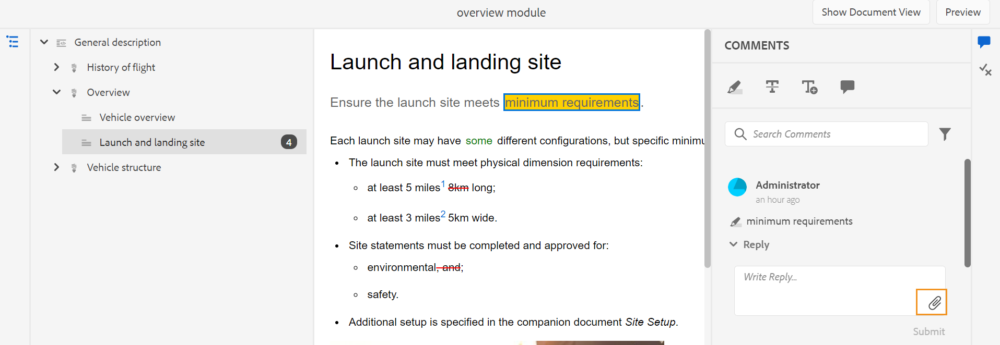

# Nouveautés de la version de février 2023 d’Adobe Experience Manager Guides as a Cloud Service

Cet article couvre les nouvelles fonctionnalités et les fonctionnalités améliorées de la version de février 2023 d’Adobe Experience Manager Guides (appelée ultérieurement *AEM Guides as a Cloud Service*).

Pour plus d’informations sur les instructions de mise à niveau, la matrice de compatibilité et les problèmes résolus dans cette version, consultez l’article [Notes de mise à jour](release-notes-2023-2-0.md) .

## Génération de rapports à partir de l’éditeur Web

AEM Guides s’accompagne d’une fonctionnalité de l’éditeur Web qui vous permet de vérifier l’exhaustivité globale de vos documents techniques et de générer des rapports à leur sujet.
Vous pouvez afficher la liste des rubriques, gérer les métadonnées et afficher le contenu multimédia utilisé dans toutes les références pour la carte actuelle à partir de la
Onglet **Rapports** dans l’éditeur web.

**Générer la vue Liste des rubriques**

Vous pouvez générer la liste des rubriques qui fournit des informations détaillées sur vos rubriques, telles que le type de référence, l’état du document et l’auteur. Vous pouvez également générer le fichier CSV pour télécharger l’instantané actuel des rubriques dans la carte DITA.

**Gestion des métadonnées et modification de l’état du document**

Vous pouvez appliquer des balises sur une rubrique individuelle ou utiliser la fonction de balisage en masse pour appliquer plusieurs balises sur plusieurs rubriques, un mappage DITA ou un sous-mappage. Vous pouvez également remplacer l’état du document de toutes les rubriques sélectionnées par l’état suivant du document commun.

**Générer le rapport multimédia**

Vous pouvez générer le rapport multimédia qui contient des informations détaillées sur le multimédia utilisé dans vos références dans la carte actuelle. Vous avez la possibilité de filtrer et de trier les fichiers multimédia répertoriés dans le rapport.
Vous pouvez également générer le fichier CSV pour télécharger l’instantané actuel du fichier multimédia utilisé dans la carte DITA.

## UX restructuré pour la fonctionnalité de révision

Désormais, AEM guides fournit un UX amélioré qui vous aide à passer en revue les rubriques partagées en vue de la révision. Dans la dernière expérience, la fonctionnalité de révision présente les améliorations suivantes :

* Interface utilisateur actualisée
* Panneau Conditions permettant de mettre en surbrillance le contenu en fonction des conditions disponibles dans la rubrique.
* Chaque commentaire du panneau des commentaires est associé au texte correspondant dans la rubrique actuelle. Il permet d’identifier le texte commenté.
* Les commentaires sont affichés dans l’ordre du texte commenté dans le document.
* Le nom de la tâche de révision s’affiche dans le workflow de révision.
* Sélectionnez la feuille de route de la tâche de révision utilisée pour résoudre toutes les références clés et tous les termes du glossaire utilisés dans le contenu de la révision.
* Barre d’outils contextuelle qui permet de mettre rapidement le texte en surbrillance ou barré
* Menu Options pour modifier ou supprimer vos propres commentaires
* Pour les commentaires obsolètes, vous avez accès à une vue côte à côte qui vous aide à comparer la version précédente de la rubrique à la version de révision actuelle.
* Lors de l’utilisation des filtres, les commentaires sur le panneau de droite sont filtrés en fonction de la sélection, et la variable
Le nombre de commentaires dans le panneau de gauche est mis à jour en conséquence.

  

## Améliorations de la traduction

Le tableau de bord Traduction contient désormais plus d’améliorations conviviales qui vous permettent de traduire facilement vos documents à partir de l’éditeur Web.

**Transmettez l’étiquette de version à la version cible**

AEM Guides permet de transmettre le libellé du fichier source au fichier cible. Vous pouvez ainsi identifier facilement la version source du fichier traduit.

Par exemple, si vous avez des fichiers source auxquels est appliqué le libellé de version Version 1.0, vous pouvez également transmettre le libellé source (Version 1.0) au fichier traduit.

**Forcer la synchronisation pour les ressources désynchronisées**

Si vous apportez des modifications à certaines ressources, AEM Guides les signale comme étant hors synchronisation. Vous pouvez soit retraduire les ressources modifiées, soit choisir d’ignorer l’état Désynchronisé . Par exemple, si vous avez apporté des modifications mineures qui n’ont vraiment pas besoin de traduction, vous pouvez marquer leur état comme étant Synchronisé.

**Afficher les projets de traduction en cours pour une rubrique ou une carte**

Certaines des références de votre tableau de bord de traduction peuvent être en cours. Désormais, AEM Guides fournit une fonctionnalité qui vous aide à afficher la liste de tous les projets de traduction en cours (ainsi que la langue cible) qui contiennent la référence sélectionnée.

## Générer une sortie dans divers formats à partir de l’éditeur web

Vous pouvez désormais facilement générer la sortie pour vos rubriques ou mappage DITA à partir de l’éditeur web. Vous pouvez configurer divers paramètres prédéfinis de sortie, tels que AEM Site, PDF, HTML5,
JSON (format de sortie sans affichage) et sortie personnalisée. Vous pouvez ensuite les utiliser pour générer les sorties respectives.

Vous pouvez définir des attributs dans vos rubriques DITA, puis utiliser le paramètre prédéfini de condition pour appliquer une condition lors de la publication de la sortie. Vous pouvez également utiliser la fonction de publication de ligne de base pour publier sélectivement une version spécifique de votre mappage ou de votre rubrique DITA.

## Rechercher et remplacer le texte au niveau de la carte

AEM Guides vous permet de rechercher des fichiers dans une carte qui contient du texte spécifique. Le texte recherché est mis en surbrillance dans les fichiers. Vous pouvez désormais également remplacer le mot ou l’expression recherché par un autre mot ou expression dans tous les fichiers. Vous pouvez sélectionner l’icône **Tout remplacer** à droite en haut de la liste pour remplacer toutes les occurrences du terme recherché dans tous les fichiers.

## Suppression et duplication de fichiers à partir du panneau du référentiel

Vous pouvez désormais facilement créer un doublon ou une copie d’un fichier à partir du menu **Options** du fichier sélectionné dans le panneau du référentiel. Par défaut, le fichier est créé avec
un suffixe (comme `filename_1.extension`).

## Autres améliorations apportées à l’éditeur web

* Dans AEM Guides, vous pouvez effectuer certaines opérations courantes pour les images et les fichiers multimédias à l’aide du menu contextuel. Vous pouvez désormais également localiser l’image ou le média sélectionné dans le référentiel ou afficher l’aperçu du fichier dans l’interface utilisateur d’Assets.

* Le nom du profil de dossier actif s’affiche sous forme de libellé pour l’icône Préférences utilisateur dans la barre d’outils principale. Vous pouvez ainsi identifier le profil de dossier sur lequel vous travaillez.

* Lorsque vous ouvrez une carte en mode Carte, le titre de la carte active s’affiche au centre de la barre d’outils principale. Ceci s’avère utile pour indiquer aux utilisateurs quelle carte est actuellement ouverte.

## Afficher le titre à la place de l’UUID dans l’éditeur Oxygen

Maintenant AEM Guides vous permet de choisir l’option **Utiliser le titre dans l’éditeur et le gestionnaire de cartes** dans Paramètres. Si vous sélectionnez cette option, le titre du fichier s’affiche dans l’onglet du fichier lorsqu’il est ouvert dans l’éditeur ou dans le Gestionnaire de mappages DITA. Si vous ne sélectionnez pas cette option, l’UUID du fichier est affiché dans l’onglet du fichier.

## Publication basée sur un microservice pour AEM Guides as a Cloud Service

Le nouveau microservice de publication vous permet d’exécuter simultanément des charges de travail de publication volumineuses sur AEM Guides as a Cloud Service et d’exploiter la plate-forme Adobe I/O Runtime sans serveur de pointe.

Pour chaque demande de publication, AEM Guides as a Cloud Service exécute un conteneur distinct qui se met à l’échelle horizontalement en fonction des demandes de l’utilisateur. Cela vous permet d’exécuter plusieurs requêtes de publication et d’obtenir des performances améliorées.

Pour plus d’informations, voir [Configuration de la publication basée sur un nouveau microservice pour AEM Guides as a Cloud Service](https://experienceleague.adobe.com/docs/experience-manager-guides-learn/tutorials/knowledge-base/publishing/configure-microservices.md).

## PDF natif | Ajout d’un signet personnalisé dans la sortie PDF

Vous pouvez maintenant ajouter un signet personnalisé sur un contenu particulier dans la sortie finale du PDF pour une navigation facile. Cela sera ajouté à la table des matières qui est créée à partir des titres de rubrique ou de section dans votre mappage DITA.

## PDF natif | Application d’un style personnalisé aux entrées de la table des matières et au contenu de la rubrique

AEM Guides fournit la fonctionnalité permettant d’appliquer un style personnalisé aux entrées de la table des matières ou à une rubrique particulière dans la sortie du PDF. Par exemple, vous pouvez modifier la couleur du texte dans la table des matières et le titre de la rubrique. Vous pouvez également appliquer des styles à l’ensemble du contenu dans la rubrique.

## PDF natif | Style du marqueur de page dans le composant de note de bas de page

Vous pouvez maintenant mettre en forme le marqueur de la page dans les notes de pied. Par exemple, vous pouvez ajouter des crochets ou modifier leur couleur. Ces styles permettent aux utilisateurs d’identifier facilement les marqueurs de page dans le document.

## PDF natif | Barre de modification pour indiquer les rubriques modifiées dans la table des matières

AEM Guides vous permet désormais d’identifier rapidement les rubriques modifiées dans la table des matières de la sortie du PDF.  Une barre de modification s’affiche à gauche des rubriques modifiées dans la table des matières. Vous pouvez cliquer sur la rubrique dans la table des matières et afficher les modifications détaillées.

