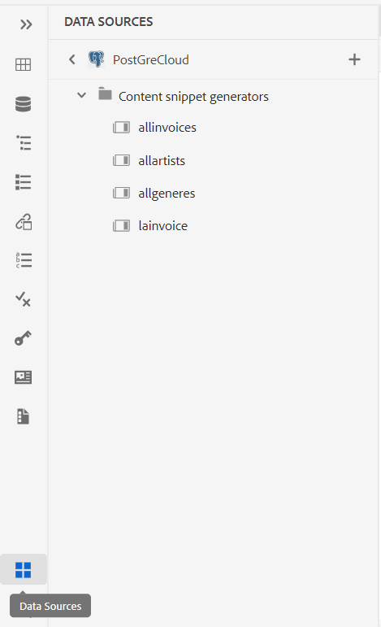

# Nouveautés de la version de juillet 2023 des Guides Adobe Experience Manager as a Cloud Service

Cet article couvre les nouvelles fonctionnalités et les fonctionnalités améliorées de la version de juillet 2023 des Guides Adobe Experience Manager (ultérieurement appelée *AEM Guides as a Cloud Service*).

Pour plus d’informations sur les instructions de mise à niveau, la matrice de compatibilité et les problèmes résolus dans cette version, voir [Notes de mise à jour](release-notes-2023-7-0.md).

## Connexion à une source de données et insertion de données dans vos rubriques

Vous pouvez désormais vous connecter rapidement à vos sources de données à l’aide des connecteurs prêts à l’emploi des AEM Guides. La connexion à une source de données vous permet de maintenir vos informations synchronisées avec la source. Toute mise à jour des données est répercutée automatiquement, ce qui fait d’AEM Guides un véritable hub de contenu. Cette fonctionnalité vous permet de gagner du temps et vous évite d’ajouter ou de copier manuellement les données.

Désormais, AEM Guides permet à votre administrateur de configurer les connecteurs prêts à l’emploi pour les bases de données JIRA et SQL (MySQL, PostgreSQL, SQL Server, SQLite). Ils peuvent également ajouter d’autres connecteurs en étendant les interfaces par défaut.

Une fois ajoutés, vous pouvez afficher les connecteurs configurés répertoriés sous le **Sources de données** dans l’éditeur Web.

{width="300" align="left"}

Vous pouvez créer un générateur de fragments de contenu pour récupérer les données d’une source de données connectée. Vous pouvez ensuite insérer les données dans vos rubriques et les modifier.

Une fois que vous avez créé un générateur de fragments de contenu, vous pouvez le réutiliser pour insérer les données dans n’importe quelle rubrique. Pour plus d’informations, voir [Insertion d’un fragment de contenu à partir de votre source de données](../user-guide/web-editor-content-snippet.md).

## Panneau de révision pour afficher les projets de révision et les tâches de révision actives

Maintenant AEM Guides rend vos révisions plus transparentes. Il fournit le panneau Révisions dans l’éditeur web. Le panneau Révisions affiche tous les projets de révision et les tâches de révision actives dans les projets de révision dont vous faites partie.

En tant qu’auteur, cette fonctionnalité vous permet d’ouvrir facilement les tâches de révision, d’afficher les commentaires et d’adresser rapidement les commentaires dans une vue centralisée.
{width="800" align="left"}
Pour plus d’informations, voir la **Réviser** description des fonctionnalités dans la section [Panneau gauche](../user-guide/web-editor-features.md#id2051EA0M0HS) .

## Améliorations de la collection de cartes

Une collection de cartes vous permet d’organiser plusieurs mappages et de les publier par lots. De nombreuses nouvelles améliorations ont été apportées à la collection de cartes :

- Vous pouvez désormais également ajouter des paramètres prédéfinis de sortie de PDF natifs à une collection de mappages et les utiliser pour générer la sortie de PDF.
- Vous pouvez afficher les paramètres prédéfinis de profil global et de dossier créés par votre administrateur et les utiliser pour générer la sortie du PDF.
- Désormais, vous pouvez non seulement sélectionner un paramètre prédéfini individuel, mais également activer tous les paramètres prédéfinis de profil de dossier pour un mappage DITA en une seule fois.
  {width="800" align="left"}

Pour plus d’informations, voir [Utilisation de la collecte des cartes pour la génération de la sortie](../user-guide/generate-output-use-map-collection-output-generation.md).

## Possibilité d’accéder aux fichiers de HTML temporaires lors de la génération de la sortie de PDF native

Désormais, AEM Guides vous permet de télécharger les fichiers de HTML temporaires créés lors de la génération de la sortie de PDF native. Dans les paramètres prédéfinis de sortie, sélectionnez l’option de téléchargement des fichiers temporaires.  AEM Guides vous permet ensuite de télécharger les fichiers temporaires créés lors de la génération de la sortie à l’aide de ce paramètre prédéfini.

Cette fonctionnalité permet d’obtenir de meilleures informations sur le processus de génération avec accès aux styles et aux mises en page intermédiaires. Elle vous aide également à corriger ou à modifier vos styles CSS en fonction de vos besoins.

{width="800" align="left"}

Pour plus d’informations, voir [Création d’un paramètre prédéfini de sortie PDF](../web-editor/native-pdf-web-editor.md#create-output-preset).

## Publication basée sur un microservice pour générer une sortie HTML5 et personnalisée

Le nouveau microservice de publication vous permet d’exécuter simultanément des charges de travail de publication volumineuses sur AEM Guides as a Cloud Service et d’exploiter la plate-forme sans serveur Adobe I/O Runtime de pointe. Désormais, vous pouvez également générer le HTML5 et la sortie personnalisée à l’aide du microservice.
Vous pouvez exécuter plusieurs requêtes de publication et obtenir de meilleures performances pour générer ces formats de sortie.
Pour plus d’informations, voir [Configuration de la publication sur microservice pour AEM Guides as a Cloud Service](../knowledge-base/publishing/configure-microservices.md).

## Affichage des détails de version des Guides d’AEM dans A propos des informations

Maintenant avec l’AEM **A propos** vous pouvez également afficher les détails de la version AEM Guides . Vous pouvez afficher les détails de la version actuelle dans le **A propos** de l’ **Aide** sur la page de navigation d’AEM.

(width=&quot;800&quot; align=&quot;left&quot;)
