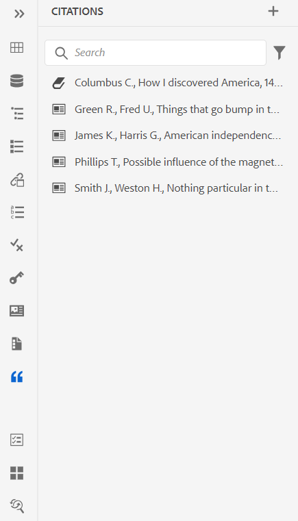

# Nouveautés de la version de septembre 2023 des Guides Adobe Experience Manager as a Cloud Service

Cet article couvre les nouvelles fonctionnalités et les fonctionnalités améliorées de la version de septembre 2023 des Guides Adobe Experience Manager (ultérieurement appelée *AEM Guides as a Cloud Service*).

Pour plus d’informations sur les instructions de mise à niveau, la matrice de compatibilité et les problèmes résolus dans cette version, voir [Notes de mise à jour](release-notes-2023-9-0.md).

## Connexion à une source de données et insertion des rubriques

AEM Guides fournit des connecteurs prêts à l’emploi qui vous aident à vous connecter à vos sources de données, ce qui fait d’AEM Guides un véritable centre de contenu. Cela vous permet de gagner du temps et de vous consacrer à l’ajout ou à la réplication manuels de données.

Outre les connecteurs prêts à l’emploi tels que JIRA et SQL (MySQL, PostgreSQL, SQL Server, SQLite), votre administrateur peut également configurer des connecteurs pour les bases de données MariaDB, H2DB, AdobeCommerce et Elasticsearch. Ils peuvent également ajouter d’autres connecteurs en étendant les interfaces par défaut.

Vous pouvez afficher les connecteurs configurés sous le **Sources de données** dans l’éditeur Web.

*Afficher les sources de données connectées.*

Vous pouvez désormais créer une rubrique à partir d’une source de données connectée. Une rubrique peut contenir des données dans divers formats, tels que des tableaux, des listes et des paragraphes. Il vous permet également de créer un mappage DITA pour toutes les rubriques. Vous pouvez associer des métadonnées à la rubrique lors de l’extraction d’une source de données.

Pour plus d’informations, voir [Utiliser les données de votre source de données](../user-guide/web-editor-content-snippet.md).

## Ajout de citations à votre contenu

Les citations sont des références à la source d’informations ajoutées à votre contenu. Les citations vous aident à établir la crédibilité et à prévenir le plagiat. Les citations aident les lecteurs à localiser la source et à vérifier les informations présentées dans le texte.

Dans AEM Guides, vous pouvez ajouter des citations ou importer des citations et les appliquer à votre contenu. Vous pouvez ajouter ces citations à partir de n’importe quelle source de livres, de sites web et de journaux.

Après avoir inséré vos citations dans vos rubriques, vous pouvez les prévisualiser dans l’éditeur web. Vous pouvez également publier du contenu avec des citations à l’aide du PDF natif.

{width="300" align="left"}

*Affichez la liste des citations dans le panneau Citations .*

Pour plus d’informations, voir [Ajouter et gérer des citations dans votre contenu](../user-guide/web-editor-apply-citations.md).

## Publication sur un fragment de contenu

Les fragments de contenu sont des éléments de contenu distincts dans AEM. Il s’agit de contenu structuré basé sur un modèle de contenu. Les fragments de contenu sont du contenu pur sans informations de conception ou de mise en page. Ils peuvent être créés et gérés indépendamment des canaux pris en charge par AEM. La modularité et la réutilisation des fragments de contenu accroissent la flexibilité, la cohérence, l’efficacité et une gestion plus simple.

Désormais, AEM Guides permet de publier une rubrique ou les éléments d’une rubrique dans un fragment de contenu. Vous pouvez créer un mappage basé sur JSON entre une rubrique et un modèle de fragment de contenu. Utilisez ce mappage pour publier du contenu présent dans certains éléments ou tous les éléments d’une rubrique sur un fragment de contenu.

Capitalisez la puissance des Guides AEM et des fragments de contenu et utilisez des fragments de contenu dans n’importe quel site AEM. Vous pouvez également extraire les détails via des API prises en charge par les fragments de contenu.

{width="550" align="left"}

*Publiez une rubrique sur un fragment de contenu.*

Pour plus d’informations, voir [Publication sur un fragment de contenu](../user-guide//publish-content-fragment.md).

## Améliorations des révisions

AEM Guides offre désormais une fonctionnalité de révision améliorée avec les fonctionnalités suivantes :

### Rubriques de révision de recherche

Réaliser des révisions est une fonctionnalité essentielle des Guides d’AEM. Il permet aux réviseurs de consulter les documents qui leur sont affectés.
Vous pouvez désormais rechercher une rubrique en saisissant une partie du texte du titre ou du chemin de fichier dans la barre de recherche de l’affichage des rubriques du panneau de révision. Vous pouvez également afficher toutes les rubriques ou afficher les rubriques avec des commentaires. Par défaut, vous pouvez afficher toutes les rubriques présentes dans la tâche de révision. Pour plus d’informations, voir [Rubriques de révision](../user-guide/review-topics.md).

{width="800" align="left"}

*Recherchez une rubrique de révision dans le panneau de révision.*

## Structure de l’extension Guides

Créez des packages personnalisés au-dessus des Guides d’AEM afin de fournir une extensibilité à l’aide d’AEM Guides Extension Framework. Ces packages sont utiles aux développeurs et aux consultants et leur donnent une extensibilité aux composants de l’éditeur. Ils peuvent cibler des boutons, des boîtes de dialogue et des listes déroulantes, et ajouter du code JavaScript personnalisé qui peut facilement interagir avec l’interface utilisateur d’AEM Guides.

## Améliorations apportées aux PDF natifs

Les améliorations suivantes ont été apportées aux PDF natifs dans la version de septembre 2023 afin de rendre AEM Guides plus robuste :

### Classer les pages dans la sortie du PDF

Vous pouvez afficher ou masquer les sections suivantes dans votre PDF et organiser l’ordre dans lequel elles doivent apparaître dans la sortie finale du PDF :

* Table des matières
* Chapitres et rubriques
* Liste des figures
* Liste des tableaux
* Index
* Glossaire
* Citation
* Dispositions de pages

Si vous ne souhaitez pas afficher une section spécifique dans la sortie de votre PDF, vous pouvez masquer cela en désactivant le bouton d’activation/désactivation.

Pour plus d’informations, voir [Ordre de page](../native-pdf/components-pdf-template.md#page-order).

### Fusion de pages

Dans une sortie de PDF native par défaut, toutes les sections commencent sur une nouvelle page. Vous pouvez désormais fusionner une section avec sa page précédente ou la page suivante. La section est ainsi publiée dans la suite avec la page sélectionnée dans la sortie du PDF et aucun saut de page n’est effectué entre les deux.

Pour plus d’informations, voir la **Fusion de pages** description des fonctionnalités dans [Ordre de page](../native-pdf/components-pdf-template.md#page-order) .

### Démarrez n’importe quel chapitre à partir de la page active.

Vous pouvez définir les paramètres de configuration de base pour démarrer un chapitre à partir d’une page impaire ou pair, la structure de la table des matières et définir le format de ligne de conduite des entrées de la table des matières.

Vous pouvez également commencer un chapitre à partir de la page active. Si vous choisissez de le faire, tous les chapitres sont publiés dans la suite sans sauts de page. Par exemple, si un chapitre se termine au milieu de la page 15, le chapitre suivant commence également à partir de la 15e page elle-même.

Pour plus d’informations, voir la **Général** description de l’onglet dans  [Paramètres du PDF avancé](../native-pdf/components-pdf-template.md#advanced-pdf-settings-advanced-pdf-settings).

### Pages statiques

Vous pouvez également créer des mises en page personnalisées et les publier en tant que pages statiques dans la sortie du PDF. Cela vous permet d’ajouter du contenu statique tel que des notes ou des pages vierges.

Pour plus d’informations, voir la **Pages statiques** description des fonctionnalités dans [Ordre de page](../native-pdf/components-pdf-template.md#page-order) .

### Variables dans les références croisées

Vous pouvez utiliser des variables pour définir une référence croisée. Lorsque vous utilisez une variable, sa valeur est sélectionnée dans les propriétés.

Maintenant, vous pouvez également utiliser {figure} et {table}.
Utilisation {figure}pour ajouter une référence croisée au numéro de figure. Il sélectionne le numéro de la figure dans les styles de numéro automatique que vous avez définis pour la légende de la figure.

Utilisation {table} pour ajouter une référence croisée au numéro du tableau. Il sélectionne le numéro de tableau parmi les styles de numéro automatique que vous avez définis pour la légende.

Pour plus d’informations, voir [Références croisées](../native-pdf/components-pdf-template.md##cross-references).

### Reconception de l’éditeur CSS

L’éditeur CSS a désormais été repensé pour offrir une meilleure expérience utilisateur avec les sélecteurs et les propriétés de style.

#### Amélioration de la boîte de dialogue Ajouter un style

Vous pouvez désormais utiliser des sélecteurs personnalisés pour ajouter des styles complexes. Le nouveau champ Sélecteur vous permet d’ajouter des sélecteurs personnalisés en plus de la combinaison Classe, Balise et Classe Pseudo. Par exemple, vous pouvez créer des `table a.link` style de tous les liens hypertexte d’un tableau.

{width="300" align="left"}

*Ajoutez les détails du nouveau style.*

#### Personnalisation des propriétés du style

Désormais, AEM Guides vous présente un nouveau panneau de propriétés sous la section d’aperçu pour les styles. Vous pouvez modifier les propriétés des styles plus efficacement et plus rapidement à partir du panneau Propriétés.

## Prise en charge de plusieurs définitions de sujet dans une seule définition d’énumération

Vous pouvez maintenant définir une ou plusieurs définitions de sujet dans un mappage et les définitions d’énumération dans un autre mappage, puis ajouter la référence de mappage. Les références de l’énumération objet sont résolues dans le même mappage ou le mappage référencé.

Vous pouvez désormais également définir des conditions et les appliquer à certains éléments spécifiques d’une rubrique.  Les conditions ne sont visibles que pour ces éléments spécifiques et non pour tous les autres éléments.

Pour plus d’informations sur la gestion des définitions hiérarchiques des définitions d’objet et des énumérations, consultez la description de la fonction Modèle d’objet dans la section [Panneau gauche](../user-guide/web-editor-features.md#id2051EA0M0HS) .

## Sélectionner tous les paramètres prédéfinis d’une collection de cartes

Vous pouvez non seulement activer un paramètre prédéfini individuel et tous les paramètres prédéfinis de profil de dossier, mais également activer tous les paramètres prédéfinis pour un mappage DITA en une seule fois.
{width="800" align="left"}\
*Sélectionnez tous les paramètres prédéfinis d’une collection de mappages.*

Pour plus d’informations, voir [Utilisation de la collecte des cartes pour la génération de la sortie](../user-guide/generate-output-use-map-collection-output-generation.md).

## Prise en charge des PDF natifs dans le tableau de bord de publication en bloc

Grâce à la fonctionnalité d’activation en bloc des Guides d’AEM, vous pouvez activer rapidement et facilement votre contenu de la création à l’instance de publication. Dans la carte Activation en bloc, vous pouvez inclure le paramètre prédéfini de sortie du PDF natif, le site AEM, le PDF, le HTML5, la sortie personnalisée et la sortie JSON.
Pour plus d’informations, voir [Activation en masse du contenu publié](../user-guide/conf-bulk-activation.md).

## Amélioration de l’outil de déplacement en masse

Désormais, en tant qu’administrateur, vous pouvez utiliser l’outil de déplacement en masse amélioré pour déplacer des dossiers contenant de nombreux fichiers d’un emplacement à un autre.
Vous pouvez utiliser la boîte de dialogue parcourir le fichier pour sélectionner les dossiers sources à déplacer. Vous pouvez également naviguer pour sélectionner l’emplacement de destination pour déplacer les dossiers sources. Sélectionner  {width="25" align="left"} près d’un champ pour afficher plus d’informations à son sujet.

Pour plus d’informations, voir [Déplacer des fichiers en masse](../user-guide/authoring-file-management.md#move-files-bulk).

## Amélioration de l’expérience d’aperçu à partir du menu contextuel

Utilisez le menu contextuel pour prévisualiser rapidement le fichier (fichier .dita, .xml, audio, vidéo ou image) sans l’ouvrir. Vous pouvez désormais redimensionner le volet d’aperçu. Si le contenu contient un lien de référence, vous pouvez le sélectionner pour l’ouvrir dans un nouvel onglet.

{width="800" align="left"}

*Prévisualisez le fichier dans le volet.*

Pour plus d’informations sur le menu contextuel, voir **Options d’un fichier** description des fonctionnalités dans la section [Panneau gauche](../user-guide/web-editor-features.md#id2051EA0M0HS) .

## Utilisez des variables pour la date et l’heure actuelles dans les options Chemin de destination, Nom du site ou Nom de fichier .

Lors de la génération de sorties dans AEM site ou les PDF, vous pouvez utiliser des variables pour définir la variable **Chemin de destination**, **Nom du site**, ou **Nom du fichier** options. Vous pouvez désormais également utiliser la variable `${system_date}`et `${system_time}` . Ces variables vous aident à ajouter la date et l’heure actuelles à ces options.

Découvrez comment [utiliser des variables pour définir le chemin de destination, le nom du site ou le nom de fichier ;](../user-guide/generate-output-use-variables.md).
