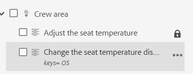

# Nouveautés de la version de décembre 2023 de Adobe Experience Manager Guides as a Cloud Service

Cet article couvre les nouvelles fonctionnalités et les fonctionnalités améliorées de la version de décembre 2023 des Guides Adobe Experience Manager (ultérieurement appelée *Guides du Experience Manager as a Cloud Service*).

Pour plus d’informations sur les instructions de mise à niveau, la matrice de compatibilité et les problèmes résolus dans cette version, consultez [Notes de mise à jour](release-notes-2023.12.0.md).

## Utilisation de variables dans la sortie du PDF natif

Vous pouvez utiliser des jeux de variables pour insérer et gérer dynamiquement des informations qui peuvent changer en fonction de conditions spécifiques telles que les noms et versions des produits. Cette fonctionnalité vous permet d’utiliser la même mise en page de PDF et de générer des sorties avec des valeurs différentes. Il n’est pas nécessaire de créer des mises en page distinctes pour chaque ensemble de valeurs.

Par exemple, vous pouvez créer un jeu de variables pour chaque produit. Ce jeu de variables peut être constitué de variables pour différents détails de produit, tels que ProductName, VersionNumber et ReleaseDate. Vous pouvez ensuite ajouter différentes valeurs pour ces variables.

**Jeu de variables 1 : Adobe-set1**

* ProductName : guides du Experience Manager
* VersionNumber : 2311
* Date de publication : 11/02/2023

**Jeu de variables 1 : Adobe-set2**

* ProductName : guides du Experience Manager
* VersionNumber : 2310
* Date de publication : 09/27/2023

{width="800" align="left"}

*Créez des variables à partir de l’onglet Sortie de l’éditeur Web.*

Vous pouvez également créer des variables avec des valeurs comportant des balises HTMLS. Par exemple, ajoutez des images issues de la gestion des actifs numériques du contenu à l’aide de la fonction `` balise .

Une fois les variables créées, vous pouvez les ajouter aux emplacements appropriés dans votre document à l’aide des mises en page des modèles de sortie. Les valeurs sont automatiquement sélectionnées dans la sortie du PDF en fonction du jeu de variables que vous sélectionnez dans le paramètre prédéfini de sortie.

*Générez la sortie du PDF natif à l’aide de variables dans la disposition du PDF.*

Cette fonctionnalité permet de générer une sortie personnalisée avec du contenu dynamique dans votre documentation et de gérer les modifications efficacement. Vous pouvez également appliquer des styles et utiliser des balises de HTML pour formater les variables.

Vous pouvez également mettre rapidement à jour les valeurs de n’importe quel jeu de variables, le cas échéant, et générer à nouveau la sortie. Par exemple, si vous devez mettre à jour les détails d’une version, vous pouvez mettre à jour la valeur de la version dans VersionNumber et générer à nouveau la sortie.

## Expérience restructurée pour modifier les attributs

Vous obtenez maintenant une expérience repensée pour ajouter ou modifier les attributs d’un élément à partir de la fonction **Propriétés du contenu** dans l’éditeur Web.

{width="300" align="left"}

*Ajoutez des attributs dans le panneau Propriétés du contenu .*

Vous pouvez également facilement modifier et supprimer les attributs.

Pour plus d’informations, reportez-vous au **Propriétés du contenu** description des fonctionnalités dans la section [Panneau droit](../user-guide/web-editor-features.md#id2051EB003YK) .

## Modification des métadonnées lors de la création

Désormais, lors de la création, vous pouvez mettre à jour les balises de métadonnées de fichier à l’aide de la liste déroulante du **Propriétés du fichier** dans le panneau de droite. Vous pouvez également sélectionner **Modification d’autres propriétés** pour mettre à jour d’autres métadonnées.

{width="300" align="left"}

*Mettez à jour les métadonnées et modifiez les propriétés du fichier à partir du panneau de droite.*

Pour plus d’informations, reportez-vous au **Propriétés du fichier** description des fonctionnalités dans la section [Panneau droit](../user-guide/web-editor-features.md#id2051EB003YK) .

## Possibilité de publier du contenu dans la base de connaissances ServiceNow

Vous pouvez désormais également publier votre contenu sur la plateforme de la base de connaissances ServiceNow .

Avec la version de décembre 2023, en tant qu’administrateur, vous pouvez créer un profil de publication pour le serveur de la base de connaissances ServiceNow. Ensuite, en tant qu’auteur ou éditeur, vous pouvez choisir ce profil de publication ServiceNow dans le paramètre prédéfini de sortie pour publier la sortie dans la base de connaissances spécifiée.

Cette fonctionnalité vous permet de publier du contenu (texte, vidéos et images) sur la plateforme de la base de connaissances ServiceNow et de gérer un référentiel complet.

{width="300" align="left"}

*Créez un paramètre prédéfini de sortie pour la base de connaissances ServiceNow.*

## Tableau de bord amélioré de la collecte des cartes

Experience Manager Guides fournit un tableau de bord de collecte de cartes amélioré. Dans une collection de mappages, vous pouvez rapidement configurer les propriétés de métadonnées en bloc pour les mappages DITA. Cette fonctionnalité est pratique, car vous n’avez pas à mettre à jour les propriétés de métadonnées pour chaque mappage DITA individuellement.

Vous pouvez désormais afficher le nom de fichier du mappage DITA. Vous pouvez également afficher les lignes de base. Vous pouvez ainsi trouver rapidement la ligne de base utilisée pour un paramètre prédéfini.

{width="800" align="left"}

*Affichez, modifiez et générez la sortie à partir du tableau de bord de la collection de mappages.*

Découvrez comment [Utilisation de la collecte des cartes pour la génération de sortie](../user-guide/generate-output-use-map-collection-output-generation.md).

## Affichage des attributs clés dans la vue Carte

Lorsque vous définissez des attributs clés pour la rubrique ou les références de mappage, vous pouvez également afficher le titre, l’icône correspondante et la clé dans le panneau de gauche. La clé s’affiche sous la forme `key=<key-name>`.

Pour plus d’informations, reportez-vous au **Vue Carte** description des fonctionnalités dans la section [Panneau gauche](../user-guide/web-editor-features.md#id2051EA0M0HS) .

 {width="300" align="left"}

*Affichez l’attribut de clé dans la vue Carte.*

## Possibilité de dupliquer une ligne de base en fonction d’un libellé

Les guides de Experience Manager offrent désormais une expérience utilisateur améliorée pour la création de lignes de base à partir de l’éditeur web.\
 {width="300" align="left"}
*Créez une ligne de base à partir de l’éditeur web.*

Il permet également de dupliquer une ligne de base en fonction du libellé. La version de référence est sélectionnée en fonction du libellé donné (s’il existe) lors de la duplication ou sélectionne la version à partir de la ligne de base dupliquée.

 {width="300" align="left"}

*Dupliquez une ligne de base à partir d’un libellé ou créez une copie exacte.*

## Amélioration du processus de création d’une collecte de carte d’activation en bloc

Le processus de création d’une collection de cartes d’activation en bloc est désormais plus harmonieux. Désormais, lorsque la page Résultats de l’activation s’affiche, vous pouvez afficher les résultats de l’activation et des journaux.
Pour plus d’informations, voir [Création d’une collection de cartes d’activation en bloc](../user-guide/conf-bulk-activation-create-map-collection.md).

## Résoudre les liens croisés dans la sortie AEM site

Les liens croisés (XREF avec portée homologue) générés dans la sortie AEM site sont désormais résolus en fonction du titre du fichier du jeu de contexte de publication pour la carte générée.

## Configurez l’URL de la sortie Site AEM pour utiliser le titre du document.

Les guides du Experience Manager vous permettent, en tant qu’administrateur, de configurer l’URL de la sortie du site AEM. Si le nom de fichier n’existe pas ou contient tous les caractères spéciaux, vous pouvez le remplacer par un séparateur dans l’URL de la sortie Site AEM. Vous pouvez également les remplacer par le nom de la première rubrique enfant. Découvrez comment [configurer l’URL de la sortie Site AEM pour utiliser le titre du document ;](../cs-install-guide/conf-output-generation.md#configure-the-url-of-the-aem-site-output-to-use-the-document-title).

