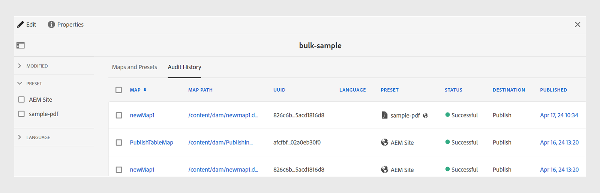

# Nouveautés de la version 2024.4.0

Cet article présente les nouvelles fonctionnalités améliorées de la version 2024.4.0 d’Adobe Experience Manager Guides.

Pour connaître la liste des problèmes résolus dans cette version, voir la section [Problèmes résolus dans la version 2024.4.0](fixed-issues-2024-04-0.md).

Découvrez les [instructions de mise à niveau pour la version 2024.4.0](upgrade-instructions-2024-04-0.md).

## Possibilité de traduire du contenu dans plusieurs langues à l’aide de groupes linguistiques préconfigurés

Experience Manager Guides permet désormais de créer des groupes de langues et de traduire facilement votre contenu dans plusieurs langues. Cette fonctionnalité permet d’organiser et de gérer les traductions en fonction des besoins de votre organisation.

Par exemple, si vous devez traduire votre contenu pour certains pays d’Europe, vous pouvez créer un groupe de langues pour les langues européennes telles que l’anglais (EN), le français (FR), l’allemand (DE), l’espagnol (ES) et l’italien (IT).

{width="300"}

*Sélectionnez les groupes de langues ou les langues que vous souhaitez utiliser pour traduire vos documents.*

>[!NOTE]
>
>Si le dossier cible d’une langue est manquant ou si la langue cible est identique à la langue source, elle est grisée et un signe d’avertissement est affiché.

En tant qu’administrateur ou administratrice, vous pouvez créer des groupes de langues et les configurer sur plusieurs profils de dossiers. En tant qu’auteur ou autrice, vous pouvez afficher les groupes de langues configurés sur votre profil de dossier.

Dans l’ensemble, la création de groupes de langues renforce l’efficacité et la productivité des projets de traduction, améliorant ainsi le processus de localisation dans plusieurs langues.

Découvrez comment [traduire des documents à partir de l’éditeur web](../user-guide/translate-documents-web-editor.md).

## Supprimez ou désactivez automatiquement le projet de traduction après la traduction

Désormais, en tant qu’administrateur ou administratrice, vous pouvez configurer les projets de traduction pour qu’ils soient désactivés ou supprimés automatiquement une fois la traduction terminée. Cette fonctionnalité vous permet d’utiliser efficacement les ressources et de gérer les fichiers une fois la traduction terminée.

La suppression d’un projet supprime définitivement tous les fichiers et dossiers présents dans le projet. La suppression des projets de traduction permet également de libérer de l’espace disque occupé.

Vous pouvez désactiver les projets de traduction si vous souhaitez les utiliser ultérieurement.

{width="550"}

*Configurez les groupes de langues et les paramètres de nettoyage pour les projets de traduction.*

En savoir plus sur la [suppression ou désactivation automatique du projet de traduction](../user-guide/translate-documents-web-editor.md#automatically-delete-or-disable-a-completed-translation-project).

## Activez la sortie de vos mappages dans la collection d’activation en bloc sur l’instance de prévisualisation

Désormais, en plus d’activer la sortie de votre collection d’activation en bloc sur l’instance de publication, Experience Manager Guides as a Cloud Services offre la possibilité de l’activer sur l’instance **Aperçu**.

Cette fonctionnalité vous permet d’activer votre contenu vers une instance d’aperçu, ce qui vous permet de vérifier son aspect et son fonctionnement avant de l’activer vers l’instance **de publication**.

{width="800"}

*Affichez les informations sur les sorties de mappage activées dans l’onglet **Historique d’audit**.*

En savoir plus sur l’[activation en bloc](../user-guide/conf-bulk-activation-publish-map-collection.md).

## Améliorations apportées aux connecteurs de sources de données

Les améliorations suivantes ont été apportées aux connecteurs de sources de données dans la version 2024.4.0 :

### Connectez-vous aux sources de données des tableaux de développement Azure (ADO) Salsify, Akeneo et Microsoft

Outre les connecteurs prêts-à-l’emploi existants, Experience Manager Guides fournit également des connecteurs pour les sources de données Salsify, Akeneo et Microsoft Azure DevOps (ADO) Boards. En tant qu’administrateur ou administratrice, vous pouvez télécharger et installer ces connecteurs. Configurez ensuite les connecteurs installés.

### Copiez et collez l’exemple de requête pour créer un fragment de contenu ou une rubrique

Vous pouvez facilement copier et coller un exemple de requête de données dans le générateur pour créer un extrait de contenu ou une rubrique. Grâce à cette fonction, vous n’avez pas à mémoriser la syntaxe ni à créer une requête manuellement. Au lieu de saisir une requête manuellement, vous pouvez copier et coller un exemple de requête, le modifier et l’utiliser pour récupérer des données selon vos besoins.

{width="800"}

*Copiez et modifiez un exemple de requête pour créer l’extrait de contenu.*

### Connexion aux fichiers de données JSON à l’aide d’un connecteur de fichiers

Désormais, en tant qu’administrateur ou administratrice, vous pouvez configurer un connecteur de fichier JSON pour qu’il utilise les fichiers de données JSON comme source de données. Utilisez le connecteur pour importer les fichiers JSON de votre ordinateur ou d’Adobe Experience Manager Assets. Ensuite, en tant qu’auteur ou autrice, vous pouvez créer des extraits de contenu ou des rubriques à l’aide des générateurs.

Cette fonctionnalité vous permet d’utiliser les données stockées dans vos fichiers JSON et de les réutiliser dans divers extraits de code. Le contenu est également mis à jour de manière dynamique à chaque fois que vous actualisez les fichiers JSON.

### Configurez plusieurs URL de ressource pour un connecteur afin de créer des fragments de contenu ou des rubriques

En tant qu’administrateur ou administratrice, vous pouvez configurer plusieurs URL de ressources pour certains connecteurs tels que Generic REST Client, Salsify, Akeneo et Microsoft Azure DevOps (ADO) Boards.

Ensuite, en tant qu’auteur ou autrice, connectez-vous aux sources de données pour créer des extraits de contenu ou des rubriques à l’aide des générateurs. Cette fonctionnalité est pratique, car vous n’avez pas à créer de source de données pour chaque URL. Cela vous permet de récupérer rapidement des données à partir d’une ressource pour une source de données spécifique dans un extrait de contenu ou une rubrique unique.

Consultez plus de détails sur les connecteurs de sources de données et sur la façon de [configurer un connecteur de source de données à partir de l’interface utilisateur](../cs-install-guide/conf-data-source-connector-tools.md).

Découvrez comment [utiliser les données de votre source de données](../user-guide/web-editor-content-snippet.md).

## Personnaliser votre expérience d’éditeur web avec une nouvelle interface utilisateur de préférences utilisateur

La boîte de dialogue **Préférences utilisateur** de l’éditeur web comprend désormais un nouvel onglet **Apparence**. Ce nouvel onglet vous permet de configurer facilement les préférences d’apparence les plus courantes dans l’interface de l’éditeur web.

Vous pouvez configurer pour afficher les fichiers par titre ou nom de fichier et modifier le thème de l’application et la vue source. Il vous aide également à configurer les paramètres pour localiser un fichier ouvert dans la vue du référentiel et gérer les espaces insécables.

{width="550"}

*Personnaliser l’apparence en fonction de vos préférences.*

Pour en savoir plus sur la description de la fonctionnalité **Préférences utilisateur**, consultez la section [Panneau de gauche](../user-guide/web-editor-features.md#id2051EA0M0HS).

## Recherchez un fichier ouvert dans la vue du référentiel de l’éditeur web

Sélectionnez l’option **Toujours localiser les fichiers dans le référentiel** dans les **Préférences utilisateur** pour accéder rapidement à votre fichier et le localiser dans la vue du référentiel. Il n’est pas nécessaire de le rechercher manuellement.

Lors de la modification, cette fonctionnalité vous permet également d’afficher facilement l’emplacement du fichier dans la hiérarchie du référentiel.

Pour plus d’informations, voir [localisez un fichier ouvert dans la vue du référentiel](../user-guide/web-editor-edit-topics.md#locate-an-open-file-in-the-repository-view).

## Amélioration de la gestion des espaces insécables dans l’éditeur web

Experience Manager Guides vous permet d’afficher un indicateur d’espace insécable lors de la modification de documents dans l’éditeur web. Il améliore également la manipulation des espaces insécables.
Cette option permet de convertir plusieurs espaces consécutifs en un seul espace afin de conserver l’affichage WYSIWYG du document dans l’éditeur web. Cette fonctionnalité permet également d’améliorer l’aspect général et le professionnalisme du document.

Pour plus d’informations, consultez les [autres fonctionnalités de l’éditeur web](../user-guide/web-editor-other-features.md).

## Désactiver le post-traitement pour certains dossiers dans Adobe Experience Manager Assets

En tant qu’administrateur, vous pouvez désormais désactiver le post-traitement et la génération des UUID pour des dossiers sélectifs sur Experience Manager Assets. Cette configuration peut s’avérer utile, en particulier lorsque vous traitez de nombreuses ressources ou des structures de dossiers complexes. Cela permet également à plusieurs utilisateurs et utilisatrices de charger rapidement et simultanément les ressources sans interférer les uns avec les autres.  

La désactivation du post-traitement pour un dossier affecte également tous ses dossiers enfants. Cependant, Experience Manager Guides offre désormais la possibilité d’activer de manière sélective le post-traitement pour les dossiers enfants individuels dans le dossier ignoré.

Découvrez comment [désactiver le post-traitement d’un dossier](../cs-install-guide/conf-folder-post-processing.md).

## Redéfinition de l’expérience pour rechercher et filtrer les fichiers dans la vue du référentiel

Le filtrage des fichiers est maintenant amélioré. La redéfinition de la fonctionnalité de filtrage des fichiers facilite les recherches et la navigation dans les fichiers.

{width="300"}

*Rechercher des fichiers contenant le texte « `general purpose.`* »

Profitez d’avantages tels qu’un accès plus rapide aux fichiers importants et une interface utilisateur plus intuitive. Votre expérience de recherche devient plus fluide et plus efficace.

 {width="300"}

*Utilisez les filtres rapides pour rechercher des fichiers DITA et non DITA.*

En savoir plus sur la fonction **Filtrer la recherche** dans la section [Panneau de gauche](../user-guide/web-editor-features.md#id2051EA0M0HS).

## Liste séparée pour afficher et insérer des éléments valides en fonction de leur position

Lors de la modification d’un document dans l’éditeur web, vous pouvez désormais afficher une liste séparée d’éléments valides à l’emplacement actuel et en dehors de l’emplacement actuel. Selon vos besoins, vous choisissez un élément parmi les options suivantes :

* **Éléments valides à l’emplacement actuel** que vous pouvez insérer à l’emplacement actuel du curseur.
* **Éléments valides en dehors de l’emplacement actuel** que vous pouvez insérer après l’un des parents pour l’élément actif dans la hiérarchie d’éléments.

{width="300"}

*Afficher les listes séparées d&#39;éléments valides pour insérer un élément à l&#39;emplacement actuel.*

Cette liste fractionnée d&#39;éléments valides permet de gérer la structure du contenu et de respecter les normes DITA.

Pour en savoir plus sur la fonction **Insérer un élément**, consultez la section de la barre d’outils Secondaire [&#128279;](../user-guide/web-editor-features.md#2051ea0j0y4).

## Le type de propriétés du contenu s’affiche sous forme de menu déroulant

Désormais, les Propriétés de contenu **Type** s’affichent sous la forme d’un menu déroulant. Vous pouvez afficher et sélectionner les balises de la hiérarchie complète pour la balise active dans la liste déroulante.

Ce menu déroulant vous permet d’accéder rapidement aux balises appropriées dans la structure hiérarchique.

{width="300"}

*Sélectionnez une balise dans la hiérarchie pour la balise active.*

Pour en savoir plus sur la fonctionnalité **Propriétés du contenu**, consultez la section [Panneau de droite](../user-guide/web-editor-features.md#id2051eb003yk).

## Amélioration des performances lors de la vérification des fichiers en bloc à partir de l’éditeur de cartes

Experience Manager Guides améliore les performances et l’expérience de la fonction d’archivage des fichiers en bloc à partir de l’éditeur de cartes. Cette amélioration vous permet d’archiver plus rapidement les fichiers en bloc.
Vous pouvez également afficher la progression de l&#39;opération d&#39;archivage des fichiers à partir de la boîte de dialogue **Enregistrer comme nouvelle version et déverrouiller**. Enfin, le message de réussite s’affiche une fois l’opération terminée et tous les fichiers extraits sélectionnés archivés.

{width="300"}

*Affichez la liste et le statut des fichiers vérifiés en bloc à partir de l’éditeur de cartes.*

Découvrez comment [utiliser l’éditeur de cartes avancé](../user-guide/map-editor-advanced-map-editor.md)

## Téléchargez le fichier temporaire lors de la génération de la sortie via DITA-OT

Vous pouvez également télécharger les fichiers temporaires générés lors de la publication de la sortie AEM Site, HTML, Personnalisé, JSON ou PDF via DITA-OT. Cette fonctionnalité vous permet d’analyser tous les problèmes qui peuvent se produire pendant le processus de génération de sortie et de résoudre les problèmes efficacement.  
Vous pouvez également télécharger le fichier metadata.xml si vous avez sélectionné des propriétés de métadonnées qui ont été transmises à la sortie générée à l&#39;aide de DITA-OT. 

Pour plus d’informations sur les paramètres prédéfinis, consultez la section [Présentation des paramètres prédéfinis de sortie](../user-guide/generate-output-understand-presets.md).

## Remplacer les informations d’identification JWT IMS par les informations d’identification OAuth IMS pour la publication basée sur Microservice

Les informations d’identification du compte de service (JWT) ont été abandonnées au profit des informations d’identification **OAuth de serveur à serveur**. Vos applications utilisant les informations d’identification du compte de service (JWT) cesseront de fonctionner après le 1er janvier 2025. Vous devez migrer vers les nouvelles informations d’identification avant le 1er janvier 2025 pour vous assurer que votre application continue de fonctionner.

Le service de publication dans le cloud pour Experience Manager Guides est désormais sécurisé par l’authentification OAuth d’Adobe IMS. Découvrez comment [configurer la publication basée sur un microservice avec l’authentification OAuth](../knowledge-base/publishing/configure-microservices-imt-config.md).
