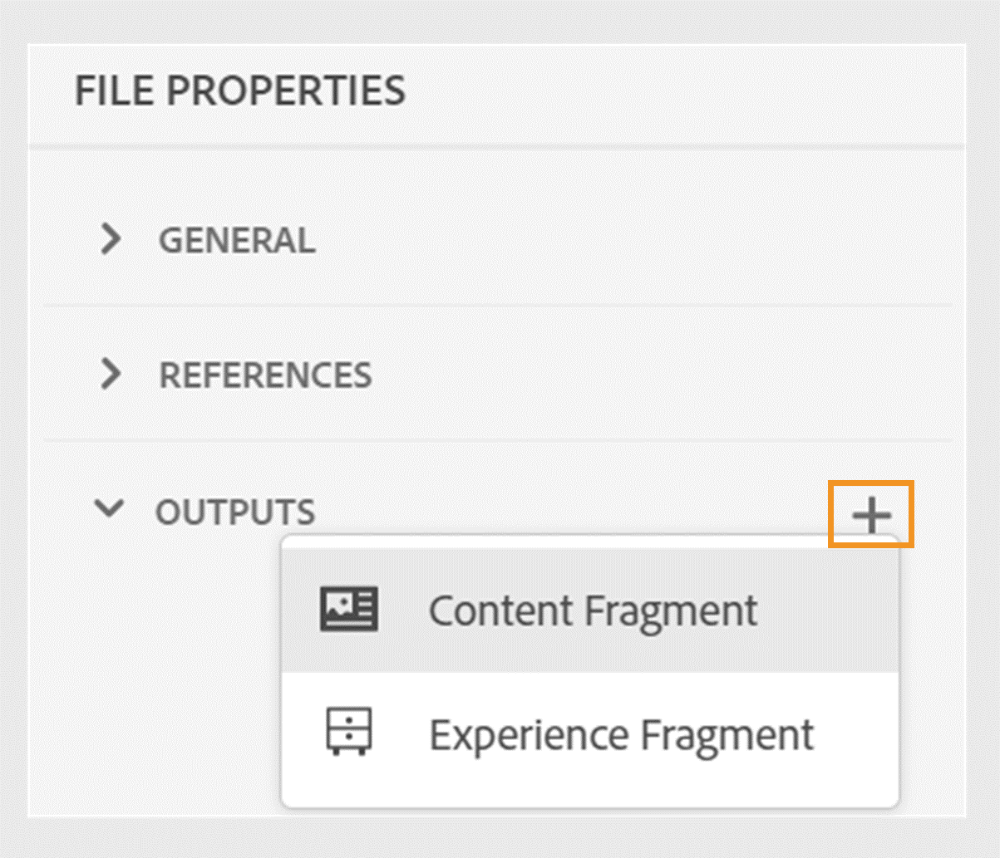
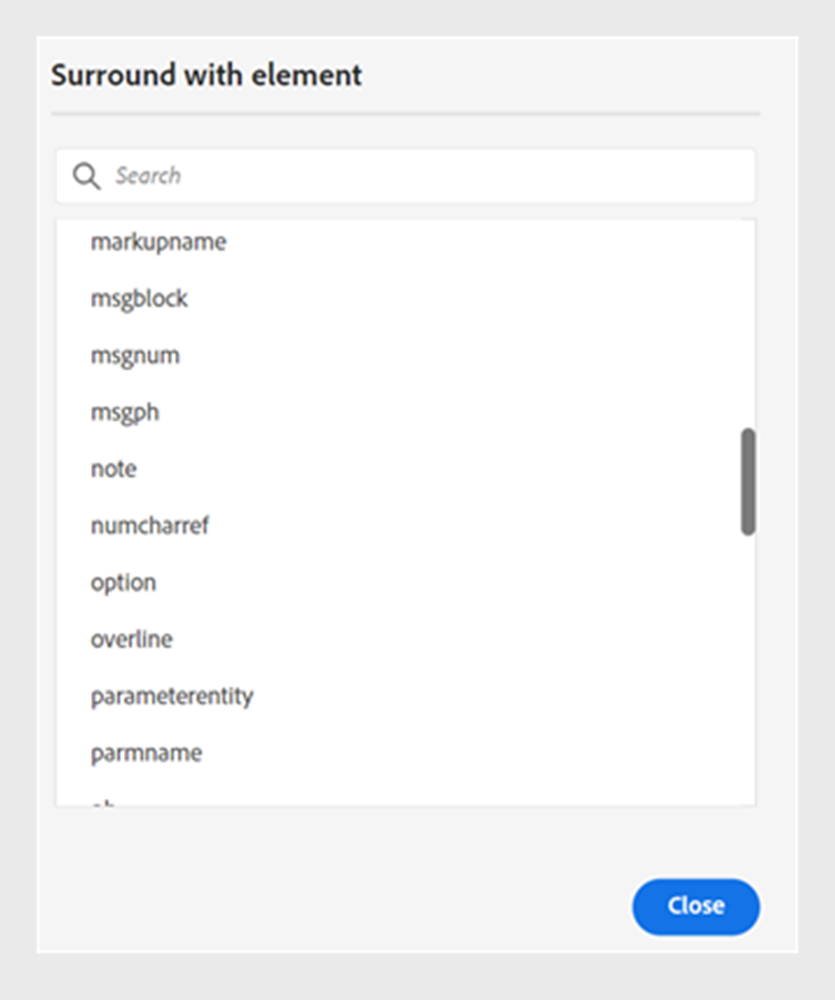

# Nouveautés de la version 2024.06.0

Cet article traite des nouvelles fonctionnalités et des améliorations de la version 2024.06.0 d’Adobe Experience Manager Guides.

Pour connaître la liste des problèmes résolus dans cette version, voir la section [Problèmes résolus dans la version 2024.06.0](fixed-issues-2024-06-0.md).

Découvrez les [instructions de mise à niveau pour la version 2024.06.0](upgrade-instructions-2024-06-0.md).

## Publish d’une rubrique ou de ses éléments dans un fragment d’expérience

Un fragment d’expérience est une unité de contenu modulaire au sein de Adobe Experience Manager qui intègre le contenu et la mise en page. Les fragments d’expérience jouent un rôle essentiel dans la création d’expériences cohérentes et attrayantes, qui peuvent être réutilisées sur plusieurs canaux.

Experience Manager Guides vous permet désormais de publier une rubrique ou ses éléments dans un fragment d’expérience. Vous pouvez créer un mappage JSON entre une rubrique et ses éléments dans un fragment d’expérience. Vous pouvez, par exemple, créer des fragments d’expérience pour les en-têtes ou pieds de page avec des éléments de marque, des bannières promotionnelles, des témoignages de clients et des promotions d’événement.

Pour plus d’informations, voir [Fragments d’expérience Publish](../user-guide/publish-experience-fragment.md).

## Améliorations de la publication de fragments de contenu

Experience Manager Guides fournit également quelques améliorations utiles dans les fragments de contenu :

- Vous pouvez facilement filtrer le contenu avec des conditions lors de la publication sur un fragment de contenu, à l’aide d’un fichier DITAVAL ou d’attributs conditionnels.
- Vous pouvez également publier et afficher les fragments de contenu d’une rubrique à partir de la section **Sorties** dans les **Propriétés du fichier**.

{width="300" align="left"}

Pour plus d’informations, voir [Fragments de contenu Publish](../user-guide/publish-content-fragment.md).

## Possibilité de transmettre des métadonnées des propriétés de fichier de rubrique à la sortie de PDF natif.

Désormais, Experience Manager Guides vous permet d’ajouter les métadonnées des propriétés de fichier d’une rubrique aux mises en page lors de la génération de la sortie du PDF natif. Utilisez cette fonction pour ajouter des métadonnées spécifiques à une rubrique, telles que le titre, les balises et la description, aux mises en page. Vous pouvez également personnaliser votre PDF publié en fonction des métadonnées de la rubrique, par exemple en ajoutant un filigrane à l’arrière-plan de la rubrique en fonction de l’état du document de la rubrique.

 {width="300" align="left"}

*Ajoutez des métadonnées aux champs dans les mises en page de votre page.*

Découvrez comment [ajouter des champs et des métadonnées](../native-pdf/design-page-layout.md#add-fields-metadata) dans une mise en page.

## Sélection de contenu partiel pour les éléments d’opérations

Experience Manager Guides améliore votre expérience de sélection du contenu dans les éléments de l’éditeur web. Vous pouvez facilement sélectionner le contenu parmi différents éléments et effectuer des opérations, comme le mettre en gras, en italique ou souligné. Cette fonctionnalité vous permet d’appliquer ou de supprimer facilement la mise en forme d’un contenu partiellement sélectionné. Vous pouvez également supprimer rapidement le contenu que vous avez sélectionné dans plusieurs éléments. Une fois le contenu supprimé, au besoin, le contenu restant est automatiquement fusionné sous un seul élément valide.

Vous pouvez également sélectionner du contenu partiel sur plusieurs éléments, puis entourer le contenu sous un élément DITA valide.
 {width="300" align="left"}

*Entourez le contenu sélectionné avec un élément valide.*

Globalement, ces améliorations offrent une meilleure expérience et vous aident à améliorer votre efficacité lors de la modification de vos documents.

Pour plus d’informations, voir [Sélection partielle de contenu sur l’élément ](../user-guide/web-editor-edit-topics.md#partial-selection-of-content-across-elements).

## Prise en charge des documents Markdown dans la publication en PDF natif

Experience Manager Guides prend également en charge les documents Markdown dans la publication en mode natif dans PDF. Cette fonctionnalité est pratique et vous aide à générer des PDF pour les fichiers Markdown dans votre mappage DITA. La prise en charge de Markdown dans la publication de PDF natifs vous permet de créer, gérer et partager facilement vos documents.

Pour plus d’informations, consultez la [prise en charge des documents Markdown](../web-editor/native-pdf-web-editor.md#support-for-markdown-documents).

## Amélioration des performances et de l’évolutivité pour les projets de traduction volumineux

La fonction de traduction est plus rapide et plus évolutive que jamais. Il s’accompagne d’une nouvelle architecture qui offre des performances améliorées. Le temps de création du projet est désormais plus rapide qu&#39;auparavant, et les conflits au cours du processus sont quasi inexistants. Cette amélioration des performances vous permet d’accélérer les traductions, ce qui garantit un fonctionnement fluide même pour les projets de traduction volumineux.

Cette amélioration est très bénéfique, car elle améliore la productivité et l’expérience globale.

Découvrez comment [traduire des documents à partir de l’éditeur Web](../user-guide/translate-documents-web-editor.md).
