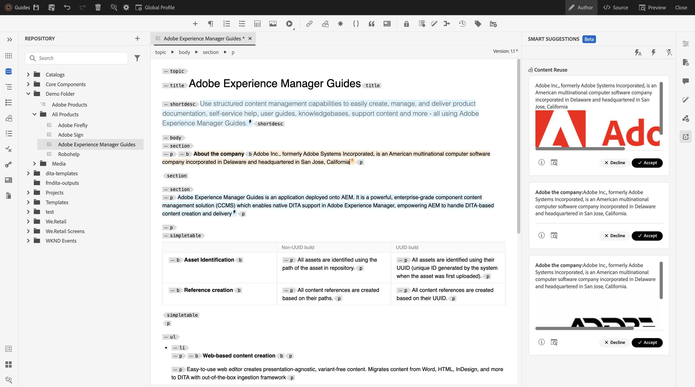
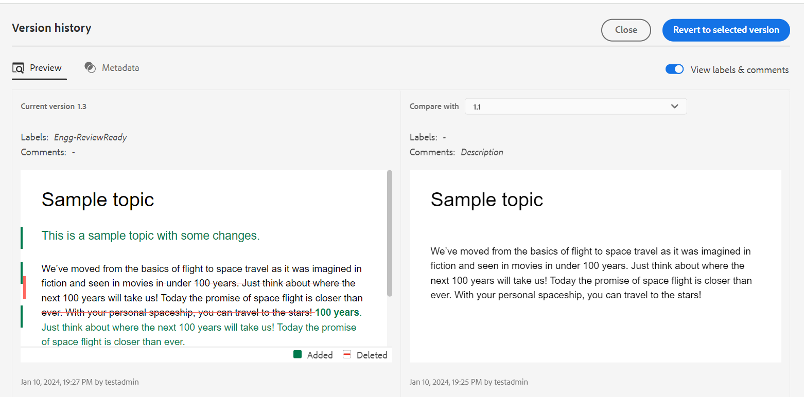
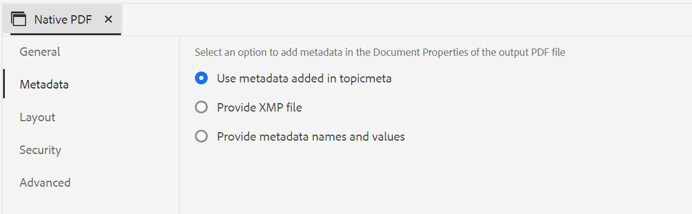

# Nouveautés de la version 2024.2.0

Cet article présente les nouvelles fonctionnalités améliorées de la version 2024.2.0 d’Adobe Experience Manager Guides.

Pour connaître la liste des problèmes résolus dans cette version, voir la section [Problèmes résolus dans la version 2024.2.0](fixed-issues-2024-2-0.md).

Découvrez les [instructions de mise à niveau pour la version 2024.2.0](upgrade-instructions-2024-2-0.md).

## Suggestions intelligentes optimisées par l’IA pour ajouter des références de contenu lors de la création de contenu

Vous pouvez désormais améliorer votre parcours de création avec les suggestions intelligentes, une nouvelle fonctionnalité basée sur l’IA dans l’éditeur web. Lorsque vous créez votre contenu, cette fonctionnalité intelligente fournit des suggestions en temps réel pour les références de contenu, ce qui améliore votre workflow, ajoute de la précision et assure une efficacité inégalée.

Pour garantir l’exactitude et la cohérence de votre contenu, la recherche et les suggestions sont limitées au contenu détenu par votre organisation et correspondent étroitement aux mots-clés que vous recherchez.

Panneau  {width="800"}

*Affichez des suggestions intelligentes pour rechercher et ajouter des références de contenu correspondantes à partir de votre référentiel de contenu.*

Vous pouvez également comparer le contenu actuel à du contenu similaire dans les autres rubriques. Vous pouvez ensuite facilement sélectionner des éléments de contenu de différentes rubriques et les ajouter en tant que références de contenu dans la rubrique active. L’ajout de références de contenu rend les mises à jour plus faciles à gérer, en particulier dans les projets de documentation plus volumineux. Par exemple, vous créez une brochure sur les dernières fonctionnalités de votre produit. Dans ce cas, vous pouvez rapidement ajouter les spécifications mises à jour en tant que références de contenu à partir des documents de fonction associés.

L’utilisation de cette fonctionnalité intelligente réduit l’effort manuel de recherche de contenu associé et vous permet de vous concentrer sur la création de nouveau contenu.  Cela permet également de maintenir la cohérence et de faciliter une meilleure collaboration entre les équipes.

En savoir plus sur les suggestions intelligentes optimisées par [IA pour créer du contenu](../user-guide/authoring-ai-based-smart-suggestions.md).

## Fonctionnalité d’historique des versions remaniée dans l’éditeur web

Experience Manager Guides propose désormais une fonctionnalité améliorée d’historique des versions qui vous permet de comparer les modifications apportées à un document au fil du temps. Dans la nouvelle vue côte à côte, vous pouvez facilement comparer le contenu et les métadonnées de la version actuelle à n’importe quelle version précédente du même document. Vous pouvez également afficher les libellés et les commentaires des versions comparées. En tant qu’administrateur, vous pouvez contrôler les métadonnées de version de la rubrique et leurs valeurs à afficher dans la boîte de dialogue **Historique des versions**.

{width="800"}
*Prévisualiser les modifications dans les différentes versions d&#39;une rubrique.*

Pour en savoir plus sur la description de la fonctionnalité **Historique des versions**, consultez la section [Panneau de gauche](../user-guide/web-editor-features.md#id2051EA0M0HS).

## Amélioration de l’expérience utilisateur dans le panneau Traduction

Le panneau **Traduction** a été amélioré.  Vous pouvez afficher la liste **Langues disponibles** et sélectionner rapidement le paramètre régional dans lequel vous souhaitez traduire votre projet. En une seule sélection, vous pouvez également choisir **Tout sélectionner** pour traduire votre projet dans toutes les langues disponibles.

{width="300"}

*Sélectionnez les paramètres régionaux dans lesquels vous souhaitez traduire votre projet. Sélectionnez la version par défaut, la version de référence ou la dernière version des fichiers à traduire.*

En savoir plus sur la [traduction de contenu](../user-guide/translation.md).

## Amélioration de la logique de recherche dans la boîte de dialogue Insérer un élément

Vous pouvez désormais facilement trouver les éléments dans la boîte de dialogue Insérer un élément .  Vous pouvez saisir une chaîne dans la zone de recherche et obtenir une liste de tous les éléments valides qui commencent par la chaîne saisie.

Par exemple, lorsque vous modifiez un paragraphe et que vous souhaitez insérer un élément, vous pouvez rechercher un caractère « t » pour obtenir
tous les éléments valides commençant par « t ».

{width="300"}

*Saisissez un caractère pour rechercher tous les éléments valides commençant par le caractère.*

Pour plus d’informations, reportez-vous à la description de la fonction **Insérer un élément** dans la section [Panneau de gauche](../user-guide/web-editor-features.md#id2051EA0M0HS).

## Possibilité de fractionner la liste actuelle et de commencer par un nouvel élément de liste au même niveau

Vous pouvez désormais facilement fractionner votre liste dans l’éditeur web. Sélectionnez l’option **Fractionner la liste** dans le menu contextuel d’un élément de liste pour fractionner la liste actuelle. Une nouvelle liste est créée au même niveau, en commençant par l’élément de liste que vous avez sélectionné pour le fractionnement.

{width="300"}

*Sélectionnez l’option pour fractionner la liste actuelle.*

Pour plus d’informations, consultez la description de la fonctionnalité **Insérer une liste** dans la section [Panneau de gauche](../user-guide/web-editor-features.md#id2051EA0M0HS).

## Accès aux propriétés du fichier en mode source de création

Vous pouvez désormais accéder à la fonction **Propriétés du fichier** du panneau de droite dans les quatre modes ou vues : Disposition, Auteur, Source et Aperçu.  Cela vous permet d’afficher les propriétés de votre fichier même lorsque vous basculez entre les différents modes.

Pour plus d’informations, consultez la description de la fonctionnalité **Propriétés du fichier** dans la section [Panneau de droite](../user-guide/web-editor-features.md#id2051EB003YK).

## Possibilité de publier plusieurs paramètres prédéfinis de sortie avec des lignes de base dynamiques en parallèle

Experience Manager permet de créer des niveaux de référence en sélectionnant automatiquement les rubriques en fonction du libellé qui leur est appliqué. Désormais, vous pouvez également publier de manière transparente plusieurs paramètres prédéfinis de sortie avec des lignes de base automatiques du même plan DITA. Il n’est pas nécessaire de publier un seul paramètre prédéfini à la fois, mais vous pouvez facilement publier plusieurs paramètres prédéfinis de sortie en parallèle.

## Améliorations du PDF natif

Les améliorations apportées à la version 2024.2.0 de Native PDF sont les suivantes :

### Transmission de métadonnées de ressources à la sortie PDF

Experience Manager permet désormais de transmettre les propriétés de métadonnées des ressources du plan DITA à la sortie PDF.
À partir du paramètre prédéfini de sortie Native PDF, vous pouvez choisir les métadonnées que vous souhaitez transmettre au processus de publication PDF. Vous pouvez sélectionner les propriétés personnalisées et par défaut.  Les propriétés de métadonnées sélectionnées sont transmises au fichier PDF généré à l’aide de PDF natif.

Cette fonctionnalité est pratique car elle vous permet de conserver la cohérence des propriétés de vos ressources telles que l’auteur, la date de création ou le titre du document. Cela facilite l’organisation, la recherche et la catégorisation de vos documents.

Pour plus d’informations, consultez les paramètres **avancés** dans la sortie [Publier PDF](../web-editor/native-pdf-web-editor.md).

### Utiliser les métadonnées ajoutées dans l’élément `topicmeta` pour la sortie PDF

La fonctionnalité de métadonnées de la publication native de PDF facilite la gestion de contenu et la recherche de fichiers sur Internet.

*Sélectionnez une option pour ajouter et personnaliser des options de métadonnées.*

Experience Manager Guides offre désormais la possibilité d&#39;utiliser les métadonnées que vous avez ajoutées dans l&#39;élément `topicmeta` du plan DITA pour renseigner les champs de métadonnées de la sortie PDF. Cette option est sélectionnée par défaut.

Cette fonctionnalité permet d’améliorer la gestion des documents, d’assurer la cohérence et de rendre vos documents consultables.

Pour en savoir plus, consultez l’onglet **Métadonnées** dans la [Publication d’une sortie PDF](../web-editor/native-pdf-web-editor.md).
