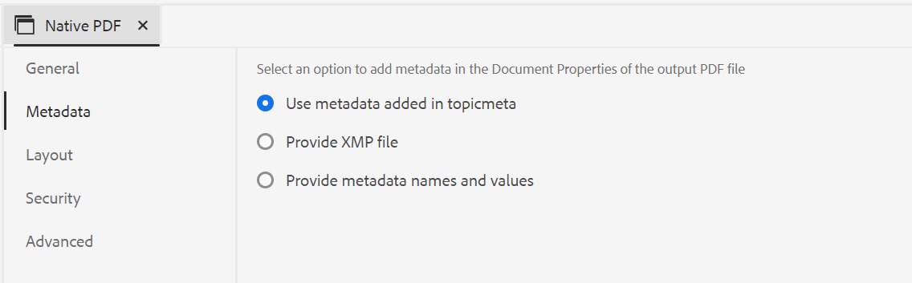

# Nouveautés de la version 2024.2.0

Cet article couvre les nouvelles fonctionnalités et les fonctionnalités améliorées de la version 2024.2.0 des Guides Adobe Experience Manager.

Pour connaître la liste des problèmes résolus dans cette version, consultez [Correction de problèmes dans la version 2024.2.0](fixed-issues-2024-2-0.md).

En savoir plus [instructions de mise à niveau pour la version 2024.2.0](upgrade-instructions-2024-2-0.md).

## Suggestions intelligentes optimisées par l’IA pour ajouter des références de contenu lors de la création de contenu

Vous pouvez désormais améliorer votre parcours de création avec des suggestions intelligentes, une nouvelle fonctionnalité basée sur l’IA de l’éditeur web. Pendant que vous créez votre contenu, cette fonctionnalité intelligente fournit des suggestions en temps réel pour les références de contenu, améliorant votre workflow, ajoutant de la précision et assurant une efficacité inégalée.

Pour que votre contenu reste correct et cohérent, la recherche et les suggestions sont limitées au contenu appartenant à votre organisation et correspondent étroitement aux mots-clés que vous recherchez.

 {width="800" align="left"}

*Afficher des suggestions intelligentes pour rechercher et ajouter des références de contenu correspondantes à partir de votre référentiel de contenu.*

Vous pouvez également comparer le contenu actuel au contenu similaire dans les autres rubriques. Vous pouvez ensuite facilement sélectionner les éléments de contenu de différentes rubriques et les ajouter en tant que références de contenu dans votre rubrique actuelle. L’ajout de références de contenu rend les mises à jour plus faciles à gérer, en particulier dans les projets de documentation plus volumineux. Par exemple, vous créez une brochure présentant les dernières fonctionnalités de votre produit. Dans ce cas, vous pouvez ajouter rapidement les spécifications mises à jour en tant que références de contenu à partir des documents de fonctionnalités associés.

L’utilisation de cette fonctionnalité intelligente réduit l’effort manuel de recherche de contenu associé et vous aide à vous concentrer sur la création de contenu.  Il permet également de maintenir la cohérence et de faciliter une meilleure collaboration entre les équipes.

En savoir plus sur [Suggestions intelligentes optimisées par l’IA pour créer du contenu](../user-guide/authoring-ai-based-smart-suggestions.md).

## Fonctionnalité d’historique des versions restructurée de l’éditeur web

Désormais, Experience Manager Guides fournit une fonctionnalité d’historique des versions améliorée qui vous permet de comparer les modifications apportées à un document au fil du temps. Dans la nouvelle vue côte à côte, vous pouvez facilement comparer le contenu et les métadonnées de la version actuelle à n’importe quelle version précédente du même document. Vous pouvez également afficher les libellés et les commentaires pour les versions comparées. En tant qu’administrateur, vous pouvez contrôler les métadonnées de version de la rubrique et leurs valeurs à afficher dans le **Historique des versions** de la boîte de dialogue

{width="800" align="left"}
*Prévisualisez les modifications dans les différentes versions d’une rubrique.*

En savoir plus sur les **Historique des versions** description des fonctionnalités dans la section [Panneau gauche](../user-guide/web-editor-features.md#id2051EA0M0HS) .

## Amélioration de l’expérience utilisateur dans le panneau Traduction

La variable **Traduction** a été amélioré.  Vous pouvez afficher la **Langues disponibles** répertoriez et sélectionnez rapidement les paramètres régionaux dans lesquels vous souhaitez traduire votre projet. Avec une sélection unique, vous pouvez également choisir **Tout sélectionner** pour traduire votre projet dans toutes les langues disponibles.

{width="300" align="left"}

*Sélectionnez les paramètres régionaux dans lesquels vous souhaitez traduire votre projet. Choisissez la version par défaut, la ligne de base ou la dernière version des fichiers à traduire.*

En savoir plus sur la manière de procéder [traduire le contenu](../user-guide/translation.md).

## Amélioration de la logique de recherche dans la boîte de dialogue Insérer l’élément

Vous pouvez désormais facilement trouver les éléments dans la boîte de dialogue Insérer un élément .  Vous pouvez saisir une chaîne dans la zone de recherche et obtenir la liste de tous les éléments valides qui commencent par la chaîne saisie.

Par exemple, lors de la modification d’un paragraphe que vous souhaitez insérer, vous pouvez rechercher un caractère &quot;t&quot; pour obtenir tous les éléments valides commençant par &quot;t&quot;.

{width="300" align="left"}

*Saisissez un caractère pour rechercher tous les éléments valides commençant par le caractère.*

Pour plus d’informations, voir la **Insérer un élément** description des fonctionnalités dans la section [Panneau gauche](../user-guide/web-editor-features.md#id2051EA0M0HS) .

## Possibilité de fractionner la liste actuelle et de commencer avec un nouvel élément de liste au même niveau

Vous pouvez désormais facilement fractionner votre liste dans l’éditeur Web. Sélectionnez la variable **Diviser la liste** dans le menu contextuel d’un élément de liste pour fractionner la liste active. Une nouvelle liste est créée au même niveau, en commençant par l’élément de liste que vous avez sélectionné pour le partage.

{width="300" align="left"}

*Sélectionnez l’option pour fractionner la liste active.*

Pour plus d’informations, voir la **Insérer une liste** description des fonctionnalités dans la section [Panneau gauche](../user-guide/web-editor-features.md#id2051EA0M0HS) .

## Accès aux propriétés de fichier dans le mode source de création

Vous pouvez maintenant accéder au **Propriétés du fichier** dans les quatre modes ou modes : Disposition, Auteur, Source et Aperçu.  Vous pouvez ainsi afficher les propriétés de votre fichier même lorsque vous passez d’un mode à l’autre.

Pour plus d’informations, voir la **Propriétés du fichier** description des fonctionnalités dans la section [Panneau droit](../user-guide/web-editor-features.md#id2051EB003YK) .

## Possibilité de publier plusieurs paramètres prédéfinis de sortie avec des lignes de base dynamiques en parallèle

Experience Manager fournit la fonctionnalité permettant de créer des lignes de base en sélectionnant automatiquement les rubriques en fonction du libellé qui leur est appliqué. Vous pouvez désormais également publier en toute transparence plusieurs paramètres prédéfinis de sortie avec des lignes de base automatiques d’un même mappage DITA. Vous n’avez pas à publier un seul paramètre prédéfini à la fois, mais vous pouvez facilement publier plusieurs paramètres prédéfinis de sortie en parallèle.

## Améliorations apportées aux PDF natifs

Les améliorations suivantes ont été apportées au PDF natif dans la version 2024.2.0 :

### Transmission des métadonnées des ressources à la sortie du PDF

Experience Manager permet désormais de transmettre les propriétés de métadonnées des ressources du mappage DITA à la sortie du PDF.
Dans le paramètre prédéfini de sortie du PDF natif, vous pouvez choisir les métadonnées à transmettre au processus de publication du PDF. Vous pouvez sélectionner les propriétés personnalisées et par défaut.  Les propriétés de métadonnées sélectionnées sont transmises au fichier de PDF généré à l’aide de l’PDF natif.

Cette fonctionnalité est pratique, car elle vous permet de préserver la cohérence de vos propriétés de ressources telles que l’auteur, la date de création ou le titre du document. Cela facilite l’organisation, la recherche et la catégorisation de vos documents.

Pour plus d’informations, voir la **Avancé** dans le [Sortie du PDF de publication](../web-editor/native-pdf-web-editor.md).

### Utilisation des métadonnées ajoutées dans la variable `topicmeta` élément pour la sortie du PDF

La fonction de métadonnées de la publication en PDF natif permet de gérer le contenu et de rechercher des fichiers sur Internet.

*Sélectionnez une option pour ajouter et personnaliser des options de métadonnées.*

Les guides Maintenant Experience Manager permettent d’utiliser les métadonnées que vous avez ajoutées dans la `topicmeta` élément du mappage DITA pour renseigner les champs de métadonnées de la sortie du PDF. Cette option est sélectionnée par défaut.

Cette fonctionnalité permet une meilleure gestion des documents, garantit la cohérence et rend vos documents consultables.

Pour en savoir plus, consultez la **Métadonnées** dans le [Sortie du PDF de publication](../web-editor/native-pdf-web-editor.md).
