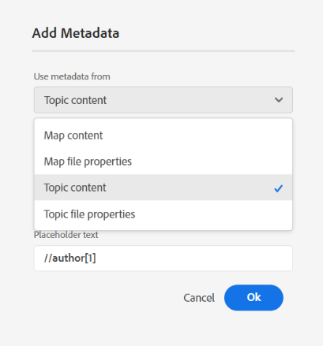

# Nouveautés de la version 2025.02.0 (février 2025)

Cet article présente les nouvelles fonctionnalités améliorées introduites dans la version 2025.02.0 d’Adobe Experience Manager Guides as a Cloud Service.

## Redéfinition de l’interface utilisateur de Experience Manager Guides pour une productivité et une expérience améliorées

Adobe Experience Manager Guides bénéficie désormais d’une conception repensée et de fonctionnalités améliorées pour vous aider à travailler plus rapidement et plus efficacement que jamais auparavant. La nouvelle interface utilisateur offre une expérience utilisateur intuitive et améliorée, avec une toute nouvelle page d’accueil, une barre d’outils d’éditeur plus propre et plus organisée, une console de mappage dédiée et des fonctionnalités améliorées.

Les principaux points forts sont les suivants :

- **Présentation de la page d’accueil** : Experience Manager Guides dispose désormais d’une page d’accueil qui offre une expérience d’écran de bienvenue intuitive, y compris un aperçu rapide des fichiers auxquels vous avez récemment accédé, des collections, etc.

  Pour plus d’informations, consultez l’expérience de la page d’accueil d’Adobe Experience Manager Guides [&#128279;](../user-guide/intro-home-page.md).

  {width="800" align="left"}

- **Nouvelle expérience d’éditeur** : à présent, découvrez l’éditeur sous un nouvel aspect. L’interface repensée de l’éditeur d’comporte une barre d’outils plus claire et plus organisée, une navigation transparente et une expérience intuitive globale permettant de créer des documents plus rapidement et plus efficacement.

  Découvrez [les fonctionnalités de l’éditeur](../user-guide/web-editor-features.md).

  {width="800" align="left"}

- **Console de mappage dédiée** : présentation de la console de mappage, une console dédiée dans laquelle toutes les fonctionnalités de gestion et de publication des mappages sont regroupées. Vous disposez désormais d’options pour générer une sortie, traduire le contenu, créer des rapports, etc., le tout dans une seule interface.

  En savoir plus sur [la gestion et la publication des cartes](../user-guide/map-console-overview.md).

  {width="800" align="left"}

## Intégration à Adobe Workfront pour des fonctionnalités de gestion du travail robustes

Experience Manager Guides s’intègre désormais de manière transparente à Adobe Workfront, ce qui vous permet d’accéder à des fonctionnalités de gestion de projet fiables en plus des fonctionnalités principales de Experience Manager Guides CCMS.

Grâce à cette intégration, vous pouvez créer et gérer des tâches Adobe Workfront directement depuis Experience Manager Guides. Par exemple, en tant qu&#39;auteur, vous pouvez créer une tâche de révision (avec une ou plusieurs rubriques ou cartes DITA ajoutées) directement dans l&#39;interface de Experience Manager Guides et l&#39;affecter à un réviseur. En tant que réviseur/réviseuse, vous pouvez travailler sur les tâches affectées dans l’interface utilisateur de révision de Experience Manager Guides et les renvoyer à l’auteur avec des commentaires. De même, vous pouvez créer une tâche de publication et de traduction, puis l’affecter aux utilisateurs qui doivent travailler dessus.

L’intégration vous permet également de surveiller vos files d’attente de travail, en vous assurant que vous restez organisé et au courant de toutes vos tâches (tâches affectées). Il permet également aux chefs de projet d’exploiter la puissance d’Adobe Workfront pour une gestion de projet approfondie dans Experience Manager Guides.

Pour plus d&#39;informations, consultez la section Intégration de [Workfront](../user-guide/workfront-integration.md).

{width="800" align="left"}

## Assistant AI (Beta) avec création intelligente et fonctionnalités d’aide pour une productivité améliorée

Bénéficiez désormais d’une productivité améliorée grâce à la création intelligente optimisée par l’IA et aux fonctionnalités d’aide de Experience Manager Guides. Avec l’assistant AI, améliorez l’efficacité grâce aux fonctionnalités de création intelligente et aux suggestions intelligentes de réutilisation du contenu du référentiel existant. Utilisez l’aide dynamique pour trouver rapidement des réponses pertinentes à vos requêtes liées aux fonctionnalités de Experience Manager Guides, à ses workflows, etc.

Pour plus d’informations, voir [Assistant AI dans Experience Manager Guides](../user-guide/ai-assistant.md).

{width="300" align="left"}

## Nouveau moteur de publication AEM Sites plus rapide et plus évolutif

Effectuez une publication plus rapide et évolutive sur AEM Sites avec le tout nouveau moteur de publication, optimisé avec le mappage des composants composites pour accélérer la création et le rendu des pages. Il est disponible avec de nouveaux modèles modifiables prêts à l’emploi qui peuvent être personnalisés en fonction de vos besoins à l’aide de l’éditeur de modèles d’AEM. Les modèles utilisent une combinaison de composants principaux de gestion de contenu web et de composants guides spécialisés afin de garantir aux utilisateurs finaux une expérience optimale sur vos pages AEM Sites. Vous pouvez également personnaliser vos modèles existants pour tirer parti de la puissance de ce nouveau moteur de publication.

En savoir plus sur la [publication AEM Sites](../user-guide/generate-output-aem-site-web-editor.md).

{width="500" align="left"}

## Publiez du contenu autonome de manière transparente sur AEM Sites avec la publication sur une seule rubrique.

Présentation de la publication sur une seule rubrique dans les pages AEM Sites. Vous pouvez ainsi publier des rubriques individuelles directement sur les pages AEM Sites sans avoir à publier une carte complète.  Cela simplifie le processus de publication et le rend plus efficace lorsque vous utilisez du contenu autonome, tel que du contenu marketing, des bulletins techniques ou tout autre contenu autonome. Il simplifie également la maintenance du contenu en éliminant la nécessité de créer des cartes pour publier des sujets uniques.

Pour plus d’informations, consultez [Publication de pages AEM Sites](../user-guide/publish-aem-sites.md).

{width="500" align="left"}

## Le tout nouvel éditeur Markdown pour une expérience de création riche

Découvrez désormais un moyen plus propre, plus efficace et plus puissant de créer des rubriques Markdown. Experience Manager Guides présente une nouvelle interface d’éditeur Markdown avec une barre d’outils bien organisée et des fonctionnalités avancées, notamment une vue **côte à côte** pour créer et prévisualiser du contenu en même temps. Il permet également la publication transparente des rubriques Markdown qui font partie d’une carte, sur plusieurs canaux.

Pour plus d’informations, voir [Création Markdown](../user-guide/web-editor-markdown-topic.md).

{width="800" align="left"}

## Améliorations de l’éditeur

Les améliorations suivantes ont été apportées à l’éditeur dans le cadre de la nouvelle version :

**Améliorations apportées à l’insertion de tables**

- Possibilité de configurer les valeurs par défaut des lignes d’en-tête, des lignes de corps et des colonnes du tableau ou de la boîte de dialogue d’insertion de tableau simple.
- Possibilité de configurer les paramètres du tableau pour coller les tableaux copiés à partir de sources externes en tant que tableau simple ou tableau.

  Pour plus d’informations, consultez la section Tableaux dans [Découvrir les fonctionnalités de l’éditeur](../user-guide/web-editor-features.md#content-insertion-options).

**Amélioration de la fonction de nom convivial pour les éléments DITA**

La fonctionnalité de nom convivial pour les éléments DITA a été améliorée. Désormais, les valeurs énumérées par défaut sont conservées lorsqu’un nom convivial est attribué à un élément et le nom mis à jour est reflété dans les chemins de navigation, les propriétés de contenu, le panneau Contenu réutilisable, le panneau Glossaire et d’autres emplacements pertinents.

**Expérience améliorée pour les recherches filtrées**

La limite d’affichage des ressources pour les résultats de recherche filtrés dans le référentiel Adobe Experience Manager Guides a été augmentée. Les résultats de la recherche renvoient désormais toutes les ressources ou tous les fichiers pertinents qui correspondent aux critères de recherche. Vous pouvez faire défiler la liste pour charger d’autres résultats. Il n’est ainsi plus nécessaire d’effectuer des recherches répétées pour localiser les ressources requises.

**Texte secondaire des images désormais ajouté en tant qu’élément**

Les images utilisent désormais l’élément `<alt>` pour le texte secondaire, conformément aux dernières normes DITA. L&#39;utilisation de l&#39;attribut `@alt` pour le texte secondaire est obsolète mais reste prise en charge dans les versions antérieures de DITA.

**Personnalisation des références croisées dans la barre d’outils de l’éditeur**

Créez maintenant un bouton de barre d’outils personnalisé pour **Référence croisée** afin d’accéder directement à l’une des options de menu. Par exemple, vous pouvez configurer cette option pour accéder directement à un lien web, un lien d’e-mail, une référence de fichier ou toute autre option disponible en fonction des besoins.

Pour plus d’informations, consultez [personnalisation de la barre d’outils et de la barre supérieure](../guides-ui-extensions/customisations/toolbar-topbar.md).

## Améliorations de la révision

Les améliorations de révision suivantes ont été apportées à la version 2025.02.0 :

- Désormais, lors de la création d’une tâche de révision, vous pouvez saisir le nom d’un projet pour le localiser et le sélectionner rapidement dans la liste déroulante Projet. Cette amélioration supprime la nécessité de faire défiler de longues listes de projets, ce qui rend plus rapide et plus efficace l’affectation de tâches de révision, en particulier lors de la gestion de plusieurs projets.

- Dans l’interface utilisateur Éditeur et révision, la zone de révision **Réponse** prend désormais en charge les entrées multiligne. Vous pouvez utiliser **Maj**+**Entrée** pour accéder à la ligne suivante. Vous pouvez également développer la zone de commentaire lors de la rédaction du commentaire.

  Pour plus d’informations, voir [Rubriques de révision](../user-guide/review-topics.md).

- Désormais, les auteurs et autrices peuvent accéder aux commentaires de révision dans l’éditeur même lorsque la tâche de révision est marquée comme fermée. Grâce aux dernières améliorations, le panneau de révision propose des tâches de révision actives et fermées pour chaque projet dans l’éditeur. Lorsque vous sélectionnez une tâche de révision fermée, les commentaires correspondants s’affichent dans le panneau Commentaires à droite, garantissant un accès continu aux commentaires de révision importants même après la fermeture d’une tâche.

  Pour plus d’informations, consultez la section Révision de la [Découvrir les fonctionnalités de l’éditeur](../user-guide/web-editor-features.md).

## Améliorations de la publication

Les améliorations de publication suivantes ont été apportées dans le cadre de la nouvelle version :

**Améliorations apportées au PDF natif**

- Possibilité d’inclure les métadonnées de l’élément de `prolog` d’une rubrique, telles que les droits d’auteur, l’auteur et d’autres détails, dans les mises en page lors de la génération de la sortie Native PDF. Cela permet de s’assurer que les fichiers PDF générés sont plus détaillés et fournissent un contexte essentiel, ce qui les rend plus informatifs pour le lecteur.

  Pour plus d’informations, consultez la section [ Ajouter des champs et des métadonnées dans la mise en page ](../native-pdf/design-page-layout.md#add-fields-and-metadata-add-fields-metadata).

  {width="300" align="left"}

- Ajout d’une option permettant d’activer ou de désactiver le prétraitement DITA-OT pour la sortie native de PDF. Activez cette option si votre contenu nécessite une normalisation basée sur DITA-OT ou des modules externes DITA-OT personnalisés pendant le traitement. Vous pouvez ainsi mieux contrôler le traitement du contenu pour la génération PDF. Par défaut, le paramètre est défini sur **Activé**.

  Pour plus d’informations, consultez la section [ Utilisation du paramètre prédéfini de sortie PDF ](../user-guide/generate-output-pdf.md)

  {width="500" align="left"}

- Les paramètres d’impression pour la génération de sortie native de PDF ont été déplacés du paramètre **Modèles** vers le **Paramètre prédéfini de sortie native de PDF** pour une meilleure convivialité. Vous pouvez désormais utiliser le même modèle pour les PDF en ligne et d’impression avec différents paramètres d’impression, tels que le profil colorimétrique.

  Pour plus d’informations, consultez [Paramètre prédéfini de sortie PDF natif](../web-editor/native-pdf-web-editor.md)

- Possibilité d’ajouter un signet pour la page de la table des matières dans la sortie native de PDF pour une navigation transparente sur les pages, en particulier dans les PDF longs.

  Pour plus d’informations, consultez la section [ Ajouter un signet personnalisé dans la sortie PDF ](../native-pdf/add-custom-bookmark.md).

## Améliorations de la gestion de contenu

Les améliorations suivantes ont été apportées à la gestion de contenu dans le cadre de la nouvelle version :

**Champs de métadonnées personnalisés dans les rapports**

Cette fonctionnalité vous permet de configurer des champs de métadonnées personnalisés pour les rapports via **Paramètres**. Une fois configurés, vous pouvez afficher ces champs sous **Colonnes** dans le panneau Filtre des rapports, où vous pouvez les sélectionner ou les désélectionner pour contrôler leur visibilité.

Pour plus d&#39;informations, reportez-vous au rapport [DITA map](../user-guide/reports-web-editor.md) de Map Console.

**bouton Actualiser dans l’interface utilisateur de traduction**

Ajout d’un bouton Actualiser dans l’interface utilisateur de traduction qui vous permet d’actualiser le tableau de bord de la traduction avec les fichiers et le statut mis à jour.

**Amélioration du workflow de post-traitement des ressources**

La prise en charge du post-traitement des ressources est assurée via l’API REST ainsi que l’API SDK. Désormais, l’événement de traitement des ressources est déclenché et peut être écouté pour définir d’autres workflows.

Pour plus d’informations, consultez la section [Gestionnaire d’événements de post-traitement](../api-reference/post-process-event.md).

## Fonctionnalités obsolètes

**Génération rapide**

Experience Manager Guides ne prend plus en charge la fonction **Génération rapide** permettant de générer une sortie directement à partir de la vue Référentiel ou Carte.

Cette fonctionnalité a été supprimée des panneaux d’affichage Référentiel et Carte . Il est recommandé d’utiliser la **console Map** pour toutes les actions liées à la gestion des cartes et à la publication.

Pour plus d’informations, consultez la section [Gestion et publication des cartes](../user-guide/map-console-overview.md).

**Transmettre des arguments de métadonnées de carte racine à la ligne de commande DITA-OT**

La possibilité de transmettre des arguments de métadonnées de carte racine par le biais de la ligne de commande DITA-OT a été abandonnée dans le cadre de la version. Désormais, il est recommandé d’utiliser le champ **Propriété de fichier** ou **Métadonnées** dans le préréglage pour transmettre les métadonnées DITA-OT requises.

Pour continuer à transmettre les métadonnées dans la ligne de commande DITA-OT, vous devez mettre à jour le `pass.metadata.args.cmd.line` dans le `Config.Manager` .

Pour plus d’informations, consultez la section [Configurer les paramètres de génération de sortie](../cs-install-guide/conf-output-generation.md#configure-the-dita-ot-command-line-argument-field-to-accept-root-map-metadata).

