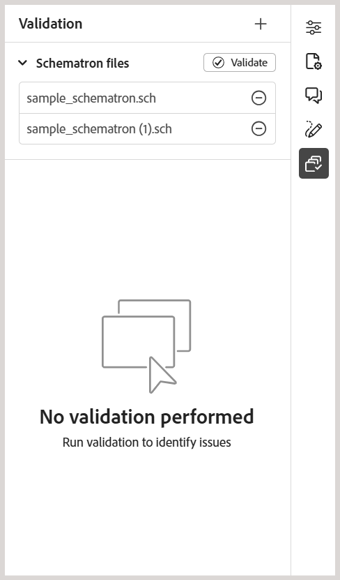

# Nouveautés de la version 2026.03.0 (mars 2026)

Cet article présente les nouvelles fonctionnalités améliorées introduites dans la version 2026.03.0 d’Adobe Experience Manager Guides as a Cloud Service.

Pour connaître la liste des problèmes résolus dans cette version, voir la section [Problèmes résolus dans la version 2026.03.0](fixed-issues-2026-03-0.md).

Découvrez les [instructions de mise à niveau pour la version 2026.03.0](../release-info/upgrade-instructions-2026-03-0.md).

## Présentation de la formation produit et du contenu d’apprentissage dans Experience Manager Guides

La fonction de contenu **Formation et apprentissage du produit** de Experience Manager Guides permet aux équipes de formation et aux concepteurs d’instructions de créer des cours en ligne interactifs directement à partir de l’interface de Experience Manager Guides.

Grâce à la création basée sur des modèles, aux composants interactifs du cours et à la prise en charge des évaluations, les équipes peuvent développer un contenu de formation de haute qualité aligné sur leurs objectifs organisationnels.

>[!NOTE]
> 
> La fonctionnalité de contenu de formation et d’apprentissage du produit reste désactivée par défaut pour toutes les instances de Experience Manager Guides as a Cloud Service. Les administrateurs peuvent activer cette fonctionnalité au niveau du profil de dossier depuis **Paramètres** > **Général**.

Les principales fonctionnalités sont les suivantes :

- Gestion centralisée du contenu d’apprentissage
- Création pilotée par les modèles
- Prise en charge de la réutilisation du contenu
- Création et gestion des évaluations
- Workflows de révision web
- Gestion de la traduction de pointe
- Publication multicanal à l’aide de formats de sortie SCORM et PDF prêts à l’emploi

Pour plus d’informations, consultez les sections [Guide de prise en main](../learning-content/course-overview.md) et [Guide de configuration](../lc-config-guide/introduction.md).

## Améliorations de l’éditeur

Les améliorations suivantes ont été apportées à l’éditeur dans le cadre de cette version :

### Améliorations apportées au panneau de validation du schéma

Les améliorations suivantes ont été apportées à l’interface utilisateur de Schematron pour améliorer la clarté, la convivialité et les résultats de validation :

- Dans le panneau Validation, un message d’état vide s’affiche lorsqu’aucun fichier Schematron n’est ajouté, offrant une meilleure clarté et orientation pour les étapes suivantes.

  {width="350" align="left"}
- Lorsque plusieurs fichiers Schematron sont ajoutés, ils sont organisés sous un accordéon consolidé, offrant une meilleure visibilité sur les fichiers Schematron configurés.

  {width="350" align="left"}
- En fonction de l’attribut de rôle défini dans le fichier Schematron, les résultats de validation sont désormais classés comme suit : `Fatal`, `Error`, `Warn` ou `Info`. Chaque catégorie comprend un nombre visible ainsi qu’une info-bulle contextuelle pour une interprétation plus claire.

  {width="350" align="left"}

Pour plus d’informations sur l’utilisation des fichiers Schematron dans Experience Manager Guides, consultez la section [Prise en charge des fichiers Schematron](../user-guide/support-schematron-file.md).

### Les copies de langue de traduction sont désormais disponibles dans le panneau de droite de l’interface de l’éditeur

Une nouvelle section **Traductions** est désormais disponible dans le panneau de droite sous *Propriétés du fichier* dans l’éditeur. Cette section permet d’accéder directement à toutes les copies de langue disponibles pour la ressource actuellement ouverte (carte, rubrique, image, etc.). Vous n’avez plus besoin d’accéder à l’interface utilisateur d’Assets pour afficher ou accéder à ces copies de langue.

{width="350" align="left"}

Pour chaque copie de langue, vous pouvez pointer sur le fichier pour localiser son chemin d’accès dans le référentiel ou simplement le sélectionner pour l’ouvrir dans l’éditeur. Outre l’ouverture de fichiers, vous pouvez également effectuer de nombreuses actions à l’aide du menu **Options**. Vous pouvez effectuer entre autres les actions suivantes : Modifier, Prévisualiser, Copier l’UUID, Copier le chemin d’accès, Ajouter aux collections et Propriétés.

Pour plus d’informations, consultez [Panneau de droite dans l’éditeur](../user-guide/web-editor-right-panel.md#file-properties).

### Rechercher des citations dans tous les champs du journal

Désormais, vous pouvez rechercher des citations dans tous les champs du Journal, par exemple *Titre*, *Titre du Journal*, *Auteur*, *Année*, *Volume*, *Number* et *Pages*, à l’aide de l’option **Any field** dans la boîte de dialogue **Ajouter une citation**. La recherche renvoie la citation correspondante la plus proche en fonction du texte saisi.

Pour plus d’informations sur l’ajout de citations dans Experience Manager Guides, consultez la section [ Ajouter et gérer des citations dans votre contenu ](../user-guide/web-editor-apply-citations.md).

{width="350" align="left"}

## Améliorations de la révision

Les améliorations suivantes sont disponibles pour la fonction Révision dans cette version :

- L’affectation d’un réviseur à une tâche de révision dépend désormais d’une sélection de projet actif. Le champ **Affecter à** de la page *Créer une tâche de révision* reste désactivé jusqu’à ce qu’un projet actif soit sélectionné. Une fois un projet sélectionné, le champ **Affecter à** est activé et répertorie uniquement les utilisateurs et les groupes d’utilisateurs associés à ce projet. Cela permet de s’assurer que les tâches de révision sont affectées uniquement à des membres valides du projet et empêche toute sélection involontaire du réviseur.

  

- Le champ **Affecter à** prend désormais en charge la recherche à saisie semi-automatique, ce qui vous permet de localiser rapidement les utilisateurs ou les groupes d’utilisateurs en saisissant du texte.

Grâce à ces améliorations, la sélection des réviseurs et réviseuses est plus précise, plus efficace et mieux alignée sur les workflows de révision spécifiques aux projets.

Pour plus d’informations, voir [Envoyer les rubriques pour révision](../user-guide/review-send-topics-for-review.md).

## Améliorations de la gestion des ressources

Cette version apporte les améliorations suivantes à la gestion des ressources :

### Utilisez l’option Aplatir la hiérarchie de fichiers pour télécharger des cartes avec les noms de fichiers d’origine et les métadonnées associées

Désormais, vous pouvez utiliser l’option Aplatir la hiérarchie de fichiers pour télécharger une carte avec son nom de fichier d’origine. En outre, le package téléchargé comprend un fichier `metadata.json`, ce qui rend les métadonnées associées facilement accessibles et réutilisables en dehors de Experience Manager Guides.

Pour plus d’informations sur le téléchargement de fichiers dans Experience Manager Guides, consultez [Télécharger des fichiers](../user-guide/authoring-download-assets.md).

### Utilisation d’une expression régulière pour activer ou désactiver le post-traitement

Vous pouvez désormais utiliser une expression régulière pour activer ou désactiver le post-traitement pour les dossiers. Cette amélioration permet aux administrateurs de définir des règles de post-traitement qui s’appliquent à plusieurs dossiers ou à des hiérarchies de dossiers entières à l’aide d’une seule configuration, au lieu de spécifier des chemins d’accès aux dossiers individuels.

Pour plus d’informations, consultez [Utilisation d’une expression régulière pour activer ou désactiver le post-traitement](../cs-install-guide/conf-folder-post-processing.md#use-regex-to-enable-or-disable-post-processing).
