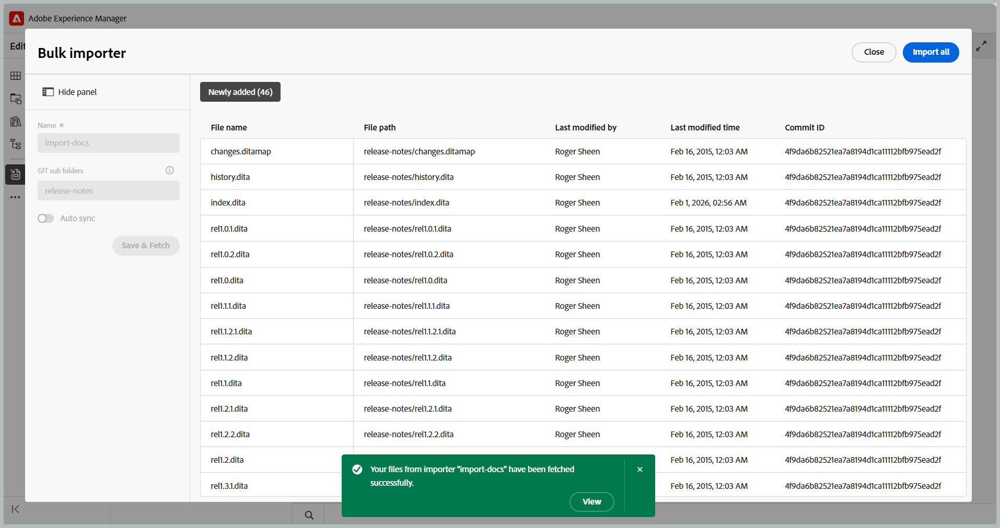

# Nouveautés de la version 2026.08.0 (août 2026)

Cet article présente les nouvelles fonctionnalités améliorées introduites dans la version 2026.08.0 d’Adobe Experience Manager Guides as a Cloud Service.

Pour obtenir la liste des problèmes résolus dans cette version, voir [Problèmes résolus dans la version 2026.08.0](fixed-issues-2026-08-0.md).

Découvrez les [instructions de mise à niveau pour la version 2026.08.0](../release-info/upgrade-instructions-2026-08-0.md).

## Nouvelle collection de cartes pour la gestion des cartes et la publication de sorties

La nouvelle collecte de cartes rassemble les activités de gestion de la collecte de cartes et de génération de sortie dans une seule interface. À partir d’un emplacement, vous pouvez gérer les mappages et les paramètres prédéfinis, générer et publier des sorties, afficher l’historique de génération et de publication, etc. En rassemblant les tâches de publication associées, il est plus facile d&#39;utiliser des collections de cartes et de suivre l&#39;activité de sortie sur plusieurs cartes et leurs langues associées. Cette mise à jour résout également les problèmes de performances rencontrés avec les collections de cartes volumineuses.

Pour plus d’informations, consultez [Utilisation d’une nouvelle collection de cartes pour la génération de sortie](../user-guide/generate-output-use-new-map-collection-output-generation.md).

## Récupérer du contenu des référentiels Git à l’aide du connecteur Git

Experience Manager Guides propose désormais le connecteur Git, qui permet d’importer du contenu des référentiels Git vers Experience Manager Guides. Une fois le contenu importé, les équipes peuvent continuer à utiliser Experience Manager Guides pour leurs workflows de création, de révision, de traduction et de publication.

Pour maintenir à jour le contenu importé, le connecteur Git prend également en charge la récupération du contenu du référentiel source pour importer des mises à jour. Il comprend la détection intelligente des modifications pour identifier les mises à jour de contenu, conserve les GUID de rubrique et de mappage pendant les opérations d’importation et de récupération, et fournit des fonctionnalités de résolution de conflit pour aider à gérer les différences entre le contenu du référentiel et le contenu déjà disponible dans Experience Manager Guides. Pour plus d’informations, consultez la section [Importer du contenu à l’aide du connecteur Git](../user-guide/web-editor-git-connector.md).

## Experience Manager Guides ajoute la prise en charge de MCP

Experience Manager Guides prend désormais en charge le protocole MCP (Model Context Protocol). Vous pouvez connecter vos outils d’IA tels que Claude, Cursor, etc. aux guides sans avoir besoin de travail personnalisé. Grâce à un seul point d’entrée MCP, dans cette version, les utilisateurs authentifiés peuvent utiliser Guides en tant que système découplé et gérer les rubriques et les cartes, créer et exporter des lignes de base et générer des rapports, tout en utilisant leurs autorisations AEM existantes. Cela permet aux équipes de documentation de travailler plus efficacement à l’aide des applications et des agents d’IA.

Pour plus d’informations, consultez la section [Utilisation du serveur Adobe Experience Manager Guides MCP](../install-conf-guide/conf-aem-guides-mcp.md).

## Améliorations de la révision

### Déléguer une tâche de révision à un autre réviseur

Les réviseurs et réviseuses peuvent désormais recommander à un autre utilisateur d’intervenir dans une révision avant qu’elle ne revienne à l’auteur, à l’aide de la nouvelle option **Déléguer** disponible pour une tâche de révision. Cela s’avère utile lorsqu’une partie du contenu ne relève pas de l’expertise de l’évaluateur ou lorsqu’un deuxième avis est nécessaire avant de terminer l’évaluation, sans avoir à acheminer la demande par l’intermédiaire d’un administrateur de projet.

Sélectionner l’option Déléguer envoie la recommandation à l’auteur, qui décide d’ajouter ou non le réviseur recommandé à la tâche. En savoir plus sur [Déléguer une tâche de révision à un autre réviseur](../user-guide/review-complete-review-tasks.md#delegate-a-review-task-to-another-reviewer).

{width="350"}

### La description de la tâche est désormais visible dans l’interface utilisateur de révision

Les réviseurs et réviseuses peuvent désormais afficher la description de la tâche directement dans l’expérience de révision, au lieu de se fier uniquement à l’e-mail de notification. La description entrée lors de la création d’une tâche de révision s’affiche désormais dans la boîte de dialogue Détails de la révision, accessible par le biais de l’icône **Infos** dans l’interface utilisateur de révision et l’interface de l’éditeur.

Les réviseurs et réviseuses ont ainsi accès aux instructions, à la portée et aux domaines d’intérêt tout au long de la révision. Pour plus d’informations, voir [Envoyer les rubriques pour révision](../user-guide/review-send-topics-for-review.md).

{width="350"}

### Identification de l’utilisateur dans la liste de balisage lors de la révision

Lors du balisage des utilisateurs dans les commentaires ou réponses de révision, la liste déroulante de balisage affiche désormais l’adresse e-mail de chaque utilisateur avec son identifiant utilisateur. Cela facilite l’identification et la sélection du réviseur ou de la réviseuse approprié(e), en particulier dans les grandes organisations où les noms d’affichage peuvent être ambigus.

Si aucune adresse e-mail n’est disponible, l’ID utilisateur s’affiche à la place. Pour plus d’informations sur l’utilisation de l’interface utilisateur de révision, voir [Tag task users in a comment](../user-guide/review-topics.md#tag-task-users-in-a-comment).

### Afficher toutes les tâches de révision pour une rubrique

Les auteurs peuvent désormais afficher toutes les tâches de révision, ouvertes ou fermées, associées à la rubrique actuellement ouverte directement à partir du panneau Commentaires. Une liste déroulante répertorie toutes les tâches de révision dont la rubrique fait partie, ainsi que l’état et le projet de chaque tâche, et vous permet de basculer entre elles pour afficher des commentaires sans quitter la rubrique ou changer de projet de révision. En savoir plus sur [Afficher toutes les tâches de révision d’une rubrique](../user-guide/review-address-review-comments.md#view-all-review-tasks-for-a-topic).

{width="350"}

### Expérience de révision améliorée avec les conditions DITAVAL

Lorsqu’une tâche de révision comprend un ou plusieurs fichiers DITAVAL joints, le panneau Conditions présente désormais chaque condition sous la forme d’un bouton bascule, prédéfini pour correspondre au(x) fichier(s) DITAVAL joint(s), de sorte que les réviseurs voient le contenu comme l’initiateur de la révision l’avait prévu. Si vous désactivez cette option, ce contenu est masqué dans la révision et restauré.

Pour plus d’informations, consultez [Panneau Conditions avec des conditions basées sur DITAVAL](../user-guide/review-topics.md#conditions-panel-with-ditaval-based-conditions).

{width="350"}

## Améliorations de la publication

### Utilisation de paramètres prédéfinis de sortie en tant que modèles

Les administrateurs peuvent désormais désigner des paramètres prédéfinis de sortie en tant que modèles, en appliquant des configurations normalisées à tous les mappages dans un profil de dossier avec une seule action via la console Mappage. Lorsqu’un modèle est appliqué, le système affiche le nombre de mappages affectés, donnant ainsi aux administrateurs et administratrices une visibilité complète avant le déploiement. Pour préserver la cohérence, les paramètres prédéfinis de modèle ne peuvent être modifiés que par les administrateurs, et la génération de sortie est désactivée pour les paramètres prédéfinis de modèle (sauf si la sortie a déjà été générée avant de définir les paramètres prédéfinis comme modèle).

Pour plus d’informations, consultez [Configuration des paramètres prédéfinis de modèle pour la génération de sortie](../install-conf-guide/template-presets-output-generation.md).

### Valider la qualité du contenu avec le contrôle de l’intégrité du contenu

Le contrôle de l&#39;intégrité du contenu permet de valider la qualité du contenu dans les plans DITA avant publication. Les administrateurs peuvent créer des paramètres prédéfinis de contrôle de l’intégrité réutilisables en combinant les contrôles pour les liens rompus, les identifiants en double et la validation du schéma.

Les auteurs peuvent exécuter un contrôle d&#39;intégrité sur un plan DITA ou sur une ligne de base sélectionnée afin de générer un rapport consolidé des problèmes sur les rubriques et plans associés. Pour plus d’informations, consultez [Exécuter le contrôle d’intégrité sur une carte](../user-guide/map-editor-other-features.md#run-health-check-on-a-map).

## Améliorations apportées à la traduction

### Spécifier un chemin d’accès au dossier personnalisé pour les projets de traduction

Lors de l’envoi de contenu pour la traduction, vous pouvez désormais sélectionner le dossier dans lequel un nouveau projet de traduction est créé, au lieu de tous les projets par défaut à un seul emplacement sous `/content/projects`. Cela permet d’éviter l’encombrement de la structure du projet et d’améliorer les performances de chargement de page à mesure que le nombre de projets de traduction augmente.

Pour plus d’informations, consultez [Créer un projet de traduction](../user-guide/translate-documents-web-editor.md#create-a-translation-project).

## Améliorations du contenu d’apprentissage

Les améliorations suivantes sont disponibles pour la fonctionnalité de contenu Formation et Apprentissage du produit dans cette version :

- Un nouvel onglet **Expérience de l’élève** est désormais disponible dans la configuration de sortie SCORM, ce qui vous permet de configurer la manière dont les élèves interagissent avec la sortie SCORM et la parcourent. Les paramètres sont organisés sous Général, Navigation et Quiz, ce qui vous permet de contrôler l’accessibilité du contenu, le flux de navigation et le comportement des quiz pour une expérience d’apprentissage personnalisée.

  Sous **Navigation**, vous pouvez désormais contrôler si le bouton **Suivant** est activé ou désactivé sur une page, ce qui permet aux élèves de progresser uniquement une fois que les conditions spécifiées sur cette page sont remplies, telles que l’ouverture de tous les éléments interactifs, l’affichage de tous les médias, etc. Pour plus d’informations, consultez [Configuration du paramètre prédéfini SCORM](../learning-content/config-scorm-preset.md).

  {width="650"}

- Vous pouvez désormais activer les téléchargements PDF pour les élèves dans la sortie SCORM. Lorsque cette option est activée, une icône de téléchargement PDF est ajoutée à la sortie SCORM publiée, ce qui permet aux élèves de télécharger une version PDF du contenu du cours pour une référence hors ligne. Vous bénéficiez ainsi d’une plus grande flexibilité dans la façon dont les élèves accèdent aux supports de cours tout en donnant aux auteurs un meilleur contrôle sur l’expérience publiée. Pour les détails de configuration et les conditions préalables, voir [Autoriser les élèves à télécharger le cours PDF](../learning-content/config-scorm-preset.md).

  {width="650"}

- Dans la sortie publiée d’un cours, les élèves peuvent désormais utiliser l’option **Vérifier les réponses** après avoir terminé un quiz et tenté de revoir leurs réponses envoyées et de voir quelles réponses étaient correctes ou incorrectes. En savoir plus sur les propriétés [Question](../learning-content/quiz-insert-questions.md#question-properties) dans un quiz.

  {width="650"}

- Dans les questions de vérification des connaissances d’un cours, le bouton **Réessayer** s’affiche désormais lorsqu’un élève sélectionne une réponse incorrecte, ce qui lui permet de réessayer de répondre à la question. Ce comportement est cohérent dans les contrôles des connaissances à sélection unique et à sélection multiple. Pour plus d&#39;informations, consultez [Autres options du menu Insertion](../learning-content/lc-other-insert-options.md).

- Lorsqu’une rubrique HTML est ajoutée à un mappage de groupes d’apprentissage, l’attribut `format="html"` est désormais automatiquement ajouté à la `topicref` correspondante, assurant ainsi un traitement et une publication corrects sous DITA-OT 4.x. Pour plus d’informations, consultez la section [&#x200B; Ajouter du contenu existant dans votre cours &#x200B;](../learning-content/manage-course.md#add-existing-content).

## Amélioration de l’API

Cette version introduit de nouvelles API Swagger pour la gestion des ressources, la traduction et la publication, ce qui facilite la connexion de ces workflows à vos outils et systèmes existants. Pour plus d’informations, consultez [&#x200B; Mises à jour des API dans les versions de Experience Manager Guides &#x200B;](../api-reference/api-update-swagger.md).

