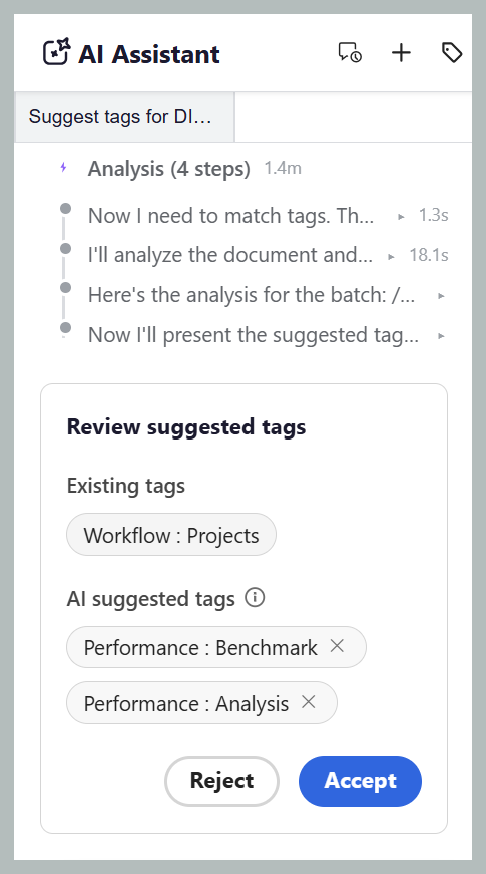
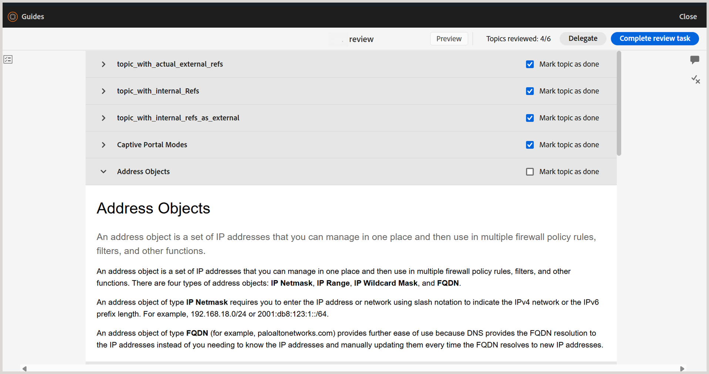

# Nouveautés de la version 2026.09.0 (septembre 2026)

Cet article présente les nouvelles fonctionnalités améliorées introduites dans la version 2026.09.0 d’Adobe Experience Manager Guides as a Cloud Service.

Pour obtenir la liste des problèmes résolus dans cette version, voir [Problèmes résolus dans la version 2026.09.0](fixed-issues-2026-09-0.md).

Découvrez les [instructions de mise à niveau pour la version 2026.09.0](../release-info/upgrade-instructions-2026-09-0.md).

## Présentation du balisage intelligent optimisé par l’IA dans l’assistant AI

Désormais, vous pouvez utiliser l’assistant AI pour suggérer et ajouter des balises à votre contenu. Grâce à la nouvelle fonctionnalité de balisage intelligent, les auteurs peuvent demander à l’assistant AI de suggérer des balises pour une ou plusieurs rubriques, grâce à la compétence Balisage intelligent optimisée par Adobe CX Enterprise Coworker. Les personnes compétentes examinent le contenu, génèrent des recommandations de balises et les présentent pour votre révision. Une fois que vous avez confirmé, les balises suggérées sont appliquées aux rubriques appropriées dans une carte.

Pour plus d’informations, consultez [Utilisation de l’assistant AI en mode Agence](../user-guide/ai-assistant-agentic.md).

Actuellement, la fonctionnalité de balisage intelligent est disponible lorsque l’assistant AI est configuré en mode **Agentic**. Les administrateurs peuvent choisir d’activer le mode **Agentic** ou **Standard** dans les paramètres **Workspace** pour une instance.

- Le **mode agent** fournit aux auteurs l’interface de balisage intelligent pour la recommandation et l’application de balises.
- Le **mode standard** fournit l’expérience de l’assistant AI existant, avec les onglets **Aide** et **Création** dans le panneau de l’assistant AI.

## Améliorations de l’éditeur

### Empêcher les remplacements de contenu lors de la modification simultanée

Lorsque deux auteurs travaillent sur le même sujet en même temps, un auteur peut avoir le sujet ouvert pendant qu&#39;un autre le verrouille, apporte des modifications et enregistre une version plus récente. La rubrique déjà ouverte peut alors contenir du contenu obsolète et la modification de cette version peut remplacer les dernières modifications.

Pour éviter de tels conflits, la dernière version enregistrée est désormais automatiquement chargée dans l’éditeur lorsque vous verrouillez une rubrique. Cela vous permet de travailler avec le contenu le plus récent et vous empêche de remplacer les modifications apportées par un autre auteur.

Cela s’applique lorsque le paramètre **Désactiver la modification sans verrouiller le fichier** est activé.

Pour plus d’informations, consultez [Empêcher les remplacements de contenu lors de la modification simultanée](../user-guide/web-editor-edit-topics.md#prevent-content-overwrite-during-concurrent-editing).

### Prévisualiser le contenu du mappage à partir d’une ligne de base statique sélectionnée

Lorsqu’un mappage comporte une ou plusieurs lignes de base statiques, vous pouvez désormais prévisualiser le mappage en fonction d’une ligne de base sélectionnée au lieu de la copie de travail actuelle dans l’éditeur.

Toutes les versions des rubriques, ressources, images et références associées à la ligne de base sélectionnée s&#39;affichent dans l&#39;aperçu, offrant ainsi une vue précise du contenu de la carte au moment où la ligne de base a été créée. Pour plus d’informations, consultez [Vues de l’éditeur pour les rubriques](../user-guide/web-editor-views.md#preview-content-using-baseline).

## Améliorations de la révision

### Marquer les rubriques individuelles comme terminées dans une tâche de révision

Experience Manager Guides introduit le suivi de la progression au niveau de la rubrique pour les réviseurs, ce qui donne une meilleure visibilité sur la progression de la révision pour les tâches comportant plusieurs rubriques. En tant que réviseur ou réviseuse, vous pouvez désormais marquer chaque sujet comme terminé et faire la distinction entre les sujets que vous avez terminés et ceux qui nécessitent encore une attention particulière.

Pour ce faire, les rubriques de la vue Document de l’interface utilisateur de révision sont organisées en accordéons avec une case à cocher **Marquer la rubrique comme terminée**. Les rubriques que vous marquez comme étant révisées à l’aide de la case à cocher sont indiquées dans le panneau **Rubriques** tandis que le compteur **Rubriques révisées** en haut affiche votre progression par rapport aux rubriques qui vous ont été affectées. Ensemble, ils vous donnent une vue claire de ce que vous avez couvert et de ce qui reste, même lorsque vous revenez à une tâche de révision plus longue après une pause.

Pour plus d’informations, voir [Rubriques de révision](../user-guide/review-topics.md#mark-individual-topics-as-done-in-a-review-task).

### Identification des utilisateurs avec des rôles lors du balisage dans les commentaires

Les réviseurs et les auteurs peuvent désormais afficher le rôle d’un utilisateur, tel que Réviseur, Auteur ou Propriétaire, ainsi que son nom d’utilisateur et son adresse électronique (le cas échéant), lors du balisage d’une personne dans un commentaire ou une réponse. Cela facilite l’identification rapide de l’utilisateur approprié pour le balisage, en particulier dans les projets avec un grand nombre de participants.

En savoir plus sur le [balisage des utilisateurs et utilisatrices](../user-guide/review-topics.md#tag-task-users-in-a-comment) dans un commentaire.

### Afficher la hiérarchie des cartes lors de la sélection des rubriques à réviser

Lors de la sélection du contenu pour une révision, en tant qu’auteur ou initiateur d’une tâche de révision, vous pouvez désormais afficher les mappages, les sous-mappages et les rubriques dans leur hiérarchie existante sur la page **Contenu**, au lieu d’afficher toutes les rubriques sous forme de liste plate. La vue hiérarchique permet de comprendre plus facilement la structure de votre contenu et de sélectionner des rubriques individuelles ou des sous-plans entiers à réviser.

Pour plus de détails, consultez [Afficher la hiérarchie de carte lors de la sélection des rubriques à réviser](../user-guide/review-send-topics-for-review.md#view-the-map-hierarchy-while-selecting-topics-for-review).

## Améliorations de la publication

### Publiez une sortie PDF native à l’aide de la langue de votre carte

La page Paramètre prédéfini de sortie PDF natif comprend désormais une nouvelle option **Utiliser le langage map**. Lorsqu’elles sont sélectionnées, les variables de modèle de sortie résolvent leur langue à partir de l’attribut `xml:lang` de la carte racine au lieu d’une langue sélectionnée explicitement dans le préréglage. Cela signifie que vous n’avez plus besoin de conserver un paramètre prédéfini de sortie distinct pour chaque langue lors de la publication des mappages traduits. Si aucun `xml:lang` n’est défini pour la carte, la sortie est définie par défaut sur l’anglais (en_US).

Pour plus d’informations, consultez les sections [Configuration des paramètres prédéfinis de PDF natifs](../web-editor/native-pdf-web-editor.md) et [Utiliser des variables de langue dans les modèles de sortie](../native-pdf/native-pdf-language-variables.md#use-language-variables-in-the-output-templates).

## Améliorations du contenu d’apprentissage

### Activer l’affichage plein écran pour le contenu H5P dans un cours d’apprentissage

Les auteurs peuvent désormais activer ou désactiver l’affichage plein écran pour chaque élément H5P utilisé dans un cours d’apprentissage. Utilisez le bouton (bascule) **Activer le plein écran** dans le panneau **Propriétés du contenu** pour contrôler ce paramètre. Lorsque cette option est activée, les élèves peuvent développer le contenu H5P en plein écran. Lorsqu’il est désactivé, le contenu reste intégré dans la vue standard. Ce paramètre s’applique de manière cohérente dans le mode Aperçu et la sortie publiée.

En savoir plus sur [Autres options du menu Insertion](../learning-content/lc-other-insert-options.md) du contenu Formation et apprentissage du produit.

## Améliorations des performances

### Amélioration des performances avec le chargement paginé des fichiers et des dossiers

Experience Manager Guides prend désormais en charge le chargement paginé de fichiers et de dossiers pour une expérience de navigation améliorée, en particulier pour les dossiers comportant un grand nombre de ressources. Au lieu de charger tout le contenu en une seule fois, les dossiers se chargent progressivement par lots de 50 ressources, avec des ressources supplémentaires récupérées au fur et à mesure que vous faites défiler l’écran ou sélectionnez **Charger plus**, selon le panneau ou la boîte de dialogue.

Le tri est effectué côté serveur. Ainsi, l’application d’un ordre de tri récupère les résultats nouvellement triés plutôt que de réorganiser les données déjà chargées dans le navigateur. Les opérations courantes, telles que le changement de nom, la suppression, l’ajout et le déplacement, ne rechargent plus un dossier entier. Au lieu de cela, ils mettent à jour uniquement l’élément concerné ou actualisent la première page de résultats.

Le chargement paginé est disponible dans la table du référentiel principal, les panneaux Collections, Explorateur, Recherche et Modèle, ainsi que dans la boîte de dialogue Sélectionner le chemin d’accès .

Pour plus d’informations, consultez la section [Chargement paginé de fichiers et de dossiers](../user-guide/paginated-loading-assets.md).

{width="650"}

