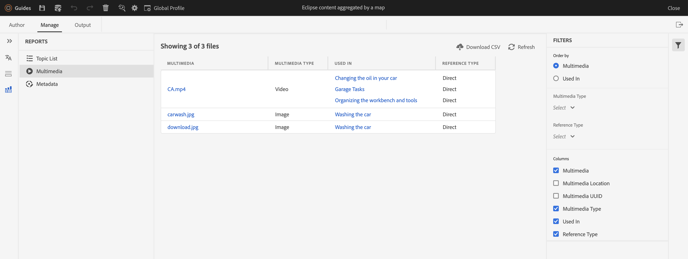

# Nouveautés de la version 4.2.1 d’Adobe Experience Manager Guides (mai 2023)

Cet article présente les nouvelles fonctionnalités améliorées de la version 4.2.1 d’Adobe Experience Manager Guides (plus tard appelée *AEM Guides*).

Pour plus d’informations sur les instructions de mise à niveau, la matrice de compatibilité et les problèmes résolus dans cette version, consultez l’article [Notes de mise à jour](release-notes-4-2-1.md).

## Naviguez de l’éditeur web vers la page d’accueil d’AEM.

Vous pouvez désormais facilement accéder à la page de navigation d’AEM à partir de l’éditeur web.

{width="800"}

* Cliquez sur l’icône **Guides** ( ) pour revenir à la page de navigation d’AEM.

Pour plus d’informations, consultez la page Navigation dans AEM .

## Prise en charge avancée des métadonnées dans la publication PDF

AEM Guides fournit désormais une prise en charge avancée des métadonnées qui sont mappées aux métadonnées dans votre sortie PDF. Les options de métadonnées comprennent des informations sur le document et son contenu, telles que le nom de l’auteur, le titre du document, les mots-clés, les informations de copyright et d’autres champs de données.

Vous pouvez importer un fichier XMP et AEM Guides peut sélectionner les informations dans le fichier. Vous avez également la possibilité de fournir les noms et valeurs des métadonnées à l’aide de la liste déroulante. Vous pouvez également ajouter des métadonnées personnalisées en saisissant directement dans le champ du nom.

Pour plus d’informations, consultez la description de la fonctionnalité **Métadonnées** dans [Création d’un paramètre prédéfini de sortie PDF](../web-editor/native-pdf-web-editor.md).

### Panneau Mode Plan amélioré

AEM Guides propose un panneau de mode Plan amélioré dans lequel vous obtenez la vue hiérarchique des éléments utilisés dans le document.

Le mode Plan apporte les améliorations suivantes :

* La liste déroulante Options d’affichage s’affiche en haut du panneau Mode Plan. Si un élément possède un identifiant, un attribut et du texte, vous pouvez les sélectionner dans la liste déroulante pour les afficher avec l’élément. Les attributs qui peuvent être affichés dans le panneau Mode Plan sont déterminés par les paramètres Attributs d’affichage qui ont été configurés par votre administrateur dans les **Paramètres de l’éditeur**.

* La fonction de recherche vous permet de rechercher un élément par son nom, son identifiant, son texte ou sa valeur d’attribut.

Pour plus d’informations, reportez-vous à la description de la fonction de mode Plan dans la section [Panneau de gauche](../user-guide/web-editor-features.md#id2051EA0M0HS).

## Générer le rapport multimédia à partir de l&#39;éditeur Web

AEM Guides permet de générer des rapports pour vos documents techniques.  Vous pouvez utiliser cette fonctionnalité pour afficher la liste des rubriques et gérer les métadonnées de vos documents. Maintenant, vous pouvez également voir le multimédia utilisé dans toutes les références pour la carte actuelle à partir de l&#39;onglet **Rapports** dans l&#39;éditeur Web.

Vous pouvez générer le rapport multimédia qui contient des informations détaillées sur le multimédia utilisé dans vos références dans la carte actuelle. Vous avez la possibilité de filtrer et de trier les fichiers multimédias répertoriés dans le rapport.
Vous pouvez également générer le fichier CSV pour télécharger l&#39;instantané actuel du fichier multimédia utilisé dans le plan DITA.

Pour plus d&#39;informations, reportez-vous à la description de la fonction Générer un rapport multimédia dans la section [Rapport de plan DITA à partir de l&#39;éditeur web](../user-guide/reports-web-editor.md).

## Native PDF | Barre de modification pour indiquer les rubriques modifiées dans la table des matières

AEM Guides vous permet désormais d’identifier rapidement les rubriques modifiées dans la table des matières de la sortie PDF.  Une barre de modification s’affiche à gauche des rubriques modifiées dans la table des matières. Vous pouvez cliquer sur la rubrique dans la table des matières et afficher les modifications détaillées.

Pour plus d’informations, voir [ Utilisation de styles de barres de modification personnalisées ](../native-pdf/change-bar-style.md).

## PDF natif | Appliquer un style au marqueur de page dans le composant de note de bas de page

Vous pouvez maintenant mettre en forme le marqueur de page dans les notes de pied de page. Par exemple, vous pouvez ajouter des crochets ou modifier leur couleur. Ces styles permettent aux utilisateurs d’identifier facilement les marqueurs de page dans le document.

Pour plus d’informations, voir [ Utilisation de styles personnalisés dans les notes de bas de page ](../native-pdf/footnote-number-style.md).

## Ouvrez et lisez des fichiers vidéo ou audio dans l’éditeur web.

AEM Guides permet désormais d’ouvrir et de lire les fichiers audio ou vidéo dans l’éditeur web. Vous pouvez modifier le volume ou la vue de la vidéo. Dans le menu contextuel, vous avez également les options suivantes : **Télécharger**, modifier **Vitesse de lecture** ou afficher **Image dans l’image**.

Pour plus d’informations, consultez la description de la fonctionnalité Vue du référentiel dans la section [Panneau de gauche](../user-guide/web-editor-features.md#id2051EA0M0HS).
