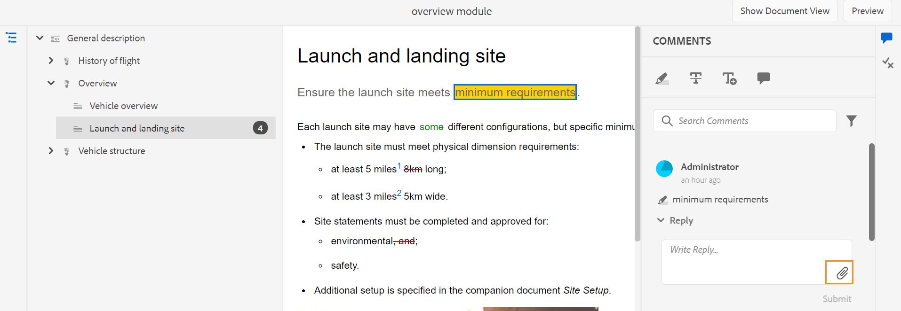
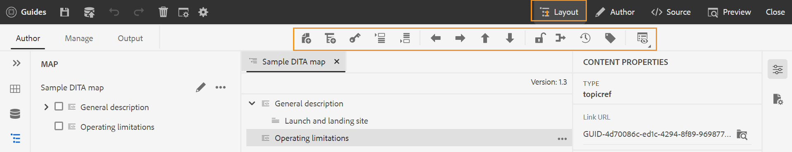
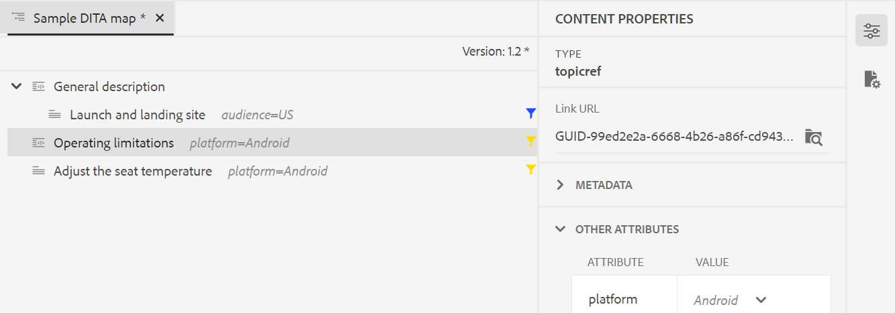
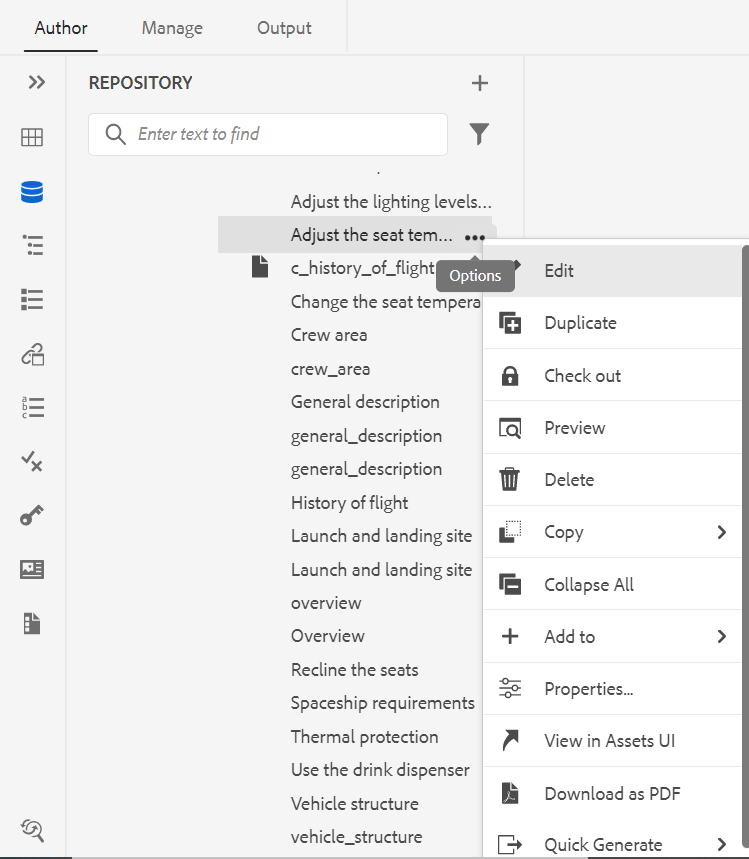
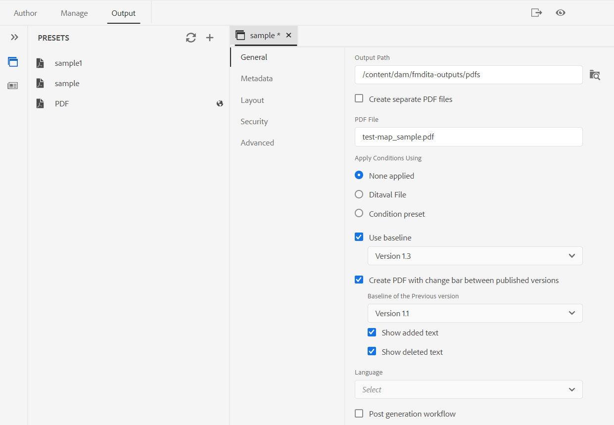

# Nouveautés de la version 4.2 d’Adobe Experience Manager Guides (février 2023)

Cet article présente les nouvelles fonctionnalités améliorées de la version 4.2 d’Adobe Experience Manager Guides (plus tard appelée *AEM Guides*).

Pour plus d’informations sur les instructions de mise à niveau, la matrice de compatibilité et les problèmes résolus dans cette version, consultez l’article [Notes de mise à jour](release-notes-4-2.md).

## Générer des rapports à partir de l’éditeur web

AEM Guides s’accompagne d’une fonctionnalité dans l’éditeur web qui vous permet de vérifier l’exhaustivité globale de vos documents techniques et de générer des rapports pour ceux-ci.
Vous pouvez afficher la liste des rubriques et gérer les métadonnées de toutes les références pour la carte actuelle à partir de la
Onglet **Rapports** dans l’éditeur web.

**Générer la vue Liste de rubriques**

Vous pouvez générer la liste des rubriques qui fournit des informations détaillées sur vos rubriques, telles que le type de référence, le statut du document et l’auteur. Vous pouvez également générer le fichier CSV pour télécharger l&#39;instantané actuel des rubriques dans le plan DITA.

**Gestion des métadonnées et modification de l’état du document**

Vous pouvez appliquer des balises sur une rubrique individuelle ou utiliser la fonction de balisage en bloc pour appliquer plusieurs balises sur plusieurs rubriques, un plan DITA ou un sous-plan. Vous pouvez également modifier l&#39;état du document de toutes les rubriques sélectionnées pour passer à l&#39;état suivant du document commun.

## Nouvelle expérience utilisateur pour la fonctionnalité de révision

Désormais, les guides d’AEM fournissent une expérience utilisateur améliorée qui vous aide à examiner les rubriques partagées pour révision. Dans la dernière expérience, la fonctionnalité de révision bénéficie des améliorations suivantes :

* Actualisation de l’interface utilisateur
* Panneau Conditions qui permet de mettre en surbrillance le contenu en fonction des conditions disponibles dans la rubrique.
* Chaque commentaire du panneau de commentaires est lié au texte correspondant dans la rubrique active. Cela vous permet d’identifier le texte commenté.
* Les commentaires s’affichent dans l’ordre du texte commenté dans le document.
* Le nom de la tâche de révision s’affiche dans le workflow de révision.
* Sélectionnez la feuille de route de la tâche de révision, qui est utilisée pour résoudre toutes les références clés et tous les termes du glossaire utilisés dans le contenu de révision.
* Barre d’outils contextuelle qui permet de mettre rapidement en surbrillance ou de barrer du texte.
* Menu Options permettant de modifier ou de supprimer vos propres commentaires.
* Pour les commentaires obsolètes, vous avez accès à la vue côte à côte qui vous aide à comparer la version précédente de la rubrique à la version de révision actuelle
* Lors de l’utilisation des filtres, les commentaires du panneau de droite sont filtrés en fonction de la sélection, puis le
le nombre de commentaires dans le panneau de gauche est mis à jour en conséquence.

Pour plus d’informations, reportez-vous à la section *Rubriques de révision ou mappages* du guide Utilisation d’Adobe Experience Manager Guides .

## Améliorations apportées à la traduction

Vous disposez désormais d’améliorations plus conviviales dans le tableau de bord de traduction qui vous permettent de traduire facilement vos documents à partir de l’éditeur web.

**Colonne Libellé de version ajoutée au tableau de bord de traduction**

Dans le tableau de bord de traduction, vous pouvez également voir la colonne Libellé de version . Le libellé de la version sélectionnée du fichier source s’affiche. Cela peut vous aider à sélectionner tous les fichiers avec un libellé spécifique et à les traduire en une seule fois.

**Afficher la différence de version pour les fichiers désynchronisés à partir du tableau de bord de traduction**

Vous pouvez maintenant vérifier les différences entre la version sélectionnée et la dernière version source traduite des rubriques. Vous pouvez également choisir de traduire les fichiers **Désynchronisés** en fonction des modifications effectuées entre les deux versions d’une rubrique.

**Transmettez le libellé de version à la version cible**

AEM Guides permet de transmettre le libellé du fichier source au fichier cible. Cela vous permet d’identifier facilement la version source du fichier traduit.

Par exemple, si vous disposez de fichiers source auxquels est appliqué le libellé de version 1.0, vous pouvez également transmettre le libellé source (version 1.0) au fichier traduit.

**Forcer la synchronisation pour les ressources non synchronisées**

Si vous apportez des modifications à certaines des ressources, AEM Guides les marque comme étant désynchronisées. Vous pouvez soit retraduire les ressources modifiées, soit ignorer le statut Désynchronisé . Par exemple, si vous avez apporté des modifications mineures qui n’ont pas vraiment besoin d’être traduites, vous pouvez marquer leur statut comme étant Synchronisé.

**Afficher les projets de traduction en cours pour une rubrique ou un plan**

Certaines références de votre tableau de bord de traduction peuvent être en cours. AEM Guides propose désormais une fonctionnalité pour vous aider à afficher la liste de tous les projets de traduction en cours (ainsi que la langue cible) qui contiennent la référence sélectionnée.

Pour plus d&#39;informations, consultez la section *Traduire les documents à partir de l&#39;éditeur web* du guide Utilisation d&#39;Adobe Experience Manager Guides .

## Générer une sortie dans divers formats à partir de l’éditeur web

Vous pouvez désormais facilement générer la sortie de vos rubriques ou de votre plan DITA à partir de l&#39;éditeur web. Vous pouvez configurer différents paramètres prédéfinis de sortie tels qu’AEM Site, PDF, HTML5,
JSON (format de sortie découplé) et sortie personnalisée. Utilisez-les pour générer les sorties respectives. Vous pouvez définir des attributs dans vos rubriques DITA, puis utiliser le paramètre prédéfini de condition pour appliquer une condition lors de la publication de la sortie. Vous pouvez également utiliser la fonction Publication de ligne de base pour publier de manière sélective une version spécifique de votre plan ou rubrique DITA.

**Gestion des paramètres prédéfinis de sortie de profil global et de dossier**

AEM Guides permet de créer et de gérer des paramètres prédéfinis de sortie pour les profils globaux et de dossiers. Vous pouvez ensuite facilement utiliser ces paramètres prédéfinis de sortie pour générer une sortie pour tous les mappages liés à ce profil global ou de dossier.

Ces paramètres prédéfinis globaux s’affichent sous l’onglet **Sortie** de tous les mappages associés. Vous pouvez les utiliser pour générer la sortie de tous les mappages associés. Vous pouvez sélectionner le paramètre prédéfini comme paramètre prédéfini PDF par défaut pour générer la sortie PDF. Vous pouvez également **Modifier**, **Renommer**, **Dupliquer** ou **Supprimer** un paramètre prédéfini de sortie existant à partir du menu **Options**.

>[!NOTE]
>
>Seuls les utilisateurs administratifs au niveau du dossier peuvent créer des paramètres prédéfinis de profil global et de profil de dossier.

## Rechercher et remplacer le texte au niveau de la carte

Vous pouvez désormais rechercher des fichiers dans une carte qui contiennent du texte spécifique. Le texte recherché est mis en surbrillance dans les fichiers. Vous pouvez également remplacer le mot ou l’expression recherché par un autre mot ou une autre expression dans les fichiers. Sélectionnez l’icône **Remplacer une seule occurrence** pour remplacer l’occurrence actuelle et l’icône **Remplacer tout dans le fichier** pour remplacer toutes les occurrences dans le fichier sélectionné. Vous pouvez sélectionner l’icône **Tout remplacer** pour remplacer toutes les occurrences du terme recherché dans tous les fichiers.

Par défaut, les options **Extraction du fichier avant remplacement** et **Création d’une nouvelle version après remplacement** sont sélectionnées, de sorte qu’un fichier est extrait avant que vous ne remplaciez le texte et qu’une nouvelle version est créée après le remplacement du texte. Vous pouvez également rechercher la chaîne dans les références indirectes dans le plan DITA. Par défaut, cette option est désactivée afin que la recherche soit effectuée uniquement sur les références directes.

## Mode Disposition dans l’éditeur de cartes

Vous pouvez maintenant afficher la disposition complète d&#39;un plan DITA dans l&#39;éditeur de plans. Lorsque vous ouvrez une carte pour la modifier, le mode Mise en page de l’éditeur de cartes s’ouvre. Dans cette vue, vous pouvez voir la hiérarchie de carte dans une arborescence. Vous pouvez également modifier et organiser ou structurer les rubriques dans une carte.

Le mode Mise en page contient une barre d’outils distincte qui vous permet d’effectuer de nombreuses tâches sur les rubriques présentes dans un mappage.
Vous pouvez insérer des références de rubrique, un groupe de rubriques, des définitions de clés dans un mappage. Vous pouvez réorganiser les rubriques présentes dans une carte en les déplaçant vers le haut, le bas, la gauche ou la droite. Vous pouvez également faire glisser et déposer les rubriques pour les déplacer dans un mappage. L’éditeur de carte fournit également les icônes pour verrouiller ou déverrouiller les fichiers, vérifier l’historique des versions et gérer les libellés de version.

Le mode Mise en page fournit également la **Options d&#39;affichage** pour afficher ou masquer le numéro de ligne, afficher ou masquer la case à cocher ou afficher le nom ou le titre du fichier pour les rubriques d&#39;un mappage.
Vous pouvez également afficher les rubriques en fonction des filtres conditionnels qui leur sont appliqués.

En plus d&#39;organiser les rubriques dans le fichier map, vous pouvez également ajouter, déplacer, copier, coller ou supprimer des références à l&#39;aide du menu **Options** disponible pour un élément en mode Mise en page.

Le panneau de droite affiche les propriétés de contenu et les propriétés de carte en mode Mise en page de l’éditeur de cartes. Vous pouvez désormais également définir les informations de métadonnées pour les rubriques ou la carte. Vous pouvez définir le Titre de navigation, le Texte du lien, la Description courte et les Mots-clés pour la rubrique ou le mappage sélectionné.

Pour plus d’informations, voir la section *Mode Mise en page* dans le guide Utilisation d’Adobe Experience Manager Guides .

## Panneau Génération rapide

AEM Guides propose désormais le panneau Génération rapide qui vous permet de générer et d&#39;afficher rapidement la sortie des paramètres prédéfinis créés pour votre plan DITA.

Dans le panneau **Génération rapide**, vous pouvez voir la liste de tous les paramètres prédéfinis de sortie créés pour votre plan DITA. Vous pouvez également afficher rapidement la sortie générée pour les paramètres prédéfinis. Un message de réussite ou d’échec s’affiche à la fin de la génération de la sortie. Vous pouvez également consulter le journal des erreurs qui contient les détails de l’erreur survenue lors du processus de génération.

## Créer une ligne de base dynamique basée sur des libellés

AEM Guides vous offre désormais la possibilité de créer des lignes de base dynamiques basées sur des libellés. Si vous générez une configuration de référence, téléchargez une configuration de référence ou créez un projet de traduction à l’aide d’une configuration de référence, les fichiers sont sélectionnés de manière dynamique en fonction des libellés mis à jour. Cette fonction est pratique car vous n&#39;avez pas à modifier la ligne de base lors de la mise à jour des libellés.

## Supprimer et dupliquer des fichiers du panneau Référentiel

Vous pouvez désormais facilement supprimer des fichiers (un seul fichier à la fois) du menu **Options** du fichier sélectionné dans le panneau du référentiel. Une invite de confirmation s’affiche avant la suppression du fichier. Si le fichier n’est pas référencé à partir d’un autre fichier, il est supprimé et un message de réussite s’affiche.

Vous pouvez également créer un doublon ou une copie du fichier sélectionné. Par défaut, le fichier est créé avec
un suffixe (comme filename_1.extension).

## Autres améliorations de l’éditeur web

* Dans AEM Guides, vous pouvez effectuer certaines opérations courantes pour les images et les fichiers multimédias à l’aide du menu contextuel. Vous pouvez désormais également localiser l’image ou le média sélectionné dans le référentiel ou afficher l’aperçu du fichier dans l’interface utilisateur d’Assets.

* Le nom du profil de dossier actuel est affiché comme libellé pour l’icône Préférences utilisateur dans la barre d’outils principale. Cela vous permet d’identifier le profil de dossier sur lequel vous travaillez.

* Lorsque vous ouvrez une carte dans la vue Carte, le titre de la carte actuelle s’affiche au centre de la barre d’outils principale. Cela s’avère utile pour indiquer à l’utilisateur ou à l’utilisatrice quel mappage est actuellement ouvert.

## Purge des versions sélectionnées des fichiers

Au fur et à mesure que vous créez et conservez votre contenu, il se peut que de nombreuses versions soient créées pour vos fichiers DITA dans votre référentiel. AEM Guides vous permet de purger les anciennes versions de vos fichiers DITA du référentiel et de libérer de l’espace disque.

AEM Guides ne supprime pas la première version du fichier ou une version incluse dans une ligne de base, ou à laquelle un libellé est appliqué. L’opération de purge ne supprime même pas les fichiers inclus dans un workflow de traduction ou de révision. Vous pouvez choisir le nombre de versions à conserver et également décider de supprimer les fichiers qui sont plus anciens que le nombre de jours défini.

Avant de commencer la purge, vous pouvez prévisualiser le rapport pour afficher les versions qui seront purgées. Vous pouvez ensuite décider de démarrer ou d’annuler l’opération de purge.

Une fois l’opération de purge terminée, vous pouvez vérifier le rapport de purge pour afficher les fichiers purgés.

## Afficher le titre à la place de l’UUID dans l’éditeur d’oxygène

AEM Guides vous permet désormais de choisir l’option **Utiliser le titre dans l’éditeur et le gestionnaire de cartes** dans les paramètres. Si vous sélectionnez cette option, le titre du fichier s&#39;affiche dans l&#39;onglet du fichier lorsqu&#39;il est ouvert dans l&#39;éditeur ou dans le gestionnaire de cartes DITA. Si vous ne sélectionnez pas cette option, l’UUID du fichier est affiché dans l’onglet du fichier.

## Interface utilisateur des métadonnées disponible pour les paramètres prédéfinis de PDF

Vous pouvez définir les métadonnées à partir du paramètre prédéfini de sortie d&#39;un plan DITA. Vous pouvez définir le titre, l’auteur, l’objet et les métadonnées de mots-clés. Ces métadonnées sont mappées aux métadonnées dans les propriétés de fichier de votre PDF de sortie. Ces métadonnées remplacent les métadonnées définies au niveau du livre. Vous pouvez définir les métadonnées spécifiquement dans chaque paramètre prédéfini de sortie et les transmettre au PDF de sortie.

## PDF natif | PDF avec barre de modification indiquant la différence entre les versions du document

Vous pouvez maintenant créer un PDF qui affiche les différences de contenu entre deux versions à l’aide de la barre de modification. Vous pouvez choisir de comparer la version actuelle à une version de référence de la version précédente ou de comparer les deux versions de référence sélectionnées.

Une barre de modification s’affiche dans le PDF pour indiquer le contenu modifié, inséré ou supprimé. Vous avez également la possibilité d’effectuer les opérations suivantes :
* Afficher le contenu inséré en vert et souligné
* Afficher le contenu supprimé en rouge et barré

## PDF natif | Prise en charge des variables pour le chemin de sortie et le nom de fichier PDF

Vous pouvez désormais également utiliser les variables prêtes à l’emploi suivantes pour définir le chemin de sortie et le fichier PDF. Vous pouvez utiliser une seule variable ou une combinaison de variables pour définir ces options :
* `${map_filename}`
* `${map_title}`
* `${preset_name}`
* `${language_code}`
* `${map_parentpath}` (uniquement pour le chemin de sortie)
* `${path_after_langfolder}` (uniquement pour le chemin de sortie)

## Native PDF | Génération de la table des matières pour les plans DITA et réorganisation des mises en page

Vous pouvez désormais générer la table des matières dans les plans DITA à l&#39;aide d&#39;un paramètre PDF avancé du modèle. Vous pouvez choisir d’activer ou de désactiver l’affichage des différentes mises en page et de réorganiser leur position.

## PDF natif | Ajout d’un signet personnalisé dans la sortie PDF

Vous pouvez désormais ajouter un signet personnalisé sur un contenu particulier dans votre sortie PDF finale pour une navigation plus facile. Elle est ajoutée à la table des matières créée à partir des titres de rubrique ou de section dans votre plan DITA.

## PDF natif | Application d’un style personnalisé aux entrées de la table des matières et au contenu de la rubrique

AEM Guides permet d’appliquer un style personnalisé aux entrées de la table des matières ou à une rubrique spécifique dans la sortie PDF. Par exemple, vous pouvez modifier la couleur du texte dans la table des matières et le titre de la rubrique. Vous pouvez également appliquer des styles à l’ensemble du contenu dans la rubrique.
