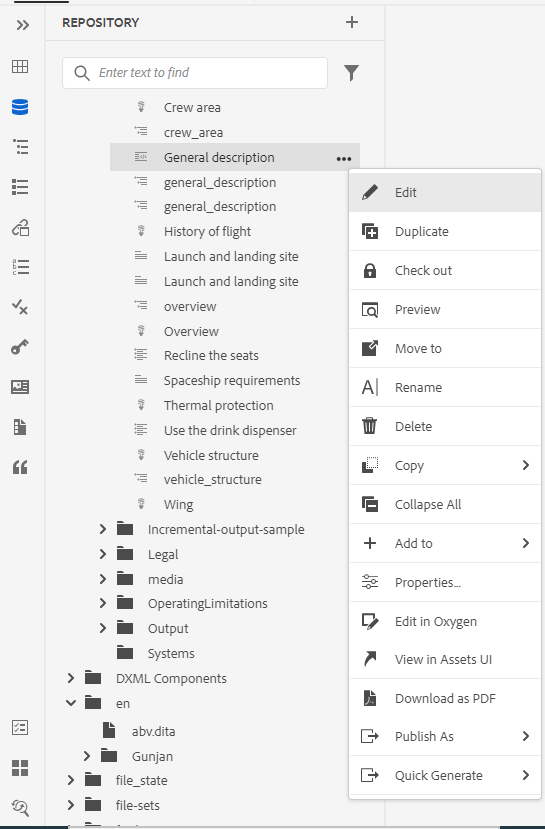

# Nouveautés de la version 4.3.1 d’Adobe Experience Manager Guides (octobre 2023)

Cet article présente les nouvelles fonctionnalités améliorées de la version 4.3.1 d’Adobe Experience Manager Guides (plus tard appelée *Experience Manager Guides*).

Pour plus d’informations sur les instructions de mise à niveau, la matrice de compatibilité et les problèmes résolus dans cette version, voir [Notes de mise à jour](./release-notes-4-3-1.md).

## Se connecter à une source de données et insérer les rubriques

Experience Manager Guides fournit des connecteurs prêts à l’emploi qui vous aident à vous connecter à vos sources de données, ce qui fait de Experience Manager Guides un véritable hub de contenu. Vous gagnez ainsi du temps et économisez des efforts qui auraient autrement été consacrés à l’ajout ou à la réplication manuels de données.

Outre les connecteurs prêts à l’emploi existants tels que JIRA et SQL (MySQL, PostgreSQL, SQL Server, SQLite), votre administrateur peut également configurer des connecteurs pour les bases de données MariaDB, H2DB, AdobeCommerce et Elasticsearch. Ils peuvent également ajouter d’autres connecteurs en étendant les interfaces par défaut.

Vous pouvez afficher les connecteurs configurés sous le panneau **Sources de données** dans l’éditeur web.

*Afficher les sources de données connectées.*

Vous pouvez désormais également créer une rubrique à partir d’une source de données connectée. Une rubrique peut contenir des données dans différents formats, tels que des tableaux, des listes et des paragraphes. Il permet également de créer un plan DITA pour toutes les rubriques. Vous pouvez associer des métadonnées à la rubrique lors de l’extraction d’une source de données.

Pour plus d’informations, consultez la section [Utiliser les données de votre source de données](../user-guide/web-editor-content-snippet.md).

## Configuration d’un connecteur de source de données à partir de l’interface utilisateur

Experience Manager Guides propose désormais également un outil **Sources de données** qui vous permet de configurer des connecteurs prêts à l’emploi pour les sources de données. Vous pouvez facilement créer des connecteurs pour les bases de données JIRA, SQL (MySQL, PostgreSQL, Microsoft SQL Server, SQLite, MariaDB, H2DB), Adobe Commerce et Elasticsearch.

Vous pouvez également modifier, reconnecter, dupliquer ou supprimer facilement un connecteur de source de données. Découvrez comment [configurer facilement un connecteur de source de données à partir de l’interface utilisateur](../install-guide/conf-data-source-connector-tools.md).

{width="550"}

*Créez et affichez les connecteurs de sources de données à partir du panneau des sources de données.*

## Afficher les journaux pour le générateur de rubriques

Vous pouvez désormais également afficher le fichier journal de génération de contenu. Ce fichier journal vous aide à vérifier les avertissements, les erreurs et les exceptions.  En savoir plus sur la manière dont les [options d’un générateur de rubriques](../user-guide/web-editor-content-snippet.md#options-for-a-topic-generator) vous aident à générer et gérer facilement les générateurs de rubriques.

## Prise en charge des outils Velocity dans les modèles de source de données

Vous pouvez désormais utiliser les outils Velocity dans les modèles Experience Manager Guides. Ces outils vous aident à appliquer diverses fonctions aux données que vous récupérez à partir des sources de données. Vous pouvez utiliser les modèles lors de la création d’un fragment de contenu ou d’une rubrique. Cette fonctionnalité vous permet de gagner du temps et d’économiser des efforts pour appliquer manuellement la même fonction à chaque jeu de données.  Il garantit également des résultats précis.
Par exemple, vous pouvez utiliser $mathTool pour exécuter des fonctions mathématiques.
Découvrez comment [utiliser les outils Velocity dans les modèles de source de données](../user-guide/web-editor-content-snippet.md#use-velocity-tools).

## Améliorations du PDF natif

Les améliorations du PDF natif suivantes ont été apportées à la version d’octobre 2023 :

### Réinitialiser le numéro de page de la première page d&#39;une mise en page

Dans la sortie PDF native, vous pouvez redémarrer les numéros de page et spécifier le numéro à partir duquel la numérotation commence. Vous pouvez également commencer la numérotation uniquement pour la première occurrence d’une section.
En savoir plus sur l’utilisation [ des propriétés de page d’une mise en page ](../native-pdf/design-page-layout.md#page-props-page-layout).

### Afficher les chapitres sans numéros automatiques dans la table des matières

Experience Manager Guides affiche les numéros de chapitres ainsi que les noms de chapitres dans la table des matières (table des matières). Vous pouvez maintenant choisir de publier uniquement les noms des chapitres sans les numéros de chapitres. Affichez plus de détails sur la configuration des [paramètres PDF avancés d’un modèle](../native-pdf/components-pdf-template.md#advanced-pdf-settings).

## Téléchargement d’une carte à partir de l’éditeur web

Désormais, vous pouvez non seulement modifier une carte dans la vue Carte de l’éditeur web, mais également la télécharger. Vous pouvez choisir de télécharger la carte à l’aide d’une ligne de base spécifique. Vous avez également la possibilité d’aplatir la hiérarchie et d’enregistrer tous les fichiers et dossiers dans un seul dossier.

Pour plus d’informations, reportez-vous à la description de la fonctionnalité **Vue Carte** dans la section [Panneau de gauche](../user-guide/web-editor-features.md#id2051EA0M0HS).

{width="550"}

*Sélectionnez un fichier dans la vue du référentiel et choisissez l’option permettant d’effectuer une action sur le fichier.*

## Prise en charge de plusieurs définitions d’objet dans une seule définition d’énumération

Vous pouvez maintenant définir une ou plusieurs définitions d’objet dans un mappage et les définitions d’énumération dans un autre mappage, puis ajouter la référence de mappage. Les références d’énumération d’objet sont résolues dans le même mappage ou le mappage référencé.

Vous pouvez désormais également définir des conditions et les appliquer à certains éléments spécifiques d&#39;une rubrique.  Les conditions ne sont visibles que pour ces éléments spécifiques et non pour tous les autres éléments.

Pour plus d&#39;informations sur la gestion des définitions hiérarchiques des objets et des énumérations, consultez la description de la fonctionnalité Schéma d&#39;objet dans la section [Panneau de gauche](../user-guide/web-editor-features.md#id2051EA0M0HS).

## Expérience d’aperçu améliorée à partir du menu contextuel

Utilisez le menu contextuel pour prévisualiser rapidement le fichier (.dita, .xml, audio, vidéo ou image) sans l’ouvrir. Vous pouvez désormais redimensionner le volet d’aperçu. Si le contenu contient un lien de référence, vous pouvez le sélectionner pour l’ouvrir dans un nouvel onglet.

](assets/quick-preview_cs.png){width="800"} du volet d’aperçu.

## Modifiez un fichier dans le plug-in du connecteur Oxygen

Experience Manager Guides vous permet désormais de sélectionner un fichier dans l’éditeur web, puis de choisir de le modifier dans le plug-in du connecteur Oxygen. Cette option n’est pas activée dans le cadre de la prise en charge prête à l’emploi.

Pour plus d’informations, reportez-vous à la description des fonctionnalités **Options de fichier** dans la section [Panneau de gauche](../user-guide/web-editor-features.md#id2051EA0M0HS).

## Utilisez des variables pour la date et l’heure actuelles dans les options Chemin de destination, Nom du site ou Nom de fichier

Lors de la génération de sorties dans des fichiers PDF ou de site AEM, vous pouvez utiliser des variables pour définir les options **Chemin de destination**, **Nom du site** ou **Nom du fichier**. Vous pouvez désormais également utiliser les variables `${system_date}` et `${system_time}`. Ces variables vous aident à ajouter la date et l’heure actuelles à ces options.

Découvrez comment [utiliser des variables pour définir les options Chemin de destination, Nom du site ou Nom de fichier](../user-guide/generate-output-use-variables.md).

## Raccourcis clavier pour déplacer le curseur dans l’éditeur web

Experience Manager Guides vous permet désormais également d’utiliser des raccourcis clavier pour déplacer le curseur dans l’éditeur web. Vous pouvez utiliser les raccourcis clavier pour déplacer rapidement un mot vers la gauche ou la droite. Vous pouvez également vous déplacer au début ou à la fin de la ligne à l’aide des raccourcis clavier.

En savoir plus sur les [raccourcis clavier dans l’éditeur web](../user-guide/web-editor-keyboard-shortcuts.md).
