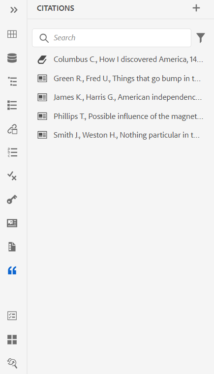
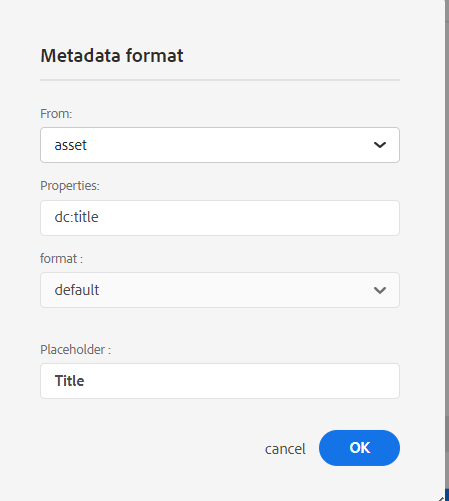
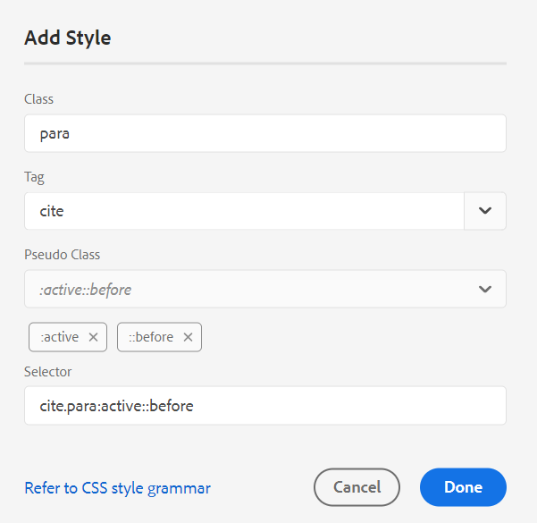
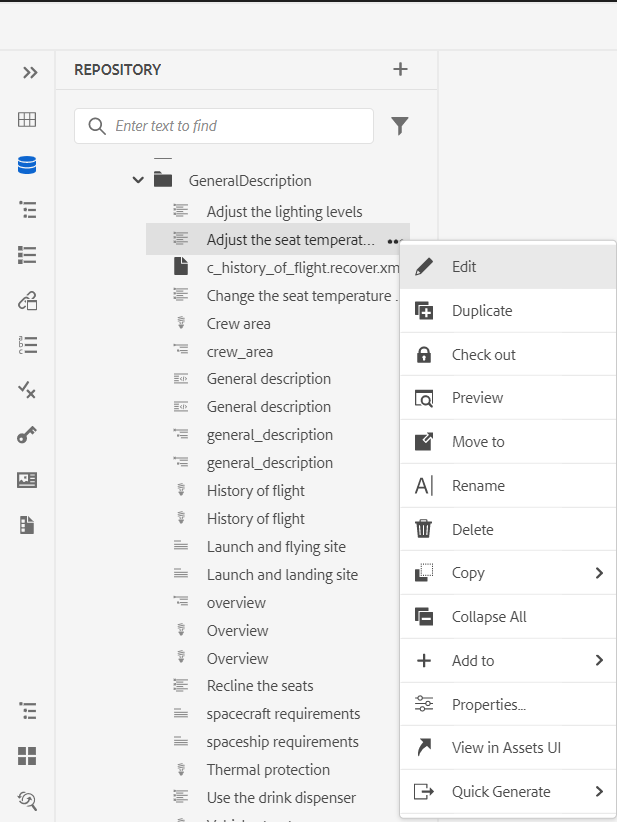
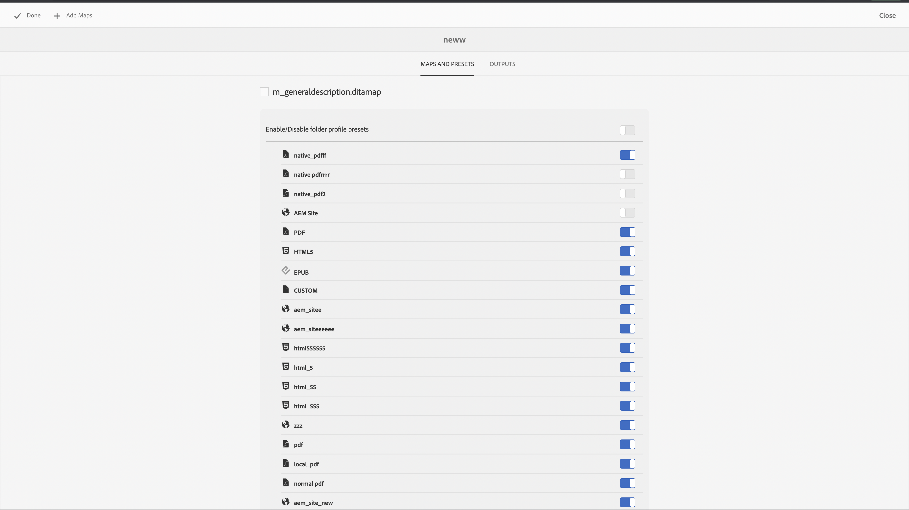

# Nouveautés de la version 4.3.0 d’Adobe Experience Manager Guides (juillet 2023)

Cet article présente les nouvelles fonctionnalités améliorées de la version 4.3.0 d’Adobe Experience Manager Guides (plus tard appelée *AEM Guides*).

Pour plus d’informations sur les instructions de mise à niveau, la matrice de compatibilité et les problèmes résolus dans cette version, voir [Notes de mise à jour](./release-notes-4-3.md).

## Se connecter à une source de données et insérer des données dans vos rubriques

Vous pouvez désormais vous connecter rapidement à vos sources de données à l’aide de connecteurs prêts à l’emploi d’AEM Guides. La connexion à une source de données vous permet de synchroniser vos informations avec la source et toutes les mises à jour des données sont répercutées automatiquement, ce qui fait d’AEM Guides un véritable hub de contenu. Cette fonctionnalité vous permet de gagner du temps et de limiter les efforts nécessaires pour ajouter ou copier manuellement les données.

AEM Guides permet à votre administrateur de configurer les connecteurs prêts à l’emploi pour les bases de données JIRA et SQL (MySQL, PostgreSQL, SQL Server, SQLite). Ils peuvent également ajouter d’autres connecteurs en étendant les interfaces par défaut.
Une fois ajoutés, vous pouvez afficher les connecteurs configurés répertoriés sous le panneau Sources de données dans l’éditeur web.

Créez un fragment de contenu pour récupérer les données d’une source de données connectée. Vous pouvez ensuite insérer les données dans vos rubriques et les modifier. Une fois que vous avez créé un générateur de fragments de contenu, vous pouvez le réutiliser pour insérer les données dans n’importe quelle rubrique.

Vous pouvez désormais également créer une rubrique à partir d’une source de données connectée. Une rubrique peut contenir des données dans différents formats, tels que des tableaux, des listes et des paragraphes. Il permet également de créer un plan DITA pour toutes les rubriques. Vous pouvez associer des métadonnées à la rubrique lors de l’extraction d’une source de données.

Pour plus d’informations, consultez la section [Utiliser les données de votre source de données](../user-guide/web-editor-content-snippet.md).

## Ajouter des citations à votre contenu

Les citations sont des références à la source d’informations ajoutée à votre contenu. Les citations vous aident à établir la crédibilité et à prévenir le plagiat. Les citations aident les lecteurs à localiser la source et à vérifier les informations présentées dans le texte.

Dans AEM Guides, vous pouvez ajouter des citations ou importer des citations et les appliquer à votre contenu. Vous pouvez ajouter ces citations à partir de n’importe quelle source de livres, de sites web et de revues.

Après avoir inséré vos citations dans vos rubriques, vous pouvez les prévisualiser dans l’éditeur web. Vous pouvez également publier du contenu avec des citations à l’aide du PDF natif.

{width="300"}

Pour plus d’informations, consultez la section [&#x200B; Ajouter et gérer des citations dans votre contenu &#x200B;](../user-guide/web-editor-apply-citations.md).

## Publication sur un fragment de contenu

Les fragments de contenu sont des éléments de contenu distincts dans AEM. Il s’agit de contenu structuré basé sur un modèle de contenu. Les fragments de contenu sont du contenu pur sans informations de conception ou de mise en page. Ils peuvent être créés et gérés indépendamment des canaux pris en charge par AEM. La modularité et la réutilisation des fragments de contenu accroissent la flexibilité, la cohérence, l’efficacité et simplifient la gestion.

AEM Guides offre désormais la possibilité de publier une rubrique ou les éléments d’une rubrique dans un fragment de contenu. Vous pouvez créer un mappage basé sur JSON entre une rubrique et un modèle de fragment de contenu. Utilisez ce mappage pour publier le contenu présent dans certains éléments ou dans tous les éléments d’une rubrique vers un fragment de contenu.

Tirez parti de la puissance d’AEM Guides et des fragments de contenu et utilisez les fragments de contenu dans n’importe quel site AEM. Vous pouvez également extraire les détails par le biais d’API prises en charge par les fragments de contenu.

{width="550"}

## Améliorations de la révision

AEM Guides offre désormais une fonctionnalité de révision améliorée avec les fonctionnalités suivantes :

### Panneau de révision pour présenter les projets de révision et les tâches de révision actives

Désormais, AEM Guides rend vos avis plus transparents. Il fournit le panneau Révisions dans l’éditeur web. Le panneau Révisions affiche tous les projets de révision et les tâches de révision actives au sein des projets de révision dont vous faites partie.

En tant qu’auteur, cette fonctionnalité vous permet d’ouvrir facilement les tâches de révision, d’afficher les commentaires et d’adresser rapidement les commentaires dans une vue centralisée.
{width="800"}
Pour plus d’informations, consultez la description de la fonctionnalité **Révision** dans la section [Panneau de gauche](../user-guide/web-editor-features.md#id2051EA0M0HS).

### Rechercher des rubriques de révision

La réalisation de révisions est une fonctionnalité essentielle d’AEM Guides. Il permet aux réviseurs de passer en revue les documents qui leur sont affectés .
Vous pouvez désormais rechercher une rubrique en saisissant une partie du texte du titre ou du chemin de fichier dans la barre de recherche de l’affichage des rubriques du panneau de révision. Vous pouvez également choisir d’afficher toutes les rubriques ou d’afficher les rubriques avec des commentaires. Par défaut, vous pouvez afficher toutes les rubriques présentes dans la tâche de révision.

{width="800"}

Pour plus d’informations, voir [Rubriques de révision](../user-guide/review-topics.md).

## Framework d’extension Guides

Créez des packages personnalisés en plus d’AEM Guides pour offrir une extensibilité à l’aide du framework d’extension AEM Guides. Ces packages sont utiles pour les développeurs et les consultants et leur donnent l’extensibilité aux composants dans l’éditeur. Ils peuvent cibler des boutons, des boîtes de dialogue et des listes déroulantes, et ajouter des JavaScript personnalisées qui peuvent facilement interagir avec l’interface utilisateur d’AEM Guides.

## Améliorations du PDF natif

Les améliorations apportées à la version 4.3.0 de Native PDF ont permis de rendre AEM Guides plus robuste :

### Prise en charge des variables de langue

AEM Guides prend en charge les variables de langue. Vous pouvez utiliser des variables de langue pour définir une version localisée des libellés d’usine tels que Note, Attention et Avertissement ou du texte statique dans la sortie PDF.
Vous pouvez ajouter les variables de langue ou la version localisée des libellés aux sections appropriées dans votre sortie PDF et dans les modèles de sortie.

#### Variables linguistiques dans la sortie PDF

Vous pouvez utiliser les variables de langue pour définir des libellés localisés pour des éléments tels que Note, Attention et Avertissement. Vous pouvez mettre à jour la valeur de ces variables dans une ou plusieurs langues, puis la valeur localisée est automatiquement sélectionnée dans la sortie PDF.
Par exemple, vous pouvez présenter l’étiquette Remarque dans votre sortie PDF des manières suivantes :

* Anglais : Remarque
* Français : Remarque
* Allemand : Hinweis

#### Variables linguistiques dans les modèles de sortie

Pour créer la sortie PDF dans différentes langues, vous deviez créer différents modèles PDF contenant du texte localisé pour chaque langue. Désormais, avec la fonctionnalité des variables de langue, il vous suffit de créer le modèle une seule fois. Ensuite, pour tout texte statique que vous devez localiser, vous pouvez créer des variables de langue correspondantes et les utiliser dans votre modèle.
Vous pouvez créer des variables de langue pour un texte plus long, comme une phrase entière ou même un paragraphe. Vous pouvez également appliquer des styles et utiliser les balises HTML pour formater ces variables de langue.

Pour plus d’informations, consultez [Prise en charge des variables de langue](../native-pdf/native-pdf-language-variables.md).

### Ajouter un filigrane à la sortie PDF pour les brouillons de documents

Vous pouvez maintenant ajouter un filigrane à la sortie PDF du document qui n’a pas encore été approuvé. Ce filigrane n’apparaît pas si vous générez le PDF du document au statut docstate « Approuvé ». Par exemple, vous pouvez ajouter un filigrane Brouillon à votre sortie PDF.

Pour plus d’informations, consultez la section [Ajouter un filigrane à la sortie PDF pour les brouillons de documents](../native-pdf/use-javascript-content-style.md#watermark-draft-document).

### Possibilité d’utiliser des métadonnées AEM dans des mises en page PDF

Les métadonnées sont la description ou la définition de votre contenu. Ces métadonnées sont stockées dans le contenu de votre plan DITA source.

Désormais, dans AEM Guides, vous pouvez également sélectionner les propriétés de métadonnées de vos ressources et les ajouter à la mise en page. AEM Guides sélectionne ensuite les propriétés de métadonnées de vos ressources et les publie dans votre sortie PDF.

{width="300"}

>[!NOTE]
>
> AEM Guides prend également en charge les propriétés de métadonnées de vos plans DITA.

Pour plus d’informations, consultez la section [&#x200B; Ajouter des champs et des métadonnées &#x200B;](../native-pdf/design-page-layout.md#add-fields-metadata).

### Classer les pages dans la sortie PDF

Vous pouvez afficher ou masquer les sections suivantes dans votre PDF et organiser l’ordre dans lequel elles doivent apparaître dans votre sortie PDF finale :

* Table des matières
* Chapitres et sujets
* Liste des figures
* Liste des tables
* Index
* Glossaire
* Citation
* Mises en page

Si vous ne souhaitez pas afficher une section particulière dans votre sortie PDF, vous pouvez la masquer en désactivant le bouton bascule.

Pour plus d’informations, voir [Ordre des pages](../native-pdf/components-pdf-template.md#page-order).

### Fusion de pages

Dans une sortie PDF native par défaut, toutes les sections commencent sur une nouvelle page. Vous pouvez maintenant fusionner une section à sa page précédente ou à la page suivante. Cette action publie la section en continuant avec la page sélectionnée dans la sortie PDF, sans saut de page entre les deux.

Pour plus d’informations, consultez la description de la fonctionnalité Fusion de pages dans la section [Ordre des pages](../native-pdf/components-pdf-template.md#page-order).

### Pages statiques

Vous pouvez également créer des mises en page personnalisées et les publier en tant que pages statiques dans la sortie PDF. Cela vous permet d’ajouter du contenu statique, tel que des notes ou des pages vierges.

Pour plus d’informations, consultez la description de la fonctionnalité Pages statiques dans la section [Ordre des pages](../native-pdf/components-pdf-template.md#page-order).

### Variables dans les références croisées

Vous pouvez utiliser des variables pour définir une référence croisée. Lorsque vous utilisez une variable, sa valeur est sélectionnée dans les propriétés.

Vous pouvez désormais également utiliser {figure} et {table}.
Utilisez {figure}pour ajouter une référence croisée au numéro de la figure. Il sélectionne le numéro de figure parmi les styles de numéros automatiques que vous avez définis pour la légende.

Utilisez {table} pour ajouter une référence croisée au numéro de la table. Il sélectionne le numéro du tableau parmi les styles de numéros automatiques que vous avez définis pour les légendes.

Pour plus d’informations, voir [Références croisées](../native-pdf/components-pdf-template.md##cross-references).

### Démarrer un chapitre à partir de la page active

Vous pouvez définir les paramètres de configuration de base pour démarrer un chapitre à partir d’une page paire ou impaire, la structure de la table des matières et définir le format de ligne de repère pour les entrées de la table des matières.

Vous pouvez également commencer un chapitre à partir de la page active. Si vous choisissez de le faire, tous les chapitres sont publiés en continu, sans sauts de page. Par exemple, si un chapitre se termine au milieu de la page 15, le chapitre suivant commence également à partir de la 15e page elle-même.

### Possibilité d’accéder aux fichiers HTML temporaires lors de la génération de la sortie PDF native

Désormais, AEM Guides vous permet de télécharger les fichiers HTML temporaires créés lors de la génération de la sortie PDF native. Dans les paramètres prédéfinis de sortie , sélectionnez l’option pour télécharger les fichiers temporaires.  AEM Guides vous permet ensuite de télécharger les fichiers temporaires créés lors de la génération de la sortie à l’aide de ce paramètre prédéfini.

Cette fonctionnalité offre de meilleures informations sur le processus de génération avec un accès aux styles et mises en page intermédiaires. Elle vous aide également à corriger ou à modifier vos styles CSS en fonction de vos besoins.

{width="800"}

Pour plus d’informations, voir [Création d’un paramètre prédéfini de sortie PDF](../web-editor/native-pdf-web-editor.md#create-output-preset).

### Refonte de l’éditeur CSS

L’éditeur CSS est maintenant repensé pour une meilleure expérience utilisateur avec des sélecteurs et des propriétés de style.

#### Amélioration de la boîte de dialogue Ajouter un style

Vous pouvez désormais utiliser des sélecteurs personnalisés pour ajouter des styles complexes. Le nouveau champ Sélecteur vous permet d’ajouter des sélecteurs personnalisés en plus de la combinaison Classe, Balise et Pseudo-Classe . Par exemple, vous pouvez créer `table a.link` style pour tous les liens hypertexte d’un tableau.

{width="300"}

#### Personnalisation des propriétés du style

AEM Guides vous présente désormais un nouveau panneau de propriétés sous la section d’aperçu pour les styles. Vous pouvez modifier les propriétés des styles plus efficacement et plus rapidement à partir du panneau des propriétés.

## Renommer et déplacer des fichiers dans la vue Référentiel

Vous pouvez désormais également renommer ou déplacer un fichier à partir du panneau du référentiel. Cette fonctionnalité est pratique et permet de gérer facilement vos fichiers à partir du panneau Référentiel. Vous pouvez sélectionner un fichier et le renommer ou le déplacer à l&#39;aide du menu **Options** du fichier sélectionné. AEM Guides affiche un message de réussite lorsque vous déplacez ou renommez un fichier.

{width="550"}

Pour plus d’informations sur le menu Options d’un fichier, consultez la description de la fonction **Vue du référentiel** dans la section [Panneau de gauche](../user-guide/web-editor-features.md#id2051EA0M0HS).

## Rapport Liens rompus dans l’éditeur web

AEM Guides vous permet de vérifier l’exhaustivité globale de vos documents techniques et de générer des rapports à partir de l’éditeur web. Désormais, dans la version de juin 2023, AEM Guides vous offre la possibilité d’afficher et de corriger les liens rompus. Il s’agit d’un rapport utile qui vous aide à gérer vos liens rompus. Vous pouvez facilement afficher les liens rompus présents dans votre plan DITA et également les corriger.
{width="800"}

Une fois que vous avez corrigé un lien, il ne s’affiche pas sous la liste des liens rompus.

Pour plus d’informations, voir [Affichage et correction des liens rompus](../user-guide/reports-web-editor.md#report-broken-links).

## Améliorations du schéma

### Utilisez des instructions de rapport pour vérifier les règles dans Schematron.

AEM Guides prend également désormais en charge les instructions de rapport avec le Schematron. Une instruction de rapport génère un message lorsqu’une instruction de test est évaluée comme vraie. Par exemple, si vous souhaitez que la description courte comporte moins de 150 caractères ou qu’elle soit égale à 1, vous pouvez définir une instruction de rapport pour vérifier les rubriques dont la description courte comporte plus de 150 caractères.

Pour plus d’informations, consultez la section [Utilisation des instructions d’assertion et de rapport pour vérifier les règles](../user-guide/support-schematron-file.md#schematron-assert-report).

### Utilisation d’expressions Regex

Vous pouvez également utiliser des expressions Regex pour définir une règle avec la fonction matches() , puis effectuer la validation à l’aide du fichier Schematron.

Pour plus d’informations, voir [Utilisation d’expressions Regex](../user-guide/support-schematron-file.md#schematron-assert-report).

### Définition de modèles abstraits

AEM Guides prend également en charge les modèles abstraits dans Schematron. Vous pouvez définir des modèles abstraits génériques et les réutiliser. Les modèles abstraits peuvent simplifier votre schéma Schematron et vous aider également à gérer et à mettre à jour votre logique de validation.

Pour plus d’informations, consultez la section [Définir des modèles abstraits](../user-guide/support-schematron-file.md#schematron-abstract-patterns).

## Prise en charge du format XLIFF dans la traduction

AEM Guides prend également en charge le format XLIFF (XML Localization Interchange File Format) pour la traduction. Vous pouvez également choisir de **Créer un projet de traduction XLIFF** pour convertir le contenu XML au format XLIFF. AEM Guides prend en charge XLIFF version 1.2.

Ce format vous permet d’exporter le contenu au format XLIFF standard, puis de le fournir aux fournisseurs de services de traduction. Pour plus d’informations, consultez la section [Créer un projet de traduction](../user-guide/translate-documents-web-editor.md#create-translation-project).

{width="350"}

## Améliorations de la collection de cartes

Une collection de cartes permet d’organiser plusieurs cartes et de les publier par lots. De nombreuses nouvelles améliorations ont été apportées à la collection de cartes :

* Désormais, vous pouvez ajouter des paramètres prédéfinis de sortie PDF natifs à une collection de mappages et les utiliser pour générer la sortie PDF.
* Vous pouvez afficher les paramètres prédéfinis de profil globaux et de dossier créés par votre administrateur et les utiliser pour générer la sortie PDF.
* Désormais, vous pouvez non seulement sélectionner un paramètre prédéfini individuel, mais vous pouvez également activer simultanément tous les paramètres prédéfinis de profil de dossier pour un plan DITA.
  {width="800"}

Pour plus d’informations, consultez [Utilisation de la collecte de mappages pour la génération de sortie](../user-guide/generate-output-use-map-collection-output-generation.md).

## Prise en charge native de PDF dans le tableau de bord de publication en bloc

Grâce à la fonction d’activation en bloc d’AEM Guides, vous pouvez activer rapidement et facilement votre contenu, de la création à la publication. Dans la carte Activation en bloc, vous pouvez inclure le paramètre prédéfini de sortie Native PDF, le site AEM, PDF, HTML5, personnalisé et la sortie JSON.
Pour plus d’informations, consultez la section [&#x200B; Activation en bloc du contenu publié &#x200B;](../user-guide/conf-bulk-activation.md).

## Outil de déplacement en bloc amélioré

Désormais, en tant qu’administrateur, vous pouvez utiliser l’outil de déplacement en bloc amélioré pour déplacer des dossiers contenant de nombreux fichiers d’un emplacement à un autre.
Vous pouvez utiliser la boîte de dialogue Parcourir le fichier pour sélectionner les dossiers sources à déplacer. Vous pouvez également accéder à l’emplacement de destination pour déplacer les dossiers sources. Sélectionnez  {width="25"} près d’un champ pour afficher plus d’informations à son sujet.

Pour plus d’informations, consultez la section [&#x200B; Déplacer des fichiers en bloc &#x200B;](../user-guide/authoring-file-management.md#move-files-bulk).

## Panneau Favoris amélioré

AEM Guides vous aide à créer une collection ou une liste de favoris de vos fichiers et dossiers et à les utiliser facilement. Le menu **Options** est désormais également disponible dans le panneau **Favoris**. Vous pouvez renommer la collection sélectionnée ou la supprimer du menu **Options**. Vous pouvez sélectionner l’option **Actualiser** pour obtenir une nouvelle liste de fichiers ou de dossiers du référentiel. Vous pouvez également afficher le contenu du dossier dans l’interface utilisateur d’Assets.

{width="650"}

>[!NOTE]
>
> Vous pouvez également actualiser la liste à l’aide de l’icône **Actualiser** située en haut.

Pour plus d’informations sur le menu **Options** d’une collection Favoris, consultez la description de la fonctionnalité **Favoris** dans la section [Panneau de gauche](../user-guide/web-editor-features.md#id2051EA0M0HS).

## Passer au thème du système

Vous pouvez également utiliser désormais le thème de l’appareil. À l’aide des **Préférences utilisateur**, vous pouvez configurer AEM Guides pour basculer automatiquement entre les thèmes clairs et sombres en fonction du thème de votre appareil.

{width="550"}

Pour plus d’informations, reportez-vous à la description de la fonctionnalité **Préférences utilisateur** dans la section [Barre d’outils principale](../user-guide/web-editor-features.md#id2051EA0G05Z).
