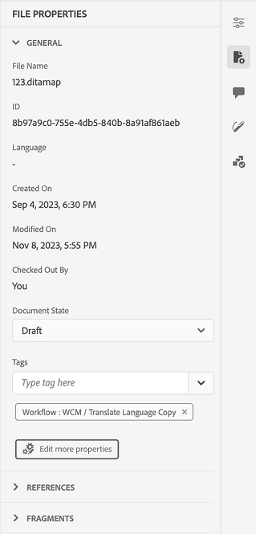
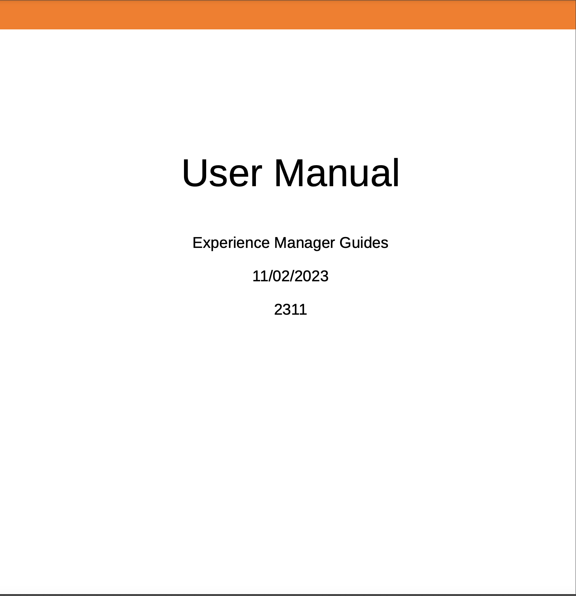

# Nouveautés de la version 4.4.0 (janvier 2024)

Cet article présente les nouvelles fonctionnalités améliorées de la version 4.4.0 d’Adobe Experience Manager Guides.

Pour obtenir la liste des problèmes qui ont été résolus dans cette version, voir [Problèmes résolus dans la version 4.4.0](../release-info/fixed-issues-4-4.md).

Découvrez les [instructions de mise à niveau pour la version 4.4.0](../release-info/upgrade-instructions-4-4.md).

## Fonctionnalité d’historique des versions remaniée dans l’éditeur web

Experience Manager Guides propose désormais une fonctionnalité améliorée d’historique des versions qui vous permet de comparer les modifications apportées à un document au fil du temps. Dans la nouvelle vue côte à côte, vous pouvez facilement comparer le contenu et les métadonnées de la version actuelle à n’importe quelle version précédente du même document. Vous pouvez également afficher les libellés et les commentaires des versions comparées. En tant qu’administrateur, vous pouvez contrôler les métadonnées de version de la rubrique et leurs valeurs à afficher dans la boîte de dialogue **Historique des versions**.

{width="800"}
*Prévisualiser les modifications dans les différentes versions d&#39;une rubrique.*

Pour en savoir plus sur la description de la fonctionnalité **Historique des versions**, consultez la section [Panneau de gauche (hérité)](/help/legacy-product-guide/user-guide/web-editor-features.md#id2051EA0M0HS).

## Gestion des paramètres prédéfinis de condition

Vous pouvez définir des attributs de condition dans vos rubriques DITA. Ensuite, utilisez les attributs de condition dans le paramètre prédéfini de condition pour publier le contenu dans un plan DITA. Experience Manager Guides offre désormais également une expérience enrichie dans l’éditeur web, ce qui vous permet de créer et de gérer plus efficacement les paramètres prédéfinis de condition. Vous pouvez également facilement les modifier, les dupliquer ou les supprimer.

{width="550"}

Pour plus d’informations, consultez la section [Utilisation de paramètres prédéfinis de condition](../user-guide/generate-output-use-condition-presets.md).

## Expérience repensée pour modifier les attributs

Vous bénéficiez désormais d’une expérience repensée permettant d’ajouter ou de modifier les attributs d’un élément à partir du panneau **Propriétés du contenu** dans l’éditeur web.

{width="300"}

*Ajoutez des attributs à partir du panneau Propriétés du contenu.*

Vous pouvez également modifier et supprimer facilement les attributs.
Pour plus d’informations, reportez-vous à la description de la fonctionnalité **Propriétés du contenu** dans la section [Panneau de droite](../user-guide/web-editor-features.md#id2051EB003YK).

## Modification de métadonnées lors de la création

Désormais, lors de la création, vous pouvez mettre à jour les balises de métadonnées de fichier à l’aide de la liste déroulante dans le **Propriétés du fichier** du panneau de droite. Vous pouvez également sélectionner **Modifier d’autres propriétés** pour mettre à jour d’autres métadonnées.

{width="300"}

*Mettez à jour les métadonnées et modifiez les propriétés du fichier dans le panneau de droite.*

Pour plus d’informations, reportez-vous à la description de la fonctionnalité **Propriétés du fichier** dans la section [Panneau de droite](../user-guide/web-editor-features.md#id2051EB003YK).

## Affichage des attributs clés dans la vue Carte

Lorsque vous définissez des attributs de clé pour les références de rubrique ou de mappage, vous pouvez également afficher le titre, l’icône correspondante et la clé dans le panneau de gauche. La clé s’affiche sous la forme `key=<key-name>`.

 {width="300"}

*Afficher l’attribut de clé dans la vue Carte.*

Pour plus d’informations, reportez-vous à la description de la fonctionnalité **Vue Carte** dans la section [Panneau de gauche](../user-guide/web-editor-features.md#id2051EA0M0HS).

## Possibilité de dupliquer une ligne de base en fonction du libellé

Experience Manager Guides offre désormais une expérience utilisateur améliorée pour la création de lignes de base à partir de l’éditeur web.
Les options **Mise à jour manuelle** et **Mise à jour automatique** sont plus intuitives et vous aident à choisir facilement entre créer une ligne de base statique ou la mettre à jour automatiquement en fonction des libellés.

 {width="300"}
*Créer une ligne de base à partir de l’éditeur web.*

Elle permet également de dupliquer une ligne de base en fonction du libellé. La version de référence est sélectionnée en fonction du libellé donné (s’il existe) lors de la duplication, ou sélectionne la version à partir de la ligne de base dupliquée.

 {width="300"} de référence

*Dupliquez une ligne de base en fonction d’un libellé ou créez une copie exacte.*

Découvrez comment [créer et gérer des lignes de base à partir de l’éditeur web](../user-guide/web-editor-baseline.md).

## Tableau de bord de collecte de cartes améliorée

Experience Manager Guides fournit un tableau de bord amélioré de collecte de cartes. Dans une collection de cartes, vous pouvez configurer rapidement les propriétés de métadonnées en bloc pour les cartes DITA. Cette fonctionnalité est pratique car vous n&#39;avez pas à mettre à jour les propriétés de métadonnées de chaque plan DITA individuellement.

Vous pouvez maintenant afficher le nom de fichier du plan DITA. Vous pouvez également afficher les références. Vous pouvez ainsi trouver rapidement la ligne de base utilisée pour un paramètre prédéfini.

{width="800"}

*Afficher, modifier et générer une sortie à partir du tableau de bord de collecte de carte.*

Découvrez comment [utiliser la collecte de mappages pour la génération de sortie](../user-guide/generate-output-use-map-collection-output-generation.md).

## Panneau Traduction améliorée

Le panneau **Traduction** a été amélioré.  Vous pouvez afficher la liste **Langues disponibles** et sélectionner rapidement le paramètre régional dans lequel vous souhaitez traduire votre projet. En une seule sélection, vous pouvez également choisir **Tout sélectionner** pour traduire votre projet dans toutes les langues disponibles.

{width="300"}

*Sélectionnez les paramètres régionaux dans lesquels vous souhaitez traduire votre projet. Sélectionnez la version par défaut, la version de référence ou la dernière version des fichiers à traduire.*

En savoir plus sur la [traduction de contenu](../user-guide/translation.md).

## Amélioration de la logique de recherche dans la boîte de dialogue Insérer un élément

Vous pouvez désormais facilement trouver les éléments dans la boîte de dialogue Insérer un élément .  Vous pouvez saisir une chaîne dans la zone de recherche et obtenir une liste de tous les éléments valides qui commencent par la chaîne saisie.

Par exemple, lorsque vous modifiez un paragraphe et que vous souhaitez insérer un élément, vous pouvez rechercher un caractère « t » pour obtenir
tous les éléments valides commençant par &#39;t&#39;.

{width="300"}

*Saisissez un caractère pour rechercher tous les éléments valides commençant par le caractère.*

Pour plus d’informations, reportez-vous à la description de la fonction **Insérer un élément** dans la section [Panneau de gauche](../user-guide/web-editor-features.md#id2051EA0M0HS).

## Possibilité de fractionner une liste au même niveau

Vous pouvez désormais facilement fractionner votre liste dans l’éditeur web. Sélectionnez l’option **Fractionner la liste** dans le menu contextuel d’un élément de liste pour fractionner la liste actuelle. Une nouvelle liste est créée au même niveau, en commençant par l’élément de liste que vous avez sélectionné pour le fractionnement.

{width="300"}

*Sélectionnez l’option pour fractionner la liste actuelle.*

Pour plus d’informations, consultez la description de la fonctionnalité **Insérer une liste** dans la section [Panneau de gauche](../user-guide/web-editor-features.md#id2051EA0M0HS).

## Déplier facilement des éléments DITA

Vous pouvez désormais facilement déplier un élément à l’aide de l’option du menu contextuel d’un élément dans l’éditeur web. Vous pouvez ainsi fusionner facilement le texte de l’élément avec son élément parent.
Pour plus d’informations, reportez-vous à la section **Déplier un élément** des [autres fonctionnalités de l’éditeur web](../user-guide/web-editor-other-features.md).

## Accès aux propriétés du fichier en mode source de création

Vous pouvez désormais accéder à la fonction **Propriétés du fichier** du panneau de droite dans les quatre modes ou vues : Disposition, Auteur, Source et Aperçu.  Cela vous permet d’afficher les propriétés de votre fichier même lorsque vous basculez entre les différents modes.

Pour plus d’informations, consultez la description de la fonctionnalité **Propriétés du fichier** dans la section [Panneau de droite](../user-guide/web-editor-features.md#id2051EB003YK).

## Afficher les fichiers par titre ou nom de fichier

Vous pouvez désormais choisir la manière d’afficher les fichiers par défaut dans l’éditeur web. Vous pouvez afficher la liste des fichiers en fonction des titres ou des noms de fichier à partir des différents panneaux à partir de la vue Création.

{width="550"}

*Modifiez la manière d’afficher les fichiers par défaut à partir de la boîte de dialogue **Préférences utilisateur**.*

## Restaurer les onglets de fichiers lors de l’actualisation du navigateur

Experience Manager Guides restaure l’état des onglets de fichiers ouverts dans l’éditeur web lorsque vous actualisez le navigateur. Pour plus d’informations, consultez la section **Actualiser le navigateur lors de la modification des fichiers** sous [Modifier les rubriques dans l’éditeur web](../user-guide/web-editor-edit-topics.md).

## Possibilité de naviguer à l’aide des raccourcis clavier

Experience Manager Guides vous permet désormais également d’utiliser des raccourcis clavier pour déplacer le curseur dans l’éditeur web. Vous pouvez utiliser les raccourcis clavier pour déplacer rapidement un mot vers la gauche ou la droite. Vous pouvez également vous déplacer au début ou à la fin de la ligne à l’aide des raccourcis clavier.
Désormais, vous pouvez également utiliser des raccourcis clavier pour déplacer le curseur au début de l’élément suivant ou à la fin de l’élément précédent.
En savoir plus sur les [raccourcis clavier dans l’éditeur web](../user-guide/web-editor-keyboard-shortcuts.md).

## Résoudre les liens croisés dans la sortie du site AEM

Les liens entre mappages (XREF avec étendue homologue) rendus dans la sortie du site AEM sont désormais résolus conformément au titre du fichier du contexte de publication défini pour le mappage généré.

## Configurez l’URL de sortie du site AEM pour utiliser le titre du document

Experience Manager Guides vous permet, en tant qu’administrateur ou administratrice, de configurer l’URL de la sortie du site AEM. Si le nom de fichier n’existe pas ou contient tous les caractères spéciaux, vous pouvez configurer pour les remplacer par un séparateur dans l’URL de la sortie du site AEM. Vous pouvez également les remplacer par le nom de la première rubrique enfant. Découvrez comment [configurer l’URL de la sortie du site AEM pour utiliser le titre du document](../cs-install-guide/conf-output-generation.md#configure-the-url-of-the-aem-site-output-to-use-the-document-title).

## Publication de plusieurs paramètres prédéfinis de sortie en parallèle

Experience Manager permet de créer des niveaux de référence en sélectionnant automatiquement les rubriques en fonction du libellé qui leur est appliqué. Désormais, vous pouvez également publier de manière transparente plusieurs paramètres prédéfinis de sortie avec des lignes de base automatiques du même plan DITA. Il n’est pas nécessaire de publier un seul paramètre prédéfini à la fois, mais vous pouvez facilement publier plusieurs paramètres prédéfinis de sortie en parallèle.

Découvrez comment [créer et gérer des lignes de base à partir de l’éditeur web](../user-guide/web-editor-baseline.md).

## Améliorations du PDF natif

Les améliorations apportées à la version 4.4.0 de Native PDF sont les suivantes :

### Utilisation de variables dans la sortie PDF

Vous pouvez utiliser des variables pour insérer et gérer de manière dynamique des informations réutilisables. Experience Manager Guides vous permet de créer, modifier et prévisualiser des variables lors de la génération de la sortie PDF. Vous pouvez modifier rapidement les valeurs des variables et rendre vos documents portables et faciles à mettre à jour.

{width="800"}

*Créer et gérer des variables dans l’éditeur web.*

Vous pouvez également créer des ensembles de variables qui remplacent les valeurs par défaut et qui attribuent des valeurs alternatives à vos variables. Insérez ces variables dans la mise en page et utilisez la même mise en page PDF. Il n’est pas nécessaire de créer des mises en page distinctes pour chaque ensemble de valeurs. Par exemple, vous pouvez créer un jeu de variables pour chaque version de produit. Cet ensemble de variables peut être constitué de variables pour différents détails de produit, tels que le nom du produit, le numéro de version et la date de publication. Vous pouvez ensuite ajouter différentes valeurs pour ces variables.

**Ensemble de variables 1 : Adobe-set1**

* Nom du produit : Experience Manager Guides
* Numéro de version : 2311
* Date de publication : 11/02/2023

**Ensemble de variables 2 : Adobe-set2**

* Nom du produit : Experience Manager Guides
* Numéro de version : 2310
* Date de publication : 09/27/2023

*Générez la sortie PDF à l’aide de variables dans la disposition PDF.*

Vous pouvez appliquer des styles et utiliser les balises HTML pour formater les variables.  Vous pouvez également mettre à jour rapidement les valeurs de n’importe quelle variable chaque fois que nécessaire et régénérer la sortie. Par exemple, si vous devez mettre à jour les détails d’une version, vous pouvez modifier la valeur de la version dans la variable VersionNumber et régénérer la sortie.

En savoir plus sur l’utilisation de [variables dans la sortie PDF](../native-pdf/native-pdf-variables.md).

### Propagation des métadonnées des ressources vers la sortie PDF

Experience Manager permet désormais de transférer les propriétés de métadonnées des ressources du plan DITA vers la sortie PDF.
À partir du paramètre prédéfini de sortie Native PDF, vous pouvez choisir les métadonnées que vous souhaitez propager au processus de publication PDF. Vous pouvez sélectionner les propriétés personnalisées et par défaut.  Les propriétés de métadonnées sélectionnées sont transférées vers le fichier PDF généré à l’aide de PDF natif.

Cette fonctionnalité est pratique car elle vous permet de conserver la cohérence des propriétés de vos ressources telles que l’auteur, la date de création ou le titre du document. Cela facilite l’organisation, la recherche et la catégorisation de vos documents.

Pour plus d’informations, consultez les paramètres **avancés** dans la sortie [Publier PDF](../web-editor/native-pdf-web-editor.md).

### Utiliser les métadonnées ajoutées dans l’élément `topicmeta` pour la sortie PDF

La fonctionnalité de métadonnées de la publication native de PDF facilite la gestion de contenu et la recherche de fichiers sur Internet.

*Sélectionnez une option pour ajouter et personnaliser des options de métadonnées.*

Experience Manager Guides offre désormais la possibilité d&#39;utiliser les métadonnées que vous avez ajoutées dans l&#39;élément `topicmeta` du plan DITA pour renseigner les champs de métadonnées de la sortie PDF. Cette option est sélectionnée par défaut.

Cette fonctionnalité permet d’améliorer la gestion des documents, d’assurer la cohérence et de rendre vos documents consultables.

Pour en savoir plus, consultez l’onglet **Métadonnées** dans la [Publication d’une sortie PDF](../web-editor/native-pdf-web-editor.md).

### Utiliser et dupliquer des modèles PDF prêts à l’emploi

Experience Manager Guides fournit des modèles PDF prêts à l’emploi ou d’usine. Dupliquez les modèles PDF d’usine pour créer les modèles PDF personnalisés.

Vous pouvez désormais également prévisualiser la miniature d’un modèle lors de la création et de la duplication d’un modèle. Vous pouvez également modifier ou supprimer cette image. Cette fonctionnalité est utile pour marquer ou distinguer les modèles portant des noms similaires.
En savoir plus sur le modèle .

{width="550"}

*Dupliquez un modèle PDF existant.*

### Modifier l’ordre des pages et publier plusieurs pages par feuille

Outre la publication des pages en fonction du document source, vous pouvez également modifier l’ordre des pages dans PDF lors de la publication d’un document de plusieurs pages.  Vous avez ainsi la possibilité de publier les pages dans différents ordres, comme toutes les pages impaires ou paires en premier. Vous pouvez également publier sous forme de livret et lire les pages comme un livre. Vous pouvez également décider du nombre de pages que vous souhaitez publier sur une seule feuille de papier. Pour plus d’informations, consultez la section [ Organisation de la page ](../native-pdf/components-pdf-template.md#page-organization).

### Trier les termes du glossaire en fonction des clés de tri

Vous pouvez désormais également trier les termes du glossaire en fonction des clés de tri. Vous pouvez utiliser la balise « sort-as » pour définir une clé de tri pour les termes du glossaire. Ensuite, vous pouvez les trier en fonction des clés de tri à la place des termes. Vous pouvez ainsi trier les termes du glossaire en fonction des termes utilisés dans différentes langues. Vous pouvez également définir une clé de tri unique pour un terme du glossaire avec une expression ou un groupe de mots.
Pour plus d’informations, voir [Paramètres avancés de PDF](../native-pdf/components-pdf-template.md#advanced-pdf-settings).

### Amélioration de la gestion des ressources pour les modèles PDF natifs

Experience Manager Guides a amélioré la gestion des ressources pour les modèles PDF natifs. Vous pouvez désormais partager et réutiliser des ressources, telles que des images, des fichiers CSS et des fichiers de polices, sur plusieurs modèles Native PDF. Grâce à cette amélioration, la gestion des ressources d’un grand nombre de modèles est beaucoup plus simple. Vous n’avez pas besoin de créer des ressources en double pour chaque modèle. Vous pouvez également les conserver dans un dossier partagé et les utiliser dans tous les modèles PDF natifs.
Pour plus d&#39;informations, voir [Modèle ](../native-pdf/pdf-template.md).
