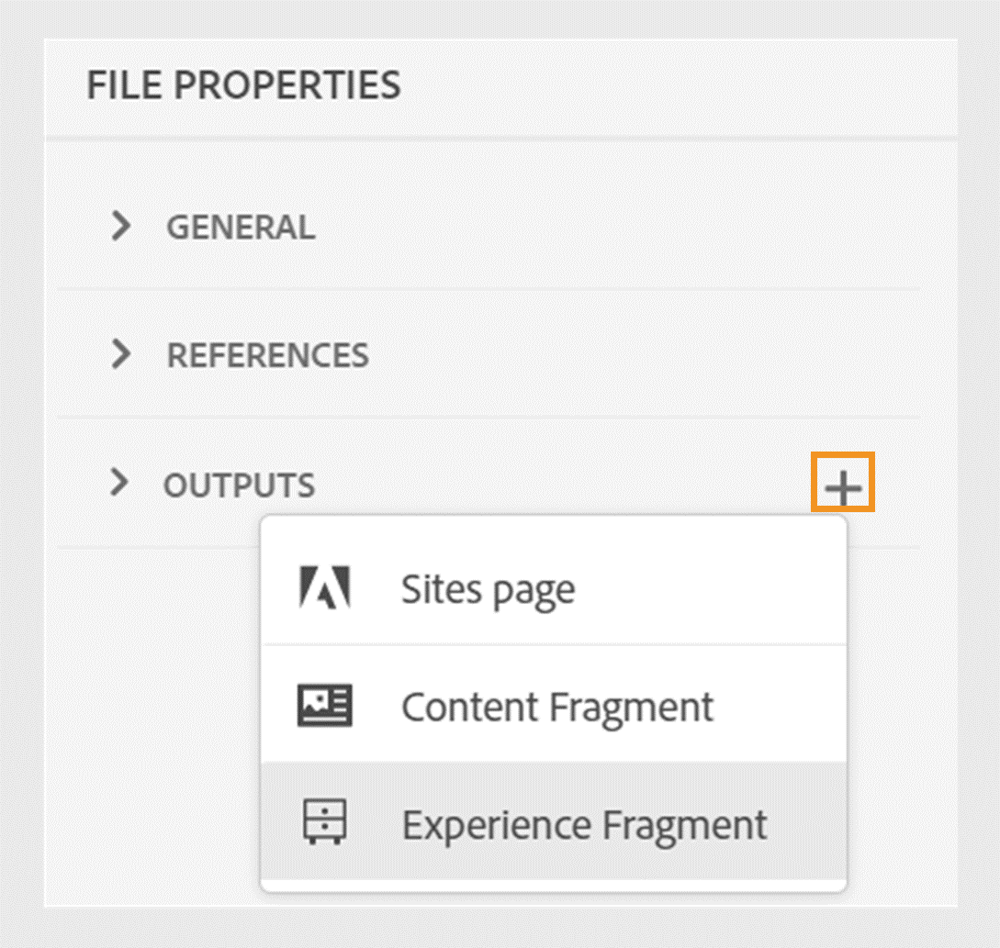
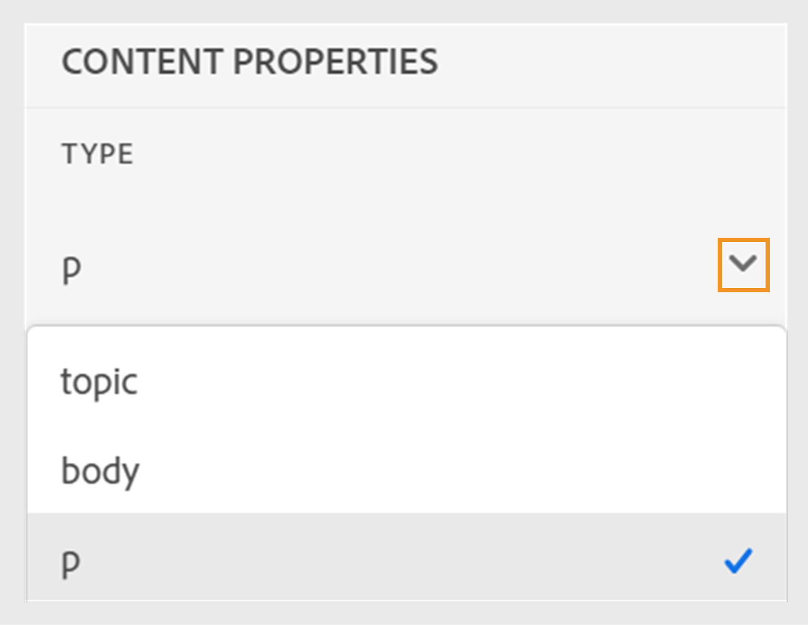

# Nouveautés de la version 4.6.0 (septembre 2024)

Cet article présente les nouvelles fonctionnalités améliorées introduites dans la version 4.6.0 d’Adobe Experience Manager Guides.

Pour obtenir la liste des problèmes qui ont été résolus dans cette version, voir [Problèmes résolus dans la version 4.6.0](../release-info/fixed-issues-4-6-0.md).

Découvrez les [instructions de mise à niveau pour la version 4.6.0](../release-info/upgrade-instructions-4-6-0.md).

## Améliorations de la publication

Les améliorations suivantes ont été apportées à la publication de contenu dans la version 4.6.0 :

### Publier une rubrique ou ses éléments dans un fragment d’expérience

Un fragment d’expérience est une unité de contenu modulaire au sein de Adobe Experience Manager qui intègre du contenu et une mise en page. Les fragments d’expérience sont essentiels à la création d’expériences cohérentes et attrayantes, qui peuvent être réutilisées sur plusieurs canaux. Par exemple, vous pouvez créer des fragments d’expérience pour les en-têtes ou pieds de page avec des éléments de marque, des bannières promotionnelles, des témoignages de clients et des promotions d’événement.

 {width="300"}

*Publiez et affichez les fragments d’expérience d’une rubrique à partir de la section **Sorties**&#x200B;de la section **Propriétés du fichier**.*

Experience Manager Guides vous permet désormais de publier une rubrique ou ses éléments dans un fragment d’expérience. Vous pouvez créer un mappage JSON entre une rubrique ou ses éléments et un modèle de fragment d’expérience. Vous pouvez également créer des variations de fragments d’expérience à l’aide des filtres de condition.

En savoir plus sur la [Publication de fragments d’expérience](../user-guide/publish-experience-fragment.md).

### Améliorations apportées à la publication de fragments de contenu

Experience Manager Guides propose également des améliorations utiles dans les fragments de contenu :

- Experience Manager Guides vous permet de publier une rubrique ou ses éléments dans un fragment de contenu.

- Vous pouvez publier et afficher les fragments de contenu d’une rubrique à partir de la section **Sorties** de la section **Propriétés du fichier**.

- Vous pouvez facilement créer des variations de fragment de contenu en filtrant le contenu avec des conditions lors de la publication dans un fragment de contenu.

- Utilisez la nouvelle interface de mappage pour sélectionner et publier facilement les éléments dans un fragment de contenu.

Désormais, la publication des fragments de contenu ne remplace que le contenu mappé au lieu de remplacer le fragment de contenu complet. Cette fonctionnalité permet à un fragment de contenu de contenir des données provenant de plusieurs sources, telles que plusieurs rubriques ou l’éditeur de fragment de contenu.

Pour plus d’informations, voir [Publication de fragments de contenu](../user-guide/publish-content-fragment.md).

### Réorganisation du paramètre prédéfini d’AEM Sites pour faciliter son utilisation

Les paramètres ont été réorganisés pour vous aider à configurer rapidement le paramètre prédéfini de sortie et à générer la sortie AEM Sites.
Vous pouvez créer les paramètres prédéfinis AEM Sites existants en sélectionnant l’option **Utiliser le mappage de composant hérité** dans la boîte de dialogue **Nouveau paramètre prédéfini de sortie**.

Affichez les onglets **Général**, **Contenu** et **Référence croisée** dans les paramètres prédéfinis AEM Sites :
- **Général** : contient les configurations générales pour générer la sortie. Vous pouvez spécifier le site et le chemin de sortie, supprimer ou remplacer des pages de sortie existantes, supprimer les pages générées précédemment pour les rubriques supprimées, sélectionner le modèle de conception, conserver les fichiers temporaires et spécifier le workflow de post-génération.
- **Contenu** : contient les paramètres applicables au contenu pour la génération de la sortie. Vous pouvez sélectionner les filtres, la ligne de base du plan DITA et les propriétés de métadonnées pour la publication.
- **Références cross-map** : cette liste contient des rubriques contenant des références cross-map avec une portée = « pair ». Vous pouvez spécifier le contexte de publication d&#39;une liste de références croisées avec scope=« peer » pour les rubriques disponibles dans d&#39;autres plans DITA. Cet onglet s’affiche si vous utilisez la version Experience Manager Guides (UUID).

### Références de mappage croisé à partir des paramètres prédéfinis AEM Sites dans l’éditeur web

La dernière amélioration de Experience Manager Guides introduit des références croisées dans les paramètres prédéfinis AEM Sites de l’éditeur web.
Les références de mappage croisé dans Experience Manager Guides permettent d’améliorer la navigation du contenu, la réutilisation du contenu et l’expérience utilisateur.

Vous pouvez spécifier le contexte de publication d&#39;une liste de références croisées à des rubriques disponibles dans d&#39;autres plans DITA avec scope=« peer ». Par exemple, la rubrique 1 de la carte A contient une référence à la rubrique 2. La rubrique 2 peut être présente dans une ou plusieurs cartes.  Vous pouvez sélectionner le mappage parent et un paramètre prédéfini spécifique ou la sortie publiée le plus récemment pour chaque lien.

Si la même rubrique est référencée plusieurs fois dans un fichier, vous pouvez ajouter un contexte de publication différent pour chaque instance. Vous bénéficiez ainsi d’une plus grande flexibilité et d’un meilleur contrôle sur leur contenu. Par exemple, la rubrique 3 est présente à la fois dans la carte B et dans la carte C. La rubrique 1 contient deux références à la rubrique 3. Vous pouvez choisir Mappage B comme mappage parent pour le premier lien et Mappage C comme parent pour le deuxième lien.

*Spécifiez le contexte de publication des rubriques liées à partir de l’onglet **Références de mappage croisé**&#x200B;du préréglage **AEM Sites**.*

### Possibilité de transmettre des métadonnées des propriétés de fichier de rubrique à la sortie native de PDF

Désormais, Experience Manager Guides vous permet d’ajouter les métadonnées des propriétés de fichier d’une rubrique aux mises en page tout en générant la sortie Native PDF. Utilisez cette fonctionnalité pour ajouter des métadonnées spécifiques à la rubrique telles que le titre, les balises et la description aux mises en page. Vous pouvez également personnaliser le PDF publié en fonction des métadonnées de la rubrique, par exemple en ajoutant un filigrane à l’arrière-plan de la rubrique en fonction de l’état du document de la rubrique.

 {width="300"}

*Ajouter des métadonnées aux champs dans vos mises en page.*

Découvrez comment [ajouter des champs et des métadonnées](../native-pdf/design-page-layout.md#add-fields-metadata) dans une mise en page.

### Prise en charge des documents Markdown dans la publication native de PDF

Experience Manager Guides prend également en charge les documents Markdown dans la publication native de PDF. Cette fonctionnalité est pratique et vous permet de générer des fichiers PDF pour les fichiers Markdown dans votre plan DITA.

Pour plus d’informations, consultez la section [Prise en charge des documents Markdown](../web-editor/native-pdf-web-editor.md#support-for-markdown-documents).

### Téléchargez le fichier temporaire lors de la génération de la sortie via DITA-OT

Vous pouvez également télécharger les fichiers temporaires générés lorsque vous publiez la sortie AEM Sites, HTML, Personnalisée, JSON ou PDF via DITA-OT. Cette fonctionnalité vous permet d’analyser tous les problèmes qui peuvent se produire pendant le processus de génération de sortie et de résoudre les problèmes efficacement.  
Vous pouvez également télécharger le fichier metadata.xml si vous avez sélectionné des propriétés de métadonnées qui ont été transmises à la sortie générée à l&#39;aide de DITA-OT. 

Pour plus d’informations sur les paramètres prédéfinis, consultez la section [Présentation des paramètres prédéfinis de sortie](../user-guide/generate-output-understand-presets.md).

### Option permettant de choisir une hiérarchie de fichiers plate ou imbriquée pour la sortie HTML5

Désormais, Experience Manager Guides vous permet de conserver la hiérarchie de dossiers plate pour les fichiers temporaires dans lesquels l’intégralité du contenu est publiée au format de sortie HTML5 et enregistrée dans un seul dossier.
Si vous ne choisissez pas d’aplatir la hiérarchie de fichiers, la sortie HTML5 est générée dans une hiérarchie de dossiers imbriquée. Cela signifie que la structure de dossiers d’origine du contenu, avec des fichiers organisés en sous-dossiers, est répliquée dans la sortie. Cette hiérarchie de dossiers imbriqués permet une organisation et une catégorisation des fichiers plus complexes, ce qui facilite la gestion et la navigation dans de grands volumes de données.

En savoir plus sur la manière de [générer une sortie HTML5](../user-guide/generate-output-html5.md)

## Améliorations de l’éditeur

Les améliorations suivantes ont été apportées à l’éditeur dans la version 4.6.0 :

### Accès en lecture seule au mode Auteur et Source pour les fichiers verrouillés

Si un fichier DITA ou Markdown est verrouillé ou extrait par un autre utilisateur, vous ne pouvez pas modifier le contenu. Outre l’aperçu, vous pouvez également l’afficher en tant que fichier en lecture seule en mode Création ou Source.
En mode lecture seule, vous pouvez afficher le contenu ainsi que les balises et les attributs en mode **Auteur** ou **Source** et modifier les propriétés du fichier.

Vous pouvez également accéder à la vue **Disposition** pour les plans DITA en lecture seule.
>[!NOTE]
>
> Les administrateurs de profils de dossiers doivent mettre à jour *ui_config.json* afin que vous puissiez accéder harmonieusement aux fichiers en lecture seule en modes Auteur, Source et Disposition.

*Afficher les fichiers verrouillés en mode Auteur et Source.*

Découvrez comment [ouvrir des fichiers verrouillés en modes Auteur et Source](../user-guide/web-editor-edit-topics.md#open-locked-files-in-author-and-source-modes).

### Sélection de contenu partiel sur plusieurs éléments pour les opérations

Experience Manager Guides améliore votre expérience de sélection du contenu dans les éléments de l’éditeur web. Vous pouvez facilement sélectionner du contenu sur différents éléments et effectuer des opérations telles que le mettre en gras, en italique ou en souligné.

Cette fonctionnalité vous permet d’appliquer ou de supprimer facilement la mise en forme du contenu partiellement sélectionné. Vous pouvez également supprimer rapidement le contenu que vous avez sélectionné dans plusieurs éléments. Une fois le contenu supprimé, si nécessaire, le contenu restant est automatiquement fusionné sous un seul élément valide. Vous pouvez également sélectionner du contenu partiel sur plusieurs éléments, puis entourer le contenu sous un élément DITA valide.

Dans l’ensemble, ces améliorations vous offrent une meilleure expérience et vous aident à améliorer votre efficacité lors de la modification de vos documents.
Pour plus d’informations, consultez la section [Sélection partielle du contenu sur plusieurs éléments](../user-guide/web-editor-edit-topics.md#partial-selection-of-content-across-elements).

### Liste séparée pour afficher et insérer des éléments valides en fonction de leur position

Lors de la modification d’un document dans l’éditeur web, vous pouvez désormais afficher une liste séparée d’éléments valides à l’emplacement actuel et en dehors de l’emplacement actuel. Selon vos besoins, vous choisissez un élément parmi les options suivantes :

- **Éléments valides à l’emplacement actuel** que vous pouvez insérer à l’emplacement actuel du curseur.
- **Éléments valides en dehors de l’emplacement actuel** que vous pouvez insérer après l’un des parents pour l’élément actif dans la hiérarchie d’éléments.

{width="300"}

*Afficher les listes séparées d&#39;éléments valides pour insérer un élément à l&#39;emplacement actuel.*

Cette liste fractionnée d&#39;éléments valides permet de gérer la structure du contenu et de respecter les normes DITA.

Pour en savoir plus sur la fonction **Insérer un élément**, consultez la section de la barre d’outils Secondaire [&#128279;](../user-guide/web-editor-features.md#2051ea0j0y4).

### Redéfinition de l’expérience pour rechercher et filtrer les fichiers dans la vue du référentiel

Le filtrage des fichiers est maintenant amélioré. La redéfinition de la fonctionnalité de filtrage des fichiers facilite les recherches et la navigation dans les fichiers.

{width="300"}

*Rechercher des fichiers contenant le texte « `general purpose.`* »

Profitez d’avantages tels qu’un accès plus rapide aux fichiers importants et une interface utilisateur plus intuitive. Votre expérience de recherche devient plus fluide et plus efficace.

 {width="300"}

*Utilisez les filtres rapides pour rechercher des fichiers DITA et non DITA.*

>[!NOTE]
>
> Les administrateurs de profils de dossiers doivent mettre à jour *ui_config.json* afin que vous puissiez accéder harmonieusement à cette fonctionnalité.

En savoir plus sur la fonction **Filtrer la recherche** dans la section [Panneau de gauche](../user-guide/web-editor-features.md#id2051EA0M0HS).

### Conditions groupées pour une organisation de contenu améliorée

Experience Manager Guides vous permet désormais de regrouper des conditions et de les présenter dans une hiérarchie imbriquée, ce qui vous permet d’ajouter plusieurs conditions à un seul groupe. En regroupant les conditions, vous pouvez mieux les organiser et les appliquer à l’ensemble de votre contenu.

{width="300"}

Pour en savoir plus sur la description de la fonctionnalité **Conditions**, consultez la section [Panneau de gauche](../user-guide/web-editor-features.md#id2051EA0M0HS).

### Personnalisez votre expérience d’éditeur web avec une nouvelle interface utilisateur de préférences utilisateur

La boîte de dialogue **Préférences utilisateur** de l’éditeur web comprend désormais un nouvel onglet **Apparence**. Ce nouvel onglet vous permet de configurer facilement les préférences d’apparence les plus courantes dans l’interface de l’éditeur web.

Vous pouvez configurer pour afficher les fichiers par titre ou nom de fichier et modifier le thème de l’application et la vue source. Il vous aide également à configurer les paramètres pour localiser un fichier ouvert dans la vue du référentiel et gérer les espaces insécables.

{width="550"}

*Personnaliser l’apparence en fonction de vos préférences.*

Pour en savoir plus sur la description de la fonctionnalité **Préférences utilisateur**, consultez la section [Panneau de gauche](../user-guide/web-editor-features.md#id2051EA0M0HS).

### Recherchez un fichier ouvert dans la vue du référentiel de l’éditeur web

Sélectionnez l’option **Toujours localiser les fichiers dans le référentiel** dans les **Préférences utilisateur** pour naviguer rapidement et localiser votre fichier dans la vue du référentiel. Vous n’avez pas à effectuer de recherche manuelle.

Lors de la modification, cette fonctionnalité vous permet également d’afficher facilement l’emplacement du fichier dans la hiérarchie du référentiel.

Pour plus d’informations, voir [localisez un fichier ouvert dans la vue du référentiel](../user-guide/web-editor-edit-topics.md#locate-an-open-file-in-the-repository-view).

### Amélioration de la gestion des espaces insécables dans l’éditeur web

Experience Manager Guides vous permet d’afficher un indicateur d’espace insécable lors de la modification de documents dans l’éditeur web. Il améliore également la manipulation des espaces insécables.
Cette option permet de convertir plusieurs espaces consécutifs en un seul espace afin de conserver l’affichage WYSIWYG du document dans l’éditeur web. Cette fonctionnalité permet également d’améliorer l’aspect général et le professionnalisme du document.

Pour plus d’informations, consultez les [autres fonctionnalités de l’éditeur web](../user-guide/web-editor-other-features.md).

### Possibilité d’afficher les propriétés de n’importe quel élément de la hiérarchie des éléments

Désormais, les Propriétés de contenu **Type** s’affichent sous la forme d’un menu déroulant. Vous pouvez afficher et sélectionner les balises de la hiérarchie complète pour la balise active dans la liste déroulante.

Ce menu déroulant vous permet d’accéder rapidement aux propriétés de contenu de la balise sélectionnée.

{width="300"}

*Sélectionnez une balise dans la hiérarchie pour la balise active.*

Pour en savoir plus sur la fonctionnalité **Propriétés du contenu**, consultez la section [Panneau de droite](../user-guide/web-editor-features.md#id2051eb003yk).

### Amélioration des performances lors de l’archivage des fichiers en bloc à partir de l’éditeur de cartes

Experience Manager Guides améliore les performances et l’expérience de la fonction d’archivage des fichiers en bloc à partir de l’éditeur de cartes. Cette amélioration vous permet d’archiver plus rapidement les fichiers en bloc.
Vous pouvez également afficher la progression de l&#39;opération d&#39;archivage des fichiers à partir de la boîte de dialogue **Enregistrer comme nouvelle version et déverrouiller**. Enfin, le message de réussite s’affiche une fois l’opération terminée et tous les fichiers extraits sélectionnés archivés.

{width="300"}

*Affichez la liste et le statut des fichiers vérifiés en bloc à partir de l’éditeur de cartes.*

Découvrez comment [utiliser l’éditeur de cartes avancé](../user-guide/map-editor-advanced-map-editor.md)

## Améliorations de la gestion du cycle de vie du contenu

La gestion du cycle de vie du contenu a été améliorée des manières suivantes :

### Possibilité de traduire du contenu dans plusieurs langues à l’aide de groupes linguistiques préconfigurés

Experience Manager Guides permet désormais de créer des groupes de langues et de traduire facilement votre contenu dans plusieurs langues. Cette fonctionnalité permet d’organiser et de gérer les traductions en fonction des besoins de votre organisation.

Par exemple, si vous devez traduire votre contenu pour certains pays d’Europe, vous pouvez créer un groupe de langues pour les langues européennes telles que l’anglais (EN), le français (FR), l’allemand (DE), l’espagnol (ES) et l’italien (IT).

{width="300"}

*Sélectionnez les groupes linguistiques ou les langues dans lesquels vous souhaitez traduire vos documents.*

>[!NOTE]
>
>Si le dossier cible d’une langue est manquant ou si la langue cible est identique à la langue source, elle est grisée et un signe d’avertissement est affiché.

En tant qu’administrateur ou administratrice, vous pouvez créer des groupes de langues et les configurer sur plusieurs profils de dossiers. En tant qu’auteur ou autrice, vous pouvez afficher les groupes de langues configurés sur votre profil de dossier.

Dans l’ensemble, la création de groupes de langues renforce l’efficacité et la productivité des projets de traduction, améliorant ainsi le processus de localisation dans plusieurs langues.

Découvrez comment [traduire des documents à partir de l’éditeur web](../user-guide/translate-documents-web-editor.md).

### Amélioration des performances et de l’évolutivité pour les grands projets de traduction

La fonction de traduction est plus rapide et plus évolutive que jamais. Il s’accompagne d’une nouvelle architecture qui offre des performances améliorées. Le temps de création du projet est maintenant plus rapide qu&#39;auparavant et les conflits pendant le processus sont presque inexistants. Ces performances améliorées vous permettent de réaliser des traductions plus rapides, ce qui garantit un fonctionnement fluide, même pour les projets de traduction volumineux.

Cette amélioration est très bénéfique, car elle améliore la productivité et l’expérience globale.

En savoir plus sur la [traduction de documents à partir de l’éditeur web](../user-guide/translate-documents-web-editor.md).

### Supprimez ou désactivez automatiquement le projet de traduction après la traduction

Désormais, en tant qu’administrateur ou administratrice, vous pouvez configurer les projets de traduction pour qu’ils soient désactivés ou supprimés automatiquement une fois la traduction terminée. Cette fonctionnalité vous permet d’utiliser efficacement les ressources et de gérer les fichiers une fois la traduction terminée.

La suppression d’un projet supprime définitivement tous les fichiers et dossiers présents dans le projet. La suppression des projets de traduction permet également de libérer de l’espace disque occupé.

Vous pouvez désactiver les projets de traduction si vous souhaitez les utiliser ultérieurement.

{width="550"}

*Configurez les groupes de langues et les paramètres de nettoyage pour les projets de traduction.*

En savoir plus sur la [suppression ou désactivation automatique du projet de traduction](../user-guide/translate-documents-web-editor.md#automatically-delete-or-disable-a-completed-translation-project).

### Désactiver le post-traitement pour certains dossiers dans Adobe Experience Manager Assets

En tant qu’administrateur, vous pouvez désormais désactiver le post-traitement et la génération des UUID pour des dossiers sélectifs sur Experience Manager Assets. Cette configuration peut s’avérer utile, en particulier lorsque vous traitez de nombreuses ressources ou des structures de dossiers complexes. Cela permet également à plusieurs utilisateurs et utilisatrices de charger rapidement et simultanément les ressources sans interférer les uns avec les autres.  

La désactivation du post-traitement pour un dossier affecte également tous ses dossiers enfants. Cependant, Experience Manager Guides offre désormais la possibilité d’activer de manière sélective le post-traitement pour les dossiers enfants individuels dans le dossier ignoré.

Découvrez comment [désactiver le post-traitement d’un dossier](../cs-install-guide/conf-folder-post-processing.md).

## Améliorations apportées aux connecteurs de sources de données

Les améliorations suivantes ont été apportées aux connecteurs de sources de données dans la version 2024.4.0 :

### Connectez-vous aux sources de données des tableaux de développement Azure (ADO) Salsify, Akeneo et Microsoft

Outre les connecteurs prêts-à-l’emploi existants, Experience Manager Guides fournit également des connecteurs pour les sources de données Salsify, Akeneo et Microsoft Azure DevOps (ADO) Boards. En tant qu’administrateur ou administratrice, vous pouvez télécharger et installer ces connecteurs. Configurez ensuite les connecteurs installés.

### Copiez et collez l’exemple de requête pour créer un fragment de contenu ou une rubrique

Vous pouvez facilement copier et coller un exemple de requête de données dans le générateur pour créer un extrait de contenu ou une rubrique. Grâce à cette fonction, vous n’avez pas à mémoriser la syntaxe ni à créer une requête manuellement. Au lieu de saisir une requête manuellement, vous pouvez copier et coller un exemple de requête, le modifier et l’utiliser pour récupérer des données selon vos besoins.

{width="800"}

*Copiez et modifiez un exemple de requête pour créer l’extrait de contenu.*

### Connexion aux fichiers de données JSON à l’aide d’un connecteur de fichiers

Désormais, en tant qu’administrateur ou administratrice, vous pouvez configurer un connecteur de fichier JSON pour qu’il utilise les fichiers de données JSON comme source de données. Utilisez le connecteur pour importer les fichiers JSON de votre ordinateur ou d’Adobe Experience Manager Assets. Ensuite, en tant qu’auteur ou autrice, vous pouvez créer des extraits de contenu ou des rubriques à l’aide des générateurs.

Cette fonctionnalité vous permet d’utiliser les données stockées dans vos fichiers JSON et de les réutiliser dans divers extraits de code. Le contenu est également mis à jour de manière dynamique à chaque fois que vous actualisez les fichiers JSON.

### Configurez plusieurs URL de ressource pour un connecteur afin de créer des fragments de contenu ou des rubriques

En tant qu’administrateur ou administratrice, vous pouvez configurer plusieurs URL de ressources pour certains connecteurs tels que Generic REST Client, Salsify, Akeneo et Microsoft Azure DevOps (ADO) Boards.

Ensuite, en tant qu’auteur ou autrice, connectez-vous aux sources de données pour créer des extraits de contenu ou des rubriques à l’aide des générateurs. Cette fonctionnalité est pratique, car vous n’avez pas à créer de source de données pour chaque URL. Il vous permet de récupérer rapidement des données de n’importe quelle ressource pour une source de données spécifique dans un seul fragment de contenu ou une seule rubrique.

Consultez plus de détails sur les connecteurs de sources de données et sur la façon de [configurer un connecteur de source de données à partir de l’interface utilisateur](../cs-install-guide/conf-data-source-connector-tools.md).

Découvrez comment [utiliser les données de votre source de données](../user-guide/web-editor-content-snippet.md).
