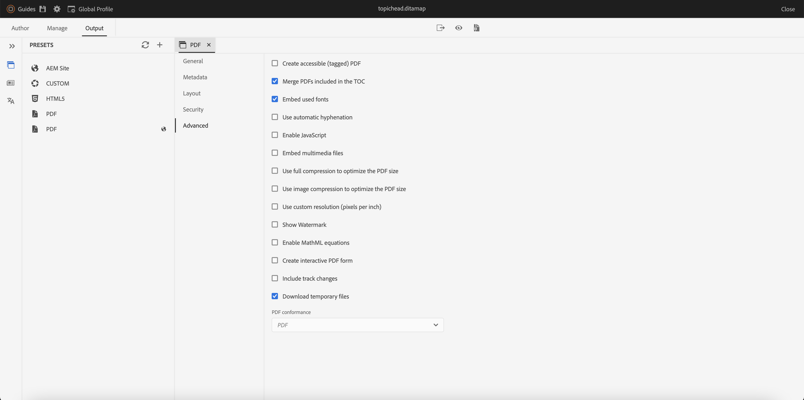

# Nouveautés de la version 4.3.0 de Adobe Experience Manager Guides (juillet 2023)

Cet article couvre les nouvelles fonctionnalités et les fonctionnalités améliorées de la version 4.3.0 des Guides Adobe Experience Manager (ultérieurement appelées *Guides d’AEM*).

Pour plus d’informations sur les instructions de mise à niveau, la matrice de compatibilité et les problèmes résolus dans cette version, voir [Notes de mise à jour](./release-notes-4.3.md).

## Connexion à une source de données et insertion de données dans vos rubriques

Vous pouvez désormais vous connecter rapidement à vos sources de données à l’aide des connecteurs prêts à l’emploi des AEM Guides. La connexion à une source de données vous permet de maintenir vos informations synchronisées avec la source. Toute mise à jour des données est répercutée automatiquement, ce qui fait d’AEM Guides un véritable hub de contenu. Cette fonctionnalité vous permet de gagner du temps et vous évite d’ajouter ou de copier manuellement les données.

AEM Guides permet à votre administrateur de configurer les connecteurs prêts à l’emploi pour les bases de données JIRA et SQL (MySQL, PostgreSQL, SQL Server, SQLite). Ils peuvent également ajouter d’autres connecteurs en étendant les interfaces par défaut.
Une fois ajoutés, vous pouvez afficher les connecteurs configurés répertoriés sous le panneau Sources de données dans l’éditeur web.

Créez un fragment de contenu pour récupérer les données d’une source de données connectée. Vous pouvez ensuite insérer les données dans vos rubriques et les modifier. Une fois que vous avez créé un générateur de fragments de contenu, vous pouvez le réutiliser pour insérer les données dans n’importe quelle rubrique.

Vous pouvez désormais également créer une rubrique à partir d’une source de données connectée. Une rubrique peut contenir des données dans divers formats, tels que des tableaux, des listes et des paragraphes. Il vous permet également de créer un mappage DITA pour toutes les rubriques. Vous pouvez associer des métadonnées à la rubrique lors de l’extraction d’une source de données.

Pour plus d’informations, voir [Utiliser les données de votre source de données](../user-guide/web-editor-content-snippet.md).

## Ajout de citations à votre contenu

Les citations sont des références à la source d’informations ajoutées à votre contenu. Les citations vous aident à établir la crédibilité et à prévenir le plagiat. Les citations aident les lecteurs à localiser la source et à vérifier les informations présentées dans le texte.

Dans AEM Guides, vous pouvez ajouter des citations ou importer des citations et les appliquer à votre contenu. Vous pouvez ajouter ces citations à partir de n’importe quelle source de livres, de sites web et de journaux.

Après avoir inséré vos citations dans vos rubriques, vous pouvez les prévisualiser dans l’éditeur web. Vous pouvez également publier du contenu avec des citations à l’aide du PDF natif.

{width="300" align="left"}

Pour plus d’informations, voir [Ajouter et gérer des citations dans votre contenu](../user-guide/web-editor-apply-citations.md).

## Publication sur un fragment de contenu

Les fragments de contenu sont des éléments de contenu distincts dans AEM. Il s’agit de contenu structuré basé sur un modèle de contenu. Les fragments de contenu sont du contenu pur sans informations de conception ou de mise en page. Ils peuvent être créés et gérés indépendamment des canaux pris en charge par AEM. La modularité et la réutilisation des fragments de contenu accroissent la flexibilité, la cohérence, l’efficacité et une gestion plus simple.

Désormais, AEM Guides permet de publier une rubrique ou les éléments d’une rubrique dans un fragment de contenu. Vous pouvez créer un mappage basé sur JSON entre une rubrique et un modèle de fragment de contenu. Utilisez ce mappage pour publier du contenu présent dans certains éléments ou tous les éléments d’une rubrique sur un fragment de contenu.

Capitalisez la puissance des Guides AEM et des fragments de contenu et utilisez des fragments de contenu dans n’importe quel site AEM. Vous pouvez également extraire les détails via des API prises en charge par les fragments de contenu.

{width="550" align="left"}

## Améliorations des révisions

AEM Guides offre désormais une fonctionnalité de révision améliorée avec les fonctionnalités suivantes :

### Panneau de révision pour afficher les projets de révision et les tâches de révision actives

Maintenant AEM Guides rend vos révisions plus transparentes. Il fournit le panneau Révisions dans l’éditeur web. Le panneau Révisions affiche tous les projets de révision et les tâches de révision actives dans les projets de révision dont vous faites partie.

En tant qu’auteur, cette fonctionnalité vous permet d’ouvrir facilement les tâches de révision, d’afficher les commentaires et d’adresser rapidement les commentaires dans une vue centralisée.
{width="800" align="left"}
Pour plus d’informations, voir la **Réviser** description des fonctionnalités dans la section [Panneau gauche](../user-guide/web-editor-features.md#id2051EA0M0HS) .

### Rubriques de révision de recherche

Réaliser des révisions est une fonctionnalité essentielle des Guides d’AEM. Il permet aux réviseurs de consulter les documents qui leur sont affectés.
Vous pouvez désormais rechercher une rubrique en saisissant une partie du texte du titre ou du chemin de fichier dans la barre de recherche de l’affichage des rubriques du panneau de révision. Vous pouvez également afficher toutes les rubriques ou afficher les rubriques avec des commentaires. Par défaut, vous pouvez afficher toutes les rubriques présentes dans la tâche de révision.

{width="800" align="left"}

Pour plus d’informations, voir [Rubriques de révision](../user-guide/review-topics.md).

## Structure de l’extension Guides

Créez des packages personnalisés au-dessus des Guides d’AEM afin de fournir une extensibilité à l’aide d’AEM Guides Extension Framework. Ces packages sont utiles aux développeurs et aux consultants et leur donnent une extensibilité aux composants de l’éditeur. Ils peuvent cibler des boutons, des boîtes de dialogue et des listes déroulantes, et ajouter du code JavaScript personnalisé qui peut facilement interagir avec l’interface utilisateur d’AEM Guides.

## Améliorations apportées aux PDF natifs

Les améliorations suivantes ont été apportées au PDF natif dans la version 4.3.0 pour que AEM Guides soit un produit plus robuste :

### Prise en charge des variables de langue

AEM Guides prend en charge les variables de langue. Vous pouvez utiliser des variables de langue pour définir une version localisée des libellés prêts à l’emploi tels que Remarque, Attention et Avertissement ou texte statique dans la sortie du PDF.
Vous pouvez ajouter les variables de langue ou la version localisée des étiquettes aux sections appropriées dans la sortie de votre PDF et dans les modèles de sortie.

#### Variables de langue dans la sortie du PDF

Vous pouvez utiliser les variables de langue pour définir des libellés localisés pour des éléments tels que Remarque, Attention et Avertissement. Vous pouvez mettre à jour la valeur de ces variables dans une ou plusieurs langues, puis la valeur localisée est automatiquement sélectionnée dans la sortie du PDF.
Par exemple, vous pouvez présenter le libellé Remarque dans la sortie de votre PDF de la manière suivante :

* Anglais : Remarque
* Français : Remarque
* Allemand : Hinweis

#### Variables de langue dans les modèles de sortie

Si vous vouliez créer la sortie du PDF dans différentes langues, vous deviez créer différents modèles de PDF contenant du texte localisé pour chaque langue. Désormais, avec la fonction Variables de langue, vous n’avez besoin de créer le modèle qu’une seule fois. Ensuite, pour tout texte statique que vous devez localiser, vous pouvez créer les variables de langue correspondantes et les utiliser dans votre modèle.
Vous pouvez créer des variables de langue pour du texte plus long, comme une phrase entière ou même un paragraphe. Vous pouvez également appliquer des styles et utiliser des balises de HTML pour formater ces variables de langue.

Pour plus d’informations, voir [Prise en charge des variables de langue](../native-pdf/native-pdf-language-variables.md).

### Ajout d’un filigrane à la sortie PDF pour les documents de brouillon

Vous pouvez maintenant ajouter un filigrane à la sortie PDF du document qui n’a pas encore été approuvé. Ce filigrane n’apparaît pas si vous générez le PDF du document dans le docstate &quot;Approuvé&quot;. Par exemple, vous pouvez ajouter un brouillon de filigrane pour la sortie de votre PDF.

Pour plus d’informations, voir [Ajout d’un filigrane à la sortie du PDF pour les brouillons de documents](../native-pdf/use-javascript-content-style.md#watermark-draft-document).

### Possibilité d’utiliser des métadonnées AEM dans des mises en page PDF

Les métadonnées sont la description ou la définition de votre contenu. Ces métadonnées sont stockées dans le contenu de votre mappage DITA source.

Désormais, dans AEM Guides, vous pouvez également sélectionner les propriétés de métadonnées de vos ressources et les ajouter à la mise en page. AEM Guides sélectionne ensuite ces propriétés de métadonnées de vos ressources et les publie dans la sortie PDF.

{width="300" align="left"}

>[!NOTE]
>
> AEM Guides prend également en charge les propriétés de métadonnées pour vos mappages DITA.

Pour plus d’informations, voir [Ajout de champs et de métadonnées](../native-pdf/design-page-layout.md#add-fields-metadata).

### Classer les pages dans la sortie du PDF

Vous pouvez afficher ou masquer les sections suivantes dans votre PDF et organiser l’ordre dans lequel elles doivent apparaître dans la sortie finale du PDF :

* Table des matières
* Chapitres et rubriques
* Liste des figures
* Liste des tableaux
* Index
* Glossaire
* Citation
* Dispositions de pages

Si vous ne souhaitez pas afficher une section spécifique dans la sortie de votre PDF, vous pouvez masquer cela en désactivant le bouton d’activation/désactivation.

Pour plus d’informations, voir [Ordre de page](../native-pdf/components-pdf-template.md#page-order).

### Fusion de pages

Dans une sortie de PDF native par défaut, toutes les sections commencent sur une nouvelle page. Vous pouvez désormais fusionner une section avec sa page précédente ou la page suivante. La section est ainsi publiée dans la suite avec la page sélectionnée dans la sortie du PDF et aucun saut de page n’est effectué entre les deux.

Pour plus d’informations, consultez la description de la fonctionnalité Fusion de pages dans [Ordre de page](../native-pdf/components-pdf-template.md#page-order) .

### Pages statiques

Vous pouvez également créer des mises en page personnalisées et les publier en tant que pages statiques dans la sortie du PDF. Cela vous permet d’ajouter du contenu statique tel que des notes ou des pages vierges.

Pour plus d’informations, consultez la description des fonctionnalités des pages statiques dans [Ordre de page](../native-pdf/components-pdf-template.md#page-order) .

### Variables dans les références croisées

Vous pouvez utiliser des variables pour définir une référence croisée. Lorsque vous utilisez une variable, sa valeur est sélectionnée dans les propriétés.

Maintenant, vous pouvez également utiliser {figure} et {table}.
Utilisation {figure}pour ajouter une référence croisée au numéro de figure. Il sélectionne le numéro de la figure dans les styles de numéro automatique que vous avez définis pour la légende de la figure.

Utilisation {table} pour ajouter une référence croisée au numéro du tableau. Il sélectionne le numéro de tableau parmi les styles de numéro automatique que vous avez définis pour la légende.

Pour plus d’informations, voir [Références croisées](../native-pdf/components-pdf-template.md##cross-references).

### Démarrez n’importe quel chapitre à partir de la page active.

Vous pouvez définir les paramètres de configuration de base pour démarrer un chapitre à partir d’une page impaire ou pair, la structure de la table des matières et définir le format de ligne de conduite des entrées de la table des matières.

Vous pouvez également commencer un chapitre à partir de la page active. Si vous choisissez de le faire, tous les chapitres sont publiés dans la suite sans sauts de page. Par exemple, si un chapitre se termine au milieu de la page 15, le chapitre suivant commence également à partir de la 15e page elle-même.

### Possibilité d’accéder aux fichiers de HTML temporaires lors de la génération de la sortie de PDF native

Désormais, AEM Guides vous permet de télécharger les fichiers de HTML temporaires créés lors de la génération de la sortie de PDF native. Dans les paramètres prédéfinis de sortie, sélectionnez l’option de téléchargement des fichiers temporaires.  AEM Guides vous permettent ensuite de télécharger les fichiers temporaires créés lors de la génération de la sortie à l’aide de ce paramètre prédéfini.

Cette fonctionnalité permet d’obtenir de meilleures informations sur le processus de génération avec accès aux styles et aux mises en page intermédiaires. Elle vous aide également à corriger ou à modifier vos styles CSS en fonction de vos besoins.

{width="800" align="left"}

Pour plus d’informations, voir [Création d’un paramètre prédéfini de sortie PDF](../web-editor/native-pdf-web-editor.md#create-output-preset).

### Reconception de l’éditeur CSS

L’éditeur CSS a désormais été repensé pour offrir une meilleure expérience utilisateur avec les sélecteurs et les propriétés de style.

#### Amélioration de la boîte de dialogue Ajouter un style

Vous pouvez désormais utiliser des sélecteurs personnalisés pour ajouter des styles complexes. Le nouveau champ Sélecteur vous permet d’ajouter des sélecteurs personnalisés en plus de la combinaison Classe, Balise et Classe Pseudo. Par exemple, vous pouvez créer des `table a.link` style de tous les liens hypertexte d’un tableau.

{width="300" align="left"}

#### Personnalisation des propriétés du style

Désormais, AEM Guides vous présente un nouveau panneau de propriétés sous la section d’aperçu pour les styles. Vous pouvez modifier les propriétés des styles plus efficacement et plus rapidement à partir du panneau Propriétés.

## Renommer et déplacer des fichiers dans la vue Repository

Vous pouvez désormais également renommer ou déplacer un fichier à partir du panneau du référentiel. Cette fonctionnalité est pratique et permet de gérer facilement vos fichiers à partir du panneau Référentiel . Vous pouvez sélectionner un fichier et le renommer ou le déplacer à l’aide de la fonction **Options** pour le fichier sélectionné. AEM Guides affiche un message de réussite lorsque vous déplacez ou renommez un fichier.

{width="550" align="left"}

Pour plus d’informations sur le menu Options d’un fichier, consultez la **Vue Repository** description des fonctionnalités dans la section [Panneau gauche](../user-guide/web-editor-features.md#id2051EA0M0HS) .

## Rapport Liens rompus dans l’éditeur web

AEM Guides vous permet de vérifier l’exhaustivité globale de vos documents techniques et de générer des rapports à partir de l’éditeur web. La version de juin 2023 d’AEM Guides vous offre désormais la fonctionnalité d’affichage et de correction des liens rompus. Il s’agit d’un rapport utile qui vous aide à gérer vos liens rompus. Vous pouvez facilement afficher les liens rompus présents dans votre carte DITA et les corriger.
{width="800" align="left"}

Une fois un lien corrigé, il ne s’affiche pas sous la liste des liens rompus.

Pour plus d’informations, voir [Afficher et corriger les liens rompus](../user-guide/reports-web-editor.md#report-broken-links).

## Améliorations des schémas

### Utilisation d’instructions de rapport pour vérifier les règles dans le schéma

AEM Guides prend désormais en charge les instructions de rapport avec le schéma. Une instruction de rapport génère un message lorsqu’une instruction de test est évaluée comme vraie. Par exemple, si vous souhaitez que la brève description soit inférieure ou égale à 150 caractères, vous pouvez définir une instruction de rapport afin de vérifier les rubriques dont la brève description comporte plus de 150 caractères.

Pour plus d’informations, voir [Utilisez des instructions d’insertion et de rapport pour rechercher des règles.](../user-guide/support-schematron-file.md#schematron-assert-report).

### Utilisation d’expressions Regex

Vous pouvez également utiliser des expressions Regex pour définir une règle avec la fonction matches(), puis effectuer la validation à l’aide du fichier de schéma.

Pour plus d’informations, voir [Utilisation d’expressions Regex](../user-guide/support-schematron-file.md#schematron-assert-report).

### Définition de modèles abstraits

AEM Guides prend également en charge les modèles abstraits dans Schematron. Vous pouvez définir des modèles abstraits génériques et réutiliser ces modèles abstraits. Les modèles abstraits peuvent simplifier votre schéma de schéma et vous aider à gérer et à mettre à jour votre logique de validation.

Pour plus d’informations, voir [Définition de modèles abstraits](../user-guide/support-schematron-file.md#schematron-abstract-patterns).

## Prise en charge du format XLIFF en traduction

AEM Guides fournit également la prise en charge du format XLIFF (XML Localization Interchange File Format) en traduction. Vous pouvez également choisir de **Créer un projet de traduction XLIFF** pour convertir le contenu XML au format XLIFF. AEM Guides prend en charge XLIFF version 1.2.

Avec ce format, vous pouvez exporter le contenu au format XLIFF standard du secteur, puis fournir la même chose aux fournisseurs de traduction. Pour plus d’informations, voir [Création d’un projet de traduction](../user-guide/translate-documents-web-editor.md#create-translation-project).

{width="350" align="left"}

## Améliorations de la collection de cartes

Une collection de cartes vous permet d’organiser plusieurs mappages et de les publier par lots. De nombreuses nouvelles améliorations ont été apportées à la collection de cartes :

* Vous pouvez désormais ajouter des paramètres prédéfinis de sortie du PDF natif à une collection de mappages et les utiliser pour générer la sortie du PDF.
* Vous pouvez afficher les paramètres prédéfinis de profil global et de dossier créés par votre administrateur et les utiliser pour générer la sortie du PDF.
* Désormais, vous pouvez non seulement sélectionner un paramètre prédéfini individuel, mais également activer tous les paramètres prédéfinis de profil de dossier pour un mappage DITA en une seule fois.
  {width="800" align="left"}

Pour plus d’informations, voir [Utilisation de la collecte des cartes pour la génération de la sortie](../user-guide/generate-output-use-map-collection-output-generation.md).

## Prise en charge des PDF natifs dans le tableau de bord de publication en bloc

Grâce à la fonctionnalité d’activation en bloc des Guides d’AEM, vous pouvez activer rapidement et facilement votre contenu de la création à l’instance de publication. Dans la carte Activation en bloc, vous pouvez inclure le paramètre prédéfini de sortie du PDF natif, le site AEM, le PDF, le HTML5, la sortie personnalisée et la sortie JSON.
Pour plus d’informations, voir [Activation en masse du contenu publié](../user-guide/conf-bulk-activation.md).

## Amélioration de l’outil de déplacement en masse

Désormais, en tant qu’administrateur, vous pouvez utiliser l’outil de déplacement en masse amélioré pour déplacer des dossiers contenant de nombreux fichiers d’un emplacement à un autre.
Vous pouvez utiliser la boîte de dialogue parcourir le fichier pour sélectionner les dossiers sources à déplacer. Vous pouvez également naviguer pour sélectionner l’emplacement de destination pour déplacer les dossiers sources. Sélectionner  {width="25" align="left"} près d’un champ pour afficher plus d’informations à son sujet.

Pour plus d’informations, voir [Déplacer des fichiers en masse](../user-guide/authoring-file-management.md#move-files-bulk).

## Panneau Favoris amélioré

AEM Guides vous aide à créer une collection ou une liste préférée de vos fichiers et dossiers et à les utiliser facilement. Maintenant **Options** est également disponible dans la **Favoris** du panneau. Vous pouvez renommer la collection sélectionnée ou la supprimer de l’onglet **Options** . Vous pouvez sélectionner la variable **Actualiser** pour obtenir une nouvelle liste de fichiers ou de dossiers du référentiel. Vous pouvez également afficher le contenu du dossier dans l’interface utilisateur d’Assets.

{width="650" align="left"}

>[!NOTE]
>
> Vous pouvez également actualiser la liste à l’aide du **Actualiser** en haut.

Pour plus d’informations sur la variable **Options** d’une collection Favoris, affichez la **Favoris** description des fonctionnalités dans la section [Panneau gauche](../user-guide/web-editor-features.md#id2051EA0M0HS) .

## Passer au thème du système

Vous pouvez également désormais utiliser le thème de l’appareil. En utilisant la variable **Préférences utilisateur**, vous pouvez configurer AEM Guides pour basculer automatiquement entre les thèmes clairs et sombres en fonction du thème de votre appareil.

{width="550" align="left"}

Pour plus d’informations, voir la **Préférences utilisateur** description des fonctionnalités dans la section [Barre d’outils principale](../user-guide/web-editor-features.md#id2051EA0G05Z) .
