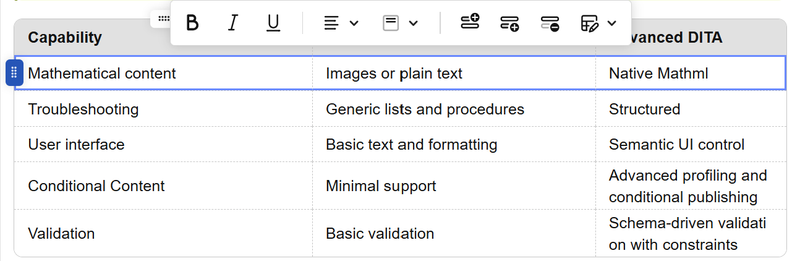
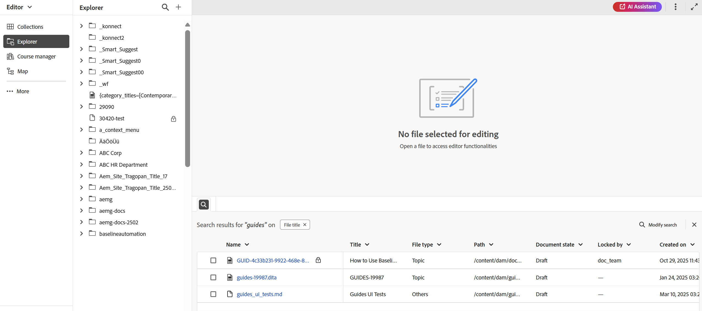
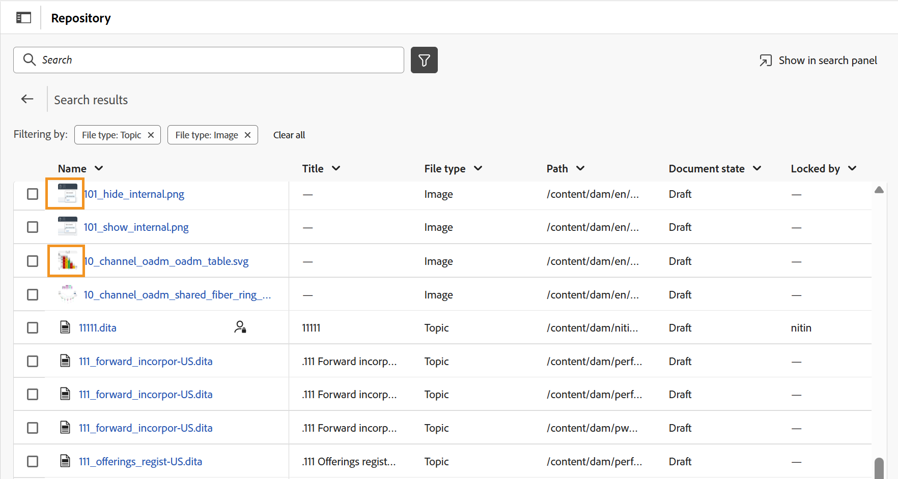

# Nouveautés de la version 5.2.0 (mai 2026)

Cet article présente les nouvelles fonctionnalités améliorées introduites dans la version 5.2.0 d’Adobe Experience Manager Guides as a Cloud Service.

Pour obtenir la liste des problèmes résolus dans cette version, voir [Problèmes résolus dans la version 5.2.0](../release-info/fixed-issues-5-2-0.md).

Découvrez les [instructions de mise à niveau pour la version 5.2.0](../release-info/upgrade-instructions-5-2-0.md).

## Présentation de l’éditeur 2.0

Editor 2.0 (ou nouvel éditeur) simplifie la création, ce qui vous permet de créer du contenu plus efficacement dans les modes de balise et non de balise, grâce à une expérience plus intuitive. Cette version offre des performances améliorées, avec des chargements de page plus rapides et une modification plus fluide, même pour les sujets volumineux et complexes. Il offre également une stabilité améliorée en comblant les principales lacunes de création, en particulier en ce qui concerne la navigation et le comportement du curseur. En outre, une interface moderne offre une interface utilisateur actualisée et conviviale qui équilibre fonctionnalité et facilité d’utilisation. Pour plus d’informations, consultez [Présentation de l’éditeur](../user-guide/web-editor.md).

Regardez cet aperçu vidéo mettant en évidence les fonctionnalités de l’éditeur 2.0.

>[!VIDEO](https://video.tv.adobe.com/v/3484007)

Voici les améliorations qui rendent la création plus facile et plus efficace.

### Interface utilisateur et expérience repensées

Une interface actualisée améliore la convivialité globale, ce qui rend la navigation et la création de contenu plus intuitives et plus cohérentes.

- **CSS plus riche pour les éléments en mode création et aperçu** : le CSS par défaut amélioré pour les éléments offre un style amélioré et une meilleure cohérence visuelle dans les modes création et aperçu.

  {width="650"}

- **Prise en charge des thèmes sombres** : la prise en charge d’un thème sombre dans la zone d’édition du contenu améliore l’expérience de création pour les utilisateurs et utilisatrices qui préfèrent travailler avec une interface sombre.

  {width="650"}

- **Paramètres consolidés de l’éditeur au niveau de l’utilisateur** : nouveau panneau de paramètres centralisé qui offre aux créateurs et aux créatrices un meilleur contrôle sur le comportement de l’éditeur, ce qui permet aux utilisateurs et aux utilisatrices de gérer plus facilement les préférences à partir d’un seul emplacement. Les options de configuration incluent la possibilité d’activer/désactiver :

   - Espaces insécables en mode Création
   - Paramètres de visibilité des balises avec ou sans attributs
   - Commentaires XML en mode Création
   - Menu d’insertion rapide pour l’insertion d’éléments dans l’éditeur

  {width="350"}

  Pour plus d’informations sur la configuration des paramètres de l’éditeur, voir [Paramètres de l’éditeur](../user-guide/config-editor-settings.md).

- **Meilleure représentation du contenu conditionnel en mode Création** : le contenu conditionnel s’affiche plus clairement en mode Création, ce qui permet aux créateurs et aux créatrices d’identifier et de gérer plus efficacement les variations. Pour plus d’informations, consultez [Conditions](../user-guide/web-editor-left-panel.md#conditions) dans le panneau de gauche de l’éditeur.

  {width="650"}

### Amélioration des fonctionnalités de création

Offre des outils améliorés et une flexibilité pour rationaliser les workflows de création et de modification de contenu.

- **Affichage des attributs avec les éléments en mode balise** : les auteurs peuvent désormais afficher les attributs d’élément en mode balise, ce qui offre une meilleure visibilité et un meilleur contrôle sur le contenu structuré. Pour configurer cette fonctionnalité, consultez les [paramètres de l’éditeur](../user-guide/config-editor-settings.md).

  {width="650"}

- **Menu d’insertion rapide** : permet d’ajouter des éléments directement lors de la modification en mode Création à l’emplacement du curseur sans accéder à la barre d’outils. Les éléments fréquemment utilisés peuvent également être configurés dans la section Favoris à l’aide des paramètres de l’éditeur pour un accès plus rapide. Pour plus d’informations, consultez [Modifier les rubriques](../user-guide/web-editor-edit-topics.md).

  {width="650"}

- **Possibilité d’afficher, de modifier et d’insérer des commentaires XML en mode création** : permet aux auteurs d’afficher, de modifier et d’insérer des commentaires XML directement en mode création, pour une meilleure visibilité dans le contenu. Pour configurer cette fonctionnalité, consultez les [paramètres de l’éditeur](../user-guide/config-editor-settings.md).

  {width="650"}

- **Mode côte à côte** : permet d’afficher simultanément les modes Auteur et Source, les deux vues restant parfaitement synchronisées pour faciliter la comparaison, la modification et la validation des modifications de contenu. Pour plus d’informations, consultez [Vues de l’éditeur](../user-guide/web-editor-views.md).

  {width="650"}

- **Amélioration de la création de tableaux** : améliore l’expérience globale de création de tableaux avec des interactions plus intuitives et efficaces pour la création et la gestion des tableaux.

   - Interactions fluides et intuitives : insérez facilement des lignes et des colonnes, ainsi que la prise en charge du glisser-déposer pour réorganiser les lignes et les colonnes.
   - Barre d’outils contextuelle : accédez directement à des actions spécifiques au tableau, telles que la mise en forme, l’alignement, la fusion et d’autres actions supplémentaires dans le tableau.
   - Configuration des tableaux : ajoutez plusieurs lignes ou colonnes en une seule action, ce qui réduit les étapes répétitives et améliore l’efficacité.

  {width="650"}

  Pour plus d’informations, consultez la section [Utiliser des tableaux](../user-guide/web-editor-other-features.md#work-with-tables-in-the-new-editor).

### Amélioration des performances pour les sujets volumineux

Le nouvel éditeur améliore l’expérience de travail sur des sujets volumineux et complexes en offrant un rendu du contenu plus rapide, des fonctionnalités d’annulation et de restauration plus fiables, ainsi qu’un marqueur d’intégrité pour indiquer clairement les modifications non enregistrées.

## Présentation du nouveau référentiel sur la page d’accueil et de l’expérience de recherche améliorée

Le référentiel, désormais accessible directement à partir de la page d’accueil, sert d’espace centralisé pour améliorer la visibilité des dossiers et des fichiers. Il comprend un **panneau de navigation Dossier** dédié et une vue personnalisable **tabulaire du référentiel**. La nouvelle expérience de recherche et de filtrage facilite considérablement la recherche et la localisation des fichiers. Pour plus d’informations, consultez la section [Connaître l’interface du référentiel](../user-guide/home-page-repository-view.md).

{align="left"}

Dans l’éditeur, l’expérience de recherche et de filtrage des fichiers est désormais cohérente avec la page d’accueil d’. Un nouveau [panneau de recherche](../user-guide/search-panel-explorer.md) situé au bas de l’interface de l’éditeur, permet d’afficher les résultats de la recherche. En outre, le référentiel est désormais renommé **Explorateur** dans l’éditeur, ce qui vous permet de parcourir les dossiers et les fichiers comme auparavant.

{align="left"}

### Prise en charge du filtre d’état du document

Vous pouvez également filtrer les résultats de la recherche dans le référentiel en fonction de l’état actuel du document des fichiers. Le filtre d’état du document vous permet d’affiner votre recherche à l’aide des valeurs de filtre disponibles définies dans le fichier `ui_config.json` de votre profil de dossier.

{align="left"}

Les valeurs de filtre par défaut disponibles pour l’état du document sont les suivantes : Brouillon, Modifier, En cours de révision, Approuvé, Révisé et Terminé.

<!-- For details on customizing the default document state filters values, view [Configure document state filters](../install-conf-guide/conf-doc-state-filters.md).  -->

>[!NOTE]
>
> Si vous utilisez des paramètres personnalisés pour `ui_config.json` assurez-vous d’en reprendre une copie avant la mise à niveau. Après la mise à jour, vérifiez et ajustez vos paramètres pour vous aligner sur les modifications introduites dans la dernière version.

### Icône de miniature pour le multimédia

Tous les fichiers multimédias s’affichent avec des icônes de miniature, ce qui facilite l’identification et la localisation visuelles des images dans le **référentiel**. Cette amélioration s’applique également lors de la recherche de fichiers dans le panneau **Recherche**, ce qui vous permet de distinguer rapidement les ressources multimédias des autres types de fichiers.

{align="left"}

## Présentation de la recherche en mode Source dans Rechercher et remplacer

Experience Manager Guides a apporté plusieurs améliorations à la fonction Rechercher et remplacer disponible dans le panneau de gauche de l’interface de l’éditeur. Outre une interface utilisateur améliorée pour une meilleure convivialité, cette version introduit un nouveau bouton bascule **Utiliser le mode source** dans le panneau **Rechercher et remplacer**.

L’activation de ce mode vous permet d’effectuer une recherche globale non seulement sur le contenu visible, mais également sur le contenu source sous-jacent (structure XML, y compris les éléments, les balises et les valeurs d’attribut) pour la chaîne recherchée. Ce mode permet d’assurer une recherche complète sur l’ensemble du contenu.

{width="650" align="left"}

Dans ce mode, vous pouvez appliquer des filtres pour affiner votre recherche par type de fichier, état du document, date de dernière modification, etc. Vous avez également la possibilité de télécharger un rapport CSV détaillé après l’opération Remplacer tout , qui fournit un instantané de toutes les actions de remplacement effectuées ainsi que leur statut de réussite et d’échec.

Pour plus d’informations, consultez la section [Rechercher et remplacer](../user-guide/web-editor-left-panel.md#find-and-replace) dans _Panneau de gauche de l’éditeur_.

>[!NOTE]
>
> Pour la fonction **Utiliser le mode source** du panneau Rechercher et remplacer , la réindexation doit d’abord être terminée.

## Amélioration de l’expérience de navigation dans les fichiers et les dossiers

Cette version introduit une interface plus épurée et plus intuitive pour parcourir les fichiers et les chemins d’accès aux dossiers dans Experience Manager Guides.

Lors de la navigation dans les fichiers, la boîte de dialogue repensée **Sélectionner un fichier** comprend désormais une disposition à onglets avec deux vues : **Référentiel** pour parcourir l’ensemble du référentiel de contenu sous la forme d’un tableau et **Collections** pour accéder rapidement aux rubriques, cartes et images fréquemment utilisées.

{width="650" align="left"}

Les principales améliorations sont les suivantes :

- Vue tabulaire des fichiers et des dossiers pour une navigation organisée.
- Chemins de navigation et panneau de navigation des dossiers pour vous déplacer facilement parmi les dossiers.
- Prise en charge de la sélection multi-fichiers pour le contenu réutilisable, les références de rubrique, le schéma, les paramètres prédéfinis de sortie (à l’aide de DITAVAL) et Workfront.
- Prévisualisez les fichiers sélectionnés pour une révision plus facile. Pour plusieurs sélections, prévisualisez tous les fichiers et supprimez-en un dans le panneau Prévisualisation, si nécessaire.
- Options de recherche et de filtrage permettant de filtrer les résultats par nom, titre, type de fichier, état du document et balises.

La boîte de dialogue **Sélectionner le chemin d’accès** propose également une vue arborescente améliorée pour la navigation entre les dossiers, offrant ainsi un moyen plus organisé et plus efficace de sélectionner les chemins d’accès dans le référentiel de contenu.

{width="350" align="left"}

Pour plus d’informations, consultez la section [Parcourir les fichiers et les dossiers dans Experience Manager Guides](../user-guide/web-editor-other-features.md#browse-files-and-folders-in-experience-manager-guides) dans _Autres fonctionnalités de l’éditeur_.

## Améliorations de la création

Les améliorations de création suivantes ont été apportées dans le cadre de cette version :

### Accédez au Chemin d’accès et à l’UUID des références dans les fichiers à partir du panneau Propriétés du contenu

Vous pouvez désormais utiliser **Chemin du lien** pour afficher le chemin d’accès relatif de la référence sélectionnée et **UUID du lien** pour afficher son identifiant unique à partir du panneau Propriétés du contenu. Vous pouvez également copier le chemin absolu complet et l’UUID associé directement à partir de l’interface à l’aide des icônes en regard de Chemin du lien et UUID du lien, ce qui facilite le suivi et la réutilisation des ressources liées.

Pour plus d’informations, consultez [Propriétés du contenu](../user-guide/web-editor-right-panel.md#content-properties).

### Indicateur de copie de travail pour les modifications de métadonnées

Toute modification apportée aux champs de métadonnées disponibles sous **Propriétés du fichier** ou appliquée sur le serveur principal déclenche également l’astérisque (*) sur la version du document. Une version de document est marquée comme _dirty (*)_ chaque fois que vous ajoutez, supprimez ou modifiez des champs de métadonnées par défaut ou personnalisés. Pour éviter que les mises à jour de métadonnées générées par le système n’affectent cet indicateur, l’administration peut configurer une liste d’exclusion pour les propriétés de métadonnées. Pour plus d’informations sur la configuration des propriétés de métadonnées, consultez la section [Configurer la liste d’exclusion des propriétés de métadonnées](../install-conf-guide/conf-metadata-prop.md).

### Améliorations apportées au panneau de validation du schéma

Les améliorations suivantes ont été apportées à l’interface utilisateur de Schematron pour améliorer la clarté, la convivialité et les résultats de validation :

- Dans le panneau Validation, un message d’état vide s’affiche lorsqu’aucun fichier Schematron n’est ajouté, offrant une meilleure clarté et orientation pour les étapes suivantes.

  {width="350" align="left"}

- Lorsque plusieurs fichiers Schematron sont ajoutés, ils sont organisés sous un accordéon consolidé, offrant une meilleure visibilité sur les fichiers Schematron configurés.

  {width="350" align="left"}

- En fonction de l’attribut de rôle défini dans le fichier Schematron, les résultats de validation sont désormais classés comme suit : `Fatal`, `Error`, `Warn` ou `Info`. Chaque catégorie comprend un nombre visible ainsi qu’une info-bulle contextuelle pour une interprétation plus claire.

  {width="350" align="left"}

Pour plus d’informations sur l’utilisation des fichiers Schematron dans Experience Manager Guides, consultez la section [Prise en charge des fichiers Schematron](../user-guide/support-schematron-file.md).

### Les copies de langue de traduction sont désormais disponibles dans le panneau de droite de l’interface de l’éditeur

Une nouvelle section **Traductions** est désormais disponible dans le panneau de droite sous *Propriétés du fichier* dans l’éditeur. Cette section permet d’accéder directement à toutes les copies de langue disponibles pour la ressource actuellement ouverte (carte, rubrique, image, etc.). Vous n’avez plus besoin d’accéder à l’interface utilisateur d’Assets pour afficher ou accéder à ces copies de langue.

{width="350" align="left"}

Pour chaque copie de langue, vous pouvez pointer sur le fichier pour localiser son chemin d’accès dans le référentiel ou simplement le sélectionner pour l’ouvrir dans l’éditeur. Outre l’ouverture de fichiers, vous pouvez également effectuer de nombreuses actions à l’aide du menu **Options**. Vous pouvez effectuer entre autres les actions suivantes : Modifier, Prévisualiser, Copier l’UUID, Copier le chemin d’accès, Ajouter aux collections et Propriétés.

Pour plus d’informations, consultez [Panneau de droite dans l’éditeur](../user-guide/web-editor-right-panel.md#file-properties).

### Actualiser les rubriques ou le mappage en mode Aperçu

>[!NOTE]
>
>Ce comportement s’applique uniquement à l’ancien éditeur. Dans le nouvel éditeur, le contenu de la Prévisualisation est automatiquement actualisé.

Présentation de la nouvelle fonctionnalité **Actualiser** pour les mappages déjà ouverts en mode Aperçu. Grâce à cette nouvelle fonctionnalité, vous pouvez facilement actualiser le contenu de la carte entière ou des rubriques individuelles présentes dans celle-ci.

- Pour actualiser l’ensemble de la carte (y compris toutes les rubriques), un nouveau bouton **Actualiser** est introduit dans le coin supérieur gauche de l’éditeur.

  {width="600" align="left"}

- Pour actualiser le contenu de rubriques individuelles, une nouvelle option **Actualiser la rubrique** est introduite dans le menu contextuel.

  {width="600" align="left"}

Pour plus d’informations, consultez [Fonctionnalités de l’éditeur de cartes](../user-guide/map-editor-advanced-map-editor.md).

### Nombre de mots pour les rubriques et les cartes

Vous pouvez désormais suivre le nombre de mots présents dans un mappage ou un fichier de rubrique. Le nouveau champ **Nombre de mots** dans le panneau de droite affiche le nombre total de mots présents dans une rubrique (ou un mappage), où les mots séparés par des espaces sont comptabilisés comme des mots individuels. Il s’actualise automatiquement chaque fois que vous enregistrez des modifications. Pour les références croisées, seul le texte affiché est inclus, tandis que les clés sont exclues.

{width="350" align="left"}

Pour plus d’informations, consultez [Panneau de droite dans l’éditeur](../user-guide/web-editor-right-panel.md#file-properties).

### Identifiez et corrigez facilement les identifiants en double dans les rubriques et les mappages de la vue de création

Experience Manager Guides comprend désormais un bouton **Dupliquer les identifiants** dans l’éditeur pour vous aider à identifier et à corriger rapidement les identifiants en double présents dans une seule rubrique ou carte. Lorsque des identifiants en double sont détectés, ce bouton s’affiche dans le coin inférieur gauche de l’interface de l’éditeur dans la vue **Auteur**. Lorsque vous sélectionnez le bouton, une liste de toutes les instances avec des ID en double s’affiche dans une fenêtre contextuelle. La sélection d’une instance met en surbrillance le contenu correspondant dans la rubrique ou le mappage, ce qui vous permet de localiser et de corriger les identifiants en double à partir du panneau de droite.

Pour plus d’informations, consultez la section [Fonctionnalités supplémentaires dans l’éditeur](../user-guide/web-editor-other-features.md).

{width="350" align="left"}

### Améliorations apportées aux filtres Référentiel et Rapports

Le filtre **Verrouillé par** sous Filtres avancés dans le référentiel et le filtre **Auteur** dans les rapports DITA map chargent désormais les listes d&#39;utilisateurs progressivement au fur et à mesure que vous faites défiler l&#39;écran, plutôt que de les charger toutes en même temps. Ce chargement paginé améliore la vitesse et rend l’utilisation de jeux de données utilisateur volumineux plus efficace et plus transparente.

### Rechercher des citations dans tous les champs du journal

Désormais, vous pouvez rechercher des citations dans tous les champs du Journal, par exemple *Titre*, *Titre du Journal*, *Auteur*, *Année*, *Volume*, *Number* et *Pages*, à l’aide de l’option **Any field** dans la boîte de dialogue **Ajouter une citation**. La recherche renvoie la citation correspondante la plus proche en fonction du texte saisi.

Pour plus d’informations sur l’ajout de citations dans Experience Manager Guides, consultez la section [&#x200B; Ajouter et gérer des citations dans votre contenu &#x200B;](../user-guide/web-editor-apply-citations.md).

{width="350" align="left"}

### Les paramètres sont désormais renommés paramètres Workspace et accessibles depuis la page d’accueil

Pour améliorer la navigation et la convivialité, les améliorations suivantes ont été apportées :

- **Paramètres** dans le menu **Autres actions** de l’éditeur a été renommé **Paramètres de Workspace**.
- Le menu **Autres actions** (menu sous forme de trois points), auparavant disponible uniquement dans l’interface de la console Éditeur et mappage , est désormais accessible à partir de la [Page d’accueil](../user-guide/intro-home-page.md).

  

### Indexation améliorée pour les suggestions intelligentes dans l’assistant AI

Vous pouvez désormais facilement suivre l’état de chaque tentative d’indexation pour les suggestions intelligentes dans l’assistant AI à l’aide de nouveaux indicateurs de statut : indexation terminée, Non synchronisée, En cours et L’indexation a échoué. La dernière date et heure d’indexation est désormais enregistrée au niveau du profil de dossier pour une meilleure traçabilité. En outre, les restrictions de dossier parent-enfant sont appliquées lors de la spécification d’un chemin de dossier ou de fichier pour l’indexation.

Pour plus d’informations, consultez [Configuration de l’assistant AI pour l’aide intelligente et la création](../install-conf-guide/conf-profiles.md#configure-ai-assistant-for-smart-help-and-authoring-only-for-cloud-service).

## Améliorations de la révision

Les améliorations de révision suivantes ont été apportées dans le cadre de cette version :

### Rappels automatisés pour les tâches de révision

Vous pouvez désormais activer **Rappels automatisés** pour planifier des notifications AEM et des rappels par e-mail à l’intention des réviseurs et réviseuses, avant ou après l’échéance d’une tâche de révision. Vous pouvez configurer plusieurs rappels dans chaque cas, avec des rappels d’échéance envoyés dans une séquence définie et des rappels d’échéance déclenchés après que la tâche a été marquée comme En retard, en fonction du planning de rappel configuré. Pour plus d’informations, consultez [Envoyer les rubriques pour révision](../user-guide/review-send-topics-for-review.md).

### Historique des versions

Les réviseurs et réviseuses peuvent désormais accéder à l’historique des versions des rubriques en cours de révision, ce qui leur permet d’afficher et de comparer les versions précédemment révisées et mises à jour d’une même rubrique dans les tâches de révision précédentes. Cela permet aux réviseurs et aux réviseuses de valider les modifications apportées depuis les cycles de révision précédents et de maintenir la continuité en examinant les commentaires, les libellés et d’autres détails connexes dans le contexte de révision actuel. Pour plus d’informations, consultez [Historique des versions du réviseur](../user-guide/review-topics.md#version-history-for-the-reviewer).

### Accès au statut des tâches de révision directement à partir du panneau de révision

En tant qu’initiateur ou initiatrice d’une tâche de révision, vous pouvez désormais vérifier le statut de votre tâche de révision directement depuis le panneau de révision. Grâce aux dernières améliorations, la boîte de dialogue **Mettre à jour la tâche** du panneau de révision comprend une nouvelle option **Vérifier le statut de la révision**. La sélection de cette option vous permet d’accéder directement au tableau de bord de révision, où vous pouvez afficher l’état de la tâche pour chaque réviseur ou réviseuse, ce qui vous permet d’accéder plus rapidement à la progression de la tâche sans avoir à changer de contexte.

Pour plus d’informations, consultez [Demander une révision ou fermer une tâche de révision en tant qu’auteur](../user-guide/review-close-review-task.md).

{width="350" align="left"}

### Affectation de réviseur basée sur la sélection du projet actif

- L’affectation d’un réviseur à une tâche de révision dépend désormais d’une sélection de projet actif. Le champ **Affecter à** de la page *Créer une tâche de révision* reste désactivé jusqu’à ce qu’un projet actif soit sélectionné. Une fois un projet sélectionné, le champ **Affecter à** est activé et répertorie uniquement les utilisateurs et les groupes d’utilisateurs associés à ce projet. Cela permet de s’assurer que les tâches de révision sont affectées uniquement à des membres valides du projet et empêche toute sélection involontaire du réviseur.

  

- Le champ **Affecter à** prend désormais en charge la recherche à saisie semi-automatique, ce qui vous permet de localiser rapidement les utilisateurs ou les groupes d’utilisateurs en saisissant du texte.

Grâce à ces améliorations, la sélection des réviseurs et réviseuses est plus précise, plus efficace et mieux alignée sur les workflows de révision spécifiques aux projets.

Pour plus d’informations, voir [Envoyer les rubriques pour révision](../user-guide/review-send-topics-for-review.md).

### Modifier les tâches de révision en cours

Vous pouvez ajouter de nouvelles rubriques à une tâche de révision en cours (si elles n’ont pas été précédemment envoyées pour révision) ou supprimer des rubriques d’une tâche de révision en cours sans affecter le workflow de révision. Sur la page **Détails de la tâche**, vous pouvez simplement sélectionner ou désélectionner des rubriques pour modifier la liste de rubriques. Les réviseurs et réviseuses sont avertis (par AEM et par e-mail) de toute modification apportée aux rubriques qui leur sont attribuées par le biais d’AEM et de notifications par e-mail. Pour plus d’informations, voir [Envoyer les rubriques pour révision](../user-guide/review-send-topics-for-review.md).

{width="650" align="left"}

## Améliorations apportées à la traduction

Les améliorations de traduction suivantes ont été apportées dans le cadre de cette version :

### Indicateur pour les ressources non versionnées envoyées pour traduction

Lors de la gestion des traductions, il est important de s’assurer que le contrôle de version de tout le contenu est effectué avant de l’envoyer pour traitement. Pour faciliter cette tâche, Experience Manager Guides fournit désormais un indicateur clair pour les rubriques qui ont enregistré des modifications, mais qui n’ont pas encore de version.

Si un fichier contient des modifications sans version (non enregistrées en tant que nouvelle version dans votre mappage), une icône _info_ s’affiche en regard du fichier, indiquant que des mises à jour existent. Pour vous concentrer rapidement sur ces fichiers, activez l’option **Afficher uniquement les ressources avec des modifications sans version** dans le panneau Filtres.

Pour plus d’informations, consultez la section [Traduire les documents à partir de la console Carte](../user-guide/translate-documents-web-editor.md).

{width="650" align="left"}

## Améliorations de la gestion des ressources

Cette version apporte les améliorations suivantes à la gestion des ressources :

### Utilisez l’option Aplatir la hiérarchie de fichiers pour télécharger des cartes avec les noms de fichiers d’origine et les métadonnées associées

Désormais, vous pouvez utiliser l’option Aplatir la hiérarchie de fichiers pour télécharger une carte avec son nom de fichier d’origine. En outre, le package téléchargé comprend un fichier `metadata.json`, ce qui rend les métadonnées associées facilement accessibles et réutilisables en dehors de Experience Manager Guides.

Pour plus d’informations sur le téléchargement de fichiers dans Experience Manager Guides, consultez [Télécharger des fichiers](../user-guide/authoring-download-assets.md).

### Les propriétés de métadonnées ne peuvent plus être modifiées pour les fichiers en lecture seule

Avec cette version, lorsque le paramètre `Disable edit without locking the file` est activé, les propriétés du fichier ne peuvent plus être modifiées si un fichier est en mode **Lecture seule**.

Cette limitation s&#39;applique à tous les points d&#39;entrée où les propriétés peuvent être modifiées pour les fichiers DITA et Markdown, notamment :

- Le **panneau de droite** de l’interface de l’éditeur
- Option **Propriétés** dans le menu contextuel du fichier
- Rapport de métadonnées d’une carte
- Interface utilisateur d’Assets

Pour les ressources non DITA (telles que les images et les fichiers multimédias), les propriétés de métadonnées restent modifiables même en mode lecture seule.

Si un fichier est en lecture seule, vous devez d&#39;abord extraire le fichier avant d&#39;apporter des modifications à ses propriétés. Cette modification applique des contrôles d’autorisation plus stricts et garantit que les mises à jour des propriétés suivent les mêmes règles d’extraction et de verrouillage que les modifications de contenu.

### Utilisation d’une expression régulière pour activer ou désactiver le post-traitement

Vous pouvez désormais utiliser une expression régulière pour activer ou désactiver le post-traitement pour les dossiers. Cette amélioration permet aux administrateurs de définir des règles de post-traitement qui s’appliquent à plusieurs dossiers ou à des hiérarchies de dossiers entières à l’aide d’une seule configuration, au lieu de spécifier des chemins d’accès aux dossiers individuels.

Pour plus d’informations, consultez [Utilisation d’une expression régulière pour activer ou désactiver le post-traitement](../install-conf-guide/conf-folder-post-processing.md).

- Exécutez le traitement des ressources au niveau du dossier et des fichiers individuels.
- Filtrez les ressources en choisissant des types de ressources spécifiques, tels que des rubriques, des mappages, Markdown, HTML/CSS, DITAVAL ou d’autres fichiers pris en charge, afin de traiter uniquement les fichiers dont vous avez besoin.
- Appliquez des filtres basés sur la date pour limiter l’étendue du traitement pour une période spécifiée.
- Retraiter les ressources directement à l’aide de la nouvelle option (**Retraiter les ressources**) disponible dans le menu contextuel des fichiers et dossiers dans la vue Référentiel et le panneau Explorateur.

Pour plus d’informations sur le traitement des ressources, voir [Traitement des ressources](../user-guide/asset-processor.md).

### Nettoyage automatisé de l’arborescence B pour des performances optimales

Pour maintenir l’efficacité du système et prévenir la congestion des ressources, un nouveau processus de fond nettoie régulièrement les arbres B au niveau du système. Cela permet de s’assurer que les ressources qui n’existent plus ou qui ont été ajoutées temporairement n’occupent pas d’espace inutile.

Le système identifie intelligemment les candidats au nettoyage et effectue une suppression automatisée. De plus, cette fonctionnalité est configurable, ce qui permet aux administrateurs et administratrices de contrôler son comportement en fonction des besoins opérationnels.

Pour plus d’informations, consultez la section [Configurer le nettoyage de l’arborescence B](../install-conf-guide/conf-btree-cleanup.md).

### Amélioration de la gestion des plans DITA avec un grand nombre de clés

Vous pouvez désormais travailler en toute simplicité avec les plans DITA qui contiennent un grand nombre de clés. Cette amélioration accélère le chargement et améliore les performances, ce qui facilite la gestion des cartes complexes sans interruptions.

Après la mise à niveau de la build, le système peut subir une augmentation temporaire de la charge, ce qui peut entraîner un retard dans le post-traitement des données nouvellement chargées. Cela est dû à l’exécution d’un script unique automatisé (OTS) en arrière-plan. Une fois le script terminé, les performances du système reviendront à la normale.

### Amélioration du traitement des ressources

- Un processus automatisé est introduit pour maintenir à jour les ressources du `/content/dam`. Le système déclenche le retraitement des ressources toutes les 15 minutes. Au cours de chaque cycle, les ressources qui ont été ajoutées récemment ou qui n’ont pas été traitées au cours des 15 dernières minutes sont récupérées et retraitées, ce qui améliore l’efficacité et la cohérence de votre référentiel de contenu.
- Exécutez le traitement des ressources au niveau du dossier et des fichiers individuels.
- Filtrez les ressources en choisissant des types de ressources spécifiques, tels que des rubriques, des mappages, Markdown, HTML/CSS, DITAVAL ou d’autres fichiers pris en charge, afin de traiter uniquement les fichiers dont vous avez besoin.
- Appliquez des filtres basés sur la date pour limiter l’étendue du traitement pour une période spécifiée.
- Retraiter les ressources directement à l’aide de la nouvelle option (**Retraiter les ressources**) disponible dans le menu contextuel des fichiers et dossiers dans la vue Référentiel et le panneau Explorateur.

Pour plus d’informations sur le traitement des ressources, voir [Traitement des ressources](../user-guide/asset-processor.md).

## Améliorations de la publication

Les améliorations de publication suivantes ont été apportées dans le cadre de cette version :

### Configuration de rendus d’image personnalisés pour des paramètres prédéfinis de sortie spécifiques

Vous pouvez désormais configurer différents rendus d’image pour les paramètres prédéfinis de sortie individuels sous le même type de sortie à l’aide de l’attribut `outputName` dans `renditionmapping.xml`. Cette amélioration vous offre une plus grande flexibilité lors de la publication de contenu qui nécessite différentes résolutions d’image selon les scénarios. Par exemple, vous pouvez souhaiter une image haute résolution pour votre sortie HTML5 principale tout en utilisant une miniature plus petite pour un paramètre prédéfini léger.

Pour plus d’informations, consultez la section [Gérer le rendu d’image dans la génération de sortie](../install-conf-guide/conf-output-generation.md#handle-image-rendition-during-output-generation).

### Télécharger les journaux pour la sortie générée

Lors de la génération de la sortie et de l’affichage des journaux, un nouveau bouton **Télécharger les journaux** est désormais disponible. Il vous permet de télécharger le journal sur votre appareil local pour un accès et une révision plus faciles.

### Variables de langue pour les références croisées dans la sortie PDF native

Lors de la publication d’une sortie PDF native, vous pouvez utiliser des [variables de langue](../native-pdf/native-pdf-language-variables.md) pour traduire du texte de référence croisée statique comme _Voir dans le chapitre_ ou _Voir sur la page_. La variable utilise la langue définie dans la rubrique via l’attribut `xml:lang`.

Pour plus d’informations sur la configuration du paramètre prédéfini de sortie PDF natif et des paramètres de référence croisée, consultez la section [Paramètre prédéfini de sortie PDF natif](../web-editor/native-pdf-web-editor.md).

### Prise en charge du mappage de composants au niveau des éléments dans AEM Sites (à l’aide du mappage de composants composites)

Experience Manager Guides prend désormais en charge le mappage de composants au niveau des éléments dans la sortie AEM Sites (à l’aide du mappage de composants composites), ce qui permet aux équipes de contrôler précisément la manière dont les éléments DITA s’affichent à l’aide de `componentmapping.json`. En mappant des `topicref`, des titres, des images, des tableaux et plus encore aux composants principaux d’AEM appropriés, vous obtenez une structure plus épurée au lieu de tout ce qui est par défaut le composant de texte. Cela se traduit par de meilleures performances et des expériences Sites plus riches et plus modernes.

Pour plus d’informations, consultez la section [Mappage des composants pour AEM Sites](../install-conf-guide/component-mapping.md).

## Nouvelle expérience de base introduite dans Experience Manager Guides

La gestion de lignes de base complexes et volumineuses est désormais plus rapide, plus stable et plus facile à mettre à l’échelle grâce à la **nouvelle expérience de ligne de base**, reposant sur une architecture de ligne de base repensée. Cette mise à jour résout des problèmes de performances et de fiabilité de longue date tout en préservant les workflows existants.

Disponible en version bêta, cette mise à jour apporte une solution aux problèmes courants tels que le chargement lent, les incohérences des états de référence et une gérabilité limitée, en offrant une expérience de référence plus rapide, plus stable et plus prévisible, avec une prise en charge supplémentaire de l’automatisation et des opérations de référence à grande échelle. Les principales améliorations sont les suivantes :

- Amélioration des performances et de l’évolutivité
- Cohérence renforcée de l’interface utilisateur et du serveur principal
- Filtrage, navigation et visibilité des dépendances étendus

Pour plus d’informations, consultez [Nouvelle expérience de base (Beta) dans Experience Manager Guides](../user-guide/web-editor-baseline-v2.md).

## Améliorations de l’API

Les améliorations d’API suivantes ont été apportées dans le cadre de cette version :

- De nouvelles API sont introduites pour créer un projet de traduction et suivre leur statut. Ces API permettent d’automatiser le processus de traduction, de réduire les efforts manuels et d’améliorer l’efficacité. Pour plus d’informations, consultez [Créer un projet de traduction](../api-reference/translation-project.md)
- Amélioration des API de traitement des ressources avec une meilleure capacité de filtrage des fichiers et des dossiers. Pour plus d’informations, consultez [Traitement des ressources](../api-reference/bulk-assets-processing.md).
- Une nouvelle API est disponible pour effectuer le suivi du statut de post-traitement des ressources et dossiers individuels. Cela s’avère particulièrement utile pour les équipes qui utilisent des workflows automatisés, où la publication ne doit se produire qu’une fois le contenu entièrement traité. L’API offre un moyen fiable de confirmer la préparation, ce qui réduit le risque d’échecs de publication causés par un traitement incomplet. En outre, avec l’introduction de cette API, les événements de post-traitement des ressources ne se déclenchent pas automatiquement. Au lieu de cela, les administrateurs peuvent désormais activer cet événement par le biais d’un paramètre dans `fmdita config manager`.
Pour plus d’informations, consultez [API pour suivre le statut de post-traitement de ressources et de dossiers individuels](../api-reference/track-post-processing-status.md) et [Paramètre du gestionnaire d’événements de post-traitement dans le gestionnaire de configuration fmdita](../api-reference/post-process-event.md)

## Présentation de la formation produit et du contenu d’apprentissage dans Experience Manager Guides

La fonction de contenu **Formation et apprentissage du produit** de Experience Manager Guides permet aux équipes de formation et aux concepteurs d’instructions de créer des cours en ligne interactifs directement à partir de l’interface de Experience Manager Guides.

Grâce à la création basée sur des modèles, aux composants interactifs du cours et à la prise en charge des évaluations, les équipes peuvent développer un contenu de formation de haute qualité aligné sur leurs objectifs organisationnels.

>[!NOTE]
> 
> La fonctionnalité de contenu de formation et d’apprentissage du produit reste désactivée par défaut pour toutes les instances de Experience Manager Guides as a Cloud Service. Les administrateurs peuvent activer cette fonctionnalité au niveau du profil de dossier depuis **Paramètres** > **Général**.

Les principales fonctionnalités sont les suivantes :

- Gestion centralisée du contenu d’apprentissage
- Création pilotée par les modèles
- Prise en charge de la réutilisation du contenu
- Création et gestion des évaluations
- Workflows de révision web
- Gestion de la traduction de pointe
- Publication multicanal à l’aide de formats de sortie SCORM et PDF prêts à l’emploi

Pour plus d’informations, consultez les sections [Guide de prise en main](../learning-content/course-overview.md) et [Guide de configuration](../lc-config-guide/introduction.md).