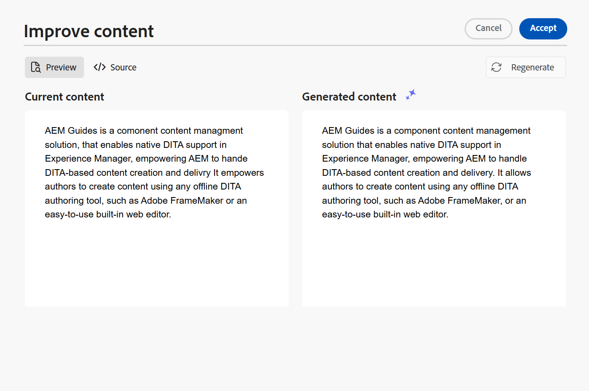

# Créer des documents de manière intelligente avec l’assistant AI (Beta)

Adobe Experience Manager Guides fournit un outil d’assistant d’IA qui vous aide à rendre votre création plus intelligente et plus rapide. À l’aide de cet outil, affichez les suggestions intelligentes pour réutiliser le contenu du référentiel de contenu existant. Utilisez la fonction d’invite de texte pour fournir une invite et modifier le contenu en fonction de vos besoins. Utilisez l’assistant d’IA pour convertir intelligemment un paragraphe en liste. Vous pouvez créer une brève description pour la rubrique actuelle en fonction du contenu sélectionné. Cette fonctionnalité vous permet également d’améliorer et de traduire facilement le contenu sélectionné.

>[!NOTE]
>
> Cette fonctionnalité de création est disponible uniquement pour les rubriques DITA et n&#39;est accessible qu&#39;à partir de l&#39;interface de l&#39;éditeur. Sur la page d’accueil et la console Carte, seul le panneau **Aide** s’affiche. Les options disponibles dans la fonction Création sont configurées au niveau du profil du dossier par les administrateurs à l’aide des paramètres de Workspace.

Après avoir sélectionné le texte d’une rubrique, vous pouvez choisir d’effectuer l’une des actions de l’assistant AI :

{width="300" align="left"}

## Suggérer du contenu réutilisable

Utilisez la fonction **Suggérer du contenu réutilisable**  de contenu réutilisable pour créer du contenu de manière cohérente et précise. Vous pouvez sélectionner le contenu et Experience Manager Guides fournit des suggestions sur la manière de réutiliser le contenu existant dans votre référentiel.
En savoir plus sur l’utilisation de suggestions intelligentes optimisées par [IA pour créer du contenu](authoring-ai-based-smart-suggestions.md).

## Utiliser une invite de texte

Une invite de texte est une instruction, une question ou une instruction qui guide l’assistant d’IA dans la génération d’une réponse spécifique.

Vous pouvez utiliser une invite de texte pour modifier le contenu. Par exemple, vous pouvez sélectionner le contenu de la rubrique active et utiliser l’invite *Rendre le texte plus concis*. De même, vous pouvez utiliser une invite de texte pour ajouter un attribut à la balise utilisée dans le contenu sélectionné.

1. Sélectionnez le texte pour lequel vous souhaitez utiliser l’invite de texte.
1. Sélectionnez **Utiliser l’invite de texte** dans le panneau **Création**.
1. Envoyez une invite de l’une des manières suivantes :

   - Choisissez une invite parmi les invites suggérées.
   - Révisez ou modifiez une invite suggérée pour créer une invite personnalisée selon vos besoins.

     >[!NOTE]
     >
     > Les invites suggérées sont configurées dans le `ui_config.json` par votre administrateur.

   - Saisissez votre invite dans la zone de texte.

1. Sélectionnez **Régénérer**  pour obtenir une autre réponse ou sortie en fonction de l’invite.

1. (Facultatif) Sélectionnez **Développer**  pour ouvrir l’éditeur **Utiliser une invite de texte**. Il affiche le contenu actuel et le contenu généré. Vous pouvez modifier le contenu de la disposition source et vérifier l’aperçu.

   

   >[!NOTE]
   >
   > Les réponses sont générées en fonction du contenu sélectionné.

1. Vous pouvez également modifier l’invite dans l’éditeur et générer à nouveau la réponse. Par exemple, vous pouvez modifier l’invite pour rendre le texte plus concis avec environ 40 mots.

1. Vous pouvez vérifier la source du contenu généré et le modifier si nécessaire.

1. Sélectionnez **Accepter** pour remplacer le contenu sélectionné dans la rubrique par le contenu généré.
1. **Annuler** : annule l’action d’invite de texte. Retourne au panneau de création.

   >[!NOTE]
   >
   > Sélectionner l’icône **Ignorer** dans le panneau de création vous ramène à l’état initial de l’assistant d’IA.

## Améliorer le contenu

Utilisez la fonctionnalité **Améliorer le contenu** pour améliorer la qualité du contenu sélectionné de la rubrique actuelle. Vous pouvez sélectionner le contenu pour vérifier l’orthographe, la langue et la structure grammaticale, et suggérer une meilleure version du contenu. Elle améliore également la qualité des peines.

1. Sélectionnez le contenu.
1. Sélectionnez **Améliorer le contenu**  pour trouver les suggestions relatives au contenu amélioré.
1. Sélectionnez **Régénérer** pour obtenir une autre suggestion d’amélioration du contenu.

1. (Facultatif) Sélectionnez **Développer** pour ouvrir l’éditeur de contenu amélioré. Il affiche le contenu actuel et généré. Vous pouvez modifier le contenu dans la disposition source et également vérifier l’aperçu.

   

Acceptez la suggestion, modifiez la réponse dans la vue source avant d’accepter, régénérez pour une autre réponse ou annulez l’action pour revenir à l’état précédent.

## Créer des raccourcis

Créez une brève description du sujet en fonction du contenu sélectionné, composée de 30 à 50 mots environ. La description courte permet aux utilisateurs et utilisatrices de rechercher et de trouver du contenu pertinent.
Par exemple, vous pouvez répertorier la configuration système requise et générer une brève description en conséquence.

1. Sélectionnez le contenu.
1. Sélectionnez **Créer une description courte**  pour créer une description courte pour la rubrique actuelle.
1. Sélectionnez **Accepter** pour créer une description courte si elle n’est pas déjà présente. S’il existe une description courte, vous devez la confirmer avant de la remplacer par la nouvelle description courte.

Vous pouvez également effectuer les actions suivantes :

- Sélectionnez **Régénérer** pour générer une autre brève description pour votre rubrique.
- Sélectionnez **Développer** pour ouvrir l’éditeur **Créer une description courte**.

  

## Détailler le contenu

Cette fonctionnalité convertit intelligemment un paragraphe sélectionné en liste.  Il analyse le contenu et crée une liste logique d’éléments. Il n’est pas nécessaire de créer les éléments manuellement. Par exemple, si vous disposez d’un paragraphe détaillant les étapes de création d’un compte d’utilisateur, l’outil peut le transformer en une liste détaillée, éliminant la nécessité de créer manuellement des éléments un par un.

1. Sélectionnez le contenu.
1. Sélectionnez **Détailler le contenu**  pour convertir le contenu sélectionné en liste.
L’outil de création du panneau de l’assistant d’IA convertit le contenu de manière intelligente en une liste d’éléments.
1. (Facultatif) Sélectionnez **Développer** pour ouvrir l’éditeur **Détailler le contenu**.
1. Une fois votre liste prête, acceptez les modifications dans le contenu généré. Le contenu généré remplace alors le contenu sélectionné.

## Traduction du contenu

Utilisez cette fonctionnalité intelligente pour traduire le contenu sélectionné dans la langue cible, ce qui la rend très utile lors de l’ajout de notes dans différentes langues. Par exemple, vous pouvez ajouter du contenu en anglais et le traduire rapidement en arabe.

Effectuez les étapes suivantes pour traduire le contenu :

1. Sélectionnez le contenu à traduire.
1. Sélectionnez **Traduire le contenu**  dans le panneau **Création**.
1. Sélectionnez la langue cible dans la liste déroulante. Le contenu traduit s’affiche dans le panneau de l’assistant d’IA.

1. (Facultatif) Sélectionnez **Développer** pour ouvrir l’éditeur **Traduire le contenu**.
1. Vous pouvez également sélectionner une autre langue dans le menu déroulant et régénérer le contenu dans la langue sélectionnée. Par exemple, si vous sélectionnez Français puis **Régénérer**, le contenu est traduit en français.

