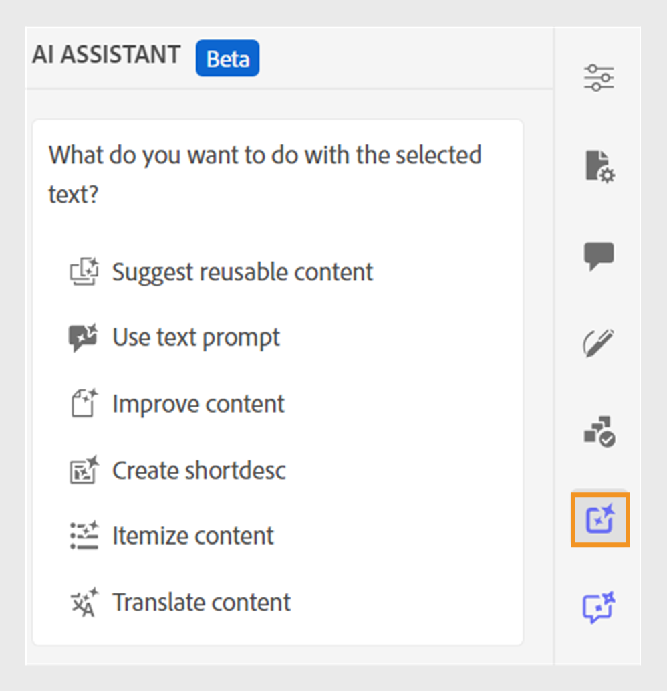

# Assistant d’IA pour la création de documents avec efficacité dynamique

Experience Manager Guides fournit un outil Assistant d’IA qui vous aide à rendre votre création plus intelligente et plus rapide. La gestion simplifiée des documents s’effectue au moyen de suggestions intelligentes et d’une optimisation. À l’aide de cet outil, affichez les suggestions intelligentes pour réutiliser le contenu du référentiel de contenu existant. Utilisez la fonction d’invite de texte pour fournir une invite et modifier le contenu ou générer une sortie selon vos besoins. Utilisez l’assistant d’IA pour convertir intelligemment un paragraphe en liste. Vous pouvez créer une brève description de la rubrique actuelle. Cette fonctionnalité vous permet également d’améliorer et de traduire facilement le contenu sélectionné.

>[!NOTE]
>
> Pour ajouter la fonction Assistant d’IA dans le panneau de droite, votre administrateur système doit sélectionner l’option **Assistant d’IA** sous l’onglet **Panneaux** de l’icône **Paramètres de l’éditeur** .
> Vous devez également extraire votre document pour afficher l’icône de l’assistant d’IA.

Cette fonctionnalité est disponible uniquement pour les rubriques DITA. Après avoir sélectionné le texte d’une rubrique, vous pouvez choisir d’effectuer l’une des actions de l’assistant d’IA :

## Suggérer du contenu réutilisable

Utilisez la fonction **Suggest reutilisable content**  pour créer du contenu de manière cohérente et précise. Vous pouvez sélectionner le contenu et Experience Manager Guides fournit des suggestions sur la manière de réutiliser le contenu existant dans votre référentiel.
En savoir plus sur l’utilisation de [suggestions intelligentes optimisées par l’IA pour créer du contenu](authoring-ai-based-smart-suggestions.md).

## invite de texte

Une invite de texte est une instruction, une question ou une instruction qui guide l’assistant d’IA à générer une réponse ou une sortie spécifique.

Vous pouvez utiliser une invite de texte pour modifier le contenu et générer une sortie.  Vous pouvez, par exemple, générer un résumé des fonctionnalités d’un produit et l’utiliser dans votre rapport pour présenter le produit. Vous pouvez également utiliser cette fonction pour comparer deux produits. Par exemple, vous pouvez également créer un tableau de comparaison pour les fonctionnalités de deux produits.

1. Sélectionnez le texte pour lequel vous souhaitez utiliser l’invite de texte.
1. Sélectionnez **Utiliser l’invite de texte**  dans le panneau **Assistant d’IA**.
1. Donnez une invite de l’une des manières suivantes :

   - Choisissez une invite parmi les invites.
   - Modifiez ou modifiez une invite suggérée afin de créer une invite personnalisée en fonction de vos besoins.

     >[!NOTE]
     >
     > Les invites sont configurées dans le `ui_config.json` par votre administrateur.

   - Saisissez votre invite dans la zone de texte.

1. Sélectionnez **Régénérer**  pour une autre réponse ou sortie basée sur votre invite, comme les outils d’IA.

1. (Facultatif) Sélectionnez **Développer**  pour ouvrir l’éditeur **d’invite de texte**. Il affiche le contenu actuel et le contenu généré. Vous pouvez modifier le contenu de la mise en page source et vérifier l’aperçu.

   >[!NOTE]
   >
   > Les réponses sont générées en fonction du contenu sélectionné.

1. Vous pouvez également modifier l’invite dans l’éditeur et générer à nouveau la réponse. Vous pouvez, par exemple, modifier l’invite pour rendre le texte plus concis et le réduire à environ 40 mots.

   

1. Vous pouvez vérifier la source du contenu généré et le modifier si nécessaire.

1. Sélectionnez **Accepter** pour remplacer le contenu sélectionné dans la rubrique par le contenu généré.
1. **Annuler** : annule l’action d’invite de texte. Renvoie à l’état initial du panneau.

   >[!NOTE]
   >
   > La sélection de l’icône **Annuler** dans le panneau des fonctionnalités vous renvoie également à l’état initial.

## Améliorer le contenu

Améliore le contenu sélectionné. Vérifiez l&#39;orthographe, la langue et la grammaire et proposez une meilleure version du contenu. Cela améliore aussi la qualité des phrases.

1. Sélectionnez le contenu.
1. Sélectionnez **Améliorer le contenu**  pour trouver les suggestions pour le contenu amélioré.
1. Sélectionnez **Régénérer** pour une autre suggestion de contenu amélioré.

1. (Facultatif) Sélectionnez **Développer** pour ouvrir l’éditeur de contenu amélioré. Il affiche le contenu actuel et généré. Vous pouvez modifier le contenu dans la mise en page source et vérifier également l’aperçu.

Acceptez la suggestion, ou régénérez-la pour obtenir une autre réponse, ou annulez l’action pour revenir à l’état précédent.

## Créer des raccourcis

Créez une brève description de la rubrique d’après le contenu sélectionné (30 à 50 mots). La brève description permet aux utilisateurs de rechercher et de trouver du contenu pertinent.
Par exemple, vous pouvez répertorier la configuration requise et générer une brève description en conséquence.

1. Sélectionnez le contenu.
1. Sélectionnez **Créer des raccourcis ** pour créer une brève description de la rubrique actuelle.
1. Sélectionnez **Accept** pour créer une nouvelle brève description si la brève description n’est pas déjà présente. S’il existe une brève description, vous devez la confirmer avant de la remplacer par la nouvelle brève description.

Vous pouvez également effectuer les actions suivantes :
- Sélectionnez **Régénérer** pour générer une autre brève description de votre rubrique, comme les outils d’IA.

- Sélectionnez **Développer** pour ouvrir l’éditeur **Créer des raccourcis**.

## Enumérer le contenu

Cette fonction convertit intelligemment un paragraphe sélectionné en liste.  Il analyse le contenu et crée une liste logique d’éléments. Vous n’avez pas à créer les éléments manuellement. Si, par exemple, vous disposez d’un paragraphe détaillant les étapes de création d’un compte d’utilisateur, l’outil peut le transformer en liste détaillée, rendant ainsi inutile la création manuelle d’éléments un par un.

1. Sélectionnez le contenu.
1. Sélectionnez **Enumérer le contenu**  pour convertir le contenu sélectionné en liste.
L’outil Assistant d’intelligence artificielle convertit intelligemment le contenu en une liste d’éléments.
1. (Facultatif) Sélectionnez **Développer** pour ouvrir l’éditeur **d’  d’analyse de contenu**.
1. Une fois votre liste prête, acceptez les modifications dans le contenu généré. Le contenu généré remplace alors le contenu sélectionné.

## Traduction du contenu

Utilisez cette fonctionnalité intelligente pour traduire le contenu sélectionné dans la langue cible. Par exemple, vous pouvez ajouter du contenu en anglais et le traduire rapidement en allemand.
Effectuez les étapes suivantes pour traduire le contenu :

1. Sélectionnez le contenu à traduire.
1. Sélectionnez **Traduire le contenu**  dans le panneau de l’assistant d’IA.
1. Sélectionnez la langue cible dans la liste déroulante. Le contenu traduit s’affiche dans le panneau de l’assistant d’IA.

1. (Facultatif) Sélectionnez **Développer** pour ouvrir l’éditeur **Traduire le contenu**.
1. Vous pouvez également sélectionner une autre langue dans le menu déroulant et régénérer le contenu dans la langue choisie. Par exemple, si vous sélectionnez Français, puis **Régénérer**, le contenu est traduit en français.

