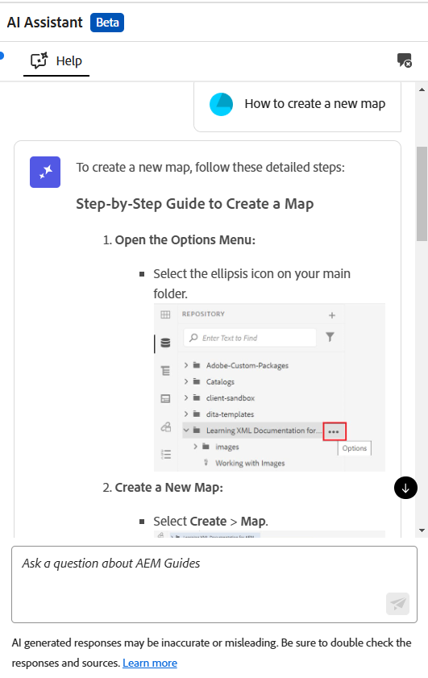

# Améliorez l’efficacité avec l’aide intelligente dans l’assistant AI (Beta)

Experience Manager Guides fournit l’aide intelligente basée sur GenAI, une fonctionnalité de recherche conversationnelle qui vous aide à trouver le contenu approprié à partir de la [documentation Adobe Experience Manager Guides](https://experienceleague.adobe.com/en/docs/experience-manager-guides/using/overview).

Vous pouvez poser vos questions et obtenir des réponses d&#39;une manière informative. La réponse à votre requête est basée sur le contenu de la documentation du produit . Cette recherche est entièrement conversationnelle. Vous pouvez poser des questions sur les différentes fonctionnalités de Experience Manager Guides ou choisir de poser des requêtes de dépannage. En fonction de la réponse, vous pouvez également poser d’autres questions. La réponse inclut également des liens vers les documents sources, auxquels vous pouvez vous reporter pour plus de détails.

Par exemple, vous pouvez poser des questions telles que *Comment publier une carte ?* Vous obtenez une réponse et les liens pour les articles associés. Ensuite, si vous souhaitez apprendre à utiliser une méthode spécifique pour publier la sortie, vous pouvez poser des questions à son sujet. Par exemple, *Comment publier une carte sur PDF ?*

Lorsque vous ouvrez l’**assistant AI** sur la page d’accueil, la console de cartes ou l’éditeur, le panneau **Aide** s’ouvre à droite. Dans le cas de l’éditeur, le panneau Création s’affiche également pour vous offrir des fonctionnalités de création dynamique. Pour plus d’informations, consultez [Assistant AI pour créer des documents de manière intelligente](./ai-assistant-right-panel.md)

{width="300" align="left"}

*Afficher le panneau **Aide**.*

Pour utiliser le panneau d’aide afin de trouver le contenu approprié et de résoudre vos requêtes, procédez comme suit :

1. Sélectionnez **Assistant AI** pour ouvrir le panneau Aide.

   >[!NOTE]
   >
   > Dans les [profils globaux ou au niveau du dossier](../cs-install-guide/conf-folder-level.md#conf-ai-guides-assistant), votre administrateur ou administratrice doit définir les questions par défaut qui apparaissent dans le panneau.

1. Saisissez la question pour rechercher le contenu associé dans la documentation de Experience Manager Guides. Vous pouvez sélectionner la question par défaut dans le panneau ou saisir votre question dans la zone de texte.

1. Sélectionnez **Envoyer**  ou appuyez sur **Entrée** pour afficher la réponse à vos questions.

   Selon votre question, vous pouvez afficher le contenu, les images applicables et les liens vers les articles.

   {width="300" align="left"}

   *Sélectionnez l’exemple de question et affichez le contenu et les images en réponse.*

1. Sélectionnez les liens vers les articles à la fin et affichez des informations détaillées sur la réponse à votre question.

1. Sélectionnez **Effacer la conversation**  pour supprimer l’historique des conversations du panneau. Vous pouvez ensuite lancer une nouvelle conversation et trouver du contenu pertinent.

Au lieu d’effectuer des recherches dans des guides de l’utilisateur et des documents de référence, vous pouvez utiliser la fonction **Aide** pour trouver rapidement des réponses pertinentes à vos requêtes. Cela vous permet de gagner du temps et de vous concentrer sur la création de contenu, ce qui se traduit par une productivité et une efficacité accrues.

## Options disponibles pour les réponses d’aide de l’assistant AI

Lorsque vous recevez une réponse de l’assistant AI dans le panneau **Aide**, vous pouvez interagir avec celle-ci ou fournir des commentaires afin d’améliorer sa précision et sa fiabilité. Vos commentaires aident l’équipe de Experience Manager Guides à améliorer la précision et la pertinence des réponses des assistants d’IA, améliorant ainsi ses performances au fil du temps.

Les options suivantes sont disponibles pour discuter ou fournir des commentaires sur les réponses fournies par le panneau de l’assistant AI **Aide** :

{width="300" align="left"}

- **Copier** : copiez la réponse à utiliser dans vos documents.
- **Comme** : indiquez que la réponse a été utile ou précise. Sélectionnez l’icône J’aime pour aimer la réponse et utilisez l’option **En savoir plus** pour fournir des commentaires détaillés.
- **Je n’aime pas** : marquez la réponse comme inutile ou incorrecte. Sélectionnez l’icône Je n’aime pas pour recevoir la réponse et utilisez l’option **En savoir plus** pour fournir des commentaires détaillés.
- **Rapport** : marquez la réponse pour révision si elle contient des erreurs ou un contenu inexact. Sélectionnez l’icône d’indicateur pour ouvrir la boîte de dialogue **Résultats du rapport**. Faites votre choix parmi les options disponibles ou fournissez un retour d’informations personnalisé.