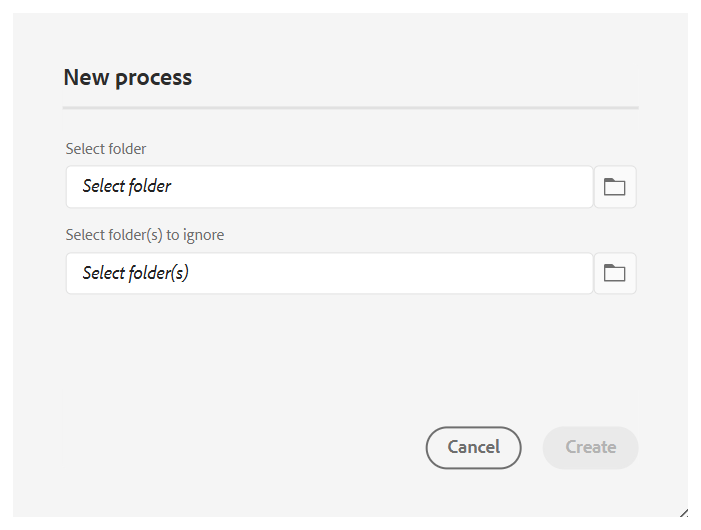

# Traitement ou retraitement des ressources

Dans les workflows gourmands en données tels que la publication, une gestion efficace des ressources est essentielle pour maintenir les performances et la fiabilité. Le processus de traitement ou de retraitement des ressources est spécialement conçu pour gérer les ressources spécifiques à l’utilisateur ou à l’utilisatrice qui nécessitent des opérations de données intensives. Cette approche aborde deux scénarios principaux : lorsque le traitement initial des ressources rencontre des erreurs ou lorsque les fichiers n’ont pas été traités du tout en raison de l’absence d’un déclencheur de post-traitement. En activant le traitement ciblé au niveau du dossier, les utilisateurs et utilisatrices peuvent isoler et traiter uniquement les ressources nécessaires, évitant ainsi la surcharge de calculs inutiles. Cette approche sélective améliore considérablement les performances et réduit le temps nécessaire aux opérations critiques telles que la publication et la génération de rapports. Dans l’ensemble, il contribue à une plus grande efficacité et une plus grande rapidité dans la gestion des tâches de données complexes.

>[!NOTE]
>
> Pour les jeux de données volumineux, il est préférable d’exécuter le traitement en dehors des heures de pointe afin d’éviter tout impact sur les performances du système. Une fois la tâche de traitement terminée, vous pouvez consulter les détails pour analyser les résultats.

## Traitement des ressources

Suivez les étapes mentionnées ci-dessous pour traiter ou retraiter les ressources :

1. Sélectionnez le logo Adobe Experience Manager en haut et choisissez **Outils**.
1. Dans le panneau **Outils**, sélectionnez **Guides**.
1. Sélectionnez la mosaïque **Processeur de ressources**.

   {width="550" align="left"}

1. La fenêtre Guides Asset Processor s’ouvre avec les détails affichés ci-dessous. En outre, seules les informations relatives aux cinq dernières migrations s’affichent dans cette fenêtre.

   - **ID d’exécution** : il s’agit de l’ID unique pour chaque tâche de retraitement que vous effectuez.

   - **Dossier** : affiche le dossier sélectionné pour le retraitement.

   - **Dossiers exclus** : pointe vers le dossier exclu du retraitement.

   - **Heure de début :** indique la date et l’heure auxquelles le processus de retraitement a été lancé.

   - **Heure de fin** : affiche la date et l’heure auxquelles le processus de retraitement se termine.

   - **Statut** : indique le statut du retraitement, à savoir En cours, Terminé ou Annulé.

   {width="550" align="left"}

1. Sélectionnez l’onglet **Nouveau processus** dans le coin supérieur droit de la fenêtre pour démarrer une nouvelle tâche de traitement.

   {width="550" align="left"}

1. Sélectionnez le dossier que vous souhaitez traiter ou retraiter. Vous pouvez également sélectionner les dossiers (dans le dossier parent sélectionné) que vous souhaitez exclure ou ignorer.

   >[!NOTE]
   >
   >Un seul dossier peut être sélectionné à la fois pour le traitement. Pour des opérations spécifiques, vous pouvez exclure plusieurs dossiers.

1. Sélectionnez **Créer**. Une fenêtre pop-up s’affiche **Succès et le Processus a été déclenché avec succès** comme illustré dans le fragment de code. La même chose se reflète dans la liste. Le statut de la tâche de retraitement s’affiche dans la fenêtre.

   {width="550" align="left"}

## Options supplémentaires pour les tâches de traitement

D’autres options sont disponibles pour la tâche de traitement une fois qu’elle a été lancée. Vous pouvez accéder à ces options en pointant la souris sur l’ID d’exécution de la tâche. Vous trouverez ci-dessous des informations détaillées sur ces options :

- **Redémarrer** : redémarre la tâche de traitement des ressources ayant réussi précédemment.

  {width="550" align="left"}

- **Reprendre** : reprend la tâche de traitement des ressources précédemment annulée ou ayant échoué.

  {width="550" align="left"}

- **Annuler** : annule la tâche de traitement des ressources en cours.

  {width="550" align="left"}

- **Afficher les journaux** : affiche les journaux de la tâche de traitement des ressources. Pour les tâches en cours, le journal affiche des informations détaillées sur le traitement, notamment le temps restant estimé et le statut de la ressource. Cette liste de journaux affiche jusqu’aux 500 dernières entrées. Le journal complet peut être téléchargé.

  {width="550" align="left"}

