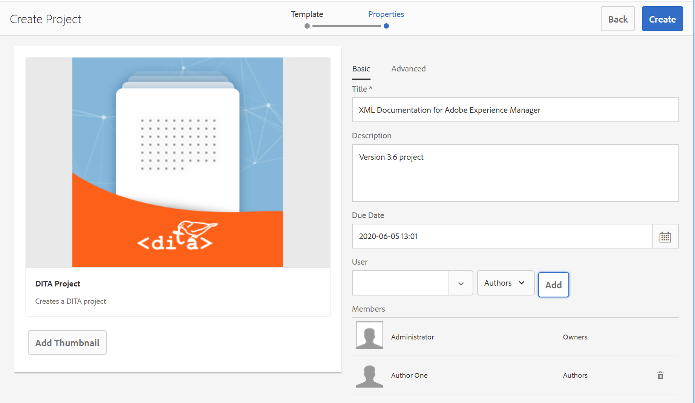

# Création d’un projet DITA {#id1645HA00NM6}

AEM Guides fournit un modèle de projet DITA que vous pouvez utiliser pour créer et gérer vos tâches de révision.

Vous pouvez créer un projet DITA, puis l’utiliser pour lancer vos révisions. Un projet permet de définir une échéance et de contrôler les tâches et le temps nécessaires pour terminer la tâche de révision pour laquelle vous avez créé le projet.

Vous pouvez ajouter des membres de l’équipe à un projet qui peuvent ensuite se voir attribuer différents rôles : auteurs, réviseurs et éditeurs.

Une fois que vous avez créé votre projet DITA, vous pouvez lancer votre révision à partir de l’éditeur web ou de l’interface utilisateur d’Assets. Pour plus d’informations, voir [Envoi de rubriques en révision](review-send-topics-for-review.md#).

De même, chaque fois qu’un auteur lance un processus de révision, les membres sélectionnés du projet reçoivent une notification par e-mail. Pour configurer des notifications par courrier électronique, voir *Personnalisation des modèles de courrier électronique* dans Installation et configuration de Adobe Experience Manager Guides as a Cloud Service.

Pour créer un projet DITA, procédez comme suit :

1. Ouvrez la console Projets .

   Vous pouvez également accéder à la console Projets à l’aide de l’URL suivante :

   ```http
   http://<server name>:<port>/projects.html
   ```

1. Cliquez sur **Créer** \> **Projet** pour lancer l’assistant Créer un projet .

   {width="650" align="left"}

1. Sur la page Créer un projet , sélectionnez le **Projet DITA** modèle et cliquez sur **Suivant**.

1. Sur la page Propriétés du projet , saisissez les détails suivants :

   Informations dans la variable **De base** tab :

   {width="650" align="left"}

   - Saisissez le **Titre**, **Description**, et **Date d’échéance**.

   - Vous pouvez, éventuellement, choisir une miniature pour le projet.

   - Par défaut, vous êtes le propriétaire du projet. Pour ajouter d’autres utilisateurs à ce projet :

   1. Saisissez ou sélectionnez un utilisateur dans le **Utilisateur** liste déroulante.

   1. Sélectionnez un type d’utilisateur : Auteurs, Réviseurs ou Éditeurs.

      >[!NOTE]
      >
      >D’autres types d’utilisateurs s’affichent dans cette liste déroulante, mais pour un projet DITA, vous devez uniquement choisir parmi le type d’utilisateur Auteurs, Réviseurs ou Éditeurs . Même si vous ajoutez un utilisateur d’un autre type, cet utilisateur ne pourra pas accéder aux fonctionnalités spécifiques à DITA disponibles dans les Guides d’AEM.

   1. Cliquez sur **Ajouter**.

      >[!NOTE]
      >
      >Si vous utilisez AEM Guides version 3.5 ou antérieure, une option vous est présentée pour sélectionner un fichier de mappage DITA afin de résoudre les références clés pour les workflows de modification, de prévisualisation et de révision des rubriques. Dans les versions 3.6 et ultérieures, vous pouvez définir la carte racine via l’éditeur web. Pour plus d’informations, voir [Préférences utilisateur](web-editor-features.md#id2087G0P40SB) dans l’éditeur Web. Une autre manière de définir la carte racine consiste à la configurer au niveau des profils globaux ou au niveau du dossier. Pour plus d’informations, voir *Configuration de profils globaux ou au niveau du dossier* dans le Guide d&#39;installation et de configuration.

   Informations dans la variable **Avancé** tab :

   - Saisissez le nom du projet. Ce nom est utilisé pour créer l’URL de ce projet.

1. Cliquez sur **Créer**.

   La boîte de dialogue Projet créé s’affiche.

1. Cliquez sur **Ouvrir** pour ouvrir la page du projet.


**Rubrique parente :**[ Révision de rubriques ou de mappages](review.md)
