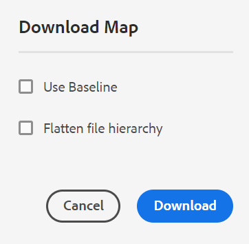

# Télécharger les fichiers {#id216MC0H0BE8}

Vous pouvez télécharger des ressources, y compris des fichiers DITA et non DITA. Vous pouvez télécharger des ressources de plusieurs façons. Certaines méthodes sont natives à Adobe Experience Manager et d’autres sont prises en charge par Adobe Experience Manager Guides. Pour obtenir des informations sur le téléchargement des ressources natives de Adobe Experience Manager, consultez [Télécharger des ressources depuis Adobe Experience Manager](https://experienceleague.adobe.com/docs/experience-manager-cloud-service/assets/manage/download-assets-from-aem.html) dans la documentation de Adobe Experience Manager. La section suivante explique le mécanisme de téléchargement des fichiers via la console de plan DITA dans Experience Manager Guides.

## Exporter un fichier de mappage DITA

Une fois que vous disposez du fichier de mappage DITA dans le référentiel Adobe Experience Manager, vous pouvez télécharger le fichier de mappage ainsi que ses dépendants. Vous avez ainsi la possibilité de partager le fichier de mappage complet pour la modification, la validation, la révision hors ligne ou simplement la création d’une sauvegarde.

Effectuez les étapes suivantes pour télécharger un fichier de plan DITA avec ses fichiers dépendants :

1. Dans l’interface utilisateur d’Assets, accédez au plan DITA à télécharger.

1. Sélectionnez le plan DITA pour l&#39;ouvrir dans la console Plan DITA.

1. Sélectionnez l&#39;onglet **Rubriques** pour afficher la liste des rubriques disponibles dans le plan DITA.

1. Dans la barre d’outils principale, sélectionnez **Télécharger la carte**.

   La boîte de dialogue Télécharger la carte s’affiche.

   {width="300" align="left"}

1. Sélectionnez **Télécharger**. Dans la boîte de dialogue Télécharger la carte , vous pouvez choisir les options suivantes :

   - **Utiliser niveau de référence** : sélectionnez cette option pour obtenir la liste des niveaux de référence créés pour le plan DITA. Pour télécharger le fichier de mappage et son contenu en fonction d&#39;une ligne de base spécifique, sélectionnez la ligne de base dans la liste déroulante. Pour plus d&#39;informations sur l&#39;utilisation des lignes de base, voir [Utilisation des lignes de base](generate-output-use-baseline-for-publishing.md#).

   - **Aplatir la hiérarchie de fichiers** : sélectionnez cette option pour enregistrer toutes les rubriques et tous les fichiers multimédias référencés dans un seul dossier.

   >[!NOTE]
   >
   > Vous pouvez également télécharger le fichier de mappage sans sélectionner d’option. Dans ce cas, la dernière version conservée des rubriques et fichiers multimédias référencés est téléchargée.

1. Après avoir sélectionné le bouton **Télécharger**, la demande de téléchargement de carte est mise en file d’attente. Vous recevrez la notification suivante une fois que la carte sera prête à être téléchargée.

   {width="550" align="left"}

   - Sélectionnez **Télécharger** pour télécharger le fichier de mappage au format .zip.

   - Sélectionnez **Télécharger ultérieurement** pour télécharger le fichier de mappage ultérieurement. Le lien de téléchargement est accessible à partir de la boîte de réception de notifications Adobe Experience Manager. Sélectionnez la notification de mappage générée dans la boîte de réception pour télécharger le mappage au format .zip.

   >[!NOTE]
   >
   > Par défaut, les cartes téléchargées restent pendant cinq jours dans la boîte de réception de notifications de Adobe Experience Manager.

{width="300" align="left"}

Une fois la carte téléchargée, vous pouvez sélectionner la carte et utiliser l’icône Ouvrir en haut pour ouvrir le rapport sélectionné.

**Rubrique parente :**[ Gérer le contenu](authoring.md)
