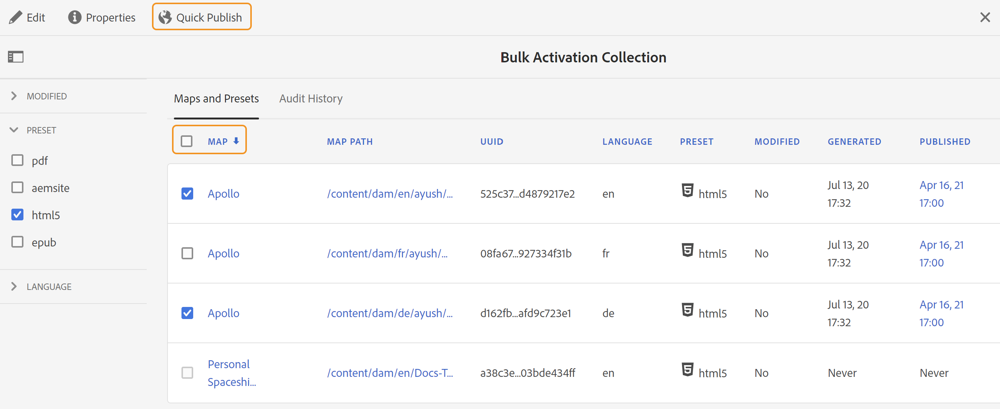

# Activer la sortie {#id214GGF00V5U}

Une fois que vous avez créé une collection de cartes pour l’activation en bloc, l’étape suivante consiste à activer votre contenu sur l’instance de publication. Pour activer votre contenu, procédez comme suit :

1. Sélectionner **Guides** dans la liste des outils.

1. Cliquez sur le lien Adobe Experience Manager en haut de l’écran et choisissez **Outils**.

1. Cliquez sur le bouton **Tableau de bord de publication en bloc** mosaïque.

   Une liste des collections de cartes d’activation en bloc s’affiche.

1. Sélectionnez la collection à publier, puis cliquez sur **Ouvrir**.

   {width="800" align="left"}

1. \(*Facultatif*\) Appliquez les filtres requis du rail de gauche pour filtrer la carte en fonction de leur \(état\), de leur paramètre prédéfini de sortie ou de leur langue modifiée :
1. Utilisez l’une des méthodes suivantes :

   - Pour activer la sortie des mappages sélectionnés, sélectionnez les fichiers de mappage et cliquez sur **Publication rapide**.
   - Pour activer la sortie de toutes les cartes DITA avec leurs paramètres prédéfinis configurés, cochez la case en regard de l’option Mappage \(colonne\), puis cliquez sur **Publication rapide.**
     {width="650" align="left"}

Une fois que la sortie est activée pour les fichiers de mappage sélectionnés, la colonne Publié est mise à jour avec la date et l’heure actuelles.

**Rubrique parente :**[ Activation en masse de contenu publié](conf-bulk-activation.md)
