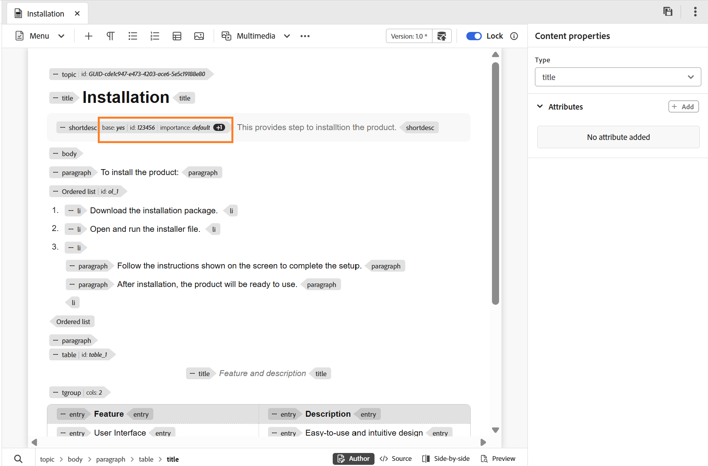

# Paramètres de l’éditeur

>[!NOTE]
>
> Cet article s’applique uniquement au nouvel éditeur. Pour activer cette fonctionnalité dans votre environnement, contactez l’équipe du service client AEM Guides.

Les paramètres de l’éditeur fournissent un panneau de configuration centralisé qui vous permet de personnaliser le comportement de l’éditeur au niveau de l’auteur individuel. Il offre davantage de flexibilité, de cohérence et de contrôle au cours du processus de création.

Ce panneau de paramètres centralisé vous permet de gérer les préférences clés de l’éditeur à partir d’un seul emplacement, ce qui réduit le besoin de configurations éparses ou manuelles. Les paramètres de l’éditeur sont accessibles à partir de la barre d’onglets **Autres actions**.

{width="650"}

## Options de configuration prises en charge

Vous pouvez activer ou désactiver les options suivantes en fonction de vos préférences :

{width="350"}

- **Espaces insécables** : activez cette option pour afficher un indicateur pour les espaces insécables lors de leur modification dans l’éditeur. Il est visible uniquement en mode Création pour les plans DITA et de rubrique DITA
- **Commentaires XML** : permet aux auteurs d’afficher, de modifier et d’insérer des commentaires XML directement en mode Création, pour une meilleure visibilité dans le contenu. Lorsque cette option est activée, les auteurs peuvent afficher, insérer, modifier et supprimer des commentaires XML directement dans le contenu en mode de création lui-même, ce qui facilite l’ajout de notes contextuelles pour les collaborateurs. Lorsqu’ils sont désactivés, les commentaires XML sont masqués en mode de création et ne peuvent pas être insérés ou modifiés à partir du mode de création, ce qui garantit une expérience de création plus épurée pour les utilisateurs qui n’en ont pas besoin. Vous pouvez continuer à afficher et à créer des commentaires XML en mode source à l’aide de la syntaxe `<!-- test comment -->`.

  {width="650"}

- **Balises** : contrôle la visibilité des balises dans l’éditeur. Lorsqu&#39;elles sont activées, les balises structurelles sont affichées dans le contenu, ce qui permet aux auteurs d&#39;afficher et de gérer la structure DITA sous-jacente. Lorsqu’elles sont désactivées, ces balises sont masquées pour offrir une expérience de création plus épurée et plus ciblée.

  {width="650"}

  Lorsque les paramètres **Afficher les balises** sont activés, vous pouvez également activer **Afficher les attributs** pour afficher et valider les attributs associés à un élément. Lorsqu’un élément est associé à plus de trois attributs, un indicateur de comptage s’affiche. Placer le pointeur de la souris sur l’indicateur affiche la liste complète des attributs appliqués à cet élément.

   {width="650"}

- **Menu d’insertion rapide dans l’éditeur** : permet d’ajouter des éléments directement lors de l’édition en mode Création à la position du curseur sans accéder à la barre d’outils. Les éléments fréquemment utilisés peuvent également être configurés dans les **Favoris** pour un accès plus rapide. Le menu d’insertion rapide est disponible directement dans l’éditeur lorsque vous appuyez sur **Ctrl + /** sous Windows ou **Commande + /** sous macOS pour positionner le curseur.

  {width="650"}

  Vous pouvez rechercher et ajouter des éléments à vos favoris, supprimer des éléments précédemment ajoutés et les réorganiser en effectuant simplement un glisser-déposer. Les éléments les plus fréquemment utilisés figurent parmi les favoris et l&#39;ordre que vous définissez ici est reflété dans le menu Insertion rapide lorsque vous y accédez à partir de l&#39;éditeur.

  Regardez cette courte vidéo sur l’utilisation du menu d’insertion rapide dans le nouvel éditeur.

  >[!VIDEO](https://video.tv.adobe.com/v/3491343)

