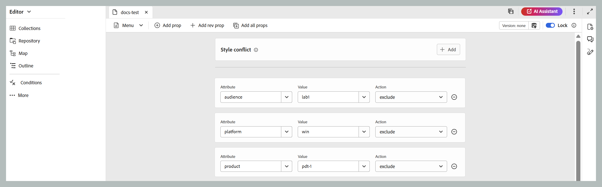

# Éditeur DITAVAL {#ditaval-editor}

Les fichiers DITAVAL sont utilisés pour générer une sortie conditionnelle. Dans une seule rubrique, vous pouvez ajouter des conditions à l’aide d’attributs d’élément pour conditionner le contenu. Ensuite, vous créez un fichier DITAVAL dans lequel vous spécifiez les conditions qui doivent être sélectionnées pour générer du contenu et quelle condition doit être exclue de la sortie finale.

Adobe Experience Manager Guides vous permet de créer et modifier facilement des fichiers DITAVAL à l&#39;aide de l&#39;éditeur DITAVAL. L’éditeur DITAVAL récupère les attributs \(ou balises\) définis dans votre système et vous pouvez les utiliser pour créer ou modifier des fichiers DITAVAL. Pour plus d’informations sur la création et la gestion des balises dans Adobe Experience Manager, consultez la section [Administration des balises](https://experienceleague.adobe.com/docs/experience-manager-cloud-service/sites/authoring/features/tags.html?lang=fr) de la documentation de Adobe Experience Manager.

Les sections suivantes présentent les options disponibles pour un fichier DITAVAL dans Experience Manager Guides.

- [Créer un fichier DITAVAL](#create-ditaval-file)
- [Modifier le fichier DITAVAL](#edit-ditaval-file)
- [Vues de l’éditeur de fichiers DITAVAl](#ditaval-editor-views)
- [Utilisation du fichier DITAVAL dans l’interface utilisateur d’Assets](#working-with-ditaval-files-in-the-assets-ui)

## Créer un fichier DITAVAL

Pour créer un fichier DITAVAL, procédez comme suit :

1. Dans le panneau Référentiel, sélectionnez l’icône **Nouveau fichier** puis sélectionnez **Rubrique** dans le menu déroulant.

   {align="left"}

   Vous pouvez également accéder à cette option à partir de la page d&#39;accueil [Experience Manager Guides](./intro-home-page.md) et du menu d&#39;options d&#39;un dossier dans la vue Référentiel.

2. La boîte de dialogue **Nouvelle rubrique** s&#39;affiche.

3. Dans la boîte de dialogue **Nouvelle rubrique**, fournissez les détails suivants :
   - Titre de la rubrique.
   - \(Facultatif\)* Nom de fichier de la rubrique. Le nom du fichier est suggéré automatiquement en fonction du titre de la rubrique. Si votre administrateur a activé les noms de fichiers automatiques en fonction du paramètre UUID, vous ne verrez pas le champ Nom .
   - Modèle sur lequel la rubrique sera basée. Pour un fichier DITAVAL, sélectionnez **Ditaval** dans la liste déroulante.
   - Chemin d’accès où enregistrer le fichier de rubrique. Par défaut, le chemin du dossier actuellement sélectionné dans le référentiel s’affiche dans le champ Chemin .

   {width="300" align="left"}

4. Sélectionnez **Créer**.

La rubrique est créée au chemin d’accès spécifié. En outre, la rubrique est ouverte dans l’éditeur pour modification.

{align="left"}

## Modifier le fichier DITAVAL

Lorsque vous créez une rubrique DITAVAL, elle s’ouvre dans l’éditeur pour être modifiée. Pour modifier une rubrique DITAVAL existante, accédez au dossier ou à la carte où se trouve la rubrique DITAVAL, puis sélectionnez **Modifier** dans le menu **Options**.

L&#39;éditeur DITAVAL permet d&#39;effectuer les tâches suivantes :

- Activer/désactiver le panneau de gauche

  Activez/désactivez la vue du panneau de gauche. Si vous avez ouvert le fichier DITAVAL via un plan DITA, le plan et le référentiel sont affichés dans ce panneau. Pour plus d&#39;informations sur l&#39;ouverture d&#39;un fichier via un plan DITA, consultez [Modifier les rubriques via un plan DITA](map-editor-advanced-map-editor.md#id17ACJ0F0FHS).

- enregistrez ;

  Enregistre les modifications effectuées dans le fichier. Toutes vos modifications sont enregistrées dans la version actuelle de votre fichier.

- Ajouter une prop

  Ajoutez une seule propriété dans votre fichier DITAVAL.

  

  La première liste déroulante répertorie les attributs DITA autorisés que vous pouvez utiliser dans le fichier DITAVAL. Cinq attributs sont pris en charge : `audience`, `platform`, `product`, `props` et `otherprops`.

  La deuxième liste déroulante affiche les valeurs configurées pour l’attribut sélectionné. Ensuite, la liste déroulante suivante affiche les actions que vous pouvez configurer sur l’attribut sélectionné. Les valeurs autorisées dans le menu déroulant de l’action sont les suivantes : `include`, `exclude`, `passthrough` et `flag`. Pour plus d&#39;informations sur ces valeurs, consultez la définition de l&#39;élément [prop](http://docs.oasis-open.org/dita/dita/v1.3/errata01/os/complete/part3-all-inclusive/langRef/ditaval/ditaval-prop.html#ditaval-prop) dans la documentation OASIS DITA

- Ajouter toutes les propriétés

  Si vous souhaitez ajouter d’un seul clic toutes les propriétés ou tous les attributs conditionnels définis dans votre système, utilisez la fonction Ajouter toutes les propriétés .

  >[!NOTE]
  >
  > Si toutes les propriétés conditionnelles définies existent déjà dans le fichier DITAVAL, vous ne pouvez pas ajouter d’autres propriétés. Un message d’erreur s’affiche dans ce scénario.

  

Une fois le fichier DITAVAL modifié, sélectionnez **Enregistrer**.

>[!NOTE]
>
> Si vous fermez le fichier sans enregistrer, les modifications seront perdues. Si vous ne souhaitez pas valider les modifications dans le référentiel Adobe Experience Manager, sélectionnez **Fermer**, puis sélectionnez **Fermer sans enregistrer** dans la boîte de dialogue **Modifications non enregistrées**.

## Vues de l’éditeur DITAVAL

L’éditeur DITAVAL d’Adobe Experience Manager Guides prend en charge l’affichage des fichiers DITAVAL dans deux modes ou vues différents :

**Auteur** :   Voici une vue standard Ce que vous voyez est ce que vous obtenez \(WYSISYG\) de l’éditeur DITAVAL. Vous pouvez ajouter ou supprimer des propriétés à l’aide de l’interface utilisateur simple, qui présente les propriétés, ses valeurs et les actions dans une liste déroulante. Dans la vue Auteur, vous avez la possibilité d’insérer une propriété individuelle et d’insérer toutes les propriétés en un seul clic.

Vous pouvez également trouver la version du fichier DITAVAL sur lequel vous travaillez actuellement en plaçant le pointeur de la souris sur le nom du fichier.

**Source**:   La vue Source affiche le code XML sous-jacent qui constitue le fichier DITAVAL. Outre les modifications de texte standard effectuées dans cet affichage, un auteur peut également ajouter ou modifier des propriétés à l’aide du catalogue dynamique.

Pour appeler le catalogue dynamique, placez le curseur à la fin de toute définition de propriété et saisissez « &lt; ». L’éditeur affiche une liste de tous les éléments XML valides que vous pouvez insérer à cet emplacement.

## Utilisation des fichiers DITAVAL dans l’interface utilisateur d’Assets

Vous pouvez également créer un fichier DITAVAL à partir de l’interface utilisateur d’Assets. Les étapes de création d&#39;une rubrique DITAVAL sont les suivantes :

1. Dans l’interface utilisateur d’Assets, accédez à l’emplacement où vous souhaitez créer le fichier DITAVAL.

1. Sélectionnez **Créer** \> **Rubrique DITA**.

1. Sur la page Plan directeur, sélectionnez le modèle de fichier DITAVAL et sélectionnez **Suivant**.

1. Sur la page Propriétés, spécifiez les **Titre** et **Nom** pour le fichier DITAVAL.

   >[!NOTE]
   >
   > Le nom est automatiquement suggéré en fonction du Titre de votre fichier. Si vous souhaitez spécifier manuellement le nom du fichier, assurez-vous que le Nom ne contient pas d&#39;espaces, d&#39;apostrophe ou de crochets et se termine par .ditaval.

1. Sélectionnez **Créer**.

   Le message Rubrique créée s’affiche.

Vous pouvez choisir d&#39;ouvrir le fichier DITAVAL pour l&#39;éditer dans l&#39;éditeur DITAVAL ou d&#39;enregistrer le fichier de rubrique dans le référentiel Adobe Experience Manager.

Pour modifier un fichier DITAVAL existant, procédez comme suit :

1. Dans l’interface utilisateur d’Assets, accédez au fichier DITAVAL à modifier.

1. Pour obtenir un verrou exclusif sur le fichier, sélectionnez le fichier et sélectionnez **Extraire**.

1. Sélectionnez le fichier et sélectionnez **Modifier** pour ouvrir le fichier dans l’éditeur DITAVAL d’Adobe Experience Manager Guides.

