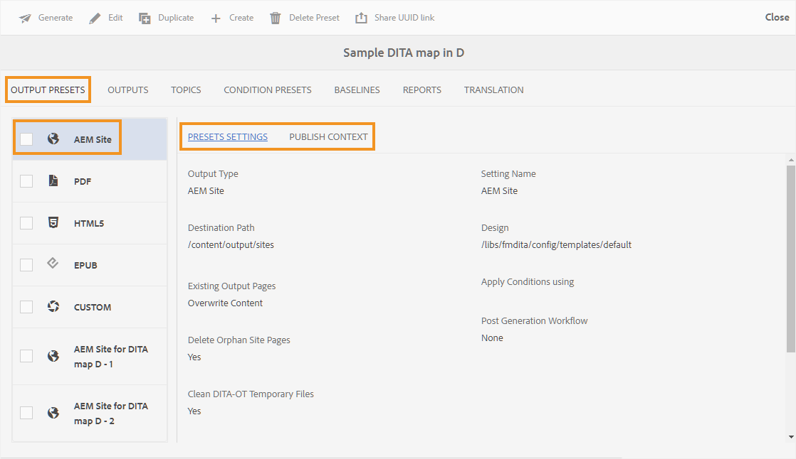

# Paramètres prédéfinis AEM Sites dans le tableau de bord de carte {#id205BE3008SW}

Vous pouvez créer des paramètres prédéfinis AEM Sites à partir du tableau de bord de mappage et les configurer pour générer la sortie AEM Sites.

Les options suivantes sont disponibles pour la sortie AEM Sites :

| Options d’AEM Sites | Description |
| --- | --- |
| Type de sortie | Type de sortie que vous souhaitez générer. Pour générer une sortie AEM Sites réactive, choisissez l’option AEM Sites . |
| Nom du paramètre | Attribuez un nom explicite aux paramètres AEM Sites que vous êtes en train de créer. Par exemple, vous pouvez spécifier *sortie des clients internes* ou *sortie des utilisateurs finaux*. |
| Nom du site | Nom du site où la sortie est stockée dans votre référentiel AEM.  Un nœud du référentiel AEM est créé et porte le nom spécifié ici. Si vous ne spécifiez pas le nom du site, le nœud de site est créé avec le nom de fichier de plan DITA.  Le nom du site que vous spécifiez ici est également utilisé comme titre dans l’onglet du navigateur.  Vous pouvez également utiliser des variables lors de la définition du nom du site. Pour plus d’informations sur l’utilisation des variables, voir [Utiliser des variables pour définir les options Chemin de destination, Nom du site ou Nom de fichier](generate-output-use-variables.md#id18BUG70K05Z). |
| Conception | Sélectionnez le modèle de conception à utiliser pour générer la sortie.  Pour plus d’informations sur l’utilisation de modèles de conception personnalisés pour générer une sortie, contactez votre administrateur de publication. |
| Chemin de destination | Chemin d’accès dans votre référentiel AEM où la sortie est stockée. Lors de la génération de la sortie finale, le Nom du site et le Chemin de destination sont combinés. Par exemple, si vous définissez le Nom du site sur `user-guide` et le Chemin de destination sur `/content/output/aem-guides`, la sortie finale est générée sous le nœud `/content/output/aem-guides/user-guide` .  Vous pouvez également utiliser des variables lors de la définition du chemin de destination. Pour plus d’informations sur l’utilisation des variables, voir [Utiliser des variables pour définir les options Chemin de destination, Nom du site ou Nom de fichier](generate-output-use-variables.md#id18BUG70K05Z). |
| Appliquer des conditions à l’aide de | Sélectionnez l’une des options suivantes :  **Aucune appliquée** : sélectionnez cette option si vous ne souhaitez appliquer aucune condition sur la sortie publiée. **Fichier DITAVal** : sélectionnez le ou les fichiers DITAVal pour générer du contenu conditionné. Vous pouvez sélectionner plusieurs fichiers DITAVal à l’aide de la boîte de dialogue de navigation ou en saisissant le chemin du fichier. Utilisez la croix près du nom du fichier pour le supprimer. Les fichiers DITAVal sont évalués dans l&#39;ordre spécifié. De ce fait, les conditions spécifiées dans le premier fichier sont prioritaires sur les conditions correspondantes spécifiées dans les fichiers ultérieurs. Vous pouvez conserver l’ordre des fichiers en ajoutant ou en supprimant des fichiers. Si le fichier DITAVal est déplacé vers un autre emplacement ou est supprimé, il n&#39;est pas automatiquement supprimé du tableau de bord de mappage. Vous devez mettre à jour l’emplacement au cas où les fichiers seraient déplacés ou supprimés. Vous pouvez pointer sur le nom du fichier pour afficher le chemin d’accès dans le référentiel AEM où le fichier est stocké. Vous ne pouvez sélectionner que les fichiers DITAVal et une erreur s&#39;affiche si vous sélectionnez un autre type de fichier. **Paramètre prédéfini de condition** : sélectionnez un paramètre prédéfini de condition dans la liste déroulante pour appliquer une condition lors de la publication de la sortie. Cette option est visible si vous avez ajouté une condition pour le fichier de plan DITA. Les paramètres conditionnels sont disponibles dans l&#39;onglet Paramètres prédéfinis de condition de la console Plan DITA. Pour en savoir plus sur les paramètres prédéfinis de condition, voir [&#x200B; Utilisation de paramètres prédéfinis de condition &#x200B;](generate-output-use-condition-presets.md#id1825FL004PN). |
| Pages de sortie existantes | Sélectionnez l’option **Remplacer le contenu** pour remplacer le contenu des pages existantes. Cette option remplace uniquement le contenu présent sous les nœuds de contenu et d’en-tête de la page. Cette option permet la publication mixte de contenu. La sélection de cette option permet de sélectionner Supprimer les pages orphelines de la sortie publiée. Il s’agit également de l’option *par défaut* pour créer la sortie AEM Sites.  Sélectionnez l’option **Supprimer et créer** pour forcer la suppression des pages existantes lors de la publication. Cette option supprime le nœud de page, ainsi que son contenu et toutes les pages enfants qu’il contient. Utilisez cette option si vous avez modifié le modèle de conception de votre paramètre prédéfini de sortie ou si vous souhaitez supprimer les pages supplémentaires déjà présentes dans la destination. |
| Supprimer les pages orphelines du site | Sélectionnez l’option **Remplacer le contenu** dans le paramètre **Pages de sortie existantes** pour afficher cette option. Si vous sélectionnez cette option, toutes les pages orphelines sont supprimées du site AEM publié. Pour que cette fonctionnalité s&#39;exécute correctement, vous devez publier l&#39;intégralité du plan DITA et ne pas utiliser la publication incrémentielle.  Supposons que vous ayez publié un plan DITA, qui contient les rubriques a.dita, b.dita et c.dita. Avant de republier la carte, vous avez supprimé la rubrique b.dita de la carte. Désormais, si vous avez sélectionné cette option, tout le contenu associé à b.dita est supprimé de la sortie AEM Sites et seuls a.dita et c.dita sont publiés.  Cette fonctionnalité ne supprime aucun mappage enfant publié. Par exemple, si votre mappage parent contient un mappage enfant et que vous supprimez l’intégralité du mappage enfant, le contenu du mappage enfant n’est pas supprimé de la sortie publiée. Cependant, si vous supprimez une rubrique d’un mappage enfant et la republiez, le contenu de la rubrique supprimée est supprimé de la sortie du site.  En outre, s’il existe un contenu référencé et que ce contenu est supprimé avant la republication, les données du contenu référencé ne sont pas supprimées.  **Remarque** : les informations sur les pages orphelines supprimées sont également capturées dans les journaux de génération de sortie. Pour plus d’informations sur l’accès aux fichiers journaux, voir [Afficher et vérifier le fichier journal](generate-output-basic-troubleshooting.md#id1821I0Y0G0A__id1822G0P0CHS). |
| Conserver les fichiers temporaires | Sélectionnez cette option pour conserver les fichiers temporaires générés par DITA-OT. Si vous rencontrez des erreurs lors de la génération de la sortie via DITA-OT, sélectionnez cette option pour conserver les fichiers temporaires. Vous pouvez ensuite utiliser ces fichiers pour résoudre les erreurs de génération de sortie.    Après avoir généré la sortie, sélectionnez l’icône **Télécharger les fichiers temporaires**  pour télécharger le dossier ZIP contenant les fichiers temporaires.    **Remarque** : si des propriétés de fichier sont ajoutées pendant la génération, les fichiers temporaires de sortie incluent également un fichier *metadata.xml* contenant ces propriétés. |
| Générer un PDF distinct pour chaque rubrique | Si cette option est sélectionnée, un PDF est également créé pour chaque rubrique du plan DITA. Lorsque vous sélectionnez cette option, une nouvelle option Fractionner le chemin PDF s’affiche.  Dans le champ Chemin d’accès du PDF partagé , spécifiez le chemin d’accès pour stocker les PDF générés pour chaque rubrique.  **Remarque** : AEM Guides utilise le plug-in DITA-OT nommé pdfx pour générer le PDF pour chaque rubrique. Ce plug-in est fourni avec le package DITA-OT prêt à l&#39;emploi. Vous pouvez personnaliser ce plug-in pour générer PDF en fonction de vos besoins. Si vous utilisez un plug-in DITA-OT personnalisé, assurez-vous d’intégrer le plug-in pdfx pour disposer de la fonctionnalité de génération de PDF au niveau de la rubrique. |
| Exécuter le workflow de post-génération | Lorsque vous sélectionnez cette option, une nouvelle liste déroulante Workflow de post-génération s’affiche, contenant tous les workflows configurés dans AEM. Vous devez sélectionner un workflow à exécuter une fois le workflow de génération de sortie terminé. |
| Utiliser niveau de référence | Si vous avez créé une ligne de base pour le plan DITA sélectionné, sélectionnez cette option pour spécifier la version que vous souhaitez publier.  **Important** : lorsque vous générez une sortie incrémentielle pour le site AEM, la sortie est créée à l’aide de la version actuelle des fichiers et non de la ligne de base jointe.  Voir [Utilisation de la ligne de base](generate-output-use-baseline-for-publishing.md#id1825FI0J0PF) pour plus d’informations. |
| Propriétés | Sélectionnez les propriétés à traiter en tant que métadonnées. Ces propriétés sont définies à partir de la page Propriétés du fichier DITA map ou bookmap. Les propriétés que vous sélectionnez dans la liste déroulante s’affichent sous le champ **Propriétés du fichier**. Sélectionnez l’icône croisée en regard de la propriété pour la supprimer.   **Remarque** : les propriétés de métadonnées sont sensibles à la casse.  *Si vous avez sélectionné une ligne de base, les valeurs des propriétés sont basées sur la version de la ligne de base sélectionnée. * Si vous n&#39;avez pas sélectionné de ligne de base, les valeurs des propriétés sont basées sur la dernière version.  Vous pouvez également transmettre les métadonnées à la sortie à l’aide de la publication DITA-OT. Pour plus d&#39;informations, reportez-vous à la section [Transmission des métadonnées à la sortie à l&#39;aide de DITA-OT](pass-metadata-dita-ot.md#id21BJ00QD0XA).  **Remarque** : si vous n&#39;avez pas défini le `cq:tags` dans l&#39;option Propriétés, les valeurs de `cq:tags` sont sélectionnées à partir de la copie de travail en cours, même si vous avez sélectionné une ligne de base pour la publication. |
| Utiliser les propriétés de mappage par défaut | Si cette option est sélectionnée, les propriétés définies pour le fichier de mappage sont également copiées dans les rubriques où ces propriétés ne sont pas définies. Tenez compte des points suivants lors de l’utilisation de cette option :  *seules les propriétés de type Chaîne, Date ou Long (à une et plusieurs valeurs) peuvent être transmises aux pages AEM Sites. * Les valeurs de métadonnées d’une propriété de type Chaîne ne prennent pas en charge les caractères spéciaux (`@, #, " "`, par exemple). * Cette option doit être utilisée avec l’option `Properties`. |

## Note supplémentaire sur AEM Sites

### Générer une sortie basée sur des articles à partir de la console Carte

Vous pouvez générer la sortie AEM Sites pour une ou plusieurs rubriques, ou l&#39;ensemble du plan DITA à partir de la console de mappage. Vous devez créer des paramètres prédéfinis de sortie pour votre plan DITA, puis vous pouvez facilement générer la sortie AEM Sites pour votre plan. Si vous avez mis à jour quelques rubriques dans votre carte, vous pouvez également générer la sortie AEM Sites uniquement pour ces rubriques à partir de la console Carte. Pour plus d’informations, consultez [Générer la sortie de la base de connaissances](web-editor-article-publishing.md#id218CK0U019I).

### Générer la sortie des rubriques de liaison à partir d&#39;autres cartes

Il est très courant de disposer d&#39;un jeu volumineux de documentation réparti sur plusieurs dossiers et plans DITA. Il devient extrêmement complexe de publier du contenu lié à partir de différents endroits. Par défaut, tous les liens `<xref>` sont créés avec le `local` `@scope`. La publication de ces rubriques ne pose aucun problème, car elle utilise un lien direct vers la rubrique. Si la rubrique se trouve en dehors du plan DITA actuel, le lien n&#39;affiche pas le contenu lié.

Une autre façon de lier du contenu consiste à créer un lien à l’aide du `peer` `@scope`. Pour ce type de contenu, le lien est résolu au moment de l&#39;exécution en sélectionnant le titre du fichier et le contexte configuré pour la rubrique liée dans le contexte de publication du plan DITA. La capture d’écran suivante présente le panneau Propriétés d’un lien avec le `peer` `@scope` :

{align="left"}

Pour simplifier la publication de mappages complexes et de rubriques liées à d’autres rubriques dans d’autres mappages, Adobe Experience Manager Guides vous permet de définir le contexte de publication pour chaque paramètre prédéfini de sortie.

Le contexte de publication vous permet de spécifier le topic à utiliser à partir de quel mappage pour publier une sortie spécifique. Comprenons cela à l’aide d’un exemple. Supposons que vous ayez quatre dossiers : exemple a, exemple b, exemple c et exemple d. Chaque dossier contient un plan DITA : plan DITA A, plan DITA B, plan DITA C et plan DITA D. La liaison croisée se produit lorsqu&#39;une rubrique du plan DITA A est liée à une rubrique du plan DITA B, C ou D. Dans la capture d&#39;écran suivante, un exemple de rubrique de concept contient des liens \(ou références\) vers des fichiers faisant partie d&#39;autres plans DITA.

{width="350" align="left"}

Désormais, lorsque vous configurez les paramètres de publication AEM Sites pour le fichier de mappage contenant cette rubrique, vous pouvez sélectionner le contexte de publication du contenu lié utilisé lors de la publication. Un contexte de publication est une combinaison d&#39;un plan DITA et de son paramètre de sortie prédéfini. Le paramètre prédéfini de sortie, à son tour, contient une version spécifique des paramètres prédéfinis de contenu et conditionnels. Cette combinaison complète du mappage DITA, du paramètre prédéfini de sortie, de la version \(fichiers\) et des conditions définit le contexte de publication d&#39;un mappage lié.

Pour spécifier le contexte de publication des fichiers liés, procédez comme suit :

1. Ouvrez l&#39;onglet **Paramètres prédéfinis de sortie** du plan DITA que vous souhaitez publier.

1. Sélectionnez le paramètre prédéfini de sortie **Site AEM**.

   Vous obtenez les onglets Paramètres prédéfinis d’AEM et Contexte de publication .

   {align="left"}

1. Ouvrez l’onglet **Contexte de publication**.

   Une liste de rubriques dépendantes s’affiche. Il s&#39;agit des rubriques qui sont liées à une rubrique de la carte actuelle, mais qui sont disponibles dans d&#39;autres cartes DITA.

   >[!NOTE]
   >
   > L’onglet Contexte de publication affiche les rubriques liées uniquement à l’aide du `peer` `@scope`. Pour les liens avec `local` `@scope`, il n’est pas nécessaire de spécifier le contexte de publication.

   Par défaut, le dernier paramètre prédéfini de sortie et le dernier mappage sont sélectionnés pour toutes les rubriques liées.

   {align="left"}

1. Pour modifier la sélection par défaut d&#39;un plan et d&#39;un paramètre prédéfini DITA, sélectionnez **Modifier** \(dans la barre d&#39;outils principale\).

1. Si vous souhaitez utiliser la sortie la plus récemment publiée de chaque fichier dépendant dans le mappage, sélectionnez **Utiliser le contexte de publication le plus récemment généré pour toutes les rubriques dépendantes**.

1. Dans la liste déroulante **Mappage parent**, sélectionnez le fichier de mappage avec la sortie duquel vous souhaitez lier la sortie du mappage actuel.

   Lors de la sélection d’un fichier de mappage, l’UUID du mappage est indiqué dans la colonne UUID du mappage parent . Les paramètres prédéfinis de sortie associés à la carte sélectionnée sont répertoriés dans la liste Paramètre prédéfini de la carte parent.

1. Dans la liste déroulante **Paramètre prédéfini du mappage parent**, sélectionnez le paramètre prédéfini de sortie auquel vous souhaitez lier la sortie du mappage actuel.

1. Sélectionnez la carte requise et son paramètre prédéfini de sortie pour toutes les rubriques dépendantes, puis sélectionnez **Terminé**.

   Le contexte des rubriques dépendantes est maintenant défini. Vous pouvez générer la sortie pour la carte actuelle. Pour plus d&#39;informations sur la génération d&#39;une sortie, voir [Générer la sortie d&#39;un plan DITA à partir de la console de mappage](generate-output-for-a-dita-map.md#).

### Publication mixte

AEM Guides prend en charge la publication de contenu DITA sur votre site AEM existant. Par exemple, si vous disposez déjà d&#39;un site, vous pouvez utiliser la sortie AEM Sites pour publier uniquement le contenu DITA sur ce site. Dans ce processus, le contenu non DITA existant n&#39;est pas modifié par le processus de publication. Pour plus d&#39;informations sur la configuration de votre site pour publier uniquement du contenu DITA, contactez votre administrateur de publication.

### Publication `conref`

Si vous utilisez `conref` dans votre contenu, il est publié en tant que contenu normal ou incorporé avec le contenu de la rubrique source \(ou référent\). Le contenu `conref` est rendu avec le contenu principal et aucune page de site distincte n’est créée pour ce contenu. Lorsque vous recherchez le contenu référencé dans le `conref`, seule la rubrique ou la page principale contenant le contenu `conref` s’affiche dans les résultats de la recherche.

>[!NOTE]
>
>Si vous avez généré des pages distinctes pour le contenu `conref` à l’aide d’AEM Guides version 3.5 ou antérieure, il est recommandé de nettoyer/supprimer ces pages à l’aide de l’option [Supprimer les pages de site orphelines](#delete-orphan-page-aem-site).

### Rechercher une chaîne dans le contenu

Vous pouvez rechercher une chaîne dans la sortie AEM Sites. Par défaut, vous ne pouvez rechercher la chaîne que dans les titres. Pour rechercher la chaîne dans le contenu ou le corps de la sortie AEM Sites, contactez votre administrateur système afin d’activer la propriété flattening.enabled .

{width="650" align="left"}

Pour plus d’informations, consultez la section *Configuration de l’aplatissement de la structure de nœud du site AEM* dans le guide Installation et configuration d’Adobe Experience Manager Guides .

**Rubrique parente :**&#x200B;[&#x200B; Présentation des paramètres prédéfinis de sortie](generate-output-understand-presets.md)
