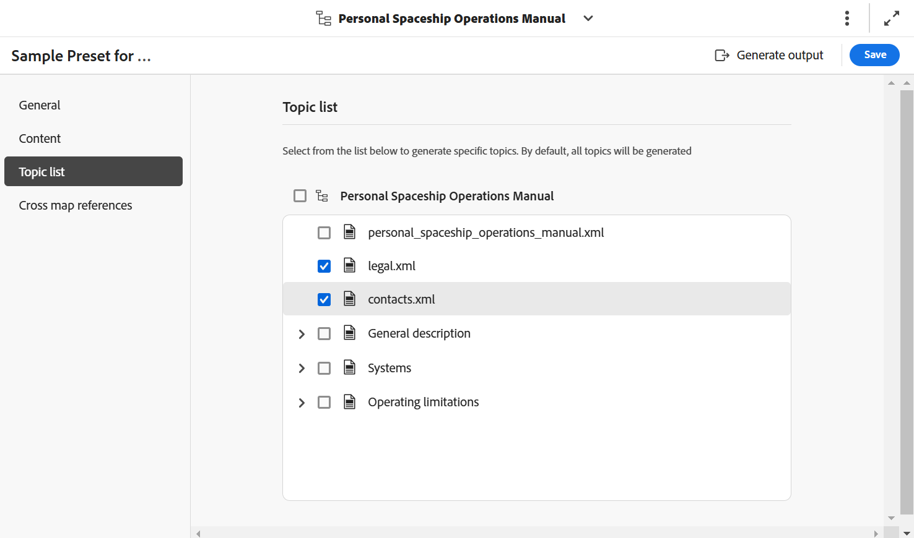

# Paramètre prédéfini d’AEM Sites dans la console Map

Vous pouvez créer des paramètres prédéfinis d’AEM Sites à partir de la console Carte et les configurer pour générer la sortie AEM Sites. Vous pouvez créer la sortie AEM Sites de deux manières :

- [Utiliser le mappage des composants composites](#use-composite-component-mapping)
- [Utiliser le mappage des composants hérités](#use-legacy-component-mapping)

>[!TIP]
>
> Il est recommandé d’utiliser le mappage des composants composites, disponible dans la version Experience Manager Guides 2502, ainsi que dans les versions plus récentes, pour des performances améliorées.

## Utiliser le mappage des composants composites

Le mappage des composants composites offre une publication plus rapide et plus évolutive vers AEM Sites par rapport au mappage des composants hérités. Il est fourni avec des modèles modifiables prêts à l’emploi qui peuvent être personnalisés en fonction de vos besoins à l’aide de l’éditeur de modèles d’AEM. Les modèles combinent des composants principaux de gestion de contenu web et des `guides-components` spécialisés afin de garantir aux utilisateurs finaux une expérience optimale sur vos pages AEM Sites. Vous pouvez également personnaliser vos modèles existants à l’aide de la méthode de mappage des composants composites .

Experience Manager Guides fournit des modèles prédéfinis pour la création d’AEM Sites. Ces modèles vous aident à assurer la cohérence de la disposition et de la structure du contenu.
- [Créez des pages d’accueil](../cs-install-guide/download-install-aem-sites-templates-cs.md#create-a-home-page-using-the-template) basées sur ces modèles prédéfinis.
- Vous pouvez [modifier des modèles de rubrique](../cs-install-guide/download-install-aem-sites-templates-cs.md#package-installation) et appliquer des styles en fonction de vos besoins.
- Vous pouvez également [personnaliser les modèles AEM Sites existants](../cs-install-guide/download-install-aem-sites-templates-cs.md#customize-existing-aem-sites-templates).

**Créer un paramètre prédéfini AEM Sites**

Pour créer le paramètre prédéfini AEM Sites à l’aide du mappage de composant composite, procédez comme suit :

1. [Ouvrez le fichier DITA map dans la console de mappage](./open-files-map-console.md).
1. Dans le panneau **Paramètres prédéfinis de sortie**, sélectionnez l’icône + pour créer un paramètre prédéfini de sortie.
1. Sélectionnez **AEM Sites** dans la liste déroulante **Type** de la boîte de dialogue **Nouveau paramètre prédéfini de sortie**.
1. Désélectionnez l’option **Utiliser le mappage des composants hérités**.
1. Sélectionnez l’option **Ajouter au profil du dossier actuel** pour créer un paramètre prédéfini de sortie dans le profil du dossier actuel. L’ indique un paramètre prédéfini au niveau du profil de dossier.

   En savoir plus sur la [Gestion des paramètres prédéfinis de sortie de profil globaux et de dossier](./web-editor-manage-output-presets.md).

1. Sélectionnez **Ajouter**.

   Le paramètre prédéfini d’AEM Sites est créé.

   {width="300" align="left"}

<!-----------------------
### Generate the AEM Sites output using the templates

Once, the preset is created, you can configure the various options available for AEM Sites output generation. Experience Manager Guides allows you to use the out of the box templates or add your own AEM Sites templates.

You can configure the Out-of-the-box Sites template  in two ways:

- In the **Sites** field, select the AEM sites where you want to publish your output.  For example, `AEMG Docs`.

    The **Publish path** and the **Topic page template** options are automatically set in the dropdown.  For example,  `AEMG-Docs-Site/en/docs/product1` and `Topic page` are set respectively. You can also choose the other options from the dropdown.

- Or, Select the **Use Sites path** option to select the complete Sites path, and then select a **Map page template**. 

    You can browse a predefined Sites path or specify a custom path even if the specified path has not been pre-created within the AEM Sites structure. In such cases, the system creates the necessary structure during the publishing process by using the selected map homepage template.

   For example, you can specify the path `/content/AEMG-Docs-Site/en/docs/product4` where the `product4`does not exist in the strcuture. In this case, the system automatically creates `product4` using the selected **Map page template** and publish the output within this newly created page. 
   
   The **Topic page template** is automatically set as `Topic Page`. However, you can choose to select other available options in the dropdown.

--->

### Configuration des paramètres prédéfinis AEM Sites pour le mappage des composants composites

>[!NOTE]
>
> Avant de configurer le paramètre prédéfini AEM Sites pour Experience Manager Guides, votre administrateur ou administratrice doit créer une structure AEM Sites à l’aide des modèles.

- **Logiciel On-premise** : découvrez comment [télécharger et installer des modèles AEM Sites](../install-guide/download-install-aem-sites-templates.md) pour les logiciels On-premise.
- **Cloud Service** : en savoir plus sur la [téléchargement et installation de modèles AEM Sites](../cs-install-guide/download-install-aem-sites-templates-cs.md) pour Cloud Service.

Dans la console Mappage , les options de configuration des paramètres prédéfinis pour le mappage des composants composites sont organisées sous les onglets suivants :

- Général
- Contenu
- Liste de sujets
- Références de mappage croisé

{width="650" align="left"}

**Général**

L&#39;onglet **Général** contient les options de paramétrage suivantes :

| Options d’AEM Sites | Description |
| --- | --- |
| Utiliser le chemin du site | Utilisez cette option pour publier votre contenu sur un site Experience Manager. |
| Chemin du site | **Cette option s’affiche si vous sélectionnez l’option** Utiliser le chemin du site ****. Parcourez le chemin d’accès prédéfini au site Experience Manager ou spécifiez un chemin d’accès personnalisé dans lequel vous souhaitez que la sortie soit publiée. L’option **Utiliser les sites** permet de spécifier le chemin de publication entier, même si le chemin spécifié n’a pas été précréé dans la structure AEM Sites. Dans ce cas, le système crée la structure nécessaire pendant le processus de publication en utilisant le modèle de page d’accueil de mappage sélectionné. |
| Modèle de page de carte | **Cette option s’affiche si vous sélectionnez l’option** Utiliser le chemin du site ****. Sélectionnez le modèle à appliquer aux pages d&#39;accueil de carte. |
| Site | Nom du Experience Manager Sites sur lequel vous souhaitez publier votre contenu. Les options de la liste déroulante sont renseignées en fonction de la liste des sites disponibles dans AEM Sites.  Sélectionnez **Actualiser**  pour récupérer une nouvelle liste d’options et refléter les données mises à jour. |
| Chemin de publication | Chemin d’accès dans votre référentiel AEM où la sortie est stockée. Le chemin de publication est renseigné avec tous les chemins qui contiennent les pages créées à partir du modèle Page d’accueil . La sortie AEM Sites du plan DITA est générée sous ce chemin d&#39;accès.  Par exemple, si vous spécifiez le site en tant que `AEMG-Docs` et le chemin de publication en tant que `aemg-docs-en/docs/product-abc.`, la sortie AEM Sites est générée sous le nœud `aemg-docs-en/docs/product-abc/` dans `crx/de`. |
| Modèle de page de rubrique | Sélectionnez le modèle à appliquer à toutes les rubriques de sortie. |
| Générer des noms de page en fonction de | **Nom de fichier de rubrique** : utilise le nom de fichier de la rubrique DITA pour créer l&#39;URL du site.   **Titre de la rubrique** : utilise le titre de la rubrique DITA pour créer les noms de site Experience Manager. |
| Nettoyage des pages générées précédemment | - **Supprimer les pages générées précédemment pour le sujet supprimé de la carte** : si la structure de la carte DTIA change, vous pouvez utiliser cette option pour supprimer les pages générées précédemment pour les sujets supprimés. Cette fonctionnalité est disponible uniquement pour la publication de carte complète.  Supposons que vous ayez publié un plan DITA, qui contient les rubriques a.dita, b.dita et c.dita. Avant de republier la carte, vous avez supprimé la rubrique b.dita de la carte. Désormais, si vous avez sélectionné cette option, tout le contenu associé à b.dita est supprimé de la sortie AEM Sites et seuls a.dita et c.dita sont publiés.  **Remarque** : les informations sur les pages supprimées sont également capturées dans les journaux de génération de sortie. Pour plus d’informations sur l’accès aux fichiers journaux, [Afficher et vérifier le fichier journal](generate-output-basic-troubleshooting.md#id1821I0Y0G0A__id1822G0P0CHS).   **Attention** : lors de la suppression des rubriques, les pages ne sont plus disponibles sur le site publié. Ainsi, avant que les rubriques ne soient supprimées, un avertissement s’affiche. Vous devez confirmer la suppression.  - **Supprimer toutes les pages créées par d’autres sources à ce chemin d’accès** : si vous sélectionnez cette option, toutes les pages publiées sur ce chemin d’accès à partir d’autres cartes, rubriques individuelles ou toute autre source sont supprimées. Les pages ne sont plus disponibles sur le site publié. Ainsi, avant que les rubriques ne soient supprimées, un avertissement s’affiche. Vous devez confirmer la suppression. |
| Workflow de post-génération | Lorsque vous sélectionnez cette option, une nouvelle liste déroulante Workflow de post-génération s’affiche, contenant tous les workflows configurés dans AEM. Vous devez sélectionner un workflow à exécuter une fois le workflow de génération de sortie terminé. |

**Contenu**

L&#39;onglet **Contenu** contient les options de paramétrage suivantes :

| Options d’AEM Sites | Description |
| --- | --- |
| Utiliser niveau de référence | Si vous avez créé une ligne de base pour le plan DITA sélectionné, sélectionnez cette option pour spécifier la version que vous souhaitez publier.  Affichage [Utilisation de la ligne de base](generate-output-use-baseline-for-publishing.md#id1825FI0J0PF) pour plus d’informations. |
| Filtrage conditionnel | Sélectionnez l’une des options suivantes :  **Aucune** : sélectionnez cette option si vous ne souhaitez appliquer aucune condition sur la sortie publiée. **Utilisation de DITAVAL** : Sélectionnez le ou les fichiers DITAVAL pour générer du contenu conditionné. Vous pouvez sélectionner plusieurs fichiers DITAVal à l’aide de la boîte de dialogue de navigation ou en saisissant le chemin du fichier. Utilisez la croix près du nom du fichier pour le supprimer. Les fichiers DITAVal sont évalués dans l&#39;ordre spécifié. De ce fait, les conditions spécifiées dans le premier fichier sont prioritaires sur les conditions correspondantes spécifiées dans les fichiers ultérieurs. Vous pouvez conserver l’ordre des fichiers en ajoutant ou en supprimant des fichiers. Si le fichier DITAVal est déplacé vers un autre emplacement ou est supprimé, il n&#39;est pas automatiquement supprimé du tableau de bord de mappage. Vous devez mettre à jour l’emplacement au cas où les fichiers seraient déplacés ou supprimés. Vous pouvez pointer sur le nom du fichier pour afficher le chemin d’accès dans le référentiel AEM où le fichier est stocké. Vous ne pouvez sélectionner que les fichiers DITAVal et une erreur s&#39;affiche si vous sélectionnez un autre type de fichier. **Paramètre prédéfini de condition** : sélectionnez un paramètre prédéfini de condition dans la liste déroulante pour appliquer une condition lors de la publication de la sortie. Cette option est visible si vous avez ajouté une condition pour le fichier de plan DITA. Les paramètres conditionnels sont disponibles dans l&#39;onglet Paramètres prédéfinis de condition de la console Plan DITA. Pour en savoir plus sur les paramètres prédéfinis de condition, consultez [Utilisation des paramètres prédéfinis de condition](generate-output-use-condition-presets.md#id1825FL004PN). |
| Arguments de ligne de commande DITA-OT supplémentaires | Spécifiez les arguments supplémentaires que DITA-OT doit traiter lors de la génération de la sortie. Pour plus d&#39;informations sur les arguments de ligne de commande pris en charge dans DITA-OT, consultez la [documentation DITA-OT](https://www.dita-ot.org/). |
| Métadonnées   Propriétés  Fichier (Assets) | Sélectionnez les propriétés à traiter en tant que métadonnées. Ces propriétés sont définies à partir de la page Propriétés du fichier DITA map ou bookmap. Les propriétés que vous sélectionnez dans la liste déroulante s’affichent sous le champ **Propriétés du fichier**. Sélectionnez l’icône croisée en regard de la propriété pour la supprimer.   **Remarque** : les propriétés de métadonnées sont sensibles à la casse.  *Si vous avez sélectionné une ligne de base, les valeurs des propriétés sont basées sur la version de la ligne de base sélectionnée. * Si vous n&#39;avez pas sélectionné de ligne de base, les valeurs des propriétés sont basées sur la dernière version.  Vous pouvez également transmettre les métadonnées à la sortie à l’aide de la publication DITA-OT. Pour plus de détails, [Transmettez les métadonnées à la sortie à l’aide de DITA-OT](pass-metadata-dita-ot.md#id21BJ00QD0XA).  **Remarque** : si vous n&#39;avez pas défini le `cq:tags` dans l&#39;option Propriétés, les valeurs de `cq:tags` sont sélectionnées à partir de la copie de travail en cours, même si vous avez sélectionné une ligne de base pour la publication. |
| Métadonnées    Utilisation des propriétés de mappage comme solution de secours | Si cette option est sélectionnée, les propriétés définies pour le fichier de mappage sont également copiées dans les rubriques où ces propriétés ne sont pas définies. Tenez compte des points suivants lors de l’utilisation de cette option :  *seules les propriétés de type Chaîne, Date ou Long (à une et plusieurs valeurs) peuvent être transmises aux pages du site AEM. * Les valeurs de métadonnées d’une propriété de type Chaîne ne prennent pas en charge les caractères spéciaux (`@, #, " "`, par exemple). * Cette option doit être utilisée avec l’option `Properties`. |

**Liste de sujets**

L&#39;onglet **Liste des rubriques** affiche la liste des rubriques présentes dans la copie de travail actuelle du plan DITA. Par défaut, toutes les rubriques sont incluses. Vous pouvez sélectionner des rubriques spécifiques et générer la sortie AEM Sites uniquement pour celles-ci. Par exemple, vous avez mis à jour certaines rubriques afin de ne publier que ces rubriques au lieu de publier l&#39;ensemble du plan DITA.

 {width="800" align="left"}

>[!NOTE]
>
> Lorsqu&#39;une ligne de base est sélectionnée dans l&#39;onglet **Contenu**, la liste des rubriques affiche les rubriques et leurs versions à partir de la ligne de base jointe. En outre, la publication incrémentielle à partir de la liste Rubriques ne doit être utilisée que lorsqu’il n’y a aucune modification de la structure du mappage. Si la structure de la carte/table des matières est modifiée, la carte entière doit être publiée une seule fois pour mettre à jour la table des matières.

**Références de mappage croisé**

Cette liste contient des rubriques contenant des références croisées avec `scope =”peer”`. Vous pouvez spécifier le contexte de publication d&#39;une liste de références croisées avec des `scope=”peer”` aux rubriques disponibles dans d&#39;autres plans DITA. Cet onglet s’affiche si vous utilisez la version Experience Manager Guides (UUID).

Pour plus d&#39;informations, reportez-vous à la section [Utilisation de rubriques connexes](#working-with-linked-topics) ci-dessous.

Une fois la configuration effectuée, enregistrez les modifications apportées au préréglage, puis sélectionnez **Générer** pour générer AEM Sites pour le mappage correspondant.

>[!NOTE]
>
> Si vous publiez du contenu sur des sites AEM pour la première fois, il est recommandé de publier les pages au niveau du site. Cela permet de s’assurer que la sortie s’affiche correctement sur l’instance de **publication** sans aucune interruption CSS.

## Utiliser le mappage des composants hérités

Les étapes de création du paramètre prédéfini AEM Sites à l’aide du mappage des composants hérités sont identiques à celles décrites dans la section [Mappage des composants composites](#use-composite-component-mapping) ci-dessus. Toutefois, lors de la création du paramètre prédéfini, veillez à sélectionner l’option **Utiliser le mappage de composant hérité** dans la boîte de dialogue **Nouveau paramètre prédéfini de sortie**.

 {width="300" align="left"}

Dans la console Mappage , les options de configuration des paramètres prédéfinis pour le mappage des composants hérités sont organisées sous les onglets suivants :

- Général
- Contenu
- Références de mappage croisé

{width="500" align="left"}

**Général**

L&#39;onglet **Général** contient les options de paramétrage suivantes :

| Options d’AEM Sites | Description |
| --- | --- |
| Nom du site | Nom du site où la sortie est stockée dans votre référentiel AEM.  Un nœud du référentiel AEM est créé et porte le nom spécifié ici. Si vous ne spécifiez pas le nom du site, le nœud de site est créé avec le nom de fichier de plan DITA.  Le nom du site que vous spécifiez ici est également utilisé comme titre dans l’onglet du navigateur.  Vous pouvez également utiliser des variables lors de la définition du nom du site. |
| Chemin de sortie | Chemin d’accès dans votre référentiel AEM où la sortie est stockée. Lors de la génération de la sortie finale, le nom du site et le chemin de sortie sont combinés. Par exemple, si vous définissez le Nom du site sur `user-guide` et le Chemin de sortie sur `/content/output/aem-guides`, la sortie finale est générée sous le nœud `/content/output/aem-guides/user-guide` .  Vous pouvez également utiliser des variables lors de la définition du chemin de sortie. |
| Pages de sortie existantes | Sélectionnez l’option **Remplacer le contenu** pour remplacer le contenu des pages existantes. Cette option remplace uniquement le contenu présent sous les nœuds de contenu et d’en-tête de la page. Cette option permet la publication mixte de contenu. La sélection de cette option permet de sélectionner Supprimer les pages orphelines de la sortie publiée. Il s’agit également de l’option *par défaut* pour créer la sortie AEM Sites.  Sélectionnez l’option **Supprimer et créer** pour forcer la suppression des pages existantes lors de la publication. Cette option supprime le nœud de page, ainsi que son contenu et toutes les pages enfants qu’il contient. Utilisez cette option si vous avez modifié le modèle de conception de votre paramètre prédéfini de sortie ou si vous souhaitez supprimer les pages supplémentaires déjà présentes dans la destination. |
| Supprimer les pages précédemment générées pour les rubriques supprimées de la carte | Si la structure de la carte DTIA change, vous pouvez utiliser cette option pour supprimer les pages générées précédemment pour les rubriques supprimées. Cette fonctionnalité est disponible uniquement pour la publication de carte complète.  Supposons que vous ayez publié un plan DITA, qui contient les rubriques a.dita, b.dita et c.dita. Avant de republier la carte, vous avez supprimé la rubrique b.dita de la carte. Désormais, si vous avez sélectionné cette option, tout le contenu associé à b.dita est supprimé de la sortie AEM Sites et seuls a.dita et c.dita sont publiés.  **Remarque** : les informations sur les pages supprimées sont également capturées dans les journaux de génération de sortie. Pour plus d’informations sur l’accès aux fichiers journaux, [Afficher et vérifier le fichier journal](generate-output-basic-troubleshooting.md#id1821I0Y0G0A__id1822G0P0CHS).   **Attention** : lors de la suppression des rubriques, les pages ne sont plus disponibles sur le site publié. Ainsi, avant que les rubriques ne soient supprimées, un avertissement s’affiche. Vous devez confirmer la suppression. |
| Conception | Sélectionnez le modèle de conception à utiliser pour générer la sortie.  Pour plus d’informations sur l’utilisation de modèles de conception personnalisés pour générer une sortie, contactez votre administrateur de publication. |
| Workflow de post-génération | Lorsque vous sélectionnez cette option, une nouvelle liste déroulante Workflow de post-génération s’affiche, contenant tous les workflows configurés dans AEM. Vous devez sélectionner un workflow à exécuter une fois le workflow de génération de sortie terminé. |
| Conserver les fichiers temporaires | Sélectionnez cette option pour conserver les fichiers temporaires générés par DITA-OT. Si vous rencontrez des erreurs lors de la génération de la sortie via DITA-OT, sélectionnez cette option pour conserver les fichiers temporaires. Vous pouvez ensuite utiliser ces fichiers pour résoudre les erreurs de génération de sortie.    Après avoir généré la sortie, sélectionnez l’icône **Télécharger les fichiers temporaires**  pour télécharger le dossier ZIP contenant les fichiers temporaires.    **Remarque** : si des propriétés de fichier sont ajoutées pendant la génération, les fichiers temporaires de sortie incluent également un fichier *metadata.xml* contenant ces propriétés. |

**Contenu**

L&#39;onglet **Contenu** contient les options de paramétrage suivantes :

| Options d’AEM Sites | Description |
| --- | --- |
| Utiliser niveau de référence | Si vous avez créé une ligne de base pour le plan DITA sélectionné, sélectionnez cette option pour spécifier la version que vous souhaitez publier.  Affichage [Utilisation de la ligne de base](generate-output-use-baseline-for-publishing.md#id1825FI0J0PF) pour plus d’informations. |
| Filtrage conditionnel | Sélectionnez l’une des options suivantes :  **Aucune** : sélectionnez cette option si vous ne souhaitez appliquer aucune condition sur la sortie publiée. **Utilisation de DITAVAL** : Sélectionnez le ou les fichiers DITAVAL pour générer du contenu conditionné. Vous pouvez sélectionner plusieurs fichiers DITAVal à l’aide de la boîte de dialogue de navigation ou en saisissant le chemin du fichier. Utilisez la croix près du nom du fichier pour le supprimer. Les fichiers DITAVal sont évalués dans l&#39;ordre spécifié. De ce fait, les conditions spécifiées dans le premier fichier sont prioritaires sur les conditions correspondantes spécifiées dans les fichiers ultérieurs. Vous pouvez conserver l’ordre des fichiers en ajoutant ou en supprimant des fichiers. Si le fichier DITAVal est déplacé vers un autre emplacement ou est supprimé, il n&#39;est pas automatiquement supprimé du tableau de bord de mappage. Vous devez mettre à jour l’emplacement au cas où les fichiers seraient déplacés ou supprimés. Vous pouvez pointer sur le nom du fichier pour afficher le chemin d’accès dans le référentiel AEM où le fichier est stocké. Vous ne pouvez sélectionner que les fichiers DITAVal et une erreur s&#39;affiche si vous sélectionnez un autre type de fichier. **Paramètre prédéfini de condition** : sélectionnez un paramètre prédéfini de condition dans la liste déroulante pour appliquer une condition lors de la publication de la sortie. Cette option est visible si vous avez ajouté une condition pour le fichier de plan DITA. Les paramètres conditionnels sont disponibles dans l&#39;onglet Paramètres prédéfinis de condition de la console Plan DITA. Pour en savoir plus sur les paramètres prédéfinis de condition, consultez [Utilisation des paramètres prédéfinis de condition](generate-output-use-condition-presets.md#id1825FL004PN). |
| Métadonnées   Propriétés  Fichier (Assets) | Sélectionnez les propriétés à traiter en tant que métadonnées. Ces propriétés sont définies à partir de la page Propriétés du fichier DITA map ou bookmap. Les propriétés que vous sélectionnez dans la liste déroulante s’affichent sous le champ **Propriétés du fichier**. Sélectionnez l’icône croisée en regard de la propriété pour la supprimer.   **Remarque** : les propriétés de métadonnées sont sensibles à la casse.  *Si vous avez sélectionné une ligne de base, les valeurs des propriétés sont basées sur la version de la ligne de base sélectionnée. * Si vous n&#39;avez pas sélectionné de ligne de base, les valeurs des propriétés sont basées sur la dernière version.  Vous pouvez également transmettre les métadonnées à la sortie à l’aide de la publication DITA-OT. Pour plus de détails, [Transmettez les métadonnées à la sortie à l’aide de DITA-OT](pass-metadata-dita-ot.md#id21BJ00QD0XA).  **Remarque** : si vous n&#39;avez pas défini le `cq:tags` dans l&#39;option Propriétés, les valeurs de `cq:tags` sont sélectionnées à partir de la copie de travail en cours, même si vous avez sélectionné une ligne de base pour la publication. |
| Métadonnées    Utilisation des propriétés de mappage comme solution de secours | Si cette option est sélectionnée, les propriétés définies pour le fichier de mappage sont également copiées dans les rubriques où ces propriétés ne sont pas définies. Tenez compte des points suivants lors de l’utilisation de cette option :  *seules les propriétés de type Chaîne, Date ou Long (à une et plusieurs valeurs) peuvent être transmises aux pages du site AEM. * Les valeurs de métadonnées d’une propriété de type Chaîne ne prennent pas en charge les caractères spéciaux (`@, #, " "`, par exemple). * Cette option doit être utilisée avec l’option `Properties`. |

**Références de mappage croisé**

Cette liste contient des rubriques contenant des références croisées avec `scope =”peer”`. Vous pouvez spécifier le contexte de publication d&#39;une liste de références croisées avec des `scope=”peer”` aux rubriques disponibles dans d&#39;autres plans DITA. Cet onglet s’affiche si vous utilisez la version Experience Manager Guides (UUID).

Pour plus d&#39;informations, reportez-vous à la section [Utilisation de rubriques connexes](#working-with-linked-topics) ci-dessous.

## Utilisation de rubriques liées

Experience Manager Guides vous permet de créer des références de rubrique à l’aide du `peer @scope` . Vous pouvez ensuite définir le contexte de publication de ces références à partir des paramètres prédéfinis d’AEM Sites et enfin générer la sortie des rubriques liées.

Pour plus de détails, voir [Générer la sortie des rubriques de liaison à partir d&#39;autres cartes](../user-guide/generate-output-aem-site.md#generate-output-linking-topics-from-other-maps).

Pour spécifier le contexte de publication des fichiers liés, procédez comme suit :

1. Ouvrez l’onglet **Références de mappage croisé**. Pour afficher cet onglet, assurez-vous que les `<xrefs>` disposent d’identifiants uniques. Les ID uniques des `<xrefs>` seront automatiquement générés lors de la modification/enregistrement de l’ancien contenu si l’ID n’existe pas.

   Vous ne pourrez pas afficher le lien entre les cartes dans les cas suivants :
   - Pour les paramètres prédéfinis créés avant la version 4.6, l’onglet Références croisées est désactivé et une info-bulle, **Reportez-vous au tableau de bord des cartes**, s’affiche.
   - Pour les paramètres prédéfinis créés à partir du tableau de bord de mappage, **reportez-vous à Tableau de bord de mappage** une info-bulle s’affiche.
   - Pour les paramètres prédéfinis prêts à l’emploi, **voir Tableau de bord des cartes** une info-bulle s’affiche.
   - Pour les paramètres prédéfinis globaux, créez une copie locale de ce paramètre prédéfini global pour définir les références croisées.

1. Une liste de rubriques et de leurs références s’affiche

   >[!NOTE]
   >
   >L’onglet **Références de mappage croisé** affiche les rubriques liées à l’aide de l’`scope=”peer”` uniquement. Pour les liens avec `scope=”local”`, il n’est pas nécessaire de spécifier le contexte de publication.

   Toutes les rubriques liées ont leur dernier paramètre prédéfini de sortie et leur dernier mappage sélectionnés par défaut. Par défaut, le contexte de publication de toutes les rubriques liées est défini sur `<Most recently generated>` mappage .

   

1. Si vous souhaitez utiliser la sortie la plus récemment publiée de chaque fichier dépendant dans le mappage, sélectionnez **Utiliser la dernière générée** contexte de publication pour toutes les rubriques dépendantes.
Vous devez publier le mappage sélectionné comme mappage parent avant de publier le mappage contenant les rubriques liées. Si la carte avec des rubriques liées n’est pas publiée, les liens s’affichent sous la forme de texte normal au lieu de liens hypertexte dans la sortie AEM Sites.
Vous devez sélectionner le même type de paramètre prédéfini AEM Sites pour la rubrique liée. Par exemple, si le paramètre prédéfini AEM Sites actuel utilise le mappage des composants hérités, sélectionnez un paramètre prédéfini AEM Sites similaire de la rubrique liée.
1. Dans la liste déroulante Mappage parent , sélectionnez le fichier de mappage avec la sortie duquel vous souhaitez lier la sortie du mappage actuel.
La sélection d’un fichier de mappage affiche l’UUID du mappage dans la colonne UUID du mappage parent . Les paramètres prédéfinis de sortie associés à la carte sélectionnée sont répertoriés dans la liste Paramètre prédéfini de la carte parent. Par exemple, la rubrique 1 de la carte A contient une référence à la rubrique 2. La rubrique 2 peut être présente dans une ou plusieurs cartes. Vous pouvez sélectionner le mappage parent et un paramètre prédéfini spécifique ou la sortie publiée le plus récemment pour chaque lien.

1. Si la même rubrique est référencée plusieurs fois dans un fichier, vous pouvez ajouter un contexte de publication différent pour chaque instance. Vous bénéficiez ainsi d’une plus grande flexibilité et d’un meilleur contrôle sur leur contenu. Par exemple, la rubrique 3 est présente à la fois dans la carte B et dans la carte C. La rubrique 1 contient deux références à la rubrique 3. Vous pouvez choisir Mappage B comme mappage parent pour le premier lien et Mappage C comme parent pour le deuxième lien.

1. Dans la liste déroulante Paramètre prédéfini de la carte parente , sélectionnez le paramètre prédéfini de sortie avec lequel vous souhaitez lier la sortie de la carte actuelle.
   >[!NOTE]
   >
   > Les différents paramètres prédéfinis AEM Sites de la carte actuelle apparaissent dans la liste déroulante. Si vous ne sélectionnez pas de paramètre prédéfini, une icône d’avertissement s’affiche et la génération de la sortie échoue.

1. Sélectionnez la carte requise et son paramètre prédéfini de sortie pour toutes les rubriques sources, puis sélectionnez **Générer**.

**Rubrique parente :** [Présentation des paramètres prédéfinis de sortie](generate-output-understand-presets.md)