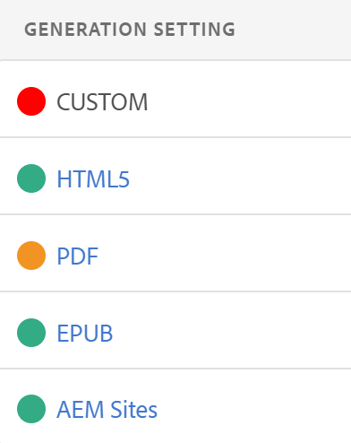

# Résolution des problèmes de base {#id1821I0Y0G0A}

Lorsque vous utilisez Adobe Experience Manager Guides, vous pouvez rencontrer des erreurs lors de la publication ou de l’ouverture de votre document. Ces erreurs peuvent se trouver dans le plan DITA, la rubrique ou dans le processus Experience Manager Guides lui-même. Cette section fournit des informations sur la manière d’accéder aux informations et de les analyser dans le fichier journal de génération de sortie. En outre, si votre rubrique DITA est trop volumineuse, vous risquez de voir l&#39;erreur de compilation JSP. Cette section fournit également des informations sur la façon de résoudre l’erreur de compilation JSP.

## Afficher et vérifier le fichier journal {#id1822G0P0CHS}

Pour afficher et vérifier le fichier journal de génération de sortie, procédez comme suit :

1. Une fois que vous avez lancé le processus de génération de sortie, sélectionnez **Sorties** dans la console de mappage DITA.

   La colonne **Paramètre de génération** des **Sorties générées** affiche la couleur pour fournir un indice visuel sur le succès ou l’échec de la génération de sortie pour différents paramètres prédéfinis de sortie.

   {width="300" align="left"}

   Dans la capture d’écran ci-dessus :

   - Le rouge indique l’échec de la génération de sortie.
   - Le vert indique une génération de sortie réussie.
   - Le code orange indique une génération de sortie réussie avec des erreurs.

   >[!NOTE]
   >
   > Les couleurs de l’onglet **Sortie**, qui indiquent le statut de divers résultats de sortie, sont différentes des couleurs utilisées pour classer les différents types d’erreurs dans les fichiers journaux.

1. Sélectionnez le lien dans la colonne **Date de génération** une fois la tâche terminée.

   Le fichier journal s’ouvre dans un nouvel onglet.

   {align="left"}

1. Appliquez les filtres suivants pour mettre en surbrillance le texte dans le fichier journal :
   - Fatal : met en surbrillance les erreurs fatales dans le fichier journal avec la couleur rouge foncé.
   - Erreur : met en surbrillance les erreurs dans le fichier journal avec la couleur rouge. Les exceptions sont traitées comme des erreurs et sont mises en surbrillance de manière similaire en rouge.
   - Avertissement : met en surbrillance les avertissements dans le fichier journal avec la couleur orange.
   - Infos : met en surbrillance les messages d’information dans le fichier journal avec la couleur verte.

1. Utilisez les boutons de navigation vers le haut et vers le bas pour accéder au texte en surbrillance dans le fichier journal.

   Vous pouvez également faire défiler le fichier journal et vérifier les messages.

## Copier et vérifier le fichier journal dans un éditeur de texte

Effectuez les étapes suivantes pour copier et vérifier le fichier journal de génération de sortie dans un éditeur de texte :

1. Une fois que vous avez lancé le processus de génération de sortie, sélectionnez **Sorties** dans la console de mappage DITA.

1. Sélectionnez le lien dans la colonne **Date de génération** une fois la tâche terminée.

   Le fichier journal s’ouvre dans un nouvel onglet.

1. Sélectionnez le bouton **Copier le journal**. Le fichier journal est copié dans le presse-papiers.
1. Ouvrez un éditeur de texte et collez le fichier journal dans l’éditeur.

1. Parcourez le fichier journal et recherchez des messages.

   Les informations suivantes vous aideront à déterminer s&#39;il y a une erreur dans le fichier DITA ou dans le processus Experience Manager Guides :

   - *Erreur liée au fichier de plan DITA* : si une erreur est trouvée dans le fichier de plan DITA ou dans tout autre fichier contenu dans le plan DITA, le fichier journal contiendra une chaîne « BUILD FAILED ». Vous pouvez vérifier les informations fournies dans le fichier journal pour localiser le fichier erroné et résoudre le problème.

   Dans l’exemple de fragment de code suivant de fichier journal, vous pouvez afficher le message `BUILD FAILED` ainsi que la raison de l’erreur.

   {width="650" align="left"}

   - *Erreur liée à Experience Manager Guides* : l&#39;autre type d&#39;erreur que vous pouvez identifier dans le fichier journal est lié au processus Experience Manager Guides lui-même. Dans ce cas, le fichier de mappage DITA est analysé avec succès, mais le processus de génération de sortie échoue en raison d&#39;une erreur interne dans Experience Manager Guides. Pour ce type d’erreur, vous devez demander de l’aide à l’équipe d’assistance technique.

   Dans l’exemple d’extrait de fichier journal suivant, vous pouvez afficher le message `BUILD SUCCESSFUL`, suivi d’une autre erreur technique.

   {width="650" align="left"}

## Résoudre l’erreur de compilation JSP

Si votre rubrique DITA est trop volumineuse, il se peut que l&#39;erreur de compilation JSP \(`org.apache.sling.api.request.TooManyCallsException`\) s&#39;affiche dans votre navigateur. Cette erreur peut apparaître lorsque vous ouvrez une rubrique pour la modifier, la réviser ou la publier.

Pour résoudre ce problème, procédez comme suit :

1. Dans la navigation globale, sélectionnez Outils et choisissez Opérations \> Console web.

   La page de configuration de la console web Adobe Experience Manager s’affiche.

1. Recherchez et sélectionnez le composant *Servlet principal Apache Sling*.

   Les options configurables pour le servlet principal Apache Sling s’affichent.

1. Augmentez la valeur du paramètre *Nombre d’appels par requête* en fonction de vos besoins.

**Rubrique parente :**&#x200B;[ Génération de sortie](generate-output.md)
