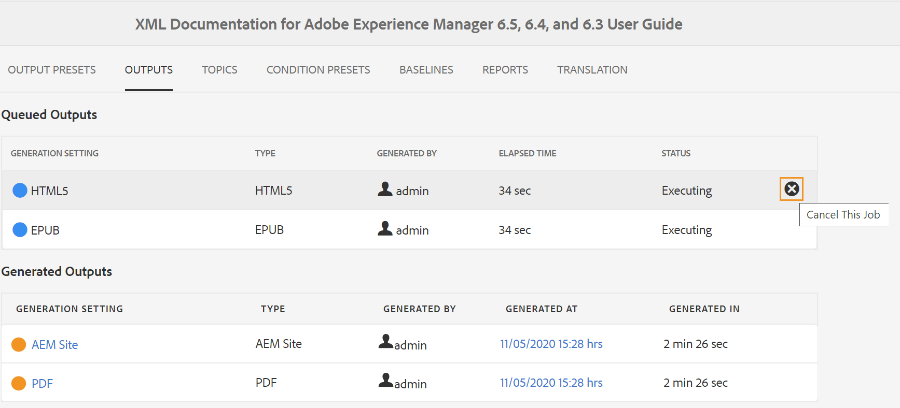

# Gérer le processus de génération de sortie

Adobe Experience Manager Guides permet d’effectuer les actions suivantes sur la sortie générée :

- [Afficher le statut de la tâche de génération de sortie](#view-the-status-of-the-output-generation-task)
- [Annuler une tâche de génération de sortie](#cancel-an-output-generation-task)
- [Supprimer une tâche de sortie](#delete-an-output-task)

## Afficher le statut de la tâche de génération de sortie

Une fois que vous avez lancé la tâche de génération de sortie pour un mappage ou que vous avez régénéré les rubriques sélectionnées, Experience Manager Guides envoie cette tâche à la file d’attente de génération de sortie. Cette file d’attente est mise à jour en temps réel, affichant le statut de chaque tâche de génération de sortie dans la file d’attente.

1. Dans l’interface utilisateur d’Assets, accédez au fichier de mappage pour lequel vous souhaitez vérifier le statut de génération de sortie et ouvrez-le.

1. Sélectionnez **SORTIES**.

   

   La page Sorties est divisée en deux parties :

   - **Sorties mises en file d’attente :**

     Répertorie les sorties qui sont en attente de génération ou qui sont en cours de génération. Les tâches en file d’attente ou en cours s’affichent avec une icône de couleur bleue devant le nom du paramètre prédéfini. Vous pouvez également trouver le paramètre ou le préréglage de génération de sortie utilisé pour la tâche mise en file d’attente, le type, l’utilisateur qui a initié la tâche, la durée écoulée depuis la mise en file d’attente de la tâche et le statut actuel.

     Sélectionnez le lien pour accéder au tableau de bord **Publication** et afficher le statut d’exécution actuel. Une liste de toutes les tâches de publication actives est disponible dans le tableau de bord de publication. Les liens **Sorties mises en file d’attente** et **Tableau de bord de publication** ne s’affichent que lorsque des sorties sont en attente de génération ou en cours de génération. Elles n’apparaissent pas une fois les tâches de sortie terminées.Pour plus d’informations sur le tableau de bord de publication, consultez la section [Gérer les tâches de publication à l’aide du tableau de bord de publication](generate-output-publish-dashboard.md#).

   - **Sorties générées**

     Répertorie les tâches de sortie qui ont été terminées. Là encore, les informations affichées ici sont similaires à la section Sorties mises en file d’attente avec quelques différences. Vous disposez d’un nouvel ensemble d’informations sous la forme d’une icône de résultat de sortie et de l’heure de génération de la sortie.

     Dans cette liste, vous pouvez avoir des tâches qui se sont exécutées avec succès, des tâches qui se sont exécutées avec un message ou des tâches ayant échoué. Les tâches réussies s’affichent avec une icône de couleur verte, les tâches comportant un message avec une icône de couleur orange et les tâches ayant échoué s’affichent avec une icône de couleur rouge.

     Pour toutes les tâches, le processus de publication crée un fichier journal \(logs.txt\) accessible en sélectionnant le lien dans la colonne Généré à . Pour les tâches ayant échoué ou contenant des messages, vous pouvez vérifier le fichier journal, comme expliqué dans la section [Afficher et vérifier le fichier journal](generate-output-basic-troubleshooting.md#id1822G0P0CHS).

     >[!NOTE]
     >
     > Lorsque vous sélectionnez le lien de la sortie PDF générée, vous êtes invité à télécharger le PDF.

## Annuler une tâche de génération de sortie

Experience Manager Guides offre aux éditeurs un moyen simple et facile d’annuler toute tâche de publication en cours. En tant qu&#39;éditeur, vous pouvez annuler une tâche de publication en cours à partir de la console de plan DITA ou du tableau de bord [Publication](generate-output-publish-dashboard.md#).

Effectuez les étapes suivantes pour annuler une tâche de génération de sortie à partir de la console de mappage DITA :

1. Dans l’interface utilisateur d’Assets, accédez au fichier de mappage pour lequel vous souhaitez annuler une tâche de génération de sortie en cours, puis ouvrez-le.

1. Sélectionnez **SORTIES**.

1. Dans la liste **Sorties mises en file d’attente**, placez le pointeur sur une tâche à annuler.

1. Sélectionnez l’icône **Annuler ce traitement**.

   

1. Sélectionnez **Oui** dans l’invite de message **Confirmer l’annulation**.

   

   Si la tâche n&#39;est pas encore démarrée, la commande d&#39;annulation est exécutée sur la tâche. Pour une tâche en cours d&#39;annulation, le Statut est défini sur Annulation.

   Une fois la tâche annulée, elle est déplacée vers la liste **Sorties générées** avec un statut **Annulé**. Lorsque vous pointez sur la tâche annulée, le nom de l’utilisateur qui a annulé la tâche s’affiche. Dans la capture d’écran suivante, la tâche *HTML5* est annulée.

   

## Supprimer une tâche de sortie

Lorsque vous générez plusieurs sorties pour un plan DITA, la liste des sorties générées pour un tel plan devient très longue au fil du temps. En tant qu’éditeur, vous pouvez nettoyer l’historique de sortie de n’importe quel fichier de mappage en supprimant les tâches obsolètes de la liste *Sorties générées*. Notez que la sortie n’est pas supprimée du système, seule l’entrée de la sortie générée est supprimée de la liste *Sorties générées*.

Effectuez les étapes suivantes pour supprimer une tâche de sortie de la liste Sortie générée :

1. Dans l’interface utilisateur d’Assets, accédez au fichier de mappage à partir duquel vous souhaitez supprimer les tâches, puis ouvrez-le.

1. Sélectionnez **SORTIES**.

1. Dans la liste **Sorties générées**, placez le pointeur sur une tâche à supprimer.

1. Sélectionnez l’icône de suppression.

   

1. Sélectionnez **Oui** dans l’invite de message **Confirmer la suppression**.

   La tâche est supprimée de la liste des Sorties générées .
