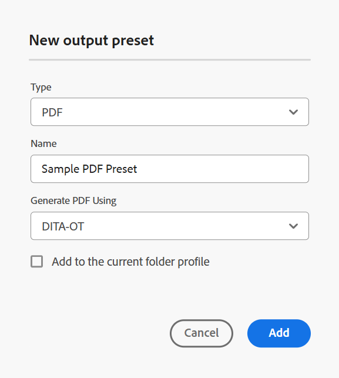

# Créer un paramètre prédéfini de sortie PDF DITA-OT {#id205BE600HAH}

Vous pouvez créer le paramètre prédéfini de sortie PDF DITA-OT de deux manières :

- [Création du paramètre prédéfini PDF DITA-OT à partir de la console Carte](#create-the-dita-ot-pdf-preset-from-the-map-console)
- [Création du paramètre prédéfini PDF DITA-OT à partir du tableau de bord de carte](#create-the-dita-ot-pdf-preset-from-the-map-dashboard)

## Création du paramètre prédéfini PDF DITA-OT à partir de la console Carte

Pour créer le paramètre prédéfini PDF à partir de la console de mappage, procédez comme suit :

1. [Ouvrez un fichier de mappage DITA dans la console Mappage](./open-files-map-console.md).

   Vous pouvez également accéder au fichier de mappage à partir du widget **Fichiers récents** dans la section [Aperçu](./intro-home-page.md#overview). Le fichier de mappage sélectionné s’ouvre dans la console Mappage .
1. Dans l’onglet **Paramètres prédéfinis de sortie**, sélectionnez l’icône + pour créer un paramètre prédéfini de sortie.
1. Sélectionnez **PDF** dans la liste déroulante Type de la boîte de dialogue **Nouveau paramètre prédéfini de sortie**.
1. Dans le champ **Nom**, attribuez un nom à ce paramètre prédéfini.
1. Dans le champ **Générer PDF à l’aide de**, sélectionnez **DITA-OT**.
1. Sélectionnez l’option **Ajouter au profil du dossier actuel** pour créer un paramètre prédéfini de sortie dans le profil du dossier actuel. L’ indique un paramètre prédéfini au niveau du profil de dossier.

   En savoir plus sur la [Gestion des paramètres prédéfinis de sortie de profil globaux et de dossier](./web-editor-manage-output-presets.md).

1. Sélectionnez **Ajouter**.

   Le paramètre prédéfini de PDF est créé.

   {width="350" align="left"}

Dans la console Map, les options de configuration des paramètres prédéfinis pour DITA-OT sont organisées sous les onglets **Général** et **Avancé** de la console Map.

{width="350" align="left"}

**Général**

L&#39;onglet **Général** contient les options de paramétrage suivantes :

- Chemin de sortie
- Arguments de ligne de commande DITA-OT
- Nom de fichier PDF
- Filtrage conditionnel \(si les conditions sont définies pour un mappage\)
- Utiliser la ligne de base \(Si une ligne de base est créée pour une carte\)
- Workflow de post-génération

**Avancé**

L’onglet **Avancé** contient les options de configuration suivantes :

- Activer le contrôle de version
- Conserver les fichiers temporaires
- Propriétés du fichier

Pour plus d’informations sur les options de configuration des paramètres prédéfinis, consultez la section Configuration des paramètres prédéfinis de PDF [&#128279;](#pdf-preset-configuration).

## Création du paramètre prédéfini PDF DITA-OT à partir du tableau de bord de carte

Pour créer le paramètre prédéfini PDF à partir du tableau de bord de mappage, procédez comme suit :

1. Dans l’interface utilisateur d’Assets, accédez à et sélectionnez le plan DITA pour l’ouvrir dans le tableau de bord des plans.
1. Assurez-vous que l’onglet **Paramètres prédéfinis de sortie** est sélectionné.
1. Sélectionnez **Créer** dans la barre d’outils.

   Un nouveau formulaire de création de paramètre prédéfini de sortie s’affiche.

1. Saisissez les détails de configuration requis pour le paramètre prédéfini PDF.
1. Sélectionnez **Terminé** pour enregistrer les paramètres prédéfinis.

## Configuration des paramètres prédéfinis de PDF

Les options de configuration varient légèrement selon que vous configurez le paramètre prédéfini depuis la console Map ou le tableau de bord Map. Certaines options s’appliquent uniquement au tableau de bord des cartes, tandis que d’autres s’appliquent aux deux.

Si une même configuration comporte deux libellés de champ différents, un **/** les sépare dans le tableau ci-dessous. Le premier représente le libellé dans la console Mappage , et le second représente le libellé dans le tableau de bord Mappage .

Par exemple, **Chemin de sortie/Chemin de destination** - Ici, **Chemin de sortie** est le libellé utilisé dans la console de mappage, tandis que **Chemin de destination** est le libellé utilisé dans le tableau de bord de mappage pour la même configuration.

| Options de PDF | Description |
| --- | --- |
| Type de sortie (*applicable uniquement au tableau de bord des cartes*) | Type de sortie que vous souhaitez générer. Pour générer une sortie PDF, choisissez l’option PDF . |
| Nom du paramètre (*applicable uniquement au tableau de bord de carte*) | Attribuez un nom explicite aux paramètres de sortie PDF que vous êtes en train de créer. Par exemple, vous pouvez spécifier _sortie des clients internes_ ou _sortie des utilisateurs finaux_. |
| Générer PDF à l’aide de (*applicable uniquement au tableau de bord des cartes*) | Sélectionnez **DITA-OT** pour générer la sortie PDF. Sélectionnez **FrameMaker Publishing Server** si votre administrateur a configuré cette option. Certaines des options de configuration varient lorsque FMPS est sélectionné. En outre, l&#39;option de configuration FMPS n&#39;est disponible que dans le tableau de bord Map. |
| Chemin de sortie/chemin de destination | Chemin d’accès dans votre référentiel AEM où est stocké le PDF.  Vous pouvez également utiliser des variables lors de la définition du chemin de destination. Pour plus d’informations sur l’utilisation des variables, consultez la section [Utiliser des variables pour définir les options Chemin de destination, Nom du site ou Nom de fichier](generate-output-use-variables.md#id18BUG70K05Z). |
| Arguments de ligne de commande DITA-OT | Spécifiez les arguments supplémentaires que DITA-OT doit traiter lors de la génération de la sortie. Pour plus d&#39;informations sur les arguments de ligne de commande pris en charge dans DITA-OT, consultez la [documentation DITA-OT](https://www.dita-ot.org/). |
| Nom de la transformation | Indiquez le type de sortie que vous souhaitez générer. Cela est nécessaire si vous souhaitez générer une sortie à l’aide de votre propre plug-in personnalisé, qui est intégré au plug-in DITA-OT. Par exemple, si vous souhaitez générer une sortie XHTML, spécifiez `xhtml`. Pour obtenir la liste des transformations disponibles dans DITA-OT, consultez [Transformations DITA-OT (formats de sortie)](http://www.dita-ot.org/2.3/user-guide/AvailableTransforms.html) dans le guide d&#39;utilisation OASIS DITA-OT. |
| Nom de fichier/Nom de fichier PDF | Indiquez le nom du fichier avec lequel vous souhaitez enregistrer le PDF.  Vous pouvez également utiliser des variables lors de la définition du nom de fichier PDF. Pour plus d’informations sur l’utilisation des variables, consultez la section [Utiliser des variables pour définir les options Chemin de destination, Nom du site ou Nom de fichier](generate-output-use-variables.md#id18BUG70K05Z).  **Remarque** : si vous ne fournissez pas de nom de fichier, le titre du plan DITA est utilisé pour générer le nom de fichier PDF final. Si le mappage n&#39;a pas de titre, le nom de fichier du mappage DITA est utilisé pour désigner le PDF final. Le nom du fichier est assaini à l’aide des règles configurées dans le système pour gérer tout caractère non valide. |
| Filtrage conditionnel/Application de conditions à l’aide de | Sélectionnez l’une des options suivantes :  * **Aucune appliquée** : sélectionnez cette option si vous ne souhaitez appliquer aucune condition sur la sortie publiée. * **fichier DITAVal** : sélectionnez le ou les fichiers DITAVal pour générer du contenu personnalisé. Vous pouvez sélectionner plusieurs fichiers DITAVal à l’aide de la boîte de dialogue de navigation ou en saisissant le chemin du fichier. Utilisez la croix près du nom du fichier pour le supprimer. Les fichiers DITAVal sont évalués dans l&#39;ordre spécifié. De ce fait, les conditions spécifiées dans le premier fichier sont prioritaires sur les conditions correspondantes spécifiées dans les fichiers ultérieurs. Vous pouvez conserver l’ordre des fichiers en ajoutant ou en supprimant des fichiers. Si le fichier DITAVal est déplacé vers un autre emplacement ou est supprimé, il n&#39;est pas automatiquement supprimé du tableau de bord de mappage. Vous devez mettre à jour l’emplacement au cas où les fichiers seraient déplacés ou supprimés. Vous pouvez pointer sur le nom du fichier pour afficher le chemin d’accès dans le référentiel AEM où le fichier est stocké. Vous ne pouvez sélectionner que les fichiers DITAVal et une erreur s&#39;affiche si vous avez sélectionné un autre type de fichier. FrameMaker Publishing Server ne prend pas en charge les fichiers DITAVAL multiples. * **Paramètre prédéfini de condition** : sélectionnez un paramètre prédéfini de condition dans la liste déroulante pour appliquer une condition lors de la publication de la sortie. Cette option est visible si vous avez ajouté une condition présente dans l&#39;onglet Paramètres prédéfinis de condition de la console de mappage DITA. Pour en savoir plus sur les paramètres prédéfinis de condition, consultez [Utilisation des paramètres prédéfinis de condition](generate-output-use-condition-presets.md#id1825FL004PN). |
| Exécuter le workflow de post-génération | Lorsque vous sélectionnez cette option, une nouvelle liste déroulante Workflow de post-génération s’affiche, contenant tous les workflows configurés dans AEM. Vous devez sélectionner un workflow à exécuter une fois le workflow de génération de sortie terminé.  **Remarque** : pour plus d’informations sur la création d’un workflow de génération post-sortie personnalisé, consultez la section Personnaliser le workflow de génération post-sortie dans Installation et configuration d’Adobe Experience Manager Guides as a Cloud Service. |
| Utiliser niveau de référence | Si vous avez créé une ligne de base pour le plan DITA sélectionné, sélectionnez cette option pour spécifier la version que vous souhaitez publier.  Affichage [Utilisation de la ligne de base](generate-output-use-baseline-for-publishing.md#id1825FI0J0PF) pour plus d’informations. |
| Conserver les fichiers temporaires | Sélectionnez cette option pour conserver les fichiers temporaires générés par DITA-OT. Si vous rencontrez des erreurs lors de la génération de la sortie via DITA-OT, sélectionnez cette option pour conserver les fichiers temporaires. Vous pouvez ensuite utiliser ces fichiers pour résoudre les erreurs de génération de sortie.    Après avoir généré la sortie, sélectionnez l’icône **Télécharger les fichiers temporaires**  pour télécharger le dossier ZIP contenant les fichiers temporaires.    **Remarque** : si des propriétés de fichier sont ajoutées pendant la génération, les fichiers temporaires de sortie incluent également un fichier *metadata.xml* contenant ces propriétés. |
| Propriétés du fichier | Sélectionnez les propriétés à traiter en tant que métadonnées. Ces propriétés sont définies à partir de la page Propriétés du fichier DITA map ou bookmap. Les propriétés que vous sélectionnez dans la liste déroulante s’affichent sous le champ **Propriétés du fichier**. Sélectionnez l’icône croisée en regard de la propriété pour la supprimer.   Remarque : vous pouvez également transmettre les métadonnées à la sortie à l&#39;aide de la publication DITA-OT. Pour plus de détails, [Transmettez les métadonnées à la sortie à l’aide de DITA-OT](pass-metadata-dita-ot.md#id21BJ00QD0XA). |

**Rubrique parente :**&#x200B;[ Présentation des paramètres prédéfinis de sortie](generate-output-understand-presets.md)
