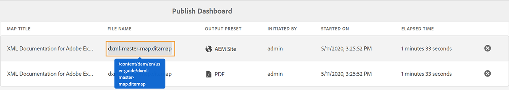

# Gestion des tâches de publication à l’aide du tableau de bord de publication {#id205CC08305Z}

Lorsque vous disposez d’un grand ensemble de tâches de publication s’exécutant sur votre système, il devient pratiquement impossible de vérifier chaque mappage DITA individuellement pour surveiller sa tâche de publication. AEM Guides offre aux administrateurs et aux éditeurs une vue unifiée de toutes les tâches de publication exécutées dans le système. Une liste de toutes les tâches de publication actives est disponible dans le tableau de bord de publication.

Le tableau de bord de publication donne un aperçu complet de toutes les tâches de publication en cours d’exécution dans le système.

{width="800" align="left"}

Le tableau de bord de publication contient les détails suivants :

- **Titre de la carte** - Le titre d’un fichier map actuellement publié ou se trouvant dans la file d’attente de publication.

- **Nom du fichier** - Nom de fichier du mappage DITA.

- **Paramètre prédéfini de sortie** - Nom du paramètre prédéfini de sortie utilisé pour générer la sortie.

- **Initié par** - Nom d’utilisateur de l’utilisateur qui a lancé la tâche de publication.

- **Démarré le** - Date et heure de début de la tâche de publication.

- **Temps écoulé** - Temps écoulé depuis l’exécution de la tâche de publication dans le système.

- **Icône Supprimer** - Annuler ou arrêter une tâche de publication.

Le panneau de gauche du tableau de bord de publication fournit les options de filtrage suivantes :

- **Paramètre prédéfini de sortie** - Sélectionnez un ou plusieurs paramètres prédéfinis de sortie pour lesquels vous souhaitez afficher les tâches de publication actuellement actives. Dans la capture d’écran suivante, les tâches de publication sont filtrées afin de n’afficher que les tâches qui utilisent le paramètre prédéfini de sortie AEM site :

  {width="800" align="left"}

- **Initié par** - Sélectionnez un nom d’utilisateur dans la liste pour afficher les tâches de publication initiées par l’utilisateur sélectionné.

- **Carte** - Sélectionnez un fichier map dans la liste pour afficher les tâches de publication exécutées pour le mappage sélectionné.

## Accès au tableau de bord de publication {#id205CC100DY4}

Pour accéder au tableau de bord de publication, procédez comme suit :

>[!NOTE]
>
> Seul un administrateur ou un éditeur peut accéder au tableau de bord de publication.

1. Cliquez sur le lien Adobe Experience Manager en haut de l’écran et choisissez **Outils**.

1. Sélectionner **Guides** dans la liste des outils.

1. Cliquez sur le bouton **Publier le tableau de bord** mosaïque.

   Le tableau de bord de publication s’ouvre avec une liste de toutes les tâches de publication actives du système.

   Si vous cliquez sur le lien Nom de fichier , la console de mappage DITA de la carte sélectionnée s’affiche.

   {width="800" align="left"}

>[!NOTE]
>
> Vous pouvez également accéder au tableau de bord de publication à partir de l’onglet Sorties lorsque vous générez la sortie à partir du tableau de bord de la carte. Pour plus d’informations, voir [Afficher l&#39;état de la tâche de génération de sortie](generate-output-for-a-dita-map.md#viewing_output_history).

## Annulation d’une tâche de publication

Pour annuler une tâche de génération de sortie à partir du tableau de bord de publication, procédez comme suit :

1. [Accès au tableau de bord de publication](#id205CC100DY4).

1. Dans la liste des tâches de publication actives, cliquez sur l’icône de suppression d’une tâche que vous souhaitez annuler.

   {width="800" align="left"}

1. Cliquez sur **Oui** dans l’invite de message Confirmer l’annulation .

   La commande d’annulation est acceptée et l’annulation est effectuée tant que la tâche reste active. Une fois la tâche terminée, elle est supprimée de la liste des tâches actives. L’état de la tâche est également mis à jour dans la console de mappage DITA sous la forme Annulé. Dans la capture d’écran suivante, la variable *HTML5* La tâche est annulée à partir du tableau de bord de publication et son état est également modifié dans la console de mappage DITA.

   {width="800" align="left"}

**Rubrique parente :**[ Génération de sortie](generate-output.md)
